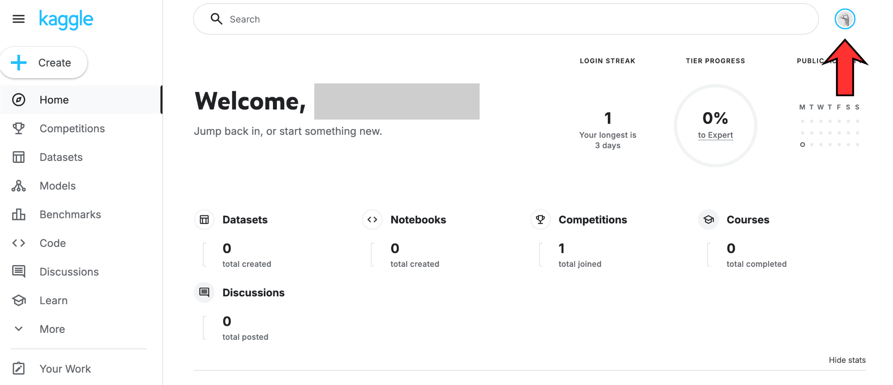
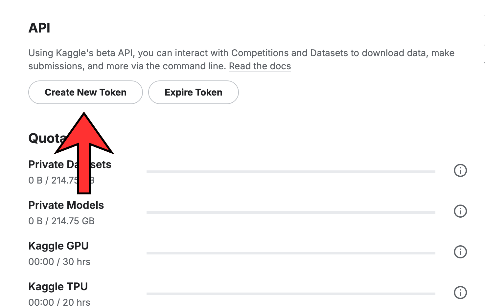
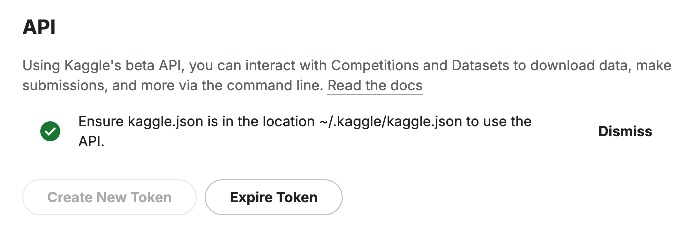
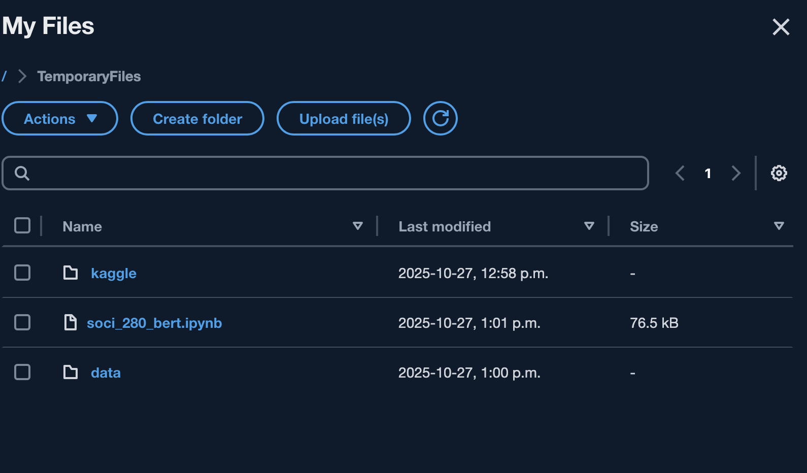

## Step 1: Get Kaggle API Key

### Step 1.1: Register for Kaggle
- Visit https://www.kaggle.com/
- Press the "register" button in the top right of the screen


- After registering, refresh and log back in. You should be taken to a webpage that looks like this:



### Step 1.2: Getting the kaggle API key
- Press your profile icon in the top right corner. (see the image above for where to click)
- Press 'settings'. This should take you to a page called settings, with identifying information like your email adress at the top of the page.
- Scroll down to the API section.



- Press 'continue' when prompted with "are you sure?"
- This will automatically download a file called `kaggle.json` into your `downloads folder`.



## Step 2, option 2: Uploading the API key via Appstream (recommended)

## Step 2.1 Log into appstream and upload materials
- Once logged in, at the top of your screen, press MyFiles > TemporaryFiles.
- In TemporaryFiles, upload soci_389_bert.ipynb.
- In TemporaryFiles, create two folders: one called `data`, and one called `kaggle`.
- In `data`, upload data_pulling.py. 
- In `kaggle`, upload `kaggle.json`. 



## Step 2.2 Opening the materials
- On the left of your screen, press the purple diamond Jupter Notebook icon.
- Navigate to MyFiles/TemporaryFiles within jupyter, and open the notebook.
- Set the kernel to the ML kernel.

## Step 2, option 2: Uploading the API Key onto jupyter notebook via JupyterLab

- Navigate to JupyterOpen: https://ubc.syzygy.ca/
- Press the `upload` button in the top right corner, and upload the folder containing today's class materials.
- 1. In your Jupyter environment (e.g. JupyterHub):
2. Click on the **file browser pane**.
3. Navigate to the `.kaggle/` folder inside your project directory.
4. **Upload** the `kaggle.json` file (you downloaded it from Kaggle earlier).
5. Your folder structure should now look like this:
```
/your-project/
├── kaggle/
│   └── kaggle.json
├── soci_270_bert.ipynb
```
