## Mostly Harmless Convolutions and Convolutional Neural Networks (CNNs)

Author: *Kaiyan Zhang, PRAXIS UBC Team*

Date: 2025-06

**Before you begin: Install the dependencies that you don't have by running the code cell below.**


```python
# !pip install opencv-python
# !pip install numpy
# !pip install matplotlib
# !pip install pandas
# !pip install scikit-learn
# !pip install seaborn
# !pip install datasets
# !pip install torch
# !pip install tqdm
```

### Part I: Introduction to Convolutions (in a Mostly Harmless Way)


#### Why Convolutions? 

Mathematically speaking, **Convolution** is an operation that combines two functions to produce a third function, which has a variety of applications in signal processing, image analysis and more. While this may sound complex, we can skip the mathematical parts of it and explain it in a less harmful and vivid way to our precious audiences (which is YOU). 

Let's begin by imagining a simple scenario: you took a picture of a cute dog, and you want to apply a filter to it so that it looks more vibrant and colorful. Now that you input the image into a computer, how does a computer "see" the image? The computer would see the image as a grid of numbers, where the combination of 3 numbers (R, G, B) in a grid represents the color of a pixel, and with all the colored pixels combined, it forms the image. Given the numeric nature of a computer image, we say that the image is digitalized.

Here, let's read in the image into Python and display it using `matplotlib`:


```python
# Load necessary libraries
import cv2
import numpy as np
import matplotlib.pyplot as plt


# Read the image in BGR format
doge_bgr = cv2.imread('data/Original_Doge_meme.jpg')

doge_rgb = cv2.cvtColor(doge_bgr, cv2.COLOR_BGR2RGB)

# Display the image using matplotlib
plt.figure(figsize=(6, 6))
plt.imshow(doge_rgb)
plt.axis('off')  
plt.title('Input Image')
plt.show()
```


    
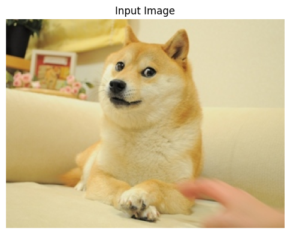
    


There is no doubt this is a cute dog, but it doesn't look like numbers, does it? In fact, if we zoom in close enough, we can clearly see that the image is made up of a grid of pixels. But we still don't see the numbers, this is because the numerical information is decoded by the computer and displayed as a colored pixel. However, we can easily convert the image into a numerical representation.

For demonstration purpose (also to protect our CPUs), I rescale the image to a 10 $\times$ 10 grid, where within each cell, the tuple represents the RGB values (0-255) of each pixel. Note that compressing images to a smaller size is always easier comparing to enhancing images to a larger size, as compression can be done by going through the image pixel by pixel and averaging the color values in each cell, while enhancement usually requires more complex operations. This gives us a hint on why convolution is important. 


```python
img_rgb = cv2.resize(doge_rgb, (10, 10), interpolation=cv2.INTER_NEAREST)

# Plot the RGB matrix
fig, ax = plt.subplots(figsize=(6, 6))


h, w = img_rgb.shape[:2]
ax.imshow(img_rgb, extent=[0, w, h, 0]) 

# Set ticks to show grid at pixel boundaries
ax.set_xticks(np.arange(0, w + 1, 1))
ax.set_yticks(np.arange(0, h + 1, 1))
ax.set_xticklabels([])
ax.set_yticklabels([])
ax.grid(color='black', linewidth=1)

for i in range(h):
    for j in range(w):
        r, g, b = img_rgb[i, j]
        brightness = int(r) + int(g) + int(b)
        color = 'white' if brightness < 380 else 'black'
        ax.text(j + 0.5, i + 0.5, f'({r},{g},{b})',
                ha="center", va="center", fontsize=6, color=color)
        
        
# Display the Grid
ax.set_title("RGB Value Grid of Resized Image")
plt.tight_layout()
plt.show()
```


    
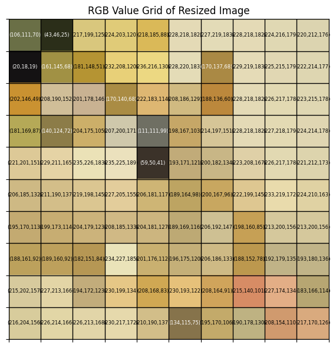
    


This has become a little abstract. Can you still identify the original image out of it? 

While the resized image may not look as cute as the original one, it still contains the necessary information, and same ideas also transits to larger images. That is, all images can be represented as a grid of numbers, where the 3 numbers in each cell corresponds to the color of a pixel. Computers can't see colors like we do, the way they see colors is as if they were mixing colors using a palette that only has red, green and blue (**RGB**), where each color has an "amount" of intensity between 0 and 255. With the 3 values for red, green and blue, computers can create any color we see in the world.

Back to the dog picture, it is easy to see that resizing the image to a smaller grid loses a lot of details, especially the rich color that makes the image vibrant. Alternatively, if we want to keep the complete color information, we can plot out the distribution of the RGB values and frequencies in the image using a histogram. While this gives us a good idea of the color distribution, it does not tell us much about the spatial relationships between the pixels.


```python
# Compute and plot the color histogram
colors = ('r', 'g', 'b')
plt.figure(figsize=(6, 4))

for i, col in enumerate(colors):
    hist = cv2.calcHist(
        images=[doge_bgr],       # source image (still in BGR)
        channels=[i],           # which channel: 0=B, 1=G, 2=R
        mask=None,              
        histSize=[256],         
        ranges=[0, 256]         
    )
    plt.plot(hist, color=col)
    plt.xlim([0, 256])
    
# Display the histogram
plt.title('RGB Histogram')
plt.xlabel('Pixel Value')
plt.ylabel('Frequency')
plt.tight_layout()
plt.show()
```


    
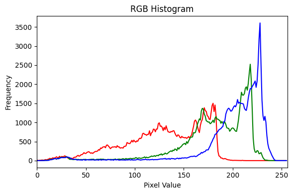
    


Can you still identify the original image out of it? 

The example above shows us what images are like in the eyes of a computer. Computers do not understand images in the same way that humans do, they can only see them as a collection of numbers. It thus make sense that we need to apply some math to these numbers to either **change the image** or **extract some useful information** from it, and that's where convolution comes in.


#### How Does Convolution Work?

Before we dive into the application of it, let's first understand how convolution operate on an image in a more intuitive way:

Imagine you are copying a painting, you first made a draft of the same size against the original painting and now you want to color it. Other than making your painting a 100% identical copy, you want to add some personal touch to it, so you decide to use a brush with a specific pattern to color the draft. Wherever you apply the brush, it will color the region it touches with a brighter color than the original painting, and your color your draft from left to right, top to bottom, until the whole draft is colored with the brush. You end up with a new painting that is similar to the original one, but with a different style.

Here, the brush you used is called a **kernel** in the context of convolution, and the process of applying the brush is what we call **convolution operation**. We would define the kernel as a small matrix of numbers that represents the pattern of the brush, and the convolution operation as the process of transforming the original image by applying the kernel to it.

Here is a gif that illustrates how our filter (the kernel) will work on the image. You can see it as the small brush that slides over the image, operating on a small region of the image at a time, and eventually producing a new image that was completely transformed by the filter.


Now, let's return to the example of the cute dog picture. What we are going to apply is a kernel called **sharpening filter**, it is a 3 $\times$ 3 matrix that looks like this:

$$\text{Sharpening Filter} = \begin{bmatrix}
 0 &-1 & 0 \\
-1 & 5 & -1 \\
 0 & -1 & 0 
\end{bmatrix}$$
**Don't panic** as we are not going to do any math here, we will just let the computer do the math for us. The only thing you need to know is that this kernel will enhance the edges of the image, making it look sharper and more defined. In fact, if you take a closer look at the kernel, you will see that it has a positive value in the center and negative values around it, and it has 0 values on the corners. This exactly looks like a brush that enhances the center of a region while reducing the intensity of the surrounding pixels, which is exactly what we want to achieve with the filter.


```python
# Define the sharpening filter
kernel = np.array([
    [ 0, -1,  0],
    [-1,  5, -1],
    [ 0, -1,  0]
], dtype=np.float32)

# Apply the kernel to the color image using filter2D.
filtered = cv2.filter2D(doge_rgb, ddepth=-1, kernel=kernel)

filtered = np.clip(filtered, 0, 255).astype(np.uint8)

# Display the original and filtered images side by side
fig, (ax1, ax2) = plt.subplots(1, 2, figsize=(12, 6))

# Input
ax1.imshow(doge_rgb)
ax1.set_title("Input Image")
ax1.axis("off")

# Output
ax2.imshow(filtered)
ax2.set_title("Filtered Image (Sharper & More Vibrant)")
ax2.axis("off")

plt.tight_layout()
plt.show()
```


    
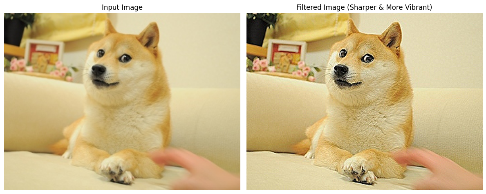
    


I guess the difference is quite obvious now, right? The sharpened image has more contrast and the edges are more defined, making it look more vibrant and colorful. This is the power of convolution, it allows us to apply filters to images and transform them in a way that is not possible with simple pixel manipulation.

However, convolution on image is not limited to filtering, it can also be used to **extract features** from the image. For example, we can use a kernel to detect edges, lines and texts in images, we can even use specific kernels to detect specific shapes or patterns in images, for example, a kernel that detects anything that looks like a dog. As you can imagine, this is a very powerful tool that can be used in many applications, in fact, even you have already used it in your daily life. For example, when you use a photo editing app to apply a filter to your picture, the app is using convolution to apply the filter to the image. When you use a search engine to search for images, the search engine is using convolution to extract features from the images and match them with your search query. Below is a gif showing how a convolution kernel detects "eyes" in an image:


This is avery simple example, and it is implemented exactly the same way as we did with the sharpening filter. The only difference is that to extract a specific features, we need to use a specific kernel that is designed to detect that feature, which usually requires some knowledge of the feature we want to extract. For example, if we want to detect eyes in the painting, we would need our "brush" to understand what eyes look like and what typical colors they have. This could be way too complicated for a single "brush", so we often use multiple brushes to detect different features when it comes to the task of feature extraction. 

To demonstrate how convolution extracts a specific feature from an image, let's take a look at a different "art tool". Let's say this time you don't want to color the painting differently, but rather you want to sketch a line art based on the original painting. You would use a fineliner pen that can detect the edges of the painting and draw a line along them. In the eyes of a computer, these are the tools it is going to use for the art:

$$\text{Horizontal Sobel} = \begin{bmatrix}
 1 & 0 & -1 \\
 2 & 0 & -2 \\
 1 & 0 & -1
\end{bmatrix} 
\text{, }
\text{Vertical Sobel} = \begin{bmatrix}
 1 & 2 & 1 \\
 0 & 0 & 0 \\
 -1 & -2 & -1
\end{bmatrix} 
$$

Still, **don't panic**, we won't do any math in this notebook. All you need to know is these two kernels together are called **Sobel filter**, and what they do is to highlight the edges in the image, making them more visible. If you take a closer look at the kernels, you will see that the first one has positive values on the left and negative values on the right, while the second one has positive values on the top and negative values on the bottom. This pattern intuitively tells us that the first "pen" will scan through the image horizontally and extract the horizontal edges, while the second "pen" will scan through the image vertically and extract the vertical edges. 

Let's now look at a different example and see what happens when we apply the Sobel filter.


```python
# Generate a greyscale version of the image
hill_bgr = cv2.imread('data/xiangbishan.jpg')

hill_rgb = cv2.cvtColor(hill_bgr, cv2.COLOR_BGR2RGB)

hill_gray = cv2.cvtColor(hill_bgr, cv2.COLOR_BGR2GRAY)

# Define the Sobel filter kernel
sb_kernel_h = np.array([
    [ 1, 0, -1],
    [ 2, 0, -2],
    [ 1, 0, -1]
], dtype=np.float32)

sb_kernel_v = np.array([
    [ 1, 2, 1],
    [ 0, 0, 0],
    [-1, -2, -1]], dtype=np.float32)

# Apply the kernel to the color image using filter2D.
horiz = cv2.filter2D(hill_gray, -1, sb_kernel_h)

vert = cv2.filter2D(hill_gray, -1, sb_kernel_v)

combined = cv2.convertScaleAbs(np.sqrt(vert.astype(np.float32)**2 + horiz.astype(np.float32)**2))

# Display the original and filtered images side by side
fig, (ax1, ax2) = plt.subplots(1, 2, figsize=(12, 6))

# Input
ax1.imshow(hill_rgb)
ax1.set_title("Input Image")
ax1.axis("off")

# Output
ax2.imshow(combined, cmap = 'gray')
ax2.set_title("Filtered Image (Edges Highlighted)")
ax2.axis("off")

plt.tight_layout()
plt.show()
```


    
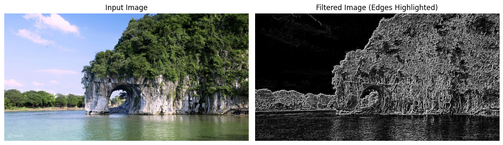
    


As we can see in the example above, the Sobel filter detects the edges in the image and highlights them like a fineliner pen. This is a very useful technique in image processing, as it allows us to extract features from the image that can be used for further analysis or classification. Let's do more explorations with the example above:


```python
# Compute the magnitude and orientation of the gradient.
# To put it simpler, they represents the length and direction of the edges at each pixel.
# For those who are familiar with pythagorean theorem, the magnitude is exactly the length of the"long edge" calculated with pythagorean theorem.
magnitude = np.sqrt(vert.astype(np.float32)**2 + horiz.astype(np.float32)**2)
orientation = np.arctan2(vert.astype(np.float32), horiz.astype(np.float32))

# Generate an edge binary map
mag_norm = cv2.normalize(magnitude, None, 0,255, cv2.NORM_MINMAX).astype(np.uint8)
_, edge_binary = cv2.threshold(mag_norm, 50, 255, cv2.THRESH_BINARY)

# Create the Contour plot
contours, _ = cv2.findContours(edge_binary, cv2.RETR_EXTERNAL, cv2.CHAIN_APPROX_SIMPLE)
contour_img = hill_rgb.copy()
cv2.drawContours(contour_img, contours, -1, (255,0,0), 1)

# Create an edge density heatmap
block = 32
h, w = edge_binary.shape
int_img = cv2.integral(edge_binary)

heatmap = np.zeros_like(edge_binary, dtype=np.float32)

for y in range(0, h - block + 1):
    for x in range(0, w - block + 1):
        y1, x1 = y,       x
        y2, x2 = y + block, x + block
        total = (int_img[y2, x2]
               - int_img[y1, x2]
               - int_img[y2, x1]
               + int_img[y1, x1])
        # center the block’s density back into the heatmap
        heatmap[y + block//2, x + block//2] = total
        
heatmap = cv2.normalize(heatmap, None, 0,255, cv2.NORM_MINMAX).astype(np.uint8)

# Plot out the visualizations
fig, axs = plt.subplots(2, 2, figsize=(12, 9))
ax1, ax2, ax3, ax4 = axs.flatten()

# Original Image
ax1.imshow(hill_rgb)
ax1.set_title("Input Image")
ax1.axis("off")

# Contours on Original Image
ax2.imshow(contour_img)
ax2.set_title("Contours on Original Image")
ax2.axis("off")

# Edge Density Heatmap
ax3.imshow(heatmap, cmap="hot")
ax3.set_title("Edge Density Heatmap")
ax3.axis("off")

# Edge Orientation Histogram
angles_deg = np.degrees(orientation[magnitude > 50].flatten())

ax4.hist(angles_deg, bins=36, range=(0, 90), color='purple')
ax4.set_title("Edge Orientation Histogram")
ax4.set_xlabel("Angle (degrees)")
ax4.set_ylabel("Frequency")


plt.tight_layout()
plt.show()
```


    
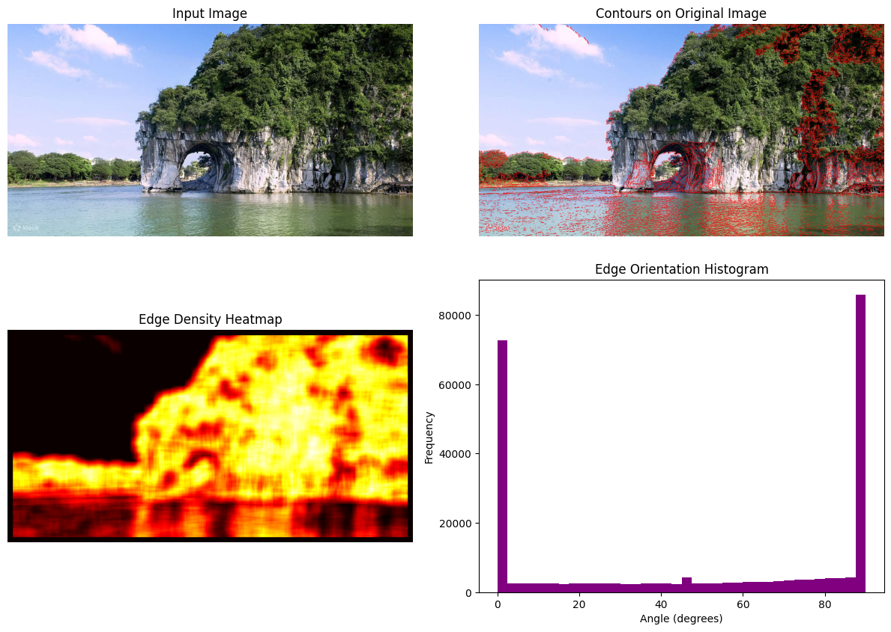
    


Here, we have generated three other visualizations based on the extracted edge data. 

- The first visualization is a Contour Map on the original image. It circles some specific contours from the image that are distinguishable from others. In many cases, this implies the circled regions have different visual patterns or belong to different objects, which is very useful in tasks such as image recognition. 
- The second visualization is the Edge Density Heatmap, assigns corresponding heat values to regions on the image based on the density distribution of the edges. The lighter the color, the higher the edge density of the region. This helps us to understand which area of the image carries the most information that may be of interest to us.
- The third visualization is a histogram showing the distribution of edge orientations. edge orientation is the direction of the edge in the graph, expressed as the angle between the edge and the x-axis (horizontal line). Understanding the distribution of edge orientation can help us better recognize the graphical features of objects in an image for tasks such as classification. For example, based on this image featuring a hill and a water surface, we now know that the edges of these two objects typically have either a horizontal or vertical orientation.

The examples above demonstrated the power of convolution in both image processing and image analysis, and more importantly, convolution is very efficient, as it is easy for computers to understand and process, and it can be applied to images of any size without losing any information. This is why convolution has become a fundamental operation in computer vision and image processing. 

But as you have probably aware, implementing convolution from scratch can be quite tedious, especially when we need to perform more specific tasks such as detecting texts or some specific shapes. To protect the brains of computer scientists, a more advanced, adaptable and efficient way of applying convolution has been developed, which is called **Convolutional Neural Networks (CNNs)**, and we will discuss it in the next part of this notebook, hopefully in a way that also protects your brain.

#### Key takeaways from this part:

1. Computers see images as grids of numbers, where each grid cell contains the RGB values of a pixel. With the spatial relationships and the color information, computers can understand images without losing information.
2. **Convolution** is an operation that applies a filter (kernel) to an image, transforming it in a way that enhances certain features or extracts useful information. It is like using a brush to color a painting or a pen to sketch a line art.
3. The kernel that sharpens an image is called a **sharpening filter**, which enhances the edges of the image and makes it look more vibrant. The kernel that detects edges is called **Sobel filter**, which highlights the edges in the image and makes them more visible.
4. Convolution is a powerful tool that can be used in many applications, such as photo editing, image search and feature extraction. It is efficient and can be applied to images of any size without losing information.


### Part II. Introduction to Convolutional Neural Networks (CNNs) (Hopefully Not Too Harmful)


#### What are Neural Networks?

What is the first thing that comes to your mind when you hear the word "**neural network**"? If you are thinking about the human brain and neurons, you are not wrong. In fact, the term "neural network" is inspired by the way how human brain and nervous systems work, where neurons are connected to each other and communicate with each other to process information. 

In the context of **machine learning**, a neural network, or more precisely, an **artificial neural network (ANN)** is defined as "a program, or model, that makes decisions in a manner similar to the human brain, by using processes that mimic the way biological neurons work together to identify phenomena, weigh options and arrive at conclusions".

The definition seems way too formal and scientific, but we can easily translate it into daily language in a less harmful way. Think of taking a closed-book multiple choice exam (Oops, gross). Your brain calls on a team of "experts", one for course facts, another for what you remember about the professor's hints in class, another for gut instincts, etc. When you read a question, each expert gives you a confidence score. You weight each score by how much you trust that expert, then add them up. The answer with the highest total "trust $\times$ confidence" wins. After the exam, you see which answers were wrong and adjust those trust weights (trust the right experts more, the wrong ones less), and prepare for the next exam based on this experience. This exactly how a neural network makes decisions and learns via its **feedback loop**. Neural networks are following a similar thought and learning process as you and me, and this is why they are flexible and powerful, being able to handle complex, abstract tasks and evolve on their own, **like an intelligent creature**. 

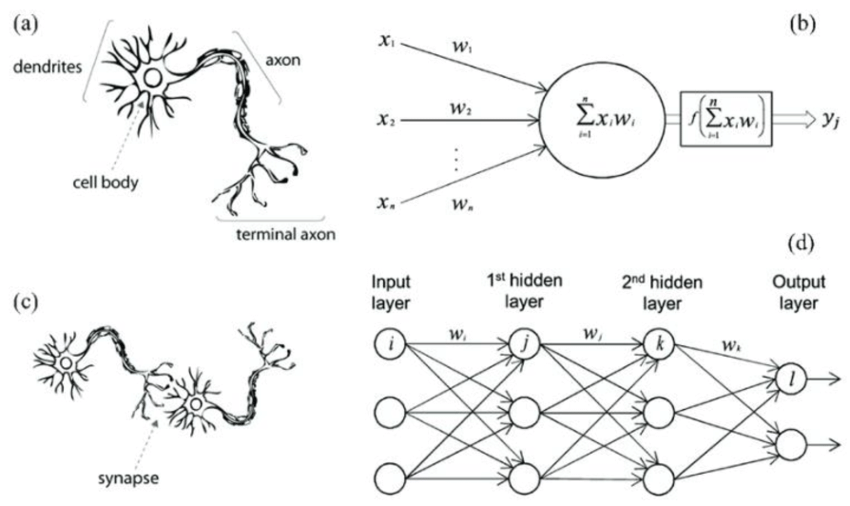


While the core idea is not complex, you may want to master some bluffing terms to translate the professional discussions. In the example above, the "experts" you consulted in your mind are called **neurons**, the key clues you noticed when reading question are called **features**; your understanding of exam question is called the **input layer**, your thought process rounds are called **hidden layers**, your chosen answer is reflected as the **output layer**, the mind map that connects all the "experts" and input features is **architecture**, and each exam attempt with the review of feedback is called an **epoch**. See, they are really not that deep! You now can also talk about it as an expert.

#### An Intuitive Understanding of Convolutional Neural Networks (CNNs)

Now that we understood what is an artificial neural network, let's dive into the real topic here: What's unique about **convolutional neural networks (CNNs)** and why they are revolutionary to computer vision and image processing? 

Let's start by discussing the unique point of CNNs. Imagine you are reading a bird guide and trying to learn the characteristics of a night heron and a heron so that you can easily distinguish between the two in the field, what would you do? I believe you would naturally try to observe the birds piece by piece: first comparing the features of the juveniles and adults, then noting how they look both in flight and on land. Gradually, your brain forms a complete comparison: the night heron has a shorter beak, a shorter neck, striking red eyes, and dark blue plumage as an adult; while the grey heron has a longer beak, a longer neck, yellow eyes, and wears grey colored plumage. 

<p align="center">
  <figure style="display:inline-block; margin:10px;">
    
    <figcaption style="text-align:center;">Night heron in a bird guide</figcaption>
  </figure>

  <figure style="display:inline-block; margin:10px;">
    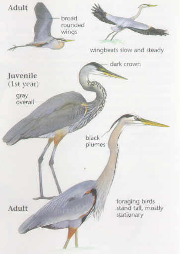
    <figcaption style="text-align:center;">Grey heron in a bird guide</figcaption>
  </figure>
</p>

A convolutional neural network would read things in the same way, as it doesn't look at things in a big picture directly (which is usually costly and slow), but would rather see an image as multiple small **patches** to study the unique features and construct a detailed field guide of its own. And the way how a CNN sees things this way is through **convolution**: it has a **convolutional layer** on top of the input layer to learn features piece by piece in its architecture, such that it can process information from an image in a cleverer way. Moreover, CNNs work quite well even when training images are not as tidy and organized as those in a field guide, which makes it efficient in solving real-life problems. 

Let's recall some basic concepts of convolution and see how they are applied in the CNNs, typically within the convolutional layer. Here, the **inputs** are still considered images, and they are interpreted by a computer as grids of numbers. The **kernels** (also called filters) here are still the matrices you apply on the input image to extract some certain features, but in a CNN, there are usually multiple distinct kernels applied at the same time to extract and map different features. After the different features are extracted, they will be pooled together with another kernel and produce a summarized output to be passed into the **fully-connected layer** for classification or other tasks.

While the principles behind the architectures are complicated, many python libraries now offer easy ways to implement these architectures. In a word, with a labeled image dataset, you can also train a CNN classifier yourself. Let's try out an example together.

#### Build Our Own CNN Classifier: An Example Using CIFAR-10 Dataset

Classifying is central in the application of CNNs, so let's try building a classifier using CNN and see how it works with an example. Let's say, we want to train a model (the "expert") that identify and distinguish between some daily objects, such as cars, planes, cat, dogs, etc. We first need to find a dataset that contains images of these objects with labels. **This is usually hard as we wouldn't always have clean, labelled datasets of a specific topic**. But luckily, we have many datasets for daily objects.

The dataset we are using here is [CIFAR-10](https://www.cs.toronto.edu/~kriz/cifar.html), it is a widely used practice dataset for beginners to image processing that consists of 60000 32 $\times$ 32 colour images in 10 classes, with 6000 images per class. There are 50000 training images and 10000 test images. Let's first load the dataset and see what it's like.

##### Step 1: Data Preprocessing


```python
# import CIFAR-10 dataset from HuggingFace
from datasets import load_dataset

dataset_train = load_dataset(
    'cifar10',
    split='train'# training dataset
)

dataset_train
```


    Dataset({
        features: ['img', 'label'],
        num_rows: 50000
    })


```python
# check how many labels/number of classes
num_classes = len(set(dataset_train['label']))
num_classes
```


    10


We can also display one of the images to see what it's like.


```python
# let's view the image (it's very small)
sample = dataset_train[0]['img']

plt.imshow(sample)
plt.axis('off')
plt.show()
```


    
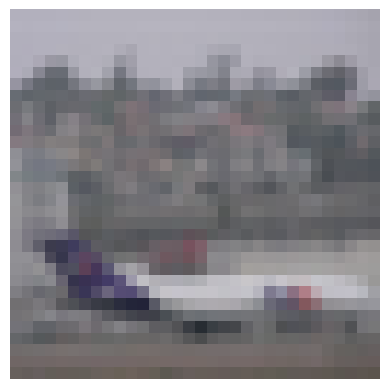
    


Can you see what the image is about? Can you imagine how computers understands it?

As most CNNs can only accept images of a fixed size, we will reshape all images to 32 $\times$ 32 pixels using `torchvision.transforms`; a **pipeline** built for image preprocessing. You can think of a pipeline as a series of small programs that together handles a specific task in a sequential order, which in here is resizing the images in the training set.


```python
import torchvision.transforms as transforms
from tqdm.auto import tqdm

# image size
img_size = 32

# preprocess variable, to be used ahead
preprocess = transforms.Compose([
    transforms.Resize((img_size,img_size)),
    transforms.ToTensor()
])

inputs_train = []

for record in tqdm(dataset_train):
    image = record['img']
    label = record['label']

    # convert from grayscale to RGB
    if image.mode == 'L':
        image = image.convert("RGB")
        
    # prepocessing
    input_tensor = preprocess(image)
    
    # append to batch list
    inputs_train.append([input_tensor, label]) 
```


      0%|          | 0/50000 [00:00<?, ?it/s]


Other than normalizing the general size of the images, we should also normalize the pixel values in the dataset.


```python
mean = [0.4670, 0.4735, 0.4662]
std = [0.2496, 0.2489, 0.2521]

preprocess = transforms.Compose([
    transforms.Normalize(mean=mean, std=std)
])

for i in tqdm(range(len(inputs_train))):
    # prepocessing
    input_tensor = preprocess(inputs_train[i][0])
    # replace with normalized tensor
    inputs_train[i][0] = input_tensor
```


      0%|          | 0/50000 [00:00<?, ?it/s]


Here, we load and process the training set that we are using to validate the model quality.


```python
# Loading the dataset
dataset_val = load_dataset(
    'cifar10',
    split='test'  # test set (used as validation set)
)

# Integrate the preprocessing steps
preprocess = transforms.Compose([
    transforms.Resize((img_size,img_size)),
    transforms.ToTensor(),
    transforms.Normalize(mean=mean, std=std)
])

inputs_val = []
i = 0
for record in tqdm(dataset_val):
    image = record['img']
    label = record['label']

    # convert from grayscale to RBG
    if image.mode == 'L':
        image = image.convert("RGB")
        
    # prepocessing
    input_tensor = preprocess(image)
    inputs_val.append((input_tensor, label)) # append to batch list
```


      0%|          | 0/10000 [00:00<?, ?it/s]


We noticed that the testing and training data are gigantic in size, which would lag our trainings. To avoid the long training time and huge training cost, we often need to split our data into multiple small **batches**. 

In CNN training, choosing a batch size of, say, 32 or 64 gives you the best of both worlds: you "study" small, manageable mini-quizzes, get regular feedback to adjust your filter-weights, and keep your compute requirements reasonable, all while learning robustly across the entire image dataset.


```python
import torch

# Given the amount of data, we set the batch size as 64 to improve the efficiency when running our model
batch_size = 64

# We use DataLoader to split both the training and validation dataset into shuffled batches. 
# Shuffle helps prevent model overfitting by ensuring that batches are more representative of the entire dataset.
dloader_train = torch.utils.data.DataLoader(
    inputs_train, batch_size=batch_size, shuffle=True
)

dloader_val = torch.utils.data.DataLoader(
    inputs_val, batch_size=batch_size, shuffle=False
)
```

##### Step 2: Training the CNN Classifier

After carefully processing both the training and the test data, we finally came to a stage where we can train our own CNN classifier. The first thing we need to do is to decide which **architecture** we want to use for the model.

Architecture determines the way how a CNN integrate and learn from the features it extracted, and thus largely determines the performance of a model. Throughout the years, there have been several hugely successful CNN architectures, which we won't be able to discuss in detail. Here, I will only demonstrate the architecture of **LeNet-5**: It reads images in a sequence that starts with a partial and combines the partials into a comprehensive one.


```python
import torch.nn as nn

# creating a CNN class
class ConvNeuralNet(nn.Module):
	#  determine what layers and their order in CNN object 
    def __init__(self, num_classes):
        super(ConvNeuralNet, self).__init__()
        self.conv_layer1 = nn.Conv2d(in_channels=3, out_channels=64, kernel_size=4, padding=1)
        self.relu1 = nn.ReLU()
        self.max_pool1 = nn.MaxPool2d(kernel_size=3, stride=2)

        self.conv_layer2 = nn.Conv2d(in_channels=64, out_channels=192, kernel_size=4, padding=1)
        self.relu2 = nn.ReLU()
        self.max_pool2 = nn.MaxPool2d(kernel_size=3, stride=2)

        self.conv_layer3 = nn.Conv2d(in_channels=192, out_channels=384, kernel_size=3, padding=1)
        self.relu3 = nn.ReLU()
        
        self.conv_layer4 = nn.Conv2d(in_channels=384, out_channels=256, kernel_size=3, padding=1)
        self.relu4 = nn.ReLU()

        self.conv_layer5 = nn.Conv2d(in_channels=256, out_channels=256, kernel_size=3, padding=1)
        self.relu5 = nn.ReLU()
        self.max_pool5 = nn.MaxPool2d(kernel_size=3, stride=2)
        
        self.dropout6 = nn.Dropout(p=0.5)
        self.fc6 = nn.Linear(1024, 512)
        self.relu6 = nn.ReLU()
        self.dropout7 = nn.Dropout(p=0.5)
        self.fc7 = nn.Linear(512, 256)
        self.relu7 = nn.ReLU()
        self.fc8 = nn.Linear(256, num_classes)
    
    # progresses data across layers    
    def forward(self, x):
        out = self.conv_layer1(x)
        out = self.relu1(out)
        out = self.max_pool1(out)
        
        out = self.conv_layer2(out)
        out = self.relu2(out)
        out = self.max_pool2(out)

        out = self.conv_layer3(out)
        out = self.relu3(out)

        out = self.conv_layer4(out)
        out = self.relu4(out)

        out = self.conv_layer5(out)
        out = self.relu5(out)
        out = self.max_pool5(out)
        
        out = out.reshape(out.size(0), -1)
        
        out = self.dropout6(out)
        out = self.fc6(out)
        out = self.relu6(out)

        out = self.dropout7(out)
        out = self.fc7(out)
        out = self.relu7(out)

        out = self.fc8(out)  # final logits
        return out
```

After designing the network architecture, we initialize it. And if we have access to hardware acceleration (through CUDA or MPS), we move the model to that device to speed up the training. 


```python
import torch

device = "cuda" if torch.cuda.is_available() else "cpu"
# set the model to device
model = ConvNeuralNet(num_classes).to(device)
```

Next, we will set the loss and optimizer function used during the training. These are the factors that determines how much your network learn from the mistakes.


```python
# set loss function
loss_func = nn.CrossEntropyLoss()
# set learning rate 
lr = 0.008
# set optimizer as SGD
optimizer = torch.optim.SGD(
    model.parameters(), lr=lr
) 
```

We will train the model for 25 epochs. To ensure we’re not overfitting to the training set, we pass the validation set through the model for inference only at the end of each epoch. If we see validation set performance suddenly degrade while train set performance improves, we are likely overfitting.

We design the training and fitting loop as follows:


```python
train_losses = []
val_losses = []
val_accuracies = []

num_epochs = 25
for epoch in range(num_epochs):
    model.train()
    running_loss = 0.0
    
    for i, (images, labels) in enumerate(dloader_train):  
        images = images.to(device)
        labels = labels.to(device)
        
        outputs = model(images)
        loss = loss_func(outputs, labels)
        
        optimizer.zero_grad()
        loss.backward()
        optimizer.step()
        
        running_loss += loss.item()
        
    avg_train_loss = running_loss / len(dloader_train)
    train_losses.append(avg_train_loss)
    
    with torch.no_grad():
        model.eval()
        correct = 0
        total = 0
        all_val_loss = []
        for images, labels in dloader_val:
            images = images.to(device)
            labels = labels.to(device)
            outputs = model(images)
            total += labels.size(0)
            predicted = torch.argmax(outputs, dim=1)
            correct += (predicted == labels).sum().item()
            all_val_loss.append(loss_func(outputs, labels).item())
            
        mean_val_loss = sum(all_val_loss) / len(all_val_loss)
        mean_val_acc = 100 * (correct / total)
        
        val_losses.append(mean_val_loss)
        val_accuracies.append(mean_val_acc)
        
    print(f'Epoch [{epoch+1}/{num_epochs}], Train Loss: {avg_train_loss:.4f}, Val Loss: {mean_val_loss:.4f}, Val Acc: {mean_val_acc:.2f}%')
```

    Epoch [1/25], Train Loss: 2.3027, Val Loss: 2.3019, Val Acc: 10.10%
    Epoch [2/25], Train Loss: 2.3015, Val Loss: 2.3000, Val Acc: 15.13%
    Epoch [3/25], Train Loss: 2.2979, Val Loss: 2.2879, Val Acc: 17.81%
    Epoch [4/25], Train Loss: 2.1603, Val Loss: 1.9651, Val Acc: 22.68%
    Epoch [5/25], Train Loss: 1.9362, Val Loss: 1.8812, Val Acc: 25.04%
    Epoch [6/25], Train Loss: 1.8544, Val Loss: 1.8119, Val Acc: 26.94%
    Epoch [7/25], Train Loss: 1.7687, Val Loss: 1.7249, Val Acc: 31.10%
    Epoch [8/25], Train Loss: 1.6734, Val Loss: 1.5913, Val Acc: 39.25%
    Epoch [9/25], Train Loss: 1.5712, Val Loss: 1.4819, Val Acc: 44.08%
    Epoch [10/25], Train Loss: 1.4939, Val Loss: 1.5056, Val Acc: 43.04%
    Epoch [11/25], Train Loss: 1.4132, Val Loss: 1.4392, Val Acc: 46.04%
    Epoch [12/25], Train Loss: 1.3396, Val Loss: 1.9725, Val Acc: 36.43%
    Epoch [13/25], Train Loss: 1.2717, Val Loss: 1.4409, Val Acc: 48.28%
    Epoch [14/25], Train Loss: 1.2114, Val Loss: 1.2350, Val Acc: 55.46%
    Epoch [15/25], Train Loss: 1.1476, Val Loss: 1.1579, Val Acc: 57.96%
    Epoch [16/25], Train Loss: 1.0797, Val Loss: 1.1142, Val Acc: 60.25%
    Epoch [17/25], Train Loss: 1.0194, Val Loss: 1.0641, Val Acc: 62.05%
    Epoch [18/25], Train Loss: 0.9687, Val Loss: 0.9634, Val Acc: 66.13%
    Epoch [19/25], Train Loss: 0.9189, Val Loss: 0.9380, Val Acc: 67.16%
    Epoch [20/25], Train Loss: 0.8750, Val Loss: 1.0063, Val Acc: 64.50%
    Epoch [21/25], Train Loss: 0.8300, Val Loss: 0.9859, Val Acc: 66.31%
    Epoch [22/25], Train Loss: 0.7905, Val Loss: 1.4402, Val Acc: 52.01%
    Epoch [23/25], Train Loss: 0.7461, Val Loss: 0.9326, Val Acc: 69.37%
    Epoch [24/25], Train Loss: 0.7066, Val Loss: 0.8555, Val Acc: 71.21%
    Epoch [25/25], Train Loss: 0.6730, Val Loss: 0.8360, Val Acc: 72.28%
    

We can visualize how training loss, validation loss and validation accuracy evolve over time.


```python
plt.figure(figsize=(12,5))

# Plot Loss
plt.subplot(1,2,1)
plt.plot(train_losses, label='Training Loss')
plt.plot(val_losses, label='Validation Loss')
plt.xlabel('Epoch')
plt.ylabel('Loss')
plt.title('Loss Curve')
plt.legend()

# Plot Accuracy
plt.subplot(1,2,2)
plt.plot(val_accuracies, label='Validation Accuracy', color='green')
plt.xlabel('Epoch')
plt.ylabel('Accuracy (%)')
plt.title('Validation Accuracy Curve')
plt.legend()

plt.tight_layout()
plt.show()
```


    

    


The loss curve and validation accuracy curve show that the validation accuracy of the model basically shows an upward momentum as the training epochs increase. If we add more epochs (costly!), the accuracy of the model will be higher, but also more at risk of overfitting.

After training for 25 epochs, we see our validation accuracy has passed 25%, we can save the model to file and load it again with the following:


```python
# save to file
torch.save(model, 'cnn.pt')

# load from file and switch to inference mode
model = torch.load('cnn.pt', weights_only=False)
model.eval()
```


    ConvNeuralNet(
      (conv_layer1): Conv2d(3, 64, kernel_size=(4, 4), stride=(1, 1), padding=(1, 1))
      (relu1): ReLU()
      (max_pool1): MaxPool2d(kernel_size=3, stride=2, padding=0, dilation=1, ceil_mode=False)
      (conv_layer2): Conv2d(64, 192, kernel_size=(4, 4), stride=(1, 1), padding=(1, 1))
      (relu2): ReLU()
      (max_pool2): MaxPool2d(kernel_size=3, stride=2, padding=0, dilation=1, ceil_mode=False)
      (conv_layer3): Conv2d(192, 384, kernel_size=(3, 3), stride=(1, 1), padding=(1, 1))
      (relu3): ReLU()
      (conv_layer4): Conv2d(384, 256, kernel_size=(3, 3), stride=(1, 1), padding=(1, 1))
      (relu4): ReLU()
      (conv_layer5): Conv2d(256, 256, kernel_size=(3, 3), stride=(1, 1), padding=(1, 1))
      (relu5): ReLU()
      (max_pool5): MaxPool2d(kernel_size=3, stride=2, padding=0, dilation=1, ceil_mode=False)
      (dropout6): Dropout(p=0.5, inplace=False)
      (fc6): Linear(in_features=1024, out_features=512, bias=True)
      (relu6): ReLU()
      (dropout7): Dropout(p=0.5, inplace=False)
      (fc7): Linear(in_features=512, out_features=256, bias=True)
      (relu7): ReLU()
      (fc8): Linear(in_features=256, out_features=10, bias=True)
    )


##### Step 3: Inference the Classifier

Now, we can use the trained classifier to predict the labels of the new input. But here, we are just using the test set for validation (which is not recommended).


```python
input_tensors = []

for image in dataset_val['img'][:10]:
    tensor = preprocess(image)
    input_tensors.append(tensor.to(device))

# stack into a single tensor
input_tensors = torch.stack(input_tensors)
input_tensors.shape
```


    torch.Size([10, 3, 32, 32])


```python
# process through model to get output logits
outputs = model(input_tensors)
# calculate predictions
predicted = torch.argmax(outputs, dim=1)
predicted

# here are the class names
dataset_val.features['label'].names
```


    ['airplane',
     'automobile',
     'bird',
     'cat',
     'deer',
     'dog',
     'frog',
     'horse',
     'ship',
     'truck']


```python
# Print out the output label and the true label
for i in range(10):
    example = dataset_val[i]           # get the i-th example as a dict
    image   = example['img']
    true_id = example['label']
    pred_id = predicted[i]
    
    true_label = dataset_val.features['label'].names[true_id]
    pred_label = dataset_val.features['label'].names[pred_id]
    
    plt.figure(figsize=(4,4))
    plt.imshow(image)
    plt.title(f"True: {true_label}   |   Pred: {pred_label}")
    plt.axis('off')
    plt.show()

```


    
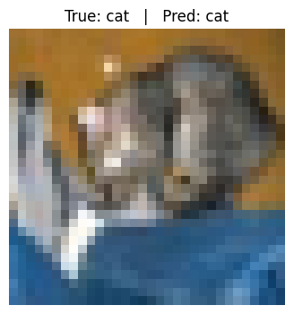
    


    
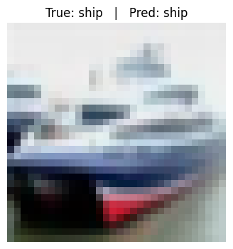
    


    
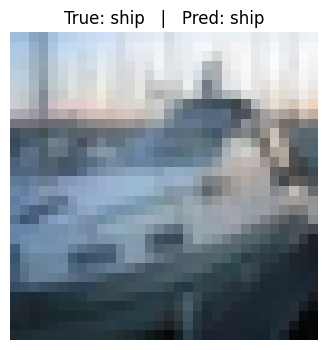
    


    
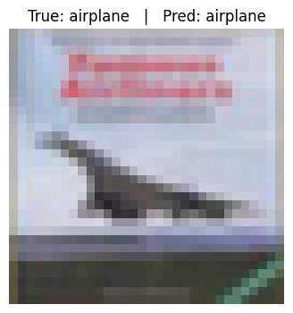
    


    
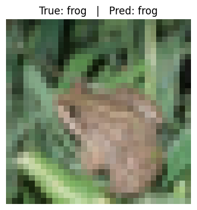
    


    
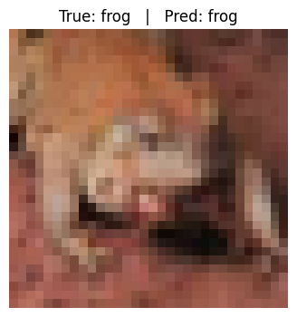
    


    
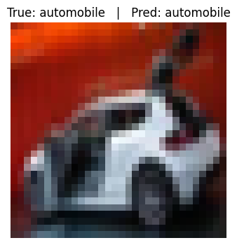
    


    
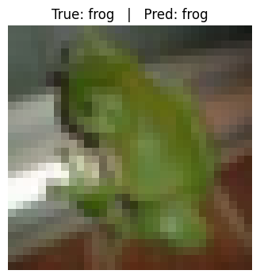
    


    

    


    
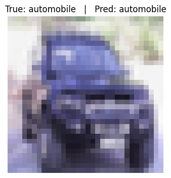
    


We can see that the model made mostly correct predictions, despite the image quality was low that even human may have difficulty to correctly classify. This somewhat shows the advantage of CNNs over humans when confronted with complex, blurry images, but CNNs have more applications than that. They power a host of real-world applications, from enabling your smartphone’s camera to automatically recognize faces and apply portrait effects, to guiding autonomous vehicles by detecting pedestrians, road signs, and lane markings in real time. In healthcare, CNNs help radiologists spot tumors in MRI and CT scans, and dermatologists classify skin lesions from photos. They underpin optical character recognition for digitizing handwritten forms, fuel quality-control systems that spot manufacturing defects on assembly lines, and even drive wildlife monitoring by identifying animals in camera-trap images.

This technology is also reshaping some humanities and social science research. For example, in archaeology, CNNs are being used to categorize, complete, and translate broken clay tablets and cuneiform texts; in art history, CNNs are being used to study the pigments and materials used in paintings, as well as the expressions and gestures of the figures in them; and in anthropology, CNNs are being used to distinguish between human races and complex kinships. It is for this reason that we are here to introduce it to you! I hope you enjoyed the class and got something different out of it!

#### Key takeaways from this part:

1. **Artificial Neural Networks (ANNs)** are programs or models that make decisions in a similar manner to the thought process of a human brain. 
2. **Convolutional Neural Networks (CNNs)** differ from other neural networks in the **convolutional layer** that allows them to understand features from image input in a more efficient way.
3. **Architectures** are central in neural networks as they determine the ways how a model learn from the input features and thereby determine the model performance.
4. Machine Learning and CNNs are fun and practical in the field of humanities and social sciences!

### Additional Resources
- [3Blue1Brown: But what is a convolution?](https://www.youtube.com/watch?v=KuXjwB4LzSA) A mathematical introductory video to convolution with rich visualized explanations. This may be particularly helpful to those who would want to dig deeper in the mathematical perspective and are not panic when they saw the matrices show up in this notebook (I'm really sorry if that made you nervous).
- [MLU-EXPLAIN: Neural Networks](https://mlu-explain.github.io/neural-networks/): A website with straightforward explanation and interactive visualizations of neural networks (with some math and technical terms), including more professional terminologies and advanced concepts that we won't cover in this notebook. But if you find this notebook to be too light and really hope to learn more, this is a good place to go!
- [CNN Explainer](https://poloclub.github.io/cnn-explainer/): An interesting interactive tutorial that explains how CNN work in a more visual way (but you may also find the explanation a little too technical). Try it out! You can also upload your own images of interest to see how the neural network processes them and classify them. Do you get the same results as you expected? What can you say about it?

### References

- Wikipedia. Convolution <https://en.wikipedia.org/wiki/Convolution>
- Pinecone. Embedding Methods for Image Search. <https://www.pinecone.io/learn/series/image-search>
- IBM. What is a neural network? <https://www.ibm.com/think/topics/neural-networks>
- IBM. What are convolutional neural networks? <https://www.ibm.com/think/topics/convolutional-neural-networks>
- Convolutional Neural Network From Scratch. <https://medium.com/latinxinai/convolutional-neural-network-from-scratch-6b1c856e1c07>
- Bird Classification using CNN + EfficientNetB0. <https://www.kaggle.com/code/vencerlanz09/bird-classification-using-cnn-efficientnetb0>

