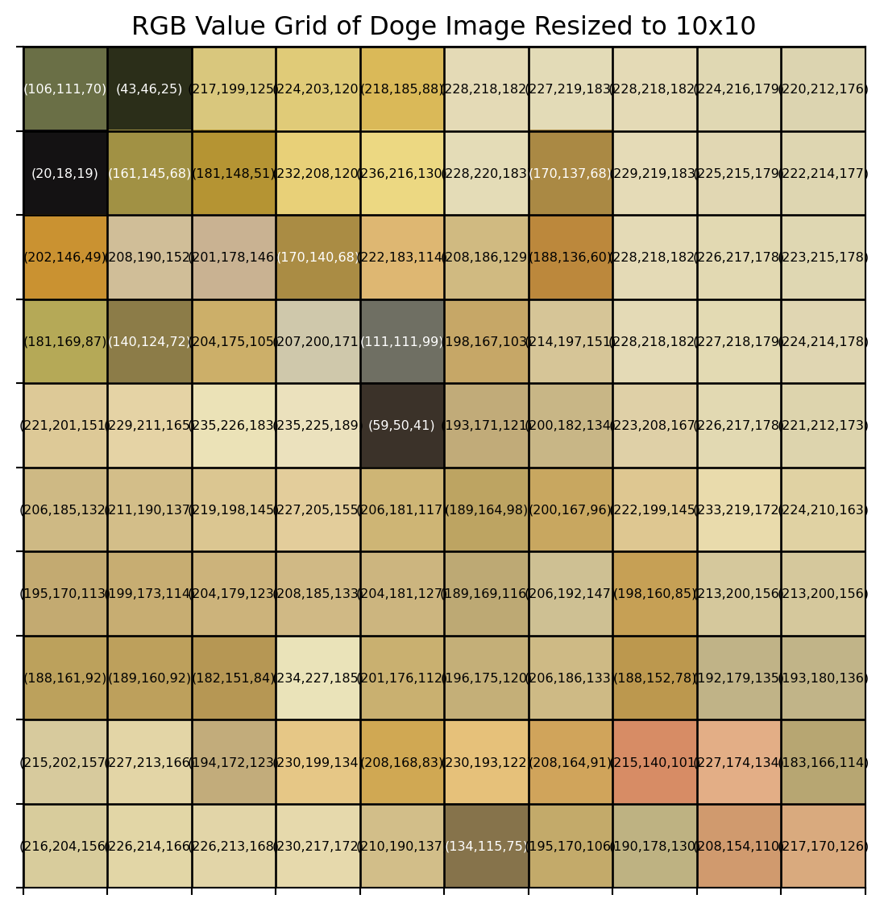
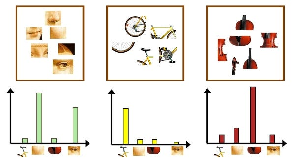
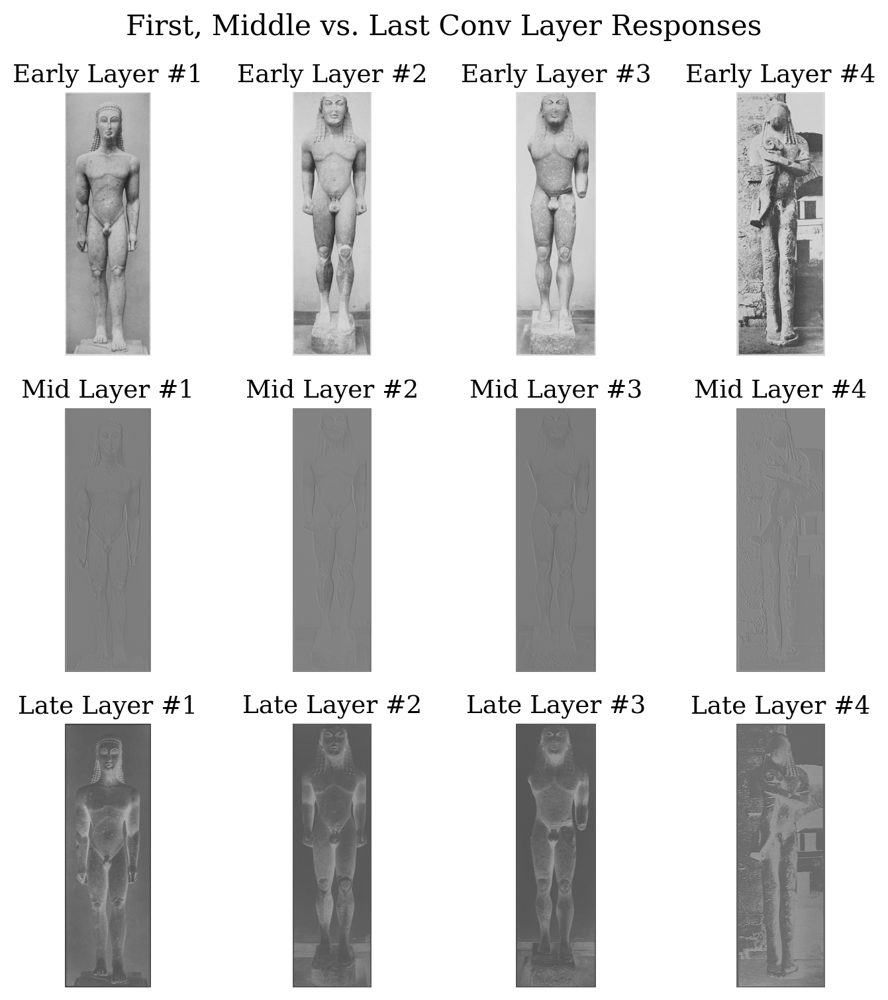
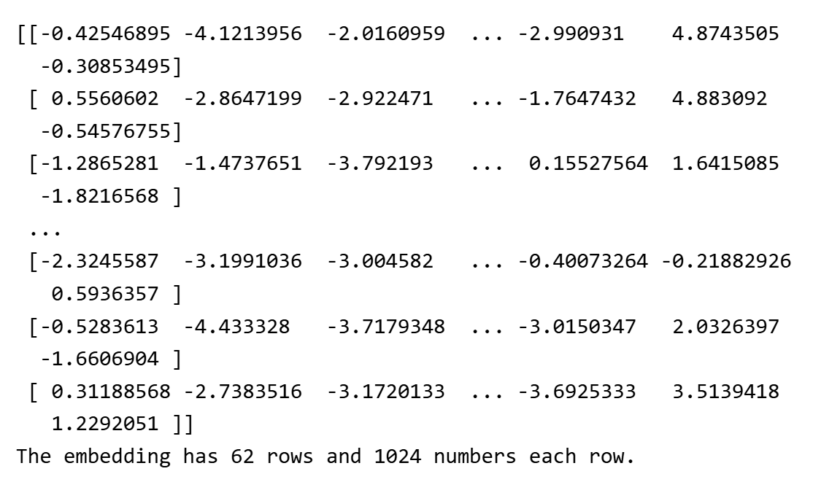
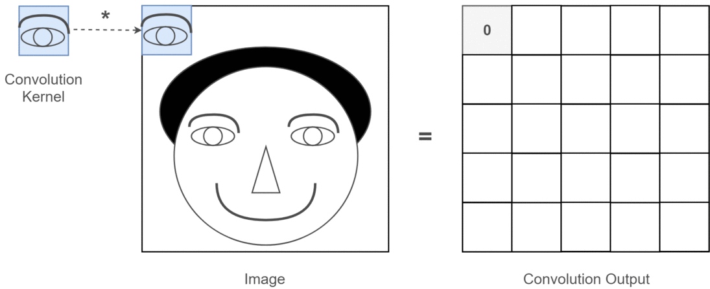

# Section 1: Image Analysis Overview

## 1.1 Motivation

- **"Humans are visual creatures."** Human beings rely on visual information to understand, depict, and communicate about the world around them.

::: {layout-ncol=3}

{height=220px fig-align="center"}

{height=220px fig-align="center"}

{height=220px fig-align="center"}
:::
<!-- end columns -->

---

## 1.1 Motivation

- Into the digital age, images have become a ubiquitous form of data, capturing information that tables and text alone cannot, or at least vey inefficient to convey. 
- Analyzing large collections of images can provide insights about patterns, trends, and relationships that would be difficult or impossible to discern through manual inspection.
- The field of **image analysis** has emerged to extract meaningful information from images using computational techniques.

. . .

- **But, this comes with challenges:**
    - Images are **high-dimensional** data, making them computationally intensive to process and analyze.
    - Variability in lighting, angle, occlusion, resolution and other factors can complicate analysis.
    - Annotating images for image analysis tasks can be time-consuming and expensive.

## 1.2 Image Analysis Applications

- **Medical Imaging:** Detecting tumors, analyzing X-rays, MRIs, and CT scans.

{height=200px fig-align="center"}

- **Autonomous Vehicles:** Object detection and scene understanding for navigation.
- **Agriculture:** Crop monitoring, disease detection, yield estimation.
- **Surveillance:** Facial recognition and activity monitoring.
- **Retail & Logistics:** Inventory management, customer behavior analysis.

---

### Specifically, in Arts and Social Sciences...

- **Remote Sensing:** Land use classification, environmental monitoring, satellite archaeology.

)](media/Remote_Sensing_Archaeology.jpg){height=150px fig-align="center"}

- **Cultural Heritage:** Digitization and analysis of artworks and historical documents.
- **Behavioral Studies:** Analyzing human activities, emotions and interactions in photos and frames from videos.

:::{.callout-note icon="false"}
### Discussion 

Can you think of other applications of image analysis in your field of study or interest? Share your thoughts!
:::

# Section 2: Computational Image Analysis

## 2.1 Image as a Type of Data

- Just like tabular data or text data, images can be represented and processed as data structures that computers can understand, but with unique characteristics. 
- Different types and formats of images exist, each with its own properties and use cases.
- **Common Image Formats**:
    - **Raster Images:** Composed of pixels, e.g., JPEG, PNG, BMP.
    - **Vector Images:** Composed of paths, e.g., SVG, EPS.
    - **Specialized Formats:** DICOM (medical imaging), GeoTIFF (geospatial data).

::: {.callout-note}
- The choice of image format can impact the analysis process, including storage requirements, processing speed, and the types of analyses that can be performed.
- Among these, raster images are most commonly used in image analysis tasks. When you are looking for image datasets, you will most likely encounter raster images.

You can learn more about image formats [here](https://en.wikipedia.org/wiki/Image_file_format).
:::

---

### 2.1.1 Image Representation

#### Image as a Grid of Pixels

- Most common representation of images is as a grid of pixels, where each pixel has a specific color value.
- **Grayscale Images:** Each pixel is represented by a single intensity value (0-255 for 8-bit images).
- **Color Images:** Each pixel is represented by multiple values, typically in RGB format (Red, Green, Blue channels).

::: {layout-ncol=2}
{width=270px fig-align="center"}

{width=270px fig-align="center"}
:::

---

#### Image as "visual words"

- In some image analysis techniques, images can be represented as collections of "visual words" or features.
- This approach is often used in bag-of-words models for image classification, where local features (like edges, corners) are extracted and quantized into a vocabulary of visual words.
- Common techniques for extracting visual words include **SIFT** (Scale-Invariant Feature Transform) and **SURF** (Speeded Up Robust Features).

{height=250px fig-align="center"}

---

#### Image as Embeddings

- Images can be represented as high-dimensional embeddings, encoding features learned by neural networks. 
- These embeddings are useful for tasks like retrieval, clustering, and classification, capturing complex patterns beyond traditional methods.
- Models of different architectures will generate different embeddings for the same image, depending on their training objectives and learned features.

::: {layout-ncol=2}

{width=280px fig-align="center"}

{height=240px fig-align="center"}

:::

## 2.2 Image Processing vs. Image Analysis

- Similar to data processing and data analysis in tabular data, image processing and image analysis are two related but distinct concepts in the field of image analysis.
    - **Image Processing:** Involves techniques to enhance, manipulate, or transform images to improve their quality or extract specific features. 
    - **Image Analysis:** Involves extracting meaningful information from images using computational techniques. 

. . .

- Image processing is often a prerequisite step for image analysis, as it turns unstructured image data into a more structured form that can be analyzed. Examples of common image processing techniques include:
    - Noise reduction
    - Contrast enhancement
    - Edge detection
    - Image segmentation

## 2.2.1 Data Acquisition and Preprocessing

- **Data Acquisition**: 
    - Capture high-quality images relevant to the research question using appropriate equipment and settings.
    - Ensure proper lighting, focus, and resolution to minimize noise and artifacts.
    - Collect diverse samples to account for variability in real world conditions.

. . .

- **Preprocessing**: 
    - Standardize images by resizing, cropping, and normalizing pixel values.
    - Enhance dataset quality through augmentation, denoising, etc.
    - Annotate or label images to provide ground truth information for supervised learning tasks.

. . .

:::{.callout-note icon="false"}
### Discussion

What are some common challenges you might face when acquiring and preprocessing image data for analysis in your field of study or interest?
:::

---

### 2.2.2 Convolutional Operations

- **Convolution** is the cornerstone of many image processing and analysis techniques, it involves applying a filter (or kernel) to an image to extract specific features or patterns.

:::{layout-ncol=2}

{height=150px fig-align="center"}

{height=150px fig-align="center"}

:::
- Common filters include: Edge Detection, Sharpening, Blurring, Embossing, etc.

{height=160px fig-align="center"}

---

### 2.2.3 Augmentation, Denoising, and Enhancement

- **Augmentation**: Techniques to artificially increase the size and diversity of an image dataset by applying transformations such as rotation, flipping, scaling, cropping, color jittering, etc.
- **Denoising**: Techniques to reduce noise in images, such as Gaussian filtering, median filtering, and more advanced methods like Non-Local Means and Deep Learning-based denoising.
- **Enhancement**: Techniques to improve the visual quality of images, such as histogram equalization, contrast stretching, and sharpening.

---

### 2.2.4 "Manual" Image Analysis

## 2.3 Classical Computer Vision

## 2.3.1 Feature Extraction

## 2.3.2 Image Segmentation

## 2.4 Modern Machine Learning and Deep Learning for Image Analysis

## 2.4.1 Supervised Learning

## 2.4.2 Unsupervised Learning

## 2.4.3 Deep Learning and CNN

## 2.4.4 Vision Transformers

## 2.4.5 Critical Considerations in Using ML/DL Models

## 2.5 Common Libraries for Image Analysis in Python

# Section 3: Demo-Aerial Image Analysis with Pre-trained Models

## 3.1 Problem Definition

## 3.2 Data Collection

## 3.3 Using Pre-trained Models

## 3.4 Evaluation Metrics

## 3.5 Model Fine-tuning

## 3.6 Visualizing Results

## 3.7 Ethical Considerations

## Conclusion

## References

- 
- 