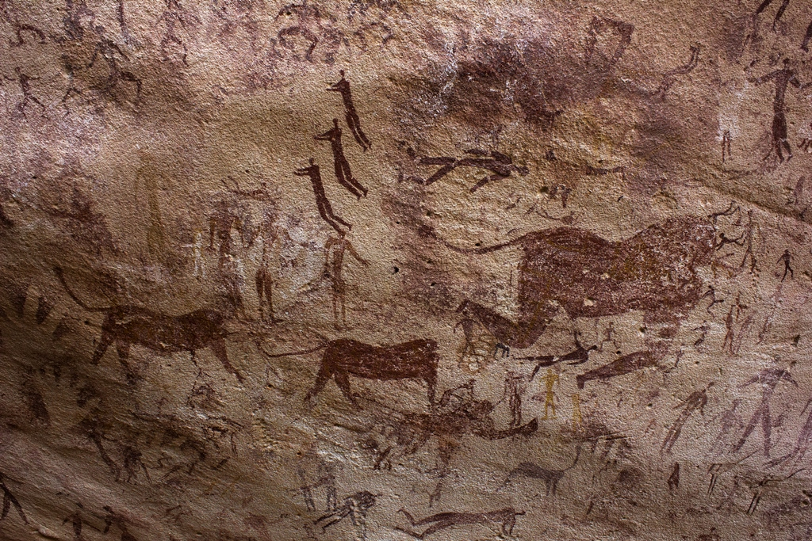
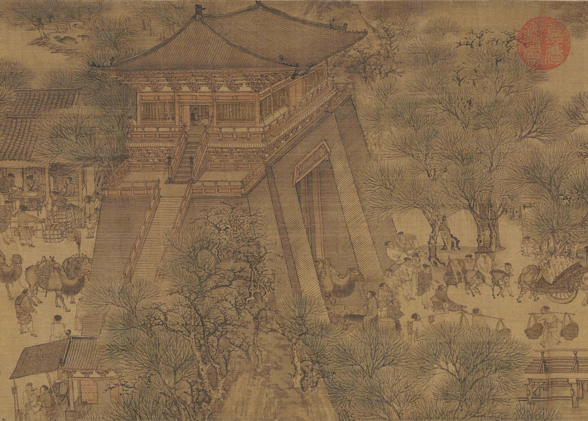

# Section 1: Image Analysis Overview

## 1.1 Motivation

- **"Humans are visual creatures."** Human beings rely on visual information to understand, depict, and communicate about the world around them.

::: {layout-ncol=3}

{height=220px fig-align="center"}

{height=220px fig-align="center"}

{height=220px fig-align="center"}
:::
<!-- end columns -->

---

## 1.1 Motivation

- Into the digital age, images have become a ubiquitous form of data, capturing information that tables and text alone cannot, or at least vey inefficient to convey. 
- Analyzing large collections of images can provide insights about patterns, trends, and relationships that would be difficult or impossible to discern through manual inspection.
- The field of **image analysis** has emerged to extract meaningful information from images using computational techniques.

. . .

- **But, this comes with challenges:**
    - Images are **high-dimensional** data, making them computationally intensive to process and analyze.
    - Variability in lighting, angle, occlusion, resolution and other factors can complicate analysis.
    - Annotating images for image analysis tasks can be time-consuming and expensive.

## 1.2 Image Analysis Applications

- **Medical Imaging:** Detecting tumors, analyzing X-rays, MRIs, and CT scans.

{height=200px fig-align="center"}

- **Autonomous Vehicles:** Object detection and scene understanding for navigation.
- **Agriculture:** Crop monitoring, disease detection, yield estimation.
- **Surveillance:** Facial recognition and activity monitoring.

## 1.3 Image Analysis in Social Sciences

- **Remote Sensing:** Land use classification, environmental monitoring, satellite archaeology.

)](media/Remote_Sensing_Archaeology.jpg){height=150px fig-align="center"}

- **Cultural Heritage:** Digitization and analysis of artworks and historical documents.
- **Behavioral Studies:** Analyzing human activities, emotions and interactions in photos and frames from videos.

# Section 2: Computational Image Analysis

## 2.1 Image as a Type of Data

## 2.1.1 Image Representation

## 2.1.2 Image Formats

## 2.2 Image Processing vs. Image Analysis

## 2.2.1 Data Acquisition and Preprocessing

## 2.2.2 Image Enhancement

## 2.2.3 "Manual" Image Analysis Techniques

## 2.3 Classical Computer Vision

## 2.3.1 Bag of Visual Words (BoVW)

## 2.4 Machine Learning for Image Analysis

## 2.4.1 Supervised Learning

## 2.4.2 Unsupervised Learning

## 2.4.3 Deep Learning and CNN

## 2.4.4 Critical Considerations in Using ML/DL Models

## 2.7 Common Libraries for Image Analysis in Python

# Section 3: A Demo 

## 3.1 Problem Definition

## 3.2 Data Collection

## 3.3 Using Pre-trained Models

## 3.4 Evaluation Metrics

## 3.5 Model Fine-tuning

## 3.6 Visualizing Results

## 3.7 Ethical Considerations

## Conclusion

## References