```python
import numpy as np
import matplotlib.pyplot as plt
from graphviz import Digraph
from IPython.display import display
from ipywidgets import interact, FloatSlider
np.random.seed(19_750)
```

# A visual Introduction to Deep Learning

## Notebook Sections
- #### What is Deep Learning, Machine Learning and Artificial Intelligence
- #### Fundamentals of learning
- #### Neural Networks
- #### How do neural networks learn?
- #### Ethics

## Section 1: What is Deep Learning, Machine Learning and Artificial Intelligence¶


### A bit of AI History

In the early days of artificial intelligence, from the 1950s to the 1970s, scientists were already hoping to build machines that could think and learn like people. One early idea was to create computer models that mimicked the way the human brain works—these were called neural networks. A scientist named Frank Rosenblatt built one of the first versions, called the Perceptron, in the 1950s. But back then, computers were slow, data was limited, and there were big challenges in getting these systems to actually learn. One major issue was that deeper networks (with many layers acting hierarchically) didn’t work well because of how small numbers kept shrinking during training, making learning stop altogether. Because of this, many researchers gave up on neural networks for a while and focused on simpler methods that were easier to control, like rule-based systems or decision trees.


In 2012, a breakthrough called AlexNet changed the game for artificial intelligence. It was a computer program that could look at images and recognize what's in them—like telling the difference between cats and dogs—better than anything before it. What made it special was that it used a technique called deep learning, where the system learns from lots of examples, and it ran on powerful computer chips (GPUs). This success proved that AI could handle complex tasks if given enough data and computing power, sparking huge interest in the tech industry and leading to major advances in things like facial recognition, self-driving cars, and voice assistants.


Then in 2017, another major leap happened with the invention of the Transformer, and by 2018 it was changing how computers understand language. Instead of reading words one at a time like older systems, Transformers could look at entire sentences at once and figure out which words matter most—kind of like how we quickly scan and understand meaning in a conversation. This led to smarter AI that could write, translate, and summarize text much more naturally. It’s the foundation of tools like ChatGPT, which can chat with you, write stories, or even help with coding—all thanks to that shift in how AI "pays attention" to information.

*TLDR;* **People have tried to do this since the 50s but compute, data and efficient models have made it all work.**

## Section 2: Fundamentals of learning

### Lets look at some plots.


```python
# Generate 20 random x values
x = np.linspace(-3, 3, 20)

# Compute y values with some noise
y = x**2 + np.random.normal(0, 1, x.shape)

# Plot the points using seaborn with slightly bigger points
plt.figure(figsize=(8, 5))
plt.scatter(x=x, y=y, s=100, alpha=0.6, label='Data')
plt.title('Some Data')
plt.xlabel('X')
plt.ylabel('Y')
plt.show()
```


    
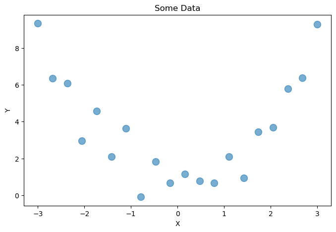
    


#### Here is some data. This can be anything. 


```python
degree = 2
# Fit a polynomial of given degree to the data using numpy
coeffs = np.polyfit(x, y, degree)

# Compute predicted y values
y_pred_2 = np.polyval(coeffs, x)

# Plot the original data and the fitted polynomial
plt.figure(figsize=(8, 5))
plt.scatter(x=x, y=y, s=100, alpha=0.6, label='Data')
plt.plot(x, y_pred_2, color='red', label=f'Degree {degree} Fit')
plt.title('A Good Fit?')
plt.xlabel('X')
plt.ylabel('Y')
plt.legend()
plt.show()
```


    
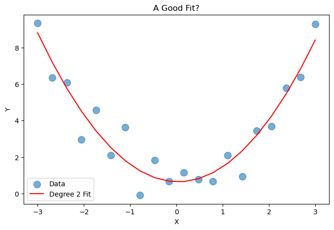
    


#### This red line "fit" to the data


```python
degree = 16

# Fit a polynomial of given degree to the data using numpy
coeffs = np.polyfit(x, y, degree)
# Compute predicted y values
y_pred_15 = np.polyval(coeffs, x)

# Plot the original data and the fitted polynomial
plt.figure(figsize=(8, 5))
plt.scatter(x=x, y=y, s=100, alpha=0.6, label='Data')
plt.plot(x, y_pred_15, color='orange', label=f'Degree {degree} Fit')
plt.title('A Better Fit?')
plt.xlabel('X')
plt.ylabel('Y')
plt.legend()
plt.show()
```


    
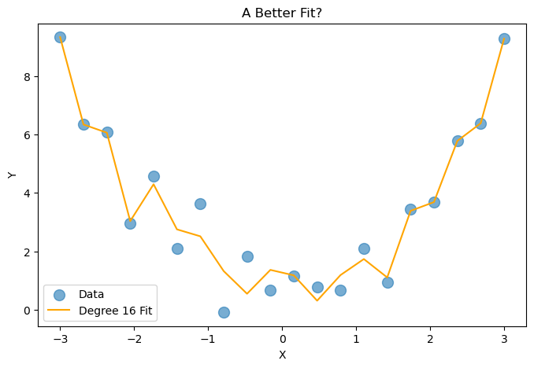
    


#### This orange line "fit" to the data


```python
plt.figure(figsize=(8, 5))
plt.scatter(x=x, y=y, s=100, alpha=0.6, label='Data')
plt.plot(x, y_pred_15, color='orange', label=f'Degree {15} Fit')
plt.plot(x, y_pred_2, color='red', label=f'Degree {2} Fit')
plt.title('Both Together')
plt.xlabel('X')
plt.ylabel('Y')
plt.legend()
plt.show()
```


    
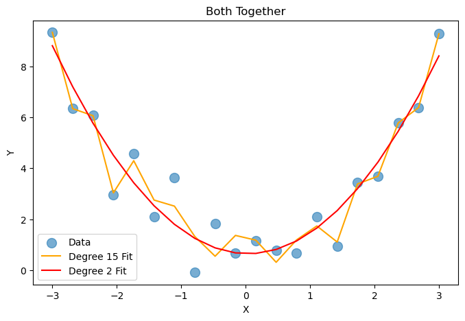
    


### What is better?

The red line *seems* better but the orange line quantatively has lower error since it goes directly through most points. 

- ##### Say you put a point between the some of the blue dots? Is the orange line more likely to predict a better position for the points or the red?
<details>
  <summary>Show answer</summary>
    No! The red line generalizes to points that dont exist in the plot much better.
</details>

- ##### What about if you add points to the left and right of the existing points?
<details>
  <summary>Show answer</summary>
   The red line does better again for unseen points.
</details>

### Key Takeaways

- #### Your model needs to be able to generalize.
- #### Your model should not blindly memorize the data it is given. Eg. Force its way through every point.
  
This is the fundamental rule of learning.

#### Example:

Say your vision model to drive self driving cars is trained with lots of videos from Los Angeles (LA. Now you drive to Vancouver and realize that your system works a lot worse. One reason for this is that the model **overfit** to the LA data. 

In reality, self driving cars are trained on data from all types of cities, suburbs and rural areas. In all driving conditions and and weather. **But** when highly unexpected things happen (like sandstorms or forrest fires that make the sky orange) these systems perform worse. 


*TLDR;* **Your predictor should generalize and find the underlying pattern not memorize that data it has seen like a puppet.**

## Section 3: Neural Networks

### Lets look at some more plots.


```python
x = np.linspace(1, 100, 200)
# Generate y values for -log(x) with noise
y_neg_log = -np.log(x) + np.random.normal(scale=0.2, size=x.shape)

# Create the scatter plot
plt.figure(figsize=(8, 5))
plt.scatter(x, y_neg_log, label='Data', color='red', s=75, alpha=0.6)
plt.title('Some Data')
plt.xlabel('X')
plt.ylabel('Y')
plt.grid(True)
plt.legend()
plt.tight_layout()
plt.show()

```


    
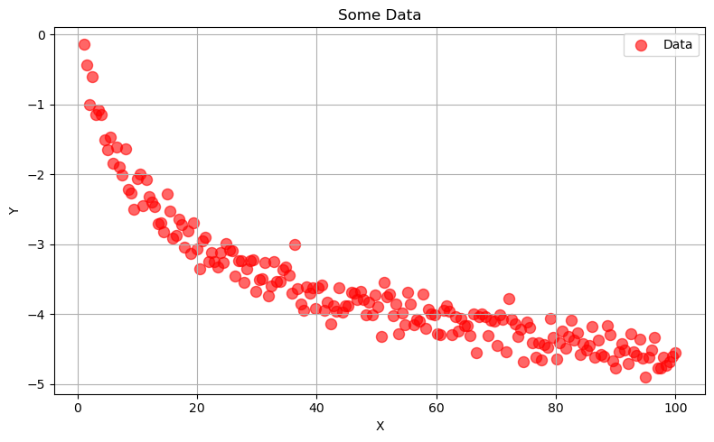
    


#### This data is non linear. We cannot fit a line to this that can capture the pattern here. 


```python
x_transformed = np.sqrt(x)

# Generate y values for -log(x) with noise
y_neg_log = -np.log(x) + np.random.normal(scale=0.2, size=x.shape)

# Create the scatter plot
plt.figure(figsize=(8, 5))
plt.scatter(x_transformed, y_neg_log, label='Stretched Data', color='blue', s=75, alpha=0.6)
plt.title('Some Data')
plt.xlabel('X')
plt.ylabel('Y')
plt.grid(True)
plt.legend()
plt.tight_layout()
plt.show()

```


    
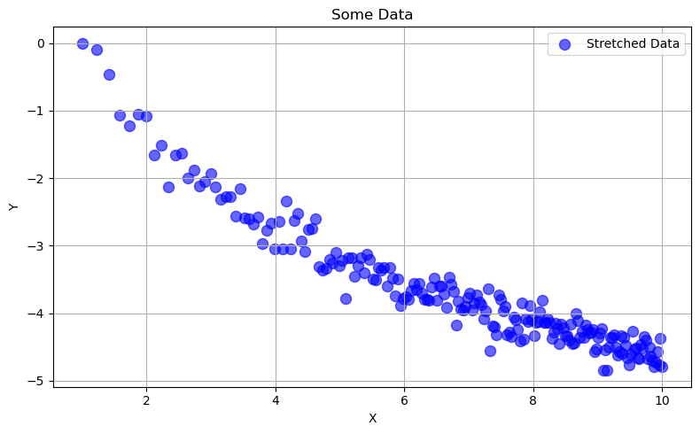
    


#### Here we stretched the X axis and made the data **more linear**. Now we can pass a line through the data **more easily**.


```python
# Data
y_neg_log = -np.log(x) + np.random.normal(scale=0.2, size=x.shape)

# Fit a line
coeffs = np.polyfit(x_transformed, y_neg_log, 1)
y_fit = np.polyval(coeffs, x_transformed)

# Plot
plt.figure(figsize=(8, 5))
plt.scatter(x_transformed, y_neg_log, label='Stretched Data', color='blue', s=75, alpha=0.6)
plt.plot(x_transformed, y_fit, label='Fitted Line', color='red', linewidth=2)
plt.title('Some Data with Fitted Line')
plt.xlabel('X')
plt.ylabel('Y')
plt.grid(True)
plt.legend()
plt.tight_layout()
plt.show()
```


    
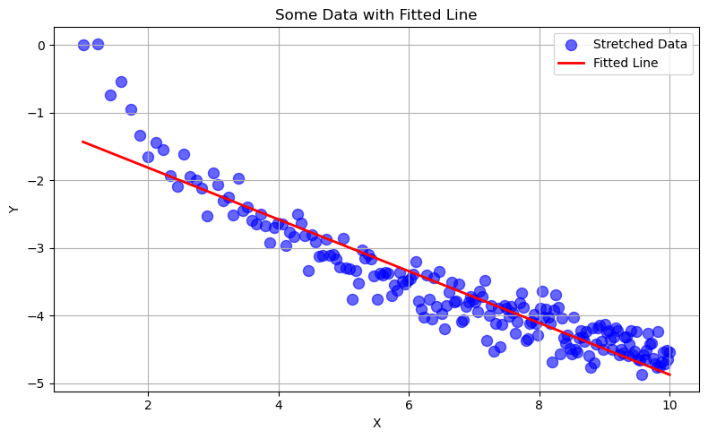
    


Note that we had to do something non-linear to get go from non-linear data -> linear data.
If we took some non-linear and did something linear, the result will be non-linear.

#### This is what neural networks do. They take complicated non linear data (like language, images, videos and proteins) and transform them until we can use simple linear predictors on them. 

#### So is it as simple as:

$$
\Large
\text{Data} \quad \xrightarrow{\text{Make it linear}} \quad \text{Linearized Data} \quad \xrightarrow{\text{Linear Predictors}} \quad \text{Predictions}
$$

#### Neural networs facilate the **"Make it linear"** step. They do so by learning the transformation needed directly by looking at the data.

##### Lets look at more plots but this time for classification.


```python
n = 500
theta = 2 * np.pi * np.random.rand(n)
r1, r2 = 5, 2
x = np.concatenate([r1 * np.cos(theta) + np.random.randn(n)*0.3, r2 * np.cos(theta) + np.random.randn(n)*0.3])
y = np.concatenate([r1 * np.sin(theta) + np.random.randn(n)*0.3, r2 * np.sin(theta) + np.random.randn(n)*0.3])
c = np.concatenate([np.zeros(n), np.ones(n)])
plt.scatter(x, y, c=c, cmap='plasma', edgecolor='k', alpha=0.7); plt.title("Ring Data")
plt.axis('equal'); plt.show()

```


    
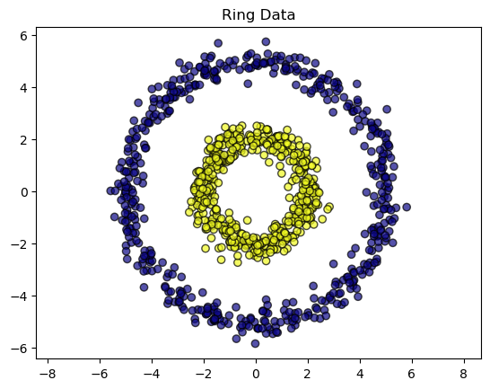
    


#### You cannot draw a line to seperate the two colors!

#### You might have seen images like this:


```python
dot = Digraph(format='png', graph_attr={'rankdir':'LR', 'size':'8,5'})

for i, layer_size, color, prefix in [(0, 2, 'lightblue', 'I'), (1, 3, 'lightgreen', 'H'), (2, 1, 'salmon', 'O')]:
    with dot.subgraph(name=f'cluster_{prefix}') as c:
        c.attr(color='white')
        for n in range(layer_size):
            c.node(f'{prefix}{n+1}', f'{prefix}{n+1}', shape='circle', style='filled', color=color)

for i, j in [(i,j) for i in range(2) for j in range(3)]:
    dot.edge(f'I{i+1}', f'H{j+1}')
for i in range(3):
    dot.edge(f'H{i+1}', 'O1')  # only one output node now

display(dot)

```


    
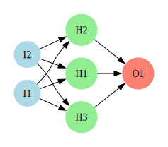
    


This represents an extremely tiny neural network. 

#### What is this doing to our ring data?

- The blue circles are input layer (X and Y axis).
- The H 1, 2, 3 are called a **"Hidden Layer"**.
- O1, or the last layer is called the **"Output layer"**.

#### A properly trained neural netowrk in this case would project the ring data into a 3D space because of H1, 2, 3.

<details>
  <summary>Bonus</summary>
    In fact, neural networks are so good they will ususally compress the rings diameter to make the seperating "power" greater.
</details>


```python
n=500; t=2*np.pi*np.random.rand(n)
x=np.concatenate([5*np.cos(t)+np.random.randn(n)*0.3, 2*np.cos(t)+np.random.randn(n)*0.3])
y=np.concatenate([5*np.sin(t)+np.random.randn(n)*0.3, 2*np.sin(t)+np.random.randn(n)*0.3])
z=np.concatenate([np.zeros(n), np.full(n,3)]); c=np.concatenate([np.zeros(n), np.ones(n)])
fig=plt.figure(); ax=fig.add_subplot(projection='3d')
ax.scatter(x,y,z,c=c,cmap='plasma',edgecolor='k',alpha=0.7);plt.title("Like this (maybe)");plt.show()
```


    
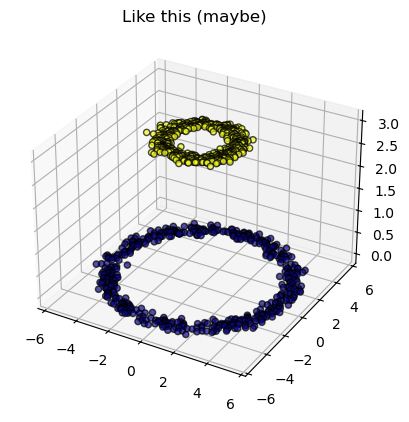
    


#### Now at the ouput layer O1, the network "learns" a "sheet of paper" that seperates the two. 1 being yellow and 0 being yellow (or the other way around).


```python
n=500; t=2*np.pi*np.random.rand(n)
x=np.concatenate([5*np.cos(t)+np.random.randn(n)*0.3, 2*np.cos(t)+np.random.randn(n)*0.3])
y=np.concatenate([5*np.sin(t)+np.random.randn(n)*0.3, 2*np.sin(t)+np.random.randn(n)*0.3])
z=np.concatenate([np.zeros(n), np.full(n,3)])
c=np.concatenate([np.zeros(n), np.ones(n)])

fig=plt.figure(); ax=fig.add_subplot(projection='3d')
ax.scatter(x,y,z,c=c,cmap='plasma',edgecolor='k',alpha=0.7)
xx,yy=np.meshgrid(np.linspace(-6,6,10),np.linspace(-6,6,10))
ax.plot_surface(xx,yy,np.ones_like(xx)*1.5,color='gray',alpha=0.5)
plt.title("Like this");plt.show()
```


    
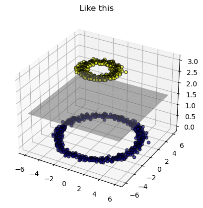
    


#### This is what a neural network does. It can do the same for continous predictions like age.

### So that is deep learning?

As long as you have more than one hidden layer, it is suddenly **"Deep Learning"**

**Theoretically**, an infinitely long hidden layer (like below) can do anything. But if would have to be too big to compute. 


```python
dot = Digraph(format='png', graph_attr={'rankdir':'LR', 'size':'8,5'})

for layer, nodes, color in [('I', 2, 'lightblue'), ('H', 2, 'lightgreen'), ('O', 1, 'salmon')]:
    with dot.subgraph(name=f'cluster_{layer}') as c:
        c.attr(color='white')
        for n in range(nodes):
            c.node(f'{layer}{n+1}', f'{layer}{n+1}', shape='circle', style='filled', color=color, width='0.6', fixedsize='true')
        if layer == 'H':
            c.node('Hdots', '...', shape='plaintext', fontsize='20')
            c.node('Hn', 'H...n', shape='circle', style='filled', color=color, width='0.6', fixedsize='true')

for i in range(2):
    for h in [1, 2]:
        dot.edge(f'I{i+1}', f'H{h}')
    dot.edge(f'I{i+1}', 'Hdots', style='dashed')
    dot.edge(f'I{i+1}', 'Hn', style='dashed')

for h in [1, 2]:
    dot.edge(f'H{h}', 'O1')
dot.edge('Hdots', 'O1', style='dashed')
dot.edge('Hn', 'O1', style='dashed')

display(dot)

```


    
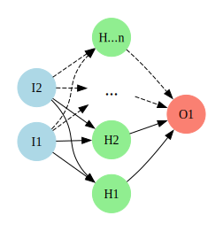
    


So we stick to reality and do things is steps. We have a **heirachial** series of layers.


```python
dot = Digraph(format='png', graph_attr={'rankdir':'LR', 'size':'8,5'})

layers = [
    (2, 'lightblue', 'I'),
    (4, 'lightgreen', 'H1'),
    (3, 'lightgreen', 'H2'),
    (3, 'lightgreen', 'H3'),
    (4, 'lightgreen', 'H4'),
    (1, 'salmon', 'O')
]

for size, color, prefix in layers:
    with dot.subgraph(name=f'cluster_{prefix}') as c:
        c.attr(color='white')
        for n in range(size):
            c.node(f'{prefix}{n+1}', f'{prefix}{n+1}', shape='circle', style='filled', color=color)

# connect layers in sequence
for (prev_size, _, prev_prefix), (next_size, _, next_prefix) in zip(layers, layers[1:]):
    for i in range(prev_size):
        for j in range(next_size):
            dot.edge(f'{prev_prefix}{i+1}', f'{next_prefix}{j+1}')

display(dot)

```


    
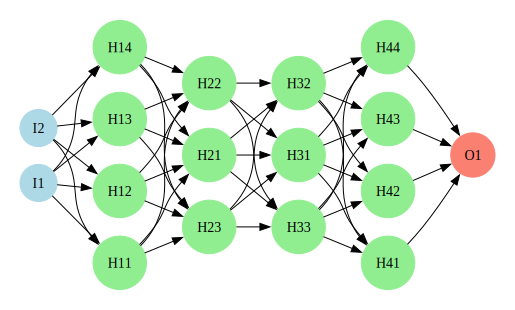
    


You can have any number of "width" here in the hidden layers. Numbers as high as 10,000 or 100,000 are common. The largest neural networks these days have **2 trillion "circles"**. And we want to build even bigger ones. 

Say you have an image recognition model and it has many layers. 

- The lower layers learn to pick up textures, lines and edges.
- The middle layers learn patters.
- The upper layers learn how to detect objects.

For example:

Credit - Chris Olah


### So how do these transformations happen? 

We need to take non-linear data and make it linear. The only way to do that is to "fight" it with non linearities of our own. A neural network trained to seperate the two does the following:

Credit - Chris Olah
<table>
<tr>
<td></td>
<td style="text-align: center; vertical-align: middle; font-size: 30px;">→</td>
<td></td>
</tr>
</table>

**It morphs the space under the data using non linear trasformations!**

*TLDR;* **Data -> Make it linear using non linear transformations -> Do simple linear predictors**

## Section 4: How do neural networks learn?

One key thing to note is that nobody programs or tells these models to do anything, including how to transform the data and how strongly. **Everything** is learned from data. In this section we will intuitively understand how these models learn from data. 

### Gradient Descent

#### Problem setup - Optimization

The plots below showcase a simple stup where we need to find an optimal red dot that gives us the best looking line. Here we only have one parameter to "move" using the slider. The largest neural networks have 2 trillion!


```python
import numpy as np
import matplotlib.pyplot as plt
from ipywidgets import interact, FloatSlider

x = np.linspace(-5, 5, 50)
y = 2 * x + 1 + np.random.normal(0, 2, 50)
slopes = np.linspace(-4, 6, 100)
mse = lambda s, i=1.0: np.mean((y - (s * x + i)) ** 2)
mse_vals = [mse(s) for s in slopes]

contour_slopes = np.linspace(-10, 12, 100)
contour_intercepts = np.linspace(-8, 10, 100)
S, I = np.meshgrid(contour_slopes, contour_intercepts)
Z = np.array([[mse(S[i, j], I[i, j]) for j in range(len(contour_slopes))] for i in range(len(contour_intercepts))])

def plot(s):
    i, m = 1.0, mse(s)
    fig, ax = plt.subplots(1, 3, figsize=(15, 4))
    ax[0].plot(slopes, mse_vals)
    ax[0].scatter(s, m, color='r')
    ax[0].set(title="Loss Landscape", xlabel="Parameter", ylabel="Error")
    yp = s * x + i
    ax[1].scatter(x, y)
    ax[1].plot(x, yp, 'orange')
    ax[1].set(title="Linear Model")
    cp = ax[2].contour(S, I, Z, 20)
    ax[2].scatter(s, i, color='r', marker='x', s=100)
    ax[2].set(title="Landscape Contour Plot", xlabel="Slope", ylabel="Intercept")
    fig.colorbar(cp, ax=ax[2], label="MSE")
    plt.tight_layout()
    plt.show()

interact(plot, s=FloatSlider(value=2, min=-4, max=6, step=0.1))
```


    interactive(children=(FloatSlider(value=2.0, description='s', max=6.0, min=-4.0), Output()), _dom_classes=('wi…


    <function __main__.plot(s)>


```python

```

## TODO Complete Optimization
## TODO Ethics
