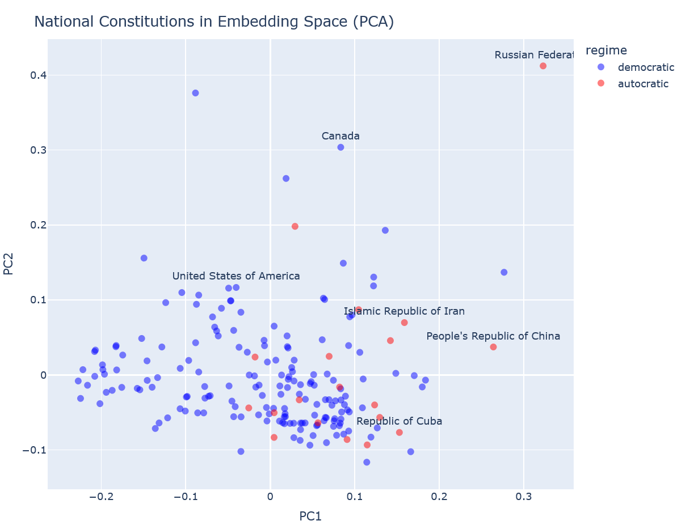
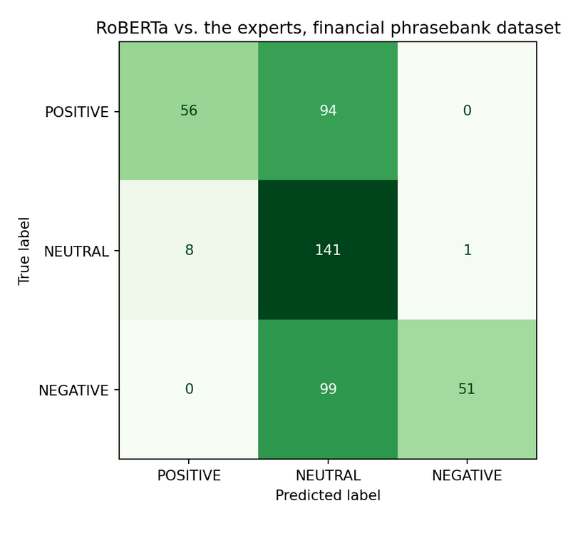
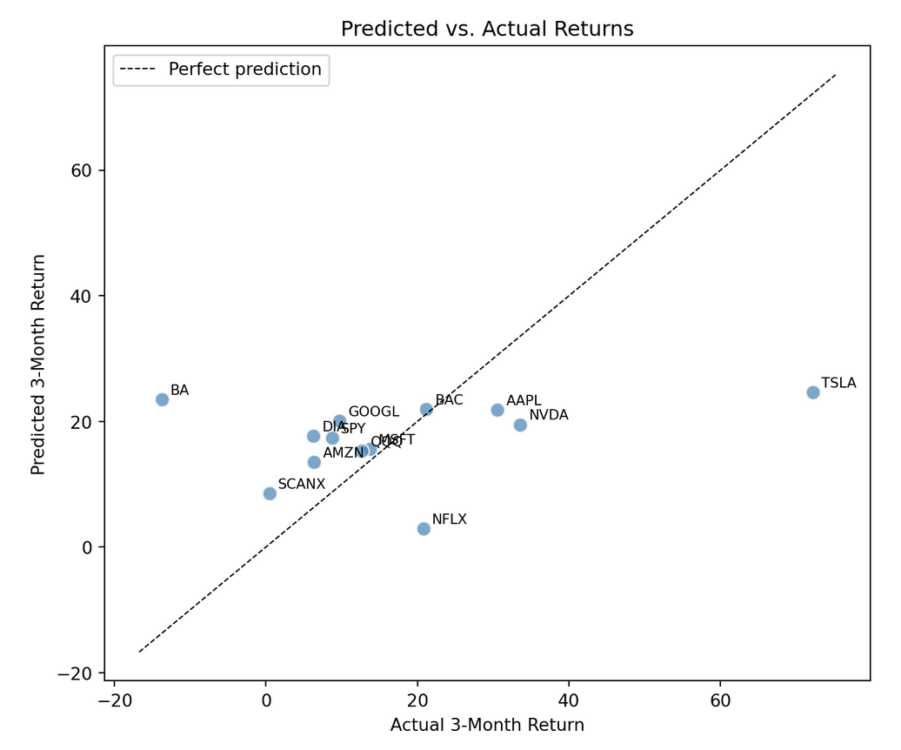

<!-- Conference + date placeholder to fill in per venue -->
<!-- {Conference Name · Date} -->

:::: {style="text-align: center;"}
{.qr fig-alt="QR code for ubcecon.github.io/praxis-ubc"}

[ubcecon.github.io/praxis-ubc]{style="font-size: 0.7em;"}
::::

:::: {style="text-align: center; margin-top: 1.5em;"}
[The Praxis Project and UBC are located on the traditional, ancestral and unceded territory of the xʷməθkʷəy̓əm (Musqueam) and Sḵwx̱wú7mesh (Squamish) peoples.]{.land-ack}
::::

## Have you ever...

- Wanted to teach students that AI tools can **do more** than write essays for them?

- Tried to incorporate machine learning into a **humanities or social science** course and run into the prerequisite wall?

- Wished your students could engage with AI tools ***as practitioners of their discipline***, not as passive users?

## Two gaps

::: {.fragment}
1. **Students see AI as a black box.**

Disconnected from the disciplinary training they're already doing.

2. **AI literacy taught only in CS courses doesn't transfer.**

And most Arts majors face prerequisite walls that prevent them from taking those courses anyway.
:::

 

::: {.fragment}
**The result:** _students who *use* AI tools without understanding them; and who can't critically evaluate AI-driven research in their own field._
:::

## The objective

The overaching goal of this project is to show students (and faculty) that:

1.  AI can be used to **construct knowledge** in their specific domain, not just as general-purpose tools.
2.  AI tools are **more useful** and **more powerful** when embedded in the disciplinary questions and methods they already know.
3.  AI tools are **not hard** to use once you understand the basics of how they work and how they connect to familiar concepts.

## Knowledge construction and AI {.smaller}

Our argument is that AI tools in academia are (at their best) tools that allow us to construct knowledge in new ways:

1.  **Scale**: the first category is tool that increase the scale of what an individual can do, through automation or machine assistance. 
2.  **Perspective**: AI tools give us new perspectives that are fundamentally different from human perspectives, allowing us to study new kinds of patterns and relationships.
    * These perspectives are not necessarily "better" or worse than human perspectives, just different.
    * They also can be automated and systematically varied to study how perspectives shape the knowledge we construct.

We highlight both of these kinds of applications.

## The classroom challenge

* How do we bring these kinds of (often complex) tools into the classroom?
* How do we deal with different technical backgrounds?
* How do we avoid creating unequal knowledge access based on tool access?

## AI tools are statistical tools you already teach {.smaller}

 

For economics, and other quantitative social science this is not a stretch:

| What CS calls it               | What we already teach                                  |
| ------------------------------ | ------------------------------------------------------ |
| Next-token prediction (LLM  s) | Conditional probability over a vocabulary              |
| Sentiment classifier           | Logistic / multinomial classification on text features |
| Word embeddings                | Dimension-reduced vector representation                |
| Temperature                    | Softmax sharpness parameter                            |
| Confidence score               | Predicted probability for the top class                |

 

[Not new statistical concepts; familiar ones, just in a new domain.]{.payoff}

## What is Praxis? {.smaller}

- *Open educational resource library*: hands-on Jupyter modules and accompanying website with rendered notebooks, documentation, and teaching guides.
  * Builds on an econometrics-focused project called [COMET](https://comet.arts.ubc.ca/): <https://comet.arts.ubc.ca/>
- *Sponsored by a UBC TLEF grant*: developed mostly by undergraduate research assistants under the supervision of faculty leads, with the goal of including material from Arts, Humanities, and Social Sciences disciplines.
  * Includes material from economics, sociology, political science, history, ancient student, family studies.
- **Open source, CC-BY-NC-SA**: fork-and-adapt encouraged.

## What makes these *teaching* tools, not tech demos or tools

- **Disciplinary question first, technique second**: not the other way around

- **Theoretical scaffolding before the code**: students understand the math and rationale before they run it

- **"Try it yourself" cells at decision points**: We encourage discussion and class activity

- **Discussion prompts that connect the technique back to statistics and Economics that students already know**

## Remainder of this workshop

Walk though of 1 (maybe 2?) modules from our Praxis library, showing specific applications of our pedagogical approach.

1. Module 1: **Do autocratic constitutions sound different**? (Political Economy)
2. Module 2: **From next-word prediction to predicting markets** (Econometrics)

# Demonstration

## Module 1: Do autocratic constitutions sound different?

- **Question:** is the language of authoritarian constitutions distinguishable from democratic ones?

- **Data:** Comparative Constitutions Project 193 national constitutions, classified by V-Dem's *Regimes of the World* index

- **Method:** TF-IDF-weighted Word2Vec embeddings, cosine similarity, Cohen's d + Welch's t-test

- **Course context:** Political Economy

## Authoritarian regimes use democratic vocabulary more than democracies do {.smaller auto-stretch="false"}

::: {.columns}
::: {.column width="55%"}
{fig-alt="PCA scatterplot of constitutions in embedding space" style="max-height: 420px; width: auto; display: block; margin: 0 auto;"}
:::

::: {.column width="45%"}
 

| Word | Cohen's *d* | *p-value* |
|------|-----------|------|
| democracy | 0.886 | 0.0003 |
| equality  | 0.846 | 0.0031 |
| freedom   | 0.773 | 0.0043 |

[Positive *d* → closer to autocratic constitutions]{style="font-size: 0.5em; color: #7D7D7D;"}
:::
:::

[The constitutions claiming to value democracy most heavily aren't the democratic ones.]{.payoff style="margin-bottom: 1em;"}

## Module 2: From next-word prediction to predicting markets

- **Question:** can the same conditional-distribution machinery used for next-word prediction → sentiment classification → linear regression on stock returns

- **Data:** Financial PhraseBank (expert-labeled) + Twitter financial news sentiment (2019)

- **Method:** pretrained RoBERTa for sentiment, linear regression on returns

- **Course context:** Data in Economics

## Sentiment, prediction and stock returns {.smaller}

::: {.columns}
::: {.column width="50%"}
{fig-alt="Confusion matrix of RoBERTa sentiment predictions vs expert labels"}
:::

::: {.column width="50%"}
{fig-alt="Predicted vs actual 3-month stock returns scatterplot"}
:::
:::

## Three ways to use Praxis

1. **Read the rendered notebooks online**
    Every notebook is fully rendered with code output on the Praxis site. Students read in a browser, no Python environment needed.

2. **Launch interactively**
    JupyterOpen (UBC), Syzygy (PIMS), or Google Colab. One-click links from the site.

3. **Fork and adapt**
    CC-BY-NC-SA. The `.qmd` source is on GitHub. Clone and modify for your own course.

## Beyond economics

::: {.columns}
::: {.column width="50%"}

**SOCI 415** — Network analysis (Family Networks, Kinship and Chinese Dynasties)

**SOCI 280** — Sentiment analysis &amp; disinformation (BERT) and Propaganda
:::

::: {.column width="50%"}
**HIST 414** — Text embeddings &amp; historical text analysis (Legal stance on Chinese immigrants in BC)

**AMNE 376** — Image embeddings &amp; computer vision (Richter's *Kouroi*, Greek antiquity)
:::
:::

 

[Same pedagogy, different disciplines.]{.payoff}

## Demonstration time

::: {#fig-qrs layout-ncol=2}

{fig-alt="QR code for Political Economy module" width="360"}

{fig-alt="QR code for Data in Economics module" width="360"}

Demonstration QR codes - links to Google colab
:::

## Lessons learned

* A real power of AI for teaching is the ability to create **new forms of knowledge** that previously were very difficult to even describe, let alone perform.
* AI literacy needs to be embedded in the disciplinary questions and methods students already know, not taught as a separate technical skill.
  - To be a critical user and consumer of AI tools, you need to understand how the knowledge they are creating is connected to the questions and methods you are using.
* Students are highly capable and motivated to use, create, and iterate on these tools when given the opportunity and support.  The biggest obstacle is fear.

## Thank you · Get involved {.smaller}

::: {.columns}
::: {.column width="60%"}
**Contact**

- General: [comet.project@ubc.ca](mailto:comet.project@ubc.ca)
- Jonathan Graves: [jonathan.graves@ubc.ca](mailto:jonathan.graves@ubc.ca)
- Laura Nelson: [laura.k.nelson@ubc.ca](mailto:laura.k.nelson@ubc.ca)

**Acknowledgements**

UBC TLEF · Vancouver School of Economics · Department of Sociology · CCSS
:::

::: {.column width="40%"}
:::: {style="text-align: center;"}
{fig-alt="QR code for ubcecon.github.io/praxis-ubc" width="360"}
::::
:::
:::

[The Praxis Project and UBC are located on the traditional, ancestral and unceded territory of the xʷməθkʷəy̓əm (Musqueam) and Sḵwx̱wú7mesh (Squamish) peoples.]{.land-ack}
