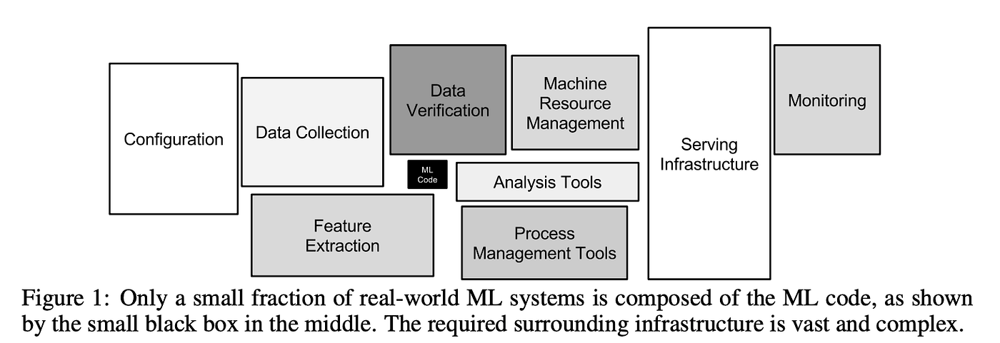

## Outline

### Prerequisites

- Comfort with `pandas` and basic Python at the COMET-intermediate level
- You do **not** need any database or SQL background.

### Learning Outcomes

By the end of this notebook you will be able to:

1. Describe where the datasets used in econometrics and machine learning actually come from, and why the world's data lives in databases.
2. Explain why shared files break down as a way to keep data: redundancy, update anomalies, and concurrent editing.
3. Define **database**, **database management system (DBMS)**, and **SQL**, and state the advantages of a DBMS over regular files.
4. Load a table into **SQLite** from a notebook and query it with `SELECT`, `WHERE`, and `ORDER BY`.
5. Explain what it means that SQL is **declarative**.

```{python}
import sqlite3

import pandas as pd
import matplotlib.pyplot as plt
```

## 1. Before the CSV

Every notebook you have worked through in COMET or prAxIs starts the same way: `pd.read_csv`, and a clean dataframe appears, but it was not created out of nowhere. It was the final product of a pipeline somebody built: data born in one place, stored under rules, extracted, shaped, and finally handed to you. This stream is about everything that happens before the CSV, because that is where most real data work happens.

Data is born in **operational systems**: the checkout that records a sale, the payroll system that records your hours, the interview software running a survey. Those systems write into databases, because they need guarantees a file cannot give: never lose a row, never let two edits collide, never accept an impossible value. Statistical agencies work the same way; a release like Statistics Canada's Labour Force Survey starts as interview records in databases and passes through cleaning, coding, and weighting steps before anything public appears. The tidy CSV at the end is the visible tip of that process, and someone designed every step behind it. That someone is doing **data engineering**!

```{mermaid}
flowchart TB
    subgraph ARC1["Querying data"]
        direction LR
        NB1["1. Why databases<br/>exist"] --> NB2["2. Basic<br/>SQL"] --> NB3["3. Advanced<br/>SQL"] --> NB4["4. Cleaning<br/>real data"]
    end
    subgraph ARC2["Designing and storing data"]
        direction LR
        NB5["5. Modeling<br/>and schemas"] --> NB6["6. Storage, speed,<br/>transactions"] --> NB7["7. OLTP, OLAP,<br/>warehouses"]
    end
    subgraph ARC3["Keeping data flowing"]
        direction LR
        NB8["8. Pipelines I:<br/>scripts to graphs"] --> NB9["9. Pipelines II:<br/>quality, lineage, time"]
    end
    subgraph ARC4["Data for AI"]
        direction LR
        NB10["10. Embeddings and<br/>vector search"] --> NB11["11. Capstone: RAG"]
    end
    ARC1 --> ARC2 --> ARC3 --> ARC4
    style NB1 fill:#c8e6c9,stroke:#2e7d32,stroke-width:3px
```

Machine learning uses the same foundation. The training corpus of a large language model is the output of a pipeline that crawls the web, filters and deduplicates it, and stores it in formats built for scale (they appear in Notebook 6). A production recommender or fraud model is retrained on features extracted, by queries, from operational databases. A retrieval-augmented (RAG) chatbot is (in its simplest form) a database attached to a model: the model's answers are only as good as what the data contains. This is an old observation in the field: the figure below, from a well-known Google paper, shows how little of a real ML system is the model itself, and how much is the data infrastructure around it.

{width=90%}

There is also a more practical reason to learn this: employers ask for it. SQL has sat for years near the top of the most-requested skills in data analyst and data scientist job postings, often ahead of Python and R. The gap between how often jobs ask for SQL and how few students outside CS or statistics ever write any is the gap this stream will fill. This material is endlessly applicable.

An aside (as you most likely have already thought of this): modern LLMs write SQL quite well, but this does not invalidate the skill. Someone still has to design what the tables mean, judge whether the generated query answers the question actually asked, and catch the query that runs error-free and returns the wrong thing. You cannot verify what you do not understand, so these skills are becoming more valuable as query-writing gets cheaper, the same way calculators made mathematical judgment matter more, and arithmetic itself matter less.

## 2. Why a file is not enough

If databases did not exist, the natural way to keep a dataset would be a file: a spreadsheet or a CSV. For a small dataset that one person analyzes and throws away, that works fine, and it is how plenty of real data is still kept. The trouble starts when data is shared, edited over time, and expected to stay correct, because a file enforces nothing: it is a sequence of characters, it accepts anything, and it stores every mistake the same as the real information we are after. The failures that follow are so common they have names:

| A typical failure | What it is called |
|---|---|
| The same person stored several times, under several spellings | **Redundancy**, with no notion of identity to tie the copies together |
| A fix appended as an extra row, with the wrong row left in place | An **update anomaly**: changing a fact creates a second version of it |
| A wage column that quietly switches from annual salary to hourly wages | **No enforced types or meaning**: a column is whatever anyone types into it |
| `BC`, `B.C.`, `bc`, `Britsh Columbia` in one region column | **No controlled categories**: free text where a fixed set of values was intended |
| Several people editing emailed copies of one spreadsheet | A **concurrency** problem: simultaneous edits with no referee |

None of these ever produces an error message. A file loads correctly with three spellings of one person just as it does with one, and the damage surfaces only later, in analysis results, where it is expensive to trace back, or, even worse, it never surfaces at all. Notebook 4 hands you a survey file with every one of these problems in it and teaches you to repair it.

These failures reach the news regularly. In October 2020, nearly 16,000 positive COVID test results dropped out of England's contact-tracing system because the reporting pipeline moved through an aging Excel file format whose row limit silently cut off every file that grew too long (BBC News, 2020). The tests existed and the files loaded; the rows past the limit simply were not in them, and thousands of exposed contacts went untraced.

> **Think Deeper.** Your bank balance is a row in a database. Imagine it were a row in a spreadsheet emailed between branches: two deposits processed on two copies of the file, merged at the end of the day, and one of them simply vanishes. The reason that never happens is the piece of software this notebook is about.

## 3. The database and the DBMS

::: {.callout-important}
## Three definitions

A **database** is a collection of data organized under explicit rules: what tables exist, what each column means and contains, and what counts as a valid entry.

A **database management system (DBMS)** is the software that stores the data and enforces those rules, so that the mistakes from section 2 never happen.

**SQL** (Structured Query Language) is the standard language for asking a DBMS questions and giving it instructions.
:::

A DBMS has value because it takes over exactly the jobs a shared spreadsheet leaves to luck:

1. **Structure.** Every table declares its columns and their types up front, and most database engines use those types to refuse values that do not fit, so a wage column can reject the text `refused` outright. The table we build later in this notebook simply inherits its types from the dataframe; in Notebook 5 we write the schema ourselves and turn that refusal on. Either way, a change in what a column means has to become an explicit change in the structure of the database.
2. **Integrity rules.** The database can enforce that every respondent has exactly one row, that a region must come from a fixed list (for example, US states), or that a wage must fall in a plausible range.
3. **One copy, many users.** Everyone reads and writes the same single database, at the same time, and the DBMS handles the access so that edits are never lost.
4. **Durability.** If the machine crashes mid-write, the database recovers to a consistent state instead of a half-saved file.
5. **A query language.** Instead of every analyst writing their own cleaning-and-averaging script, everyone asks questions in the same language: SQL.

The kind of database we use in this stream is a **relational** database, where data lives in tables: each row is one individual's record, each column is one property of the individual (wage, age, location, etc.), and every row has the same columns.

### 3.1 SQLite

The DBMS we will use for most of this stream is **SQLite**. It is a complete relational DBMS in a small library: it has no server or account requirements, and the entire database lives in a single file. It is also one of the most widely deployed databases in existence, running inside phones, browsers, and applications on billions of devices, and it is in Python's standard library.

The names you hear in industry, PostgreSQL, MySQL, SQL Server, and the cloud warehouses, are DBMSs too. Most of them run as a **server** that many users connect to over a network, which is how "one copy, many users" scales to a whole company. They all function in SQL, so nearly everything you learn on SQLite transfers directly.

## 4. A first database

Time to build one. The dataset for this stream is a wage survey: 1,000 respondents, one row each, with their age, education, province, industry, hours, and hourly wage. (It is simulated for the stream, modelled on labour force surveys, and every later notebook builds on it.)

::: {.callout-note}
## Why simulated data?

The simulation is a deliberate choice we make in this stream, and later notebooks take ever greater advantage of it. A teaching dataset needs a truth we know and failures we control: Notebook 4 cleans a file whose every flaw was planted in advance, and Notebook 7 recovers wage premiums we wrote into the world ourselves. Real public wage microdata can do neither, because it is anonymized before release, and what anonymization strips out is exactly what this stream teaches. Where real data fits, we use it: Notebook 2's province table carries the true legal minimum wages and populations, and the final two notebooks run entirely on real consumer complaints.
:::

```{python}
survey = pd.read_csv("datasets/wage_survey.csv")
survey.head()
```

Loading it into SQLite takes two lines: connect, then write the dataframe in as a table. The connection creates `wage_survey.db` in the datasets folder, and that single file is the entire database. The number the cell returns is the count of rows written.

```{python}
conn = sqlite3.connect("datasets/wage_survey.db")
survey.to_sql("survey", conn, index=False, if_exists="replace")
```

The table now has declared structure, which we can ask the database to show us:

```{python}
pd.read_sql("PRAGMA table_info(survey)", conn)[["name", "type"]]
```

Every column has a type: `INTEGER` for counts and codes, `REAL` for wages and hours, `TEXT` for categories. This is the schema, the table's contract about what each column holds. In this notebook we inherit it automatically from the dataframe; in Notebook 5 we will write schemas ourselves and add the integrity rules that make the database refuse bad data outright.

### 4.1 SELECT

Every question we ask a database in this stream is some elaboration of a `SELECT` statement. The basic shape is `SELECT` *which columns* `FROM` *which table*, and we run it with `pd.read_sql`, which sends the query to SQLite and hands the result back as a dataframe:

```{python}
pd.read_sql("SELECT respondent_id, age, education, province, hourly_wage FROM survey LIMIT 5", conn)
```

`LIMIT 5` caps the output, playing the role `.head()` plays in `pandas`. Note what happened here: `pandas` did no work beyond displaying the result. The database found the columns and rows and returned only them.

For the remainder of the stream we will not run queries through `pd.read_sql`; Jupyter notebooks have a better way: the `jupysql` extension adds a `%%sql` marker that turns an entire cell into SQL. We set it up once, pointing it at our database file and asking for results as dataframes:

```{python}
%load_ext sql
%config SqlMagic.autopandas = True
%config SqlMagic.displaycon = False
%config SqlMagic.feedback = 0
%sql sqlite:///datasets/wage_survey.db
```

From here on, every query cell in this stream is written this way: pure SQL, one clause per line, the standard format you will find in documentation, on practice sites, and in interviews. Here is the same `SELECT` again in its new form:

```{python}
%%sql
SELECT respondent_id, age, education, province, hourly_wage
FROM survey
LIMIT 5
```

### 4.2 WHERE

`WHERE` keeps the rows that satisfy a condition. Conditions can be combined with `AND` and `OR`, and text values are compared against strings in single quotes. Here is every respondent in British Columbia earning 40 dollars an hour or more:

```{python}
%%sql
SELECT respondent_id, industry, hourly_wage
FROM survey
WHERE province = 'British Columbia' AND hourly_wage >= 40
```

The footer of the result counts 138 rows, and the condition we wanted, `province = 'British Columbia'`, works with no guessing about spellings, because the rules the data was collected under guarantee the table contains exactly one spelling.

> **Your turn.** Write a query that returns the `respondent_id`, `industry`, and `weekly_hours` of every respondent in Alberta who works fewer than 30 hours a week. Start the cell with `%%sql`. If it is right, it returns 26 rows.

```{python}
# your query here
```

<details><summary>Show / hide answer</summary>

```sql
%%sql
SELECT respondent_id, industry, weekly_hours
FROM survey
WHERE province = 'Alberta' AND weekly_hours < 30
```

</details>

### 4.3 ORDER BY

`ORDER BY` sorts the result by a column, with `DESC` for descending. The five highest earners in the survey:

```{python}
%%sql
SELECT respondent_id, province, industry, education, hourly_wage
FROM survey
ORDER BY hourly_wage DESC
LIMIT 5
```

Technology and finance at the top, with university degrees, which is what we would expect. The main point is how effortless and human-readable the syntax is.

Anything the database returns is a dataframe, so it plugs straight into the tools you already know. `jupysql`'s `<<` arrow stores a query's result in a Python variable, so the survey's whole wage distribution is one `SELECT` away:

```{python}
%%sql all_wages <<
SELECT hourly_wage
FROM survey
```

And we can use Python visualization libraries like Matplotlib to graph it.

```{python}
plt.figure(figsize=(9, 5))
plt.hist(all_wages["hourly_wage"], bins=40, color="tab:green", alpha=0.85)
plt.xlabel("hourly wage (dollars)")
plt.ylabel("number of respondents")
plt.title("Hourly wages of the 1,000 survey respondents")
plt.show()
```

::: {.callout-important}
## SQL is declarative

In every query above we described the result we wanted, and never the steps to compute it. We did not write loops, did not decide what columns or rows to scan in which order, and did not manage memory; the DBMS chose how to execute each query, and it is extremely good at choosing. A language where you state *what* you want is called **declarative**. Most of the programming you know, Python/R included, is *imperative*: you spell out the steps. This division of labour, you declare, the engine executes, is a big part of why SQL has outlived every language fashion cycle since the 1970s.
:::

::: {.callout-tip}
## Self-test

`survey.head()` at the top of this section and `SELECT ... LIMIT 5` produced similar five-row previews. What is different about how the two answers were made?

<details><summary>Show / hide answer</summary>
`.head()` sliced a dataframe that Python was already holding fully in memory; `read_csv` had loaded all 1,000 rows before we asked for five. The `SELECT` sent a request to the database, and only the five rows and five columns asked for ever came back. With 1,000 rows the difference is invisible. With a hundred million rows, loading everything into memory stops being possible, and asking the database for only what you need is the way that keeps working. Notebook 6 dives deeper into this.
</details>
:::

## 5. The road ahead

This stream is eleven notebooks, in four arcs. Here is the map, which reappears in each one so you always know where you are:

```{mermaid}
flowchart TB
    subgraph ARC1["Querying data"]
        direction LR
        NB1["1. Why databases<br/>exist"] --> NB2["2. Basic<br/>SQL"] --> NB3["3. Advanced<br/>SQL"] --> NB4["4. Cleaning<br/>real data"]
    end
    subgraph ARC2["Designing and storing data"]
        direction LR
        NB5["5. Modeling<br/>and schemas"] --> NB6["6. Storage, speed,<br/>transactions"] --> NB7["7. OLTP, OLAP,<br/>warehouses"]
    end
    subgraph ARC3["Keeping data flowing"]
        direction LR
        NB8["8. Pipelines I:<br/>scripts to graphs"] --> NB9["9. Pipelines II:<br/>quality, lineage, time"]
    end
    subgraph ARC4["Data for AI"]
        direction LR
        NB10["10. Embeddings and<br/>vector search"] --> NB11["11. Capstone: RAG"]
    end
    ARC1 --> ARC2 --> ARC3 --> ARC4
    style NB1 fill:#c8e6c9,stroke:#2e7d32,stroke-width:3px
```

You are here, at **Notebook 1**. Each later notebook takes the wage survey one step further:

- **Notebook 2, Basic querying.** The core of SQL in a single `SELECT`: joins across tables and why they change row counts, `GROUP BY` and aggregates, `NULL` and its silent effects on averages, `CASE` logic, and a bunch of plausible-looking wrong queries for you to fix.
- **Notebook 3, Advanced SQL.** Subqueries, CTEs, and views; window functions; inserting and updating data; and how to run SQL from Python safely, including what a SQL injection is.
- **Notebook 4, Cleaning real data.** We get handed a hand-maintained survey file with every failure from section 2 in it, and clean it properly: entity resolution for respondents recorded under several spellings, string and date repair, outlier flags, imputation choices, and every fix as a reproducible script against immutable raw data.
- **Notebook 5, Designing data.** Entity-relationship modelling, primary and foreign keys, constraints that make the database refuse bad rows, and normalization, connected to the tidy data idea you know from COMET or DSCI 100.
- **Notebook 6, Storage, speed, and transactions.** ACID and deliberately crashing a database mid-write, indexes and reading query plans, row versus column storage with DuckDB benchmarks, and why Parquet beats CSV.
- **Notebook 7, Two kinds of databases.** Transactional versus analytical workloads, star schemas, the ETL step between them, warehouses and lakes, and how all of this feeds ML systems.
- **Notebook 8, Pipelines I: scripts to graphs.** An update script dies halfway, and re-running it double-counts everything; idempotency, incremental loads, logging and retries, and pipelines as directed acyclic graphs you build, sabotage, and fix.
- **Notebook 9, Pipelines II: quality, lineage, and time.** A new month of data arrives subtly broken and the pipeline runs green anyway; validation checks that halt bad loads, tracing what a bad file poisoned, a small scheduler, and backfills, which are the concepts industry tools like dbt and Airflow sell.
- **Notebook 10, Databases for AI.** Embeddings as coordinates of meaning, similarity search as an `ORDER BY distance`, where semantic search beats exact matching and where it loses, and RAG demystified as a database pattern.
- **Notebook 11, Capstone.** Build a full retrieval-augmented generation (RAG) system on a corpus of real consumer complaints: an ingestion pipeline that extracts, cleans, chunks, embeds, validates, and loads the data, a language model that answers questions with citations, and every answer traceable back to its source rows.

## 6. Conclusion

Behind every COMET and prAxIs dataframe is a pipeline, behind every pipeline is a database, and behind every database is a DBMS enforcing rules that files cannot: declared structure, integrity, one shared copy, durability, and a common query language. We built our first one today and asked it our first questions in SQL, declaring what we wanted and letting the engine work out how. The rest of the stream builds outward from here, and the next step is learning to query properly: several tables at once, grouped, joined, and summarized.

::: {.callout-note}
## You can now answer these interview questions

- Is a CSV file a database?
- What does a DBMS provide that a file system does not?
- What goes wrong when several people maintain the same data file by hand?
- What is SQL, and what does it mean that it is declarative?

<details><summary>Show / hide model answers</summary>

- No. A CSV is storage with no enforced structure: no types, no identity, no valid ranges, and no rules at all, so errors are stored as faithfully as facts. A database is data plus enforced rules, managed by software.
- Declared structure and types, integrity rules that reject invalid data, safe concurrent access to a single shared copy, durability after crashes, and a standard query language.
- Redundant conflicting copies, lost updates when merges collide, corrections that pile up instead of replacing what they fix, and columns whose meaning drifts because nothing pins it down.
- SQL is the standard language for querying and modifying relational databases. Declarative means a query states the result wanted, and the DBMS decides how to compute it.

</details>
:::

## Connections

- **Back:** the COMET intermediate `pandas` and Python material. This stream stands alone; nothing from the other prAxIs streams is required.
- **Forward to Notebook 2:** everything today was one table queried with single conditions. Next we join tables together, group and aggregate, meet `NULL` and `CASE`, and start reading and fixing broken queries.

### References

- BBC News. (2020). *Excel: Why using Microsoft's tool caused Covid-19 results to be lost.* https://www.bbc.com/news/technology-54423988
- Codd, E. F. (1970). *A relational model of data for large shared data banks.* Communications of the ACM, 13(6), 377-387. The paper that proposed the relational model.
- GeeksforGeeks. (2025). *Introduction of DBMS (database management system).* GeeksforGeeks. https://www.geeksforgeeks.org/dbms/introduction-of-dbms-database-management-system-set-1/
- Kleppmann, M. (2017). *Designing Data-Intensive Applications.* O'Reilly. (Chapters 1 and 2 for what storage systems promise and why.)
- Malan, D. (2024). *CS50's Introduction to Databases with SQL.* Harvard University. https://cs50.harvard.edu/sql/
- Parameswaran, A., et al. *DATA 101: Data Engineering.* UC Berkeley. https://data101.org/ The university course closest in spirit to this stream.
- Sculley, D., Holt, G., Golovin, D., Davydov, E., Phillips, T., Ebner, D., Chaudhary, V., Young, M., Crespo, J.-F., & Dennison, D. (2015). *Hidden technical debt in machine learning systems.* Advances in Neural Information Processing Systems, 28. The "ML is a small box inside data infrastructure" paper.
- SQLite Consortium. *Most widely deployed and used database engine.* https://www.sqlite.org/mostdeployed.html and *Appropriate uses for SQLite.* https://www.sqlite.org/whentouse.html

---
