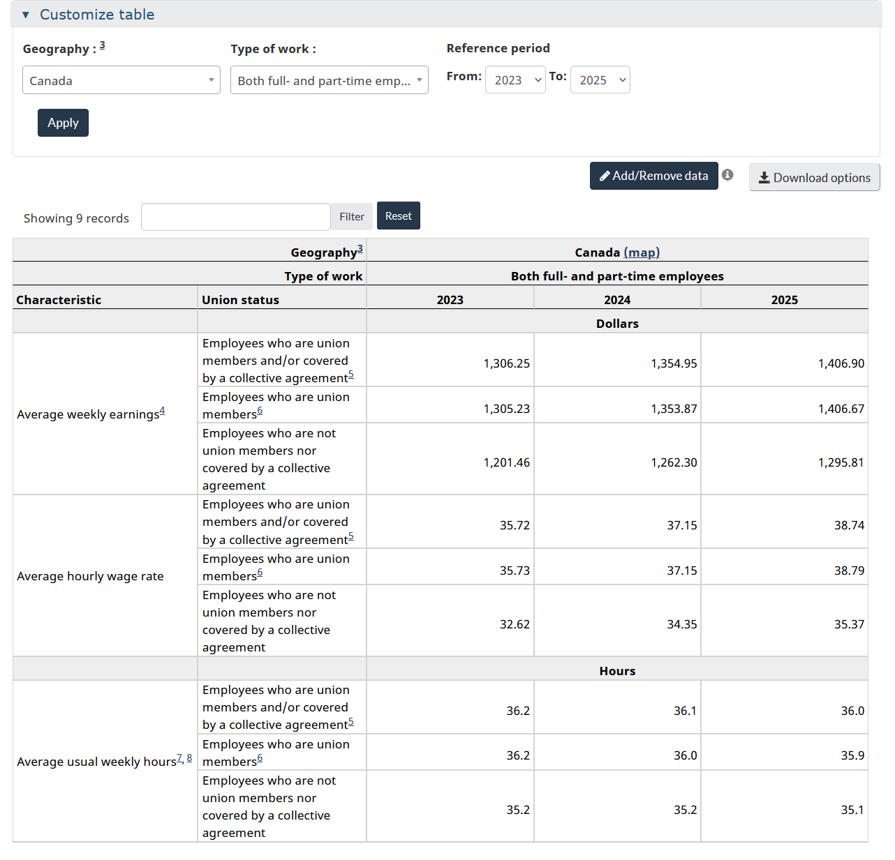
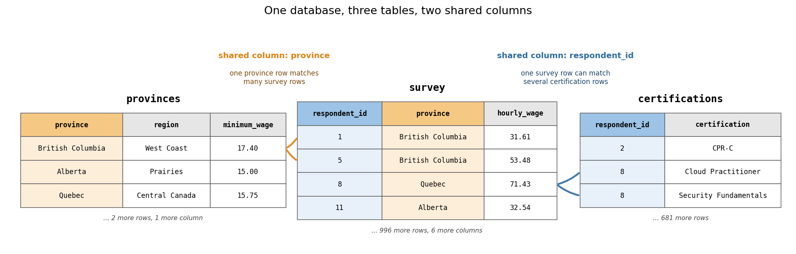
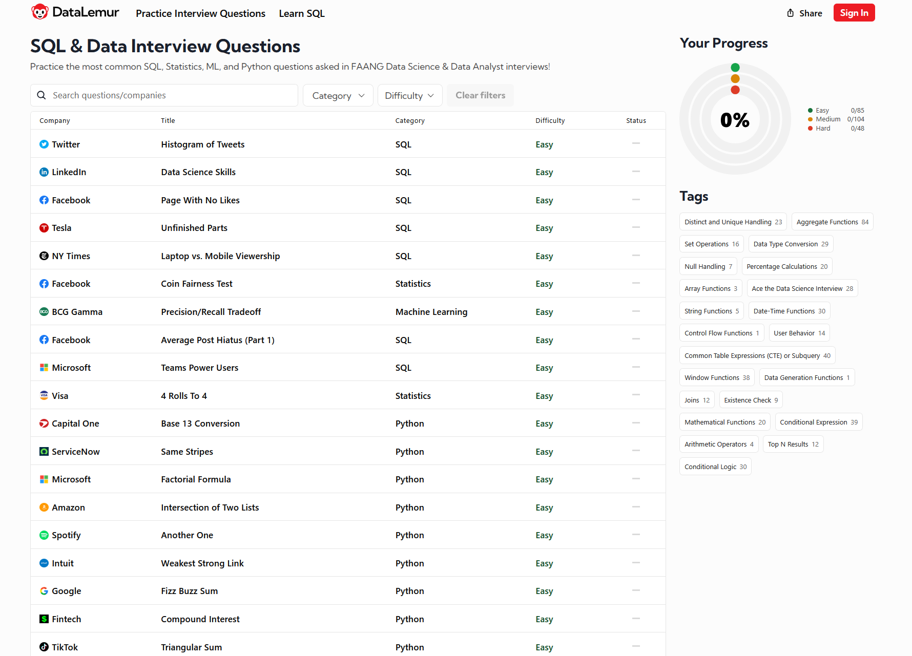

## Outline

### Prerequisites

- Notebook 1 of this stream: what a database and a DBMS are, `SELECT`, `WHERE`, `ORDER BY`, and running SQL through `%%sql` cells
- Comfort with `pandas` and basic Python at the COMET-intermediate level

### Learning Outcomes

By the end of this notebook you will be able to:

1. Sharpen single-table queries with `DISTINCT`, multi-column `ORDER BY`, and `IN`.
2. Combine tables with **inner** and **left joins**, and predict how a join changes the number of rows.
3. Summarize data with **aggregates** and `GROUP BY`, and filter groups with `HAVING`.
4. State the **logical order** in which SQL evaluates a query, and use it to explain `WHERE` versus `HAVING`.
5. Explain **NULL** and three-valued logic: why `= NULL` finds nothing, why `COUNT(column)` can be smaller than `COUNT(*)`, and how NULLs silently vanish from averages.
6. Build categories inside a query with `CASE`.
7. Spot and fix plausible-looking wrong queries, and translate between SQL and `pandas`.

## 1. Where we are in the stream

```{mermaid}
flowchart TB
    subgraph ARC1["Querying data"]
        direction LR
        NB1["1. Why databases<br/>exist"] --> NB2["2. Basic<br/>SQL"] --> NB3["3. Advanced<br/>SQL"] --> NB4["4. Cleaning<br/>real data"]
    end
    subgraph ARC2["Designing and storing data"]
        direction LR
        NB5["5. Modeling<br/>and schemas"] --> NB6["6. Storage, speed,<br/>transactions"] --> NB7["7. OLTP, OLAP,<br/>warehouses"]
    end
    subgraph ARC3["Keeping data flowing"]
        direction LR
        NB8["8. Pipelines I:<br/>scripts to graphs"] --> NB9["9. Pipelines II:<br/>quality, lineage, time"]
    end
    subgraph ARC4["Data for AI"]
        direction LR
        NB10["10. Embeddings and<br/>vector search"] --> NB11["11. Capstone: your<br/>own data product"]
    end
    ARC1 --> ARC2 --> ARC3 --> ARC4
    style NB2 fill:#c8e6c9,stroke:#2e7d32,stroke-width:3px
```

Notebook 1 ended with us looking at one table and one condition at a time. This notebook is the core of SQL: everything an analyst does most days, and everything a screening interview asks about, built from a single `SELECT`. SQL is the language the world of data speaks, and it is far easier to learn than Python, R, C++ or any other programming language. It is truly intuitive, and with a little effort you will understand all of it. But we can make this effort fun (hopefully at least a little).

So instead of learning it like a manual, we will learn it on the job. You have just joined the survey's research team as its data analyst (congratulations!!!), and the team is writing a short report on Canadian wages. One deliverable is yours: **a single table, wages by region, full-time workers only, with worker counts and union shares.**

This is not a made-up type of table. Here is Statistics Canada's version, wages and hours by union status, from the Labour Force Survey:



Along the way runs a **wrong-query gallery**: queries that look right, do not create an error, and return the wrong answer. Your colleagues will be submitting a few of these. Learning to catch them is a real skill.

## 2. One table becomes three

So far all of our data has lived in one table, and every question was answered by scanning that one table. This is the largest conceptual step from a standalone file (like a .csv) to a database.

A real database is almost never one big table. It is a collection of tables, where each table holds **one kind of thing**: one row per survey respondent, one row per province, one row per certification. The obvious question is why. Why not throw everything into a single wide table? Try it mentally with our data and it breaks in two different ways:

- **Facts about provinces would repeat once per respondent.** British Columbia's minimum wage would be stored 353 times, once in every BC row, and in the next few years when the rate changes, you would need to update all 353 copies perfectly or the data breaks. Notebook 1 named this disease: redundancy.
- **Certifications do not fit the survey's shape at all.** One respondent holds three certifications, another holds none. Do you add columns `certification_1`, `certification_2`, `certification_3`, and break on the first person with four? Or repeat the person's whole row once per certification, duplicating their wage and corrupting every average? Both options are bad, because "one row per person" is simply the wrong shape for facts that come in variable numbers per person.

The relational answer is to give each kind of thing its own table, store every fact only once, and connect the tables through **shared columns**. Here is what our database looks like from this notebook on, drawn with real rows from each table:



Read it row by row, following the arrows. Respondents 1 and 5 both live in British Columbia, so both of their rows match the same single `provinces` row: BC's minimum wage of 17.40 is stored exactly once aswell, whether 2 respondents point at it or all 353 who live there. On the other side, respondent 8 listed two certifications, so their one survey row matches two `certifications` rows. The shared columns doing the pointing, `province` on one side and `respondent_id` on the other, are called **join keys**, and section 4 is about the command that follows them.

First, the setup. We rebuild the database from the raw files so this notebook can be run alone without NB1:

```{python}
import sqlite3

import pandas as pd
import matplotlib.pyplot as plt
```

```{python}
provinces = pd.read_csv("datasets/provinces.csv")
certifications = pd.read_csv("datasets/certifications.csv")

conn = sqlite3.connect("datasets/wage_survey.db")
pd.read_csv("datasets/wage_survey.csv").to_sql("survey", conn, index=False, if_exists="replace")
provinces.to_sql("provinces", conn, index=False, if_exists="replace")
certifications.to_sql("certifications", conn, index=False, if_exists="replace")
```

The 684 the cell reports is the row count of the last table written, `certifications`.

```{python}
%load_ext sql
%config SqlMagic.autopandas = True
%config SqlMagic.displaycon = False
%config SqlMagic.feedback = 0
%sql sqlite:///datasets/wage_survey.db
```

Before querying anything, look at the two newcomers side by side:

```{python}
print(provinces.to_string(index=False))
print()
print(certifications.head(6).to_string(index=False))
```

The first table, `provinces`, is a **lookup table** (also called a reference table): one row per province, describing it. It has only five rows (provinces), and values associated with each province: nothing about any individual respondent. Unlike the survey from NB1, this data is real. The minimum wages are the true legal rates in April 2025, from the Government of Canada's minimum wage database, and the populations are Statistics Canada's estimates for April 1, 2025; the region grouping is ours. It fits our survey through the `province` column: every respondent's province should have a row here. It also matters for the job: the briefing wants **regions**, and the survey does not have a region column. This little table is where regions live.

The second table, `certifications`, is a new module of our simulated survey: respondents listed the job certifications they hold, one row per certification held. What one row stands for is different again, a person-certificate pair rather than a person, which is why respondents 8 and 10 each appear twice in the first six rows (respondent 8 with Cloud Practitioner and Security Fundamentals). It fits our survey through `respondent_id`, very important to note not all respondnts had certifications: 548 of our 1,000 respondents listed no certifications and so have no rows here at all, while others have two or three.

This three-table setup is a miniature of every production database you will ever work with: a big table of people or events, lookup tables describing the categories they belong to, and detail tables holding the facts that come in variable numbers. The rest of the notebook is about asking questions across all three.

## 3. Sizing up the data

Rule one of reporting on data: profile it before you summarize it. Nobody should publish numbers from a table they have never actually looked at, so before the briefing gets its first draft, we look into the survey. Notebook 1 gave us `SELECT`, `WHERE`, and `ORDER BY` in their simplest forms; profiling needs three upgrades, each small on its own and but used a lot.

### 3.1 DISTINCT

`DISTINCT` removes duplicates from the result: every unique entry, exactly once. Utilize it as your first move on any unfamiliar table, because it answers the question "what does this column actually contain?" Which provinces are in the data? Which industries? Which spellings?

```{python}
%%sql
SELECT DISTINCT province
FROM survey
```

Six provinces, each exactly once. Notebook 1's table of typical file failures had `BC`, `B.C.`, `bc`, and `Britsh Columbia` all meaning one province; in a database with enforced categories, the same question is one keyword. Note that if the survey held even a single row with a new spelling, `DISTINCT` would expose it immediately, which is exactly why it is the right first move. 

### 3.2 ORDER BY, on several columns

Notebook 1 sorted by one column. The full form of `ORDER BY` accepts a list: sort by the first column, break ties using the second, then the third, each with its own choice of ascending (the default) or descending with the `DESC` flag. Use it whenever a single sort leaves meaningful ties. A common case is ranking within groups: provinces in alphabetical order, and inside each province, the best-paid respondents first. 

```{python}
%%sql
SELECT respondent_id, province, hourly_wage
FROM survey
ORDER BY province, hourly_wage DESC
LIMIT 5
```

The five rows shown all come from Alberta, alphabetically first, with wages descending inside it; British Columbia would begin 125 rows further down, its own wages descending again. 

### 3.3 IN

`IN` asks whether a column's value matches any entry in a list, in one readable condition. It is exactly equivalent to chaining `OR` comparisons, just shorter and helps to avoid easy mistakes. Everyone in the two westernmost provinces of our survey:

```{python}
%%sql
SELECT respondent_id, province
FROM survey
WHERE province IN ('British Columbia', 'Alberta')
```

478 rows. `IN` gets more useful as the list grows: picture city-level data with no province column, where selecting all of Western Canada means typing dozens of cities. As a chain of `OR` comparisons that filter is an error waiting to happen; as an `IN` list it stays one legible condition. And speaking of `OR` chains going wrong, your first colleague submission has arrived.

Here please look for the issue in the SQL statement, you can also run it to see more clearly what goes wrong.

::: {.callout-caution}
## Wrong-query gallery #1

A colleague wants the same 478 respondents and writes the condition the way you would say it out loud. The query runs without throwing an error:

```{python}
%%sql
SELECT respondent_id, province
FROM survey
WHERE province = 'British Columbia' OR 'Alberta'
```

353 rows. Alberta's 125 respondents are gone. What happened?

<details><summary>Show / hide answer</summary>

SQL read this as two separate conditions: `province = 'British Columbia'`, and then the bare string `'Alberta'`. A condition must be true or false, so SQLite converts `'Alberta'` to a number, gets 0, and treats it as false. The `OR` therefore adds nothing, and the query quietly becomes "British Columbia only". Each side of an `OR` must be a complete comparison, or better, use `IN`. No error, no warning, 125 people missing: this is what most SQL mistakes look like. The corrected syntax:

```{python}
%%sql
SELECT respondent_id, province
FROM survey
WHERE province = 'British Columbia' OR province = 'Alberta'
```

478 rows, matching the `IN` version above.

</details>
:::

## 4. Crossing tables: JOIN

The briefing wants wages by region. Wages live in `survey`, regions live in `provinces`, and no single table can answer the question alone. Section 2 split our data apart and promised a command that connects it back together; this is `JOIN`, and it is the single most important idea in this notebook.

A **join** combines two tables by pairing up their rows wherever a matching rule holds. The rule almost always says that a shared column agrees on both sides, and that shared column is the **join key** from section 2's diagram: `province` links the survey to `provinces`, and `respondent_id` links it to `certifications`. Use a `JOIN` whenever a question needs columns from more than one table, which in real work is most questions.

The classic picture of the join family looks like this, where each circle is a table and the shading marks which rows survive:

{width=70%}

### 4.1 The inner join

The syntax has three new pieces:

1. `FROM survey AS s JOIN provinces AS p` names both tables and gives each a short **alias** (`s` and `p`), so the rest of the query can refer to them without spelling the full names out.
2. `ON s.province = p.province` is the matching rule: pair up rows where the provinces agree.
3. `s.province` and `p.province` are **qualified** column names. Both tables have a column called `province`, so every mention has to say whose it is, alias first, then a dot.

> **Predict first.** `survey` has 1,000 rows and `provinces` has 5. Before you run the next cell, commit to a number: how many rows will the join return?

```{python}
%%sql
SELECT s.respondent_id, s.province, p.region, p.minimum_wage
FROM survey AS s
JOIN provinces AS p ON s.province = p.province
```

Each result row is a survey row with its matching province facts glued on. But read the footer: **954 rows**. Neither 1,000 nor 5, and if you predicted either, you have just learned the most useful lesson in this section. A plain `JOIN` (an **inner join**) keeps only the rows that find a match, and Saskatchewan's 46 respondents found none, because the profile in section 3.1 counted six provinces and our lookup table holds five. They were dropped, and nothing warned us. If your next step were "average wage by region", those 46 people would not exist. This is a problem and your boss would not be happy.

### 4.2 The left join

A **left join** keeps every row of the left table (the one named in `FROM`), matched or not, and fills the right table's columns with NULL where no match exists. Use it in two situations: when losing unmatched rows is unacceptable, as in any report where every respondent must count, and when the unmatched rows are themselves the thing you are hunting for, because a left join is how you find out which of your rows have no partner.

```{python}
%%sql
SELECT s.respondent_id, s.province, p.region, p.minimum_wage
FROM survey AS s
LEFT JOIN provinces AS p ON s.province = p.province
ORDER BY p.region
```

1,000 rows, nobody dropped, and the Saskatchewan respondents sit at the top of the sort with `None` and `NaN` where a region and minimum wage should be. Those empty cells are **NULLs**, and in section 6 they will come very close to ruining our briefing.

### 4.3 Joins that multiply

So far joins have shrunk our table or preserved it. They can also make it grow.

> **Predict first.** Some respondents have no rows in `certifications`, some have two or three. Will joining the survey to it return more or fewer than 1,000 rows?

```{python}
%%sql
SELECT s.respondent_id, s.industry, s.hourly_wage, c.certification
FROM survey AS s
JOIN certifications AS c ON s.respondent_id = c.respondent_id
```

684 rows: the 548 respondents with no certifications vanished (inner join, no match), while respondent 8 now appears twice, once per certification, with their wage duplicated on both rows. Shrinking and multiplying at the same time. So a join can shrink a table, keep it, or grow it, and predicting which is a skill interviewers ask about.

::: {.callout-important}
## How a join changes row counts

One result row is produced for **every matching pair** of rows. From the survey's side: a respondent whose province is missing from `provinces` produces 0 rows in an inner join (Saskatchewan, dropped) and 1 row in a left join (kept, with NULLs). A respondent with three rows in `certifications` produces 3 rows (multiplied). Before trusting any joined result, ask: what happened to my row count, and why?
:::

::: {.callout-tip}
## Self-test

Suppose a duplicate British Columbia row slipped into `provinces` (six rows now, BC twice). How many rows would the inner join between `survey` and `provinces` return?

<details><summary>Show / hide answer</summary>
1,307. Every BC respondent matches both BC rows, so all 353 of them appear twice (706 rows), while the other matched provinces contribute 601 rows as before, and Saskatchewan still contributes none. Every BC wage is now double-counted in any average downstream. Real databases prevent this by declaring `province` a key that must be unique, which is exactly the kind of rule we will build in Notebook 5.
</details>
:::

## 5. The first draft

Time to draft the briefing. Its columns are summaries, worker counts, average wages, union shares, and summaries are what **aggregates** compute.

### 5.1 Aggregates

An **aggregate function** collapses many rows into one number, and it is the moment SQL stops returning dataframes (lists of rows) and starts returning answers. Five aggregates cover most daily work: `COUNT` (how many), `SUM` (the total), `AVG` (the mean), and `MIN` and `MAX` (the extremes, which double as a quick sanity check on any numeric column). The simplest counts rows:

```{python}
%%sql
SELECT COUNT(*) FROM survey
```

The others follow the same shape. One more keyword joins them: `AS` renames an output column, and from here on nearly every query uses it, because aggregate columns otherwise come back with awkward machine-made names like `COUNT(*)`, and readable output is very valuable:

```{python}
%%sql
SELECT COUNT(*) AS respondents,
       AVG(hourly_wage) AS avg_wage,
       MIN(hourly_wage) AS lowest,
       MAX(hourly_wage) AS highest
FROM survey
```

One row summarizing a thousand: the survey's average wage is 38.59 dollars, and wages run from 17.40 (British Columbia's minimum wage) up to 113.04.

### 5.2 GROUP BY

Whole-table summaries are not what the briefing wants; it compares groups. The tell is the word *by* or *per* in a question: average wage **by** province, respondents **per** industry. The moment you hear it, you are writing a `GROUP BY`. It splits the rows into groups, computes the aggregates once per group, and returns one row per group. Before regions, a practice draft at the province level, since it needs no join:

```{python}
%%sql
SELECT province, COUNT(*) AS respondents, AVG(hourly_wage) AS avg_wage
FROM survey
GROUP BY province
ORDER BY avg_wage DESC
```

This is a question Notebook 1 could not yet ask: average wage, by province. Before quoting the table, look at the respondent counts sitting next to the averages: Saskatchewan "leads the country" on a sample of 46 people. Printing the count beside the mean is the habit that keeps grouped averages trustworthy.

The result is a dataframe like any other, so it can be plotted.

```{python}
%%sql prov_wages <<
SELECT province, AVG(hourly_wage) AS avg_wage
FROM survey
GROUP BY province
ORDER BY avg_wage DESC
```

```{python}
plt.figure(figsize=(9, 5))
plt.bar(prov_wages["province"], prov_wages["avg_wage"], color="tab:green", alpha=0.85)
plt.ylabel("average hourly wage (dollars)")
plt.title("Average hourly wage by province, 1,000 survey respondents")
plt.xticks(rotation=15)
plt.show()
```

The briefing also wants a union share, and here aggregates have a trick for us. `union_member` holds 0 or 1, and the average of a 0/1 column is a percent share:

```{python}
%%sql
SELECT industry, COUNT(*) AS respondents, AVG(union_member) AS union_share
FROM survey
GROUP BY industry
ORDER BY union_share DESC
```

Two thirds of public administration is unionized against 3% of technology, which matches the Canadian labour market's broad shape.

> **Think Deeper.** `AVG(union_member)` works because the mean of a dummy variable is a proportion. You have used this fact all through your econometrics education: it is why a regression of a 0/1 outcome on a constant returns the sample share. The trick carries over to any yes/no column you meet.

### 5.3 HAVING, and the order SQL runs in

`WHERE` filters rows before they are grouped. To filter the **groups themselves**, by their counts or their averages, SQL has a separate keyword, `HAVING`. Industries that pay 40 dollars an hour or more on average:

```{python}
%%sql
SELECT industry, COUNT(*) AS respondents, AVG(hourly_wage) AS avg_wage
FROM survey
GROUP BY industry
HAVING AVG(hourly_wage) >= 40
ORDER BY avg_wage DESC
```

Four industries clear our bar of 40 dollars an hour. Why the separate keyword? Because of the order SQL evaluates in, which is worth memorizing outright:

::: {.callout-important}
## The order a query actually runs in

You write `SELECT` first, but the engine evaluates in this order:

`FROM` (and joins) → `WHERE` → `GROUP BY` → `HAVING` → `SELECT` → `ORDER BY` → `LIMIT`

`WHERE` runs before groups exist, so it cannot see aggregates. `HAVING` runs after, so it can. This one list resolves most beginner confusion about SQL, and asking about it is a screening-interview classic.
:::

The same idea drawn out, with the order you type on the left and the order the engine runs on the right. Follow the crossing lines: `SELECT` is written first and evaluated almost last.


::: {.callout-caution}
## Wrong-query gallery #2

A colleague wants the same four industries and writes:

```{python}
#| error: true
%%sql
SELECT industry, AVG(hourly_wage) AS avg_wage
FROM survey
WHERE AVG(hourly_wage) >= 40
GROUP BY industry
```

This one does not fail silently: SQLite refuses to run it. Read the error message: `misuse of aggregate`. Why is an aggregate misused here?

<details><summary>Show / hide answer</summary>

Follow the evaluation order: `WHERE` runs before `GROUP BY`, at a point where the engine is looking at individual rows and no groups or averages exist yet, so an aggregate inside `WHERE` is meaningless and SQL rejects it. Filtering on an aggregate is exactly what `HAVING` is for. Enjoy this error, it is one of the few times SQL stops you instead of handing back a wrong number. The corrected syntax:

```{python}
%%sql
SELECT industry, AVG(hourly_wage) AS avg_wage
FROM survey
GROUP BY industry
HAVING AVG(hourly_wage) >= 40
```

</details>
:::

> **Your turn.** The team also wants education numbers. Using only the `survey` table: for each education level, return the number of respondents and their average hourly wage, best paid group first. Start the cell with `%%sql`. If it is right, it returns 4 rows, with graduate degrees on top at just over 50 dollars an hour.

```{python}
# your query here
```

<details><summary>Show / hide answer</summary>

```{python}
%%sql
SELECT education, COUNT(*) AS respondents, AVG(hourly_wage) AS avg_wage
FROM survey
GROUP BY education
ORDER BY avg_wage DESC
```

</details>

## 6. The number we almost published

The briefing asks for regions, not provinces, so the real draft needs section 4's join and section 5's grouping working together.

> **Predict first.** The lookup table maps five provinces into three regions. How many rows will the regional table have?

```{python}
%%sql
SELECT p.region, COUNT(*) AS workers, AVG(s.hourly_wage) AS avg_wage
FROM survey AS s
JOIN provinces AS p ON s.province = p.province
GROUP BY p.region
```

Three regions, with sensible looking averages, a table you could paste straight into the report. Before we do, apply section 5's habit and read the counts: 414 + 187 + 353 = 954. We surveyed 1,000 people. Where are the other 46?

Inner join dropped every respondent whose province has no row in `provinces`, and Saskatchewan has no row. Those people are findable, since the left join keeps them with NULL where a region should be. NULL is SQL's marker for "no value here", and it does not behave like a value. Watch what happens when we hunt for the missing rows with `WHERE`:

```{python}
%%sql
SELECT s.respondent_id, s.province, p.region
FROM survey AS s
LEFT JOIN provinces AS p ON s.province = p.province
WHERE p.region = NULL
```

Zero rows, even though we watched 46 of them appear in section 4. The query looks correct, SQL raised no error, and the rows just aren't there. The reason for this is that: **`= NULL` is never true, for anything, including NULL itself.** NULL means "unknown", and SQL's logic is **three-valued**: a comparison can be true, false, or unknown, and any comparison against an unknown is itself unknown (think of this like undefined in math). `WHERE` keeps only the rows whose condition is true, so unknown is discarded just like false. Finding NULLs therefore has its own dedicated command, `IS NULL` (and its opposite, `IS NOT NULL`):

```{python}
%%sql
SELECT s.respondent_id, s.province, p.region
FROM survey AS s
LEFT JOIN provinces AS p ON s.province = p.province
WHERE p.region IS NULL
LIMIT 5
```

There they are. Counting all of them:

```{python}
%%sql
SELECT COUNT(*) AS unmatched
FROM survey AS s
LEFT JOIN provinces AS p ON s.province = p.province
WHERE p.region IS NULL
```

All 46, accounted for. Now the correct version of the regional draft. Rerun it with a left join, and `GROUP BY` does something helpful on it's own: it collects all the NULLs into a group of their own:

```{python}
%%sql
SELECT p.region, COUNT(*) AS workers, AVG(s.hourly_wage) AS avg_wage
FROM survey AS s
LEFT JOIN provinces AS p ON s.province = p.province
GROUP BY p.region
```

The `None` row is Saskatchewan, and it has the **highest** average wage in the table. Our three-region draft did not just miss 46 people, it dropped the best-paid group in the data and skewed every comparison in the process, and it would have gone into the report! Nothing crashed, no error warned us, and the wrong table even looked cleaner than the right one. 

Before we move on, two more NULL traps belong in your head. First, counting. `COUNT(*)` counts rows, but `COUNT(column)` counts only the **non-NULL** values in that column:

```{python}
%%sql
SELECT COUNT(*) AS all_rows,
       COUNT(p.region) AS non_null_regions,
       COUNT(DISTINCT p.region) AS distinct_regions
FROM survey AS s
LEFT JOIN provinces AS p ON s.province = p.province
```

Three different counts from the same table, and all of them are correct for different questions: 1,000 rows, 954 with a region, 3 distinct regions. Second, averages, which average only what is there:

```{python}
%%sql
SELECT AVG(p.minimum_wage) AS avg_min_wage,
       SUM(p.minimum_wage) / COUNT(*) AS if_null_were_zero
FROM survey AS s
LEFT JOIN provinces AS p ON s.province = p.province
```

`AVG` is `SUM` divided by `COUNT(column)`, so the 46 NULL rows contribute nothing at all, giving 16.67. Dividing by `COUNT(*)` instead would treat them as zeros and give 15.90. Neither number is "the" answer; the point is that NULL handling is a decision you have to consciously make.

NULL causes chaos outside databases too. In 2016 a security researcher registered the vanity plate `NULL`, and whenever officers left the plate field blank on a citation, the system matched it to him:

{width=55%}

## 7. Comparing fairly: CASE

The briefing spec says full-time workers only, and the survey has hours, not a full-time column. `CASE` is SQL's if-else, and it builds new columns out of conditions. Use it whenever the category you want to analyze does not exist as a column yet: banding a continuous variable, collapsing detailed codes into coarse groups, or building a dummy variable. Statistics Canada draws the full-time line at 30 hours a week, and our survey has hours but no full-time column, so let us build it (we will call it work_status) and summarize both groups:

```{python}
%%sql
SELECT CASE WHEN weekly_hours >= 30 THEN 'Full-time' ELSE 'Part-time' END AS work_status,
       COUNT(*) AS respondents,
       AVG(hourly_wage) AS avg_wage
FROM survey
GROUP BY work_status
```

819 full-timers, 181 part-timers, similar hourly wages. Notice the composition: `CASE` invents a column that exists nowhere in the table, and `GROUP BY` groups on it as though it had always been there.

A `CASE` can hold many `WHEN` branches, checked top to bottom. In the example  query below, a respondent earning 20 dollars matches `< 25` and stops, never reaching `< 45`, which is what makes the bands exclusive.

> **Your turn.** Build wage bands with `CASE`: under 25 dollars, 25 to 45, and 45 and up, and count the respondents in each. If it is right, the 25-45 section holds 592 of the 1,000 respondents.

```{python}
# your query here
```

<details><summary>Show / hide answer</summary>

```{python}
%%sql
SELECT CASE
           WHEN hourly_wage < 25 THEN 'under 25'
           WHEN hourly_wage < 45 THEN '25 to 45'
           ELSE '45 and up'
       END AS wage_band,
       COUNT(*) AS respondents
FROM survey
GROUP BY wage_band
ORDER BY respondents DESC
```

</details>

## 8. The final deliverable

Every piece is now on the table. The spec, one more time: wages by region, full-time workers only, with worker counts and union shares, and we will report only regions with at least 50 such workers. One new function appears inside it: `ROUND(value, 2)` rounds a number to the given count of decimal places, two here, so the summary columns come back readable instead of trailing twelve decimals.

```{python}
%%sql
SELECT p.region,
       COUNT(*) AS workers,
       ROUND(AVG(s.hourly_wage), 2) AS avg_wage,
       ROUND(AVG(s.union_member), 2) AS union_share
FROM survey AS s
LEFT JOIN provinces AS p ON s.province = p.province
WHERE s.weekly_hours >= 30
GROUP BY p.region
HAVING COUNT(*) >= 50
ORDER BY avg_wage DESC
```

Read it in evaluation order, the same list from section 5: the join builds person-region rows, `WHERE` keeps the 819 full-timers, `GROUP BY` folds them into regions, `HAVING` keeps regions with 50 or more, `SELECT` computes and rounds the summaries, and `ORDER BY` sorts the surviving entries.

One thing to consider: Saskatchewan's full-timers, 36 of them, formed a NULL-region group, and the 50-worker floor in `HAVING` dropped it. That is the same group that we lost in section 6, but with one difference: this time we know, we chose the threshold, and the briefing ships with a footnote saying so. Dropping data can be ok (or is something the correct choice outright). Dropping data without knowing is how wrong numbers get published.

## 9. The question we cannot answer yet

The report is out, and a teammate immediately asks the natural follow-up: **do certified workers earn more?** We have a certifications table; it feels like one join away. This is where the notebook springs its final trap.

It depends on a definition. The **grain** of a table is what one row stands for. In `survey`, a row is a person; in the certification join from section 4.3, a row is a person-certification pair. Aggregates count rows, so they answer questions at the grain of the table they are given, whether or not that is the question you asked.

::: {.callout-caution}
## Wrong-query gallery #3

How many respondents hold at least one certification? A colleague joins and counts:

```{python}
%%sql
SELECT COUNT(*) AS certified_respondents
FROM survey AS s
JOIN certifications AS c ON s.respondent_id = c.respondent_id
```

684 certified respondents. What is wrong, and what is the real number?

<details><summary>Show / hide answer</summary>

684 is the number of **certifications**, because the join has one row per person-certification pair and respondent 8 is being counted once per certificate. The question asks about people, and `COUNT(DISTINCT s.respondent_id)` counts each person once. Whenever a query involves a join, decide what one row means before you aggregate. The corrected syntax:

```{python}
%%sql
SELECT COUNT(DISTINCT s.respondent_id) AS certified_respondents
FROM survey AS s
JOIN certifications AS c ON s.respondent_id = c.respondent_id
```

The real number is 452.

</details>
:::

Counting people was rescued by `COUNT(DISTINCT ...)`. The average wage is where the ground actually gives way:

```{python}
%%sql
SELECT AVG(s.hourly_wage) AS avg_wage_certified
FROM survey AS s
JOIN certifications AS c ON s.respondent_id = c.respondent_id
```

39.89 dollars an hour, and we know before publication that it is computed at the wrong grain: every multi-certificate respondent's wage is counted once per certificate, so the heavily certified pull the average toward themselves. What we want is the average over **one row per certified person**. With this notebook's tools, a single `SELECT`, we are stuck. You would need to first collapse the join down to one row per person, and then average the result, which means running a query on the output of another query. A query inside a query.

That is exactly where Notebook 3 begins.

## 10. SQL and pandas, side by side

Everything in this notebook has a `pandas` counterpart you already know, here is a comparison table:

| SQL | pandas |
|---|---|
| `SELECT col1, col2 FROM survey` | `survey[["col1", "col2"]]` |
| `WHERE hourly_wage >= 40` | `survey[survey["hourly_wage"] >= 40]` |
| `WHERE province IN (...)` | `survey[survey["province"].isin([...])]` |
| `SELECT DISTINCT province` | `survey["province"].drop_duplicates()` |
| `ORDER BY hourly_wage DESC` | `survey.sort_values("hourly_wage", ascending=False)` |
| `LIMIT 5` | `survey.head(5)` |
| `JOIN ... ON` | `survey.merge(other, on="key", how="inner")` |
| `LEFT JOIN ... ON` | `survey.merge(other, on="key", how="left")` |
| `COUNT(*)`, `AVG(x)` | `len(survey)`, `survey["x"].mean()` |
| `COUNT(DISTINCT x)` | `survey["x"].nunique()` |
| `GROUP BY g` with aggregates | `survey.groupby("g")["x"].mean()` |
| `HAVING COUNT(*) >= 50` | `survey.groupby("g").filter(lambda d: len(d) >= 50)` |
| `IS NULL` | `survey["x"].isna()` |
| `CASE WHEN ... END` | `np.where(condition, a, b)` or `pd.cut` |

Notebook 3 adds part two of this table (window functions, CTEs) and bundles both into one downloadable cheatsheet.

## 11. Conclusion

The briefing shipped, and it was correct! Getting one table right took joins, aggregates, group filters, a manufactured column, and three near-misses: an `OR` that quietly ignored a province, an inner join that deleted the best-paid group in the data, and a count taken at the wrong grain. None of them produced an error. The issue is that they were queries that ran without throwing an error.

Thanks for sticking with me, SQL is the language of modern data and databases. It is a useful skill and the language itself is very human readable with limited obfuscations and weird issues (most of which we discussed above). The coming notebooks will be more fun with more interesting real life examples. This notebook was much more computer science and code syntax, but it is worth it! With a little more practice you can write SQL as a skill on your resume and a whole bunch of jobs after graduation open up for you.

::: {.callout-note}
## You can now answer these interview questions

- What is the difference between an inner join and a left join, and how can a join change the number of rows?
- Why can `COUNT(column)` be smaller than `COUNT(*)`?
- When do you filter with `WHERE` and when with `HAVING`?
- Why does `WHERE x = NULL` return nothing, and what do you write instead?

<details><summary>Show / hide model answers</summary>

- An inner join keeps only rows that find a match; a left join keeps every left-table row and fills unmatched columns with NULL. Row counts shrink when rows fail to match, and grow when a row matches several partners, one output row per matching pair.
- `COUNT(*)` counts rows; `COUNT(column)` counts only non-NULL values in that column, so every NULL widens the gap.
- `WHERE` filters individual rows before grouping and cannot see aggregates; `HAVING` filters whole groups after `GROUP BY` and can.
- Comparisons with NULL evaluate to unknown rather than true, so the filter keeps nothing; write `x IS NULL` (or `x IS NOT NULL`).

</details>
:::

## Appendix: where to practice

Everything in this notebook is interview material, and the way to make it permanent is repetitions on someone else's tables. Three free sites are the standard tools:

- [DataLemur](https://datalemur.com): SQL questions taken from real company interviews, with a generous free tier.
- [StrataScratch](https://www.stratascratch.com): interview questions you can solve in SQL or Python `pandas`, a natural fit for section 10's table.
- [LeetCode SQL 50](https://leetcode.com/studyplan/top-sql-50/): the classic curated list; its easy tier maps almost exactly onto this notebook.

You are ready for the easy tier of all three right now: it is `SELECT`, `WHERE`, joins, and `GROUP BY`, which is what we just learned.



## Connections

- **Back to Notebook 1:** there we built the database and asked one-table questions; here the database grew to three tables.
- **Forward to Notebook 3:** the certified-wage question needs a query that runs on the output of another query. Subqueries, CTEs, and views, window functions, changing data with INSERT and UPDATE, and how to run SQL from Python safely, including what a SQL injection is.

### References

- Government of Canada. *Current and forthcoming general minimum wage rates in Canada.* https://minwage-salairemin.service.canada.ca/en/general.html The source of the minimum wages in `provinces.csv` (rates in force April 2025).
- Malan, D. (2024). *CS50's Introduction to Databases with SQL.* Harvard University. https://cs50.harvard.edu/sql/ (Lecture 1, Relating, covers joins.)
- Mode. *SQL tutorial.* https://mode.com/sql-tutorial/ A free reference that extends everything here.
- SQLite. *The SELECT statement.* https://www.sqlite.org/lang_select.html
- SQLite. *NULL handling in SQLite.* https://www.sqlite.org/nulls.html Three-valued logic, from the engine's own documentation.
- Statistics Canada. *Average weekly earnings, average hourly wage rate and average usual weekly hours by union status, annual.* Table 14-10-0134-01. https://www150.statcan.gc.ca/t1/tbl1/en/tv.action?pid=1410013401 The real-world version of this notebook's deliverable, shown in section 1.
- Statistics Canada. (2025). *Canada's population estimates, first quarter 2025.* The Daily, June 18, 2025. https://www150.statcan.gc.ca/n1/daily-quotidien/250618/dq250618a-eng.htm The source of the populations in `provinces.csv`.

---
