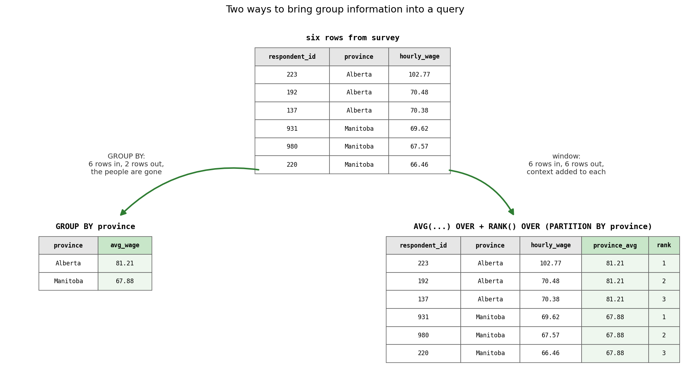

## Outline

### Prerequisites

- Notebook 2 of this stream: joins, `GROUP BY`, `HAVING`, NULL, `CASE`, and the wrong-query habit of reading row counts
- Comfort with `pandas` and basic Python at the COMET-intermediate level

### Learning Outcomes

By the end of this notebook you will be able to:

1. Nest a query inside another query, as a **derived table**, a **scalar subquery**, or an **IN-subquery**.
2. Name query steps with **CTEs** (`WITH`) and save whole queries as **views**, and choose between subquery, CTE, and view by how long the query needs to live.
3. Use **window functions** (`RANK`, aggregates with `OVER`, `LAG`) to rank within groups, compare rows to their group, and compute changes over time.
4. Modify data with **INSERT**, **UPDATE**, and **DELETE**, and protect yourself from the update that forgets its `WHERE`.
5. Run SQL from Python with **parameterized queries**, and explain what a SQL injection is.
6. Translate all of it to `pandas`, with the stream's complete cheatsheet.

## 1. Where we are in the stream

```{mermaid}
flowchart TB
    subgraph ARC1["Querying data"]
        direction LR
        NB1["1. Why databases<br/>exist"] --> NB2["2. Basic<br/>SQL"] --> NB3["3. Advanced<br/>SQL"] --> NB4["4. Cleaning<br/>real data"]
    end
    subgraph ARC2["Designing and storing data"]
        direction LR
        NB5["5. Modeling<br/>and schemas"] --> NB6["6. Storage, speed,<br/>transactions"] --> NB7["7. OLTP, OLAP,<br/>warehouses"]
    end
    subgraph ARC3["Keeping data flowing"]
        direction LR
        NB8["8. Pipelines I:<br/>scripts to graphs"] --> NB9["9. Pipelines II:<br/>quality, lineage, time"]
    end
    subgraph ARC4["Data for AI"]
        direction LR
        NB10["10. Embeddings and<br/>vector search"] --> NB11["11. Capstone: your<br/>own data product"]
    end
    ARC1 --> ARC2 --> ARC3 --> ARC4
    style NB3 fill:#c8e6c9,stroke:#2e7d32,stroke-width:3px
```

The briefing shipped, it was correct, and word got around. You are now the research team's SQL person, which means two things landed on your desk this morning. The first is a debt: Notebook 2 ended with a question we could not answer, the true average wage of certified workers, because it needs a query that runs on the output of another query. The second is a stack of new requests: top earners by province, everyone compared to their local average, an inequality figure, wage trends over time, a correction, a late survey response, and one respondent asking to be removed from the study entirely.

Every one of those needs a tool from this notebook. This is the second half of SQL, the half that separates "knows some SQL" from "writes it at work", and it is the half that medium-tier interview questions live in. Same rules as before: every command earns its place by doing a real job.

## 2. Setup, and one new table

We rebuild the database from the raw files so this notebook can be run alone, and this time a fourth table joins it:

```{python}
import sqlite3

import pandas as pd
import matplotlib.pyplot as plt
```

```{python}
provinces = pd.read_csv("datasets/provinces.csv")
certifications = pd.read_csv("datasets/certifications.csv")
wage_history = pd.read_csv("datasets/wage_history.csv")

conn = sqlite3.connect("datasets/wage_survey.db")
pd.read_csv("datasets/wage_survey.csv").to_sql("survey", conn, index=False, if_exists="replace")
provinces.to_sql("provinces", conn, index=False, if_exists="replace")
certifications.to_sql("certifications", conn, index=False, if_exists="replace")
wage_history.to_sql("wage_history", conn, index=False, if_exists="replace")
```

```{python}
%load_ext sql
%config SqlMagic.autopandas = True
%config SqlMagic.displaycon = False
%config SqlMagic.feedback = 0
%sql sqlite:///datasets/wage_survey.db
```

The new table, `wage_history`, is real data, like `provinces`: Statistics Canada's average hourly wage by province, monthly, from the Labour Force Survey (table 14-10-0063-01, all employees, all industries), pulled from StatCan's public data service. One row per province per month, 36 months from July 2023 to June 2026, six provinces, 216 rows. It joins to our other tables on `province`, and the `month` column is text in `YYYY-MM` form, which is a deliberate choice: written that way, sorting text alphabetically sorts it chronologically.

```{python}
%%sql
SELECT * FROM wage_history
WHERE province = 'British Columbia'
ORDER BY month DESC
LIMIT 4
```

Real BC wages, most recent month first. Time is a new dimension for us, and one tool in this notebook exists precisely for it. (It is also a preview of this stream's later life: in Notebook 9, new months of data will arrive on their own, and keeping tables like this one fresh becomes the whole job.)

## 3. The debt: a query inside a query

Notebook 2 left us staring at a number we knew was wrong: 39.89 dollars an hour for certified workers, computed on the join where every multi-certificate person is counted once per certificate. The fix we described but could not write: first collapse the join to one row per person, then average the result. In SQL you do exactly that by putting one query inside another. A query wrapped in parentheses inside the `FROM` clause is called a **derived table**: its output rows become the input table for the outer query, exactly as if they had been sitting in the database all along.

```{python}
%%sql
SELECT COUNT(*) AS certified_people, AVG(hourly_wage) AS avg_wage_certified
FROM (
    SELECT DISTINCT s.respondent_id, s.hourly_wage
    FROM survey AS s
    JOIN certifications AS c ON s.respondent_id = c.respondent_id
)
```

Debt paid. The inner query is Notebook 2's join with `DISTINCT` collapsing it to one row per certified person; the outer query counts and averages those rows. 452 people, and the true average is **39.44**, not 39.89. The wrong grain was inflating the answer by 45 cents, and now we can also say what the certified premium actually is: against the survey-wide 38.59, about 85 cents an hour.

Subqueries fit in more places than `FROM`. A subquery that returns a single value, called a **scalar subquery**, can sit anywhere a number can, which makes questions like "who earns more than average?" one query instead of two:

```{python}
%%sql
SELECT COUNT(*) AS above_average
FROM survey
WHERE hourly_wage > (SELECT AVG(hourly_wage) FROM survey)
```

429 of 1,000. Fewer than half, which you could have predicted from Notebook 1's histogram: wages are right-skewed, so the handful of very high earners pull the mean above the middle of the pack.

The third placement you already half-know. Notebook 2's `IN` checked membership in a list you typed; the list can instead be produced by a subquery:

```{python}
%%sql
SELECT COUNT(*) AS certified, AVG(hourly_wage) AS avg_wage
FROM survey
WHERE respondent_id IN (SELECT respondent_id FROM certifications)
```

Same 452 people, same 39.44, and notice what never happened: no join, so no duplicated rows, so no grain hazard at all. `IN` with a subquery asks "is this respondent anywhere in the certifications table?", once per respondent. Its negation `NOT IN` keeps the rows that are **not** in the list, which gives us the other side of the comparison:

```{python}
%%sql
SELECT COUNT(*) AS not_certified, AVG(hourly_wage) AS avg_wage
FROM survey
WHERE respondent_id NOT IN (SELECT respondent_id FROM certifications)
```

548 uncertified respondents at 37.89, so certified workers out-earn them by about 1.55 dollars an hour. Whether the certificates *cause* any of that gap is a question this stream deliberately leaves to the Causal ML stream; we are describing, not identifying.

::: {.callout-tip}
## Self-test

A colleague runs the `NOT IN` query above every month. One day it suddenly returns zero rows, even though most respondents still have no certification. What single value, sneaking into `certifications.respondent_id`, would explain it?

<details><summary>Show / hide answer</summary>
A NULL. `NOT IN` compares against every value in the list, and Notebook 2 taught you that any comparison with NULL is unknown, never true. One NULL in the subquery's output makes `NOT IN` unable to say a definite yes for any row, so every row is discarded. It is the `= NULL` trap wearing a new coat, and it is why careful analysts write `NOT IN (SELECT respondent_id FROM certifications WHERE respondent_id IS NOT NULL)` on columns that might contain NULLs.
</details>
:::

> **Predict first.** A colleague wants the national average wage and reasons: "take each province's average, then average those six numbers." Will their answer land above, below, or exactly on the true 38.59?

::: {.callout-caution}
## Wrong-query gallery #4

The colleague's query, a perfectly legal derived table:

```{python}
%%sql
SELECT AVG(avg_wage) AS average_of_averages
FROM (
    SELECT province, AVG(hourly_wage) AS avg_wage
    FROM survey
    GROUP BY province
)
```

39.22, not 38.59. No error, 63 cents too high. What went wrong?

<details><summary>Show / hide answer</summary>

The average of averages weights every province equally: Saskatchewan's 46 respondents count exactly as much as Ontario's 265. Since small Saskatchewan happens to be the best-paid province in our survey, it drags the unweighted mean upward. An average of group averages only equals the overall average when every group is the same size, which is roughly never. The corrected syntax is the ordinary average, no nesting required:

```{python}
%%sql
SELECT AVG(hourly_wage) AS avg_wage
FROM survey
```

This bug has a distinguished career in real reporting, because the two numbers are usually close enough to look interchangeable and far enough apart to matter.

</details>
:::

> **Your turn.** The team wants the count of respondents earning strictly more than the survey-wide average, in one query. Start the cell with `%%sql` and use a scalar subquery. If it is right, it returns 429.

```{python}
# your query here
```

<details><summary>Show / hide answer</summary>

```{python}
%%sql
SELECT COUNT(*) AS above_average
FROM survey
WHERE hourly_wage > (SELECT AVG(hourly_wage) FROM survey)
```

</details>

## 4. Naming queries: WITH

Derived tables work, but read one back after a month and you will find yourself deciphering from the inside out. SQL's fix is the **CTE** (common table expression), written with `WITH`: it gives a subquery a name at the **top** of the query, and the rest of the query uses that name like a table. Same engine, same result, radically better reading order. Here is the certified average again:

```{python}
%%sql
WITH per_person AS (
    SELECT DISTINCT s.respondent_id, s.hourly_wage
    FROM survey AS s
    JOIN certifications AS c ON s.respondent_id = c.respondent_id
)
SELECT COUNT(*) AS certified_people, AVG(hourly_wage) AS avg_wage_certified
FROM per_person
```

Read it top to bottom: first build `per_person`, then summarize it. That is the order you think in, and the order a colleague reviews in.

CTEs earn their keep when they stack, because `WITH` takes several, separated by commas, each allowed to use the ones before it. The team's follow-up request: does the certified premium hold within education levels, or are certified workers simply more educated? Two named steps answer it:

```{python}
%%sql
WITH certified_ids AS (
    SELECT DISTINCT respondent_id
    FROM certifications
),
labelled AS (
    SELECT s.education,
           CASE WHEN c.respondent_id IS NULL THEN 'Not certified' ELSE 'Certified' END AS cert_status,
           s.hourly_wage
    FROM survey AS s
    LEFT JOIN certified_ids AS c ON s.respondent_id = c.respondent_id
)
SELECT education, cert_status, COUNT(*) AS respondents, ROUND(AVG(hourly_wage), 2) AS avg_wage
FROM labelled
GROUP BY education, cert_status
ORDER BY education, cert_status
```

Every tool in this query is one you already own: a `LEFT JOIN` whose NULLs mark the uncertified, a `CASE` to label them, a two-column `GROUP BY`. The CTEs just organize the assembly into readable stages: collect the certified ids, label everyone, summarize. And the result complicates this morning's tidy 1.55-dollar premium in a useful way: the gap survives **within** every education level, but it is not one number, running from about 2.15 dollars for bachelor's holders down to 41 cents for graduate degrees. Description keeps getting sharper; causation stays a different job.

## 5. Queries that persist: views

A CTE's name lives for one query and vanishes. But some queries deserve to live longer: the team has asked you to re-run the regional briefing four times this week. SQL's answer is a **view**: `CREATE VIEW name AS` followed by any `SELECT` stores the query itself, permanently, inside the database file, and from then on the name can be queried like a table. Two commands do the honors, and pairing them is the standard move: `DROP VIEW IF EXISTS` deletes the view if there is one (and does nothing, rather than erroring, if there is not), which makes the pair safe to re-run any number of times.

```{python}
%%sql
DROP VIEW IF EXISTS regional_briefing
```

```{python}
%%sql
CREATE VIEW regional_briefing AS
SELECT p.region,
       COUNT(*) AS workers,
       ROUND(AVG(s.hourly_wage), 2) AS avg_wage,
       ROUND(AVG(s.union_member), 2) AS union_share
FROM survey AS s
LEFT JOIN provinces AS p ON s.province = p.province
WHERE s.weekly_hours >= 30
GROUP BY p.region
HAVING COUNT(*) >= 50
ORDER BY avg_wage DESC
```

That is Notebook 2's entire deliverable, saved under a name. Re-running the briefing is now a one-liner, for you and for every teammate who opens this database:

```{python}
%%sql
SELECT * FROM regional_briefing
```

Two things are worth knowing about what just happened. First, a view stores the **query**, not the results: every `SELECT` against it re-runs the briefing on whatever the data looks like at that moment, which is exactly what you want when the data changes (and section 7 is about to change it). Second, the view really is *in the file*. The database keeps a catalog of everything it contains in a built-in table called `sqlite_master`, one row per table, view, and other object, and we can look ourselves up:

```{python}
%%sql
SELECT name, type FROM sqlite_master
WHERE type = 'view'
```

::: {.callout-important}
## The naming ladder

Three tools, one skill, chosen by lifespan. A **subquery** is anonymous scratch work inside a single query. A **CTE** names a step for the duration of one query, for readability and stacking. A **view** names a whole query forever, inside the database file, for everyone. When you find yourself pasting the same subquery into a third query, climb a rung.
:::

## 6. Window functions: GROUP BY that keeps your rows

The next request sounds routine: "top three earners in each province." Try to build it with Notebook 2's tools and something odd happens. `GROUP BY province` collapses each province to one row, so the people vanish just when we want to point at them. `ORDER BY hourly_wage DESC LIMIT 3` keeps people but ranks the whole country, not each province. We are stuck between a summary and a listing, and this exact stuckness is what **window functions** exist to resolve: they compute group-level facts, like a rank within a province or a province's average, while **keeping every row**.



The syntax reads like a sentence. `RANK()` assigns positions; `OVER (...)` declares that it operates over a window of rows rather than collapsing them; `PARTITION BY province` splits the rows into per-province windows, the same role `GROUP BY` plays but without the collapsing; `ORDER BY hourly_wage DESC` says what the rank ranks. (Ties share a rank, and SQL has sibling functions like `DENSE_RANK` and `ROW_NUMBER` that treat ties differently; `RANK` is the one to know first.)

```{python}
%%sql
SELECT province, respondent_id, hourly_wage,
       RANK() OVER (PARTITION BY province ORDER BY hourly_wage DESC) AS province_rank
FROM survey
ORDER BY province, province_rank
LIMIT 8
```

Alberta's wage ladder, every respondent still an individual row, each carrying their position. Respondent 223's 102.77 tops it, and you have met them before: the runner-up of Notebook 1's top-five table (the overall record, 113.04, lives in Quebec). Now, to keep only the top three per province, the obvious move walks straight into a wall:

::: {.callout-caution}
## Wrong-query gallery #5

```{python}
#| error: true
%%sql
SELECT province, respondent_id, hourly_wage,
       RANK() OVER (PARTITION BY province ORDER BY hourly_wage DESC) AS province_rank
FROM survey
WHERE province_rank <= 3
```

SQLite refuses: `misuse of aliased window function`. You have seen a refusal shaped exactly like this before. Why can `WHERE` not use the rank?

<details><summary>Show / hide answer</summary>

Notebook 2's evaluation order strikes again. `WHERE` runs early, before the `SELECT` clause where the window is computed, so at filtering time `province_rank` does not exist yet. The standard fix is the tool from section 4: compute the window inside a CTE, then filter the CTE's output, where the rank is an ordinary column. The corrected syntax:

```{python}
%%sql
WITH ladders AS (
    SELECT province, respondent_id, hourly_wage,
           RANK() OVER (PARTITION BY province ORDER BY hourly_wage DESC) AS province_rank
    FROM survey
)
SELECT *
FROM ladders
WHERE province_rank <= 3
ORDER BY province, province_rank
```

Eighteen rows, three per province, request closed. Wrap the window, then filter: this two-step is the single most common window-function pattern in practice, and CTEs are what make it readable.

</details>
:::

Ordinary aggregates work as windows too. `AVG(hourly_wage) OVER (PARTITION BY province)` writes each province's average onto every one of its rows, which turns "how does each person compare to their local market?" into simple arithmetic:

```{python}
%%sql
SELECT respondent_id, province, hourly_wage,
       ROUND(AVG(hourly_wage) OVER (PARTITION BY province), 2) AS province_avg,
       ROUND(hourly_wage - AVG(hourly_wage) OVER (PARTITION BY province), 2) AS gap
FROM survey
LIMIT 5
```

Respondent 11 earns 7.65 below the Alberta average, respondent 12 earns 8.42 above it, and no rows were harmed. This is the `GROUP BY`-that-keeps-your-rows idea at its purest.

When the `OVER` clause contains an `ORDER BY`, the window becomes cumulative: each row sees the rows up to and including itself, which is how SQL does **running totals**. Here is a satisfying use. Sort everyone by wage, accumulate the wages as you climb, and divide by the total, and you have built the cumulative wage distribution:

```{python}
%%sql lorenz <<
WITH ordered AS (
    SELECT hourly_wage,
           SUM(hourly_wage) OVER (ORDER BY hourly_wage) AS running_total,
           RANK() OVER (ORDER BY hourly_wage) AS position
    FROM survey
)
SELECT position * 1.0 / (SELECT COUNT(*) FROM survey) AS worker_share,
       running_total / (SELECT SUM(hourly_wage) FROM survey) AS wage_share
FROM ordered
ORDER BY worker_share
```

Two details inside before we plot it. The `* 1.0` exists because `position` and the row count are whole numbers, and SQLite keeps whole-number division whole; multiplying by 1.0 first forces the decimal shares we want. And the two queries in parentheses are section 3's scalar subqueries, quietly supplying the totals to divide by.

```{python}
plt.figure(figsize=(9, 5))
plt.plot(lorenz["worker_share"], lorenz["wage_share"], color="tab:green", linewidth=2, label="our survey")
plt.plot([0, 1], [0, 1], color="black", linestyle="--", linewidth=1, label="perfect equality")
plt.xlabel("share of workers, poorest first")
plt.ylabel("share of total wages")
plt.title("Cumulative wage share, from one window query")
plt.legend()
plt.show()
```

The bottom half of earners take home about 37% of the wages. If the curve hugged the dashed diagonal, every worker would earn the same; the deeper it sags, the more unequal the distribution.

> **Think Deeper.** You have met this picture in economics: it is a **Lorenz curve**, and the area between it and the diagonal is (twice) the **Gini coefficient**, the standard inequality measure. Wage inequality here is mild because everyone in our survey is employed and hourly-paid; income Lorenz curves for whole economies sag much further. That a single window query produces the curve is a good argument for knowing window functions.

One window function is built for our new table. `LAG(column)` fetches the value from the **previous** row of the window, which against `wage_history`, partitioned by province and ordered by month, means "last month's wage", and subtraction gives the month-over-month change:

```{python}
%%sql
SELECT month, province, avg_hourly_wage,
       ROUND(avg_hourly_wage - LAG(avg_hourly_wage) OVER (PARTITION BY province ORDER BY month), 2) AS monthly_change
FROM wage_history
WHERE province = 'British Columbia'
ORDER BY month
LIMIT 6
```

Real BC wages, climbing through late 2023, and two details reward a close look. The first row's change is `NaN`, and you know exactly why: July 2023 has no previous month in the data, so `LAG` returns NULL, and NULL flows through the subtraction untouched. And December's change is 0.00, a truly flat month. `LEAD` is `LAG`'s mirror, fetching the next row instead of the previous one. This pair is the everyday workhorse of time-series SQL, month-over-month, year-over-year, change-since-yesterday, and it is the reason we brought real monthly data into the stream.

## 7. Living databases: INSERT, UPDATE, DELETE

Everything so far, across two and a half notebooks, has only ever **read** the database. But a database is not an archive, it is a living object: late responses arrive, errors get corrected, and people change their minds. SQL's three writing commands are `INSERT` (add rows), `UPDATE` (change values in existing rows), and `DELETE` (remove rows), and all three are irreversible in a way `SELECT` never is, so professionals practice a discipline: **try destructive operations on a copy first.** Let us make one:

```{python}
pd.read_sql("SELECT * FROM survey", conn).to_sql("survey_scratch", conn, index=False, if_exists="replace")
```

```{python}
%%sql
SELECT ROUND(AVG(weekly_hours), 2) AS avg_hours, COUNT(DISTINCT weekly_hours) AS distinct_values
FROM survey_scratch
```

Average hours 34.89, spread over 22 distinct values. Hold those two numbers; a colleague is about to vaporize them.

::: {.callout-caution}
## Wrong-query gallery #6

A colleague needs to correct respondent 404's weekly hours to 40, writes the `UPDATE`, sees "no error", and moves on. `UPDATE` names a table, `SET` assigns the new value:

```{python}
%%sql
UPDATE survey_scratch
SET weekly_hours = 40
```

```{python}
%%sql
SELECT ROUND(AVG(weekly_hours), 2) AS avg_hours, COUNT(DISTINCT weekly_hours) AS distinct_values
FROM survey_scratch
```

Every respondent in the table now works exactly 40 hours. What happened, and what is the habit that prevents it?

<details><summary>Show / hide answer</summary>

The `UPDATE` has no `WHERE`, and an `UPDATE` without a `WHERE` applies to **every row**, silently. One thousand values overwritten, no error, no undo. The habit: write the `WHERE` as a `SELECT` first, check that it returns exactly the rows you intend, then convert it to the `UPDATE`. The corrected syntax:

```{python}
%%sql
UPDATE survey_scratch
SET weekly_hours = 40
WHERE respondent_id = 404
```

```{python}
%%sql
SELECT respondent_id, weekly_hours
FROM survey_scratch
WHERE respondent_id = 404
```

One row targeted, one row changed. On our wrecked copy you cannot see the difference anymore, which is itself the lesson: this is why the demonstration ran on `survey_scratch` and not on `survey`.

</details>
:::

Now the real work, on the real table, with the discipline on. Three requests from the survey office. First, a **late response** arrived after the collection window; `INSERT INTO` names the table and columns, `VALUES` supplies one row:

```{python}
%%sql
INSERT INTO survey (respondent_id, age, gender, education, province, industry, union_member, weekly_hours, hourly_wage)
VALUES (1001, 27, 'Woman', 'College diploma', 'British Columbia', 'Hospitality', 0, 35.0, 3.61)
```

```{python}
%%sql
SELECT * FROM survey
WHERE respondent_id = 1001
```

The row is in, and reading it back immediately pays off: an hourly wage of 3.61 in British Columbia is impossible, sitting far below the 17.40 minimum wage in our own `provinces` table. That is a data-entry typo (ours, embarrassingly), and correcting a value in place is exactly what `UPDATE` is for, this time with its `WHERE`:

```{python}
%%sql
UPDATE survey
SET hourly_wage = 36.10
WHERE respondent_id = 1001
```

```{python}
%%sql
SELECT respondent_id, hourly_wage FROM survey
WHERE respondent_id = 1001
```

Second request handled. The third is the serious one: respondent 731 has withdrawn consent and asked for their data to be removed. In real research this is not optional: participation is voluntary and revocable, and the deletion must actually happen. Look first, as always:

```{python}
%%sql
SELECT respondent_id, age, province, industry FROM survey
WHERE respondent_id = 731
```

```{python}
%%sql
DELETE FROM survey
WHERE respondent_id = 731
```

```{python}
%%sql
SELECT COUNT(*) AS respondents FROM survey
```

A 53-year-old public administration worker from Alberta, now gone, as they asked. We are back to exactly 1,000 rows, but it is not the same thousand: one person left the study and one late respondent joined it. That is what a living database looks like, and it is also why views store queries rather than results: query `regional_briefing` now and it reports on today's data, not on the data as it stood this morning.

> **Your turn.** Insert yourself as respondent 1002, with whatever province, industry, and frankly aspirational hourly wage you like. Check you are in. Then delete yourself and leave no trace. Two `%%sql` cells (three with the check), each a command from this section.

```{python}
# your INSERT here
```

```{python}
# your DELETE here
```

<details><summary>Show / hide answer</summary>

```{python}
%%sql
INSERT INTO survey (respondent_id, age, gender, education, province, industry, union_member, weekly_hours, hourly_wage)
VALUES (1002, 22, 'Man', 'Bachelor''s degree', 'British Columbia', 'Technology', 0, 40.0, 95.00)
```

```{python}
%%sql
DELETE FROM survey
WHERE respondent_id = 1002
```

Look closely at `'Bachelor''s degree'`: the value contains a single quote, which would end the string early, and the standard SQL escape is to double it. Two single quotes in a row inside a string mean one literal quote. (And if the escaping feels familiar after section 8, it should: an unescaped quote ending a string early is exactly how the injection worked.)

</details>

## 8. Talking to the database from Python, safely

Real applications, a web form, a dashboard, a chatbot, build queries from **user input**, and there is a tempting, terrible way to do it: paste the input into the SQL string. Python's f-strings make it effortless. Here is a small lookup tool a teammate drafted for the survey office, and on friendly input it works flawlessly:

```{python}
def wages_in(province):
    query = f"SELECT respondent_id, province, hourly_wage FROM survey WHERE province = '{province}'"
    print(query)
    return pd.read_sql(query, conn)

wages_in("Manitoba")
```

62 Manitobans, as expected. The function prints the query it builds, which is about to become very educational.

> **Predict first.** The next cell calls the same function with the input `Nowhere' OR '1'='1`. Nowhere is not a province. How many rows come back?

```{python}
wages_in("Nowhere' OR '1'='1")
```

All 1,000. Read the printed query carefully: the input's stray quote **ended the province string early**, and the rest of the input became live SQL, a condition `'1'='1'` that is true for every row in the table. The user typed text into a box, and the text rewrote our query's logic. This is a **SQL injection**, it has been a top web vulnerability for over two decades, and versions of it have leaked entire customer databases. With a more vicious payload it deletes tables rather than reading them (the famous cartoon about a student named `Robert'); DROP TABLE Students;--` is only barely an exaggeration).

The defense is total and it is one habit: **SQL and data travel separately.** Every database library accepts the query and the values as two different arguments, with `?` marking where values go; `pd.read_sql` takes them through `params`. The database then treats the input purely as a value, never as SQL:

```{python}
pd.read_sql("SELECT respondent_id, province, hourly_wage FROM survey WHERE province = ?",
            conn, params=("Nowhere' OR '1'='1",))
```

Zero rows: the entire attack string was compared, as an inert lump of text, against province names, and matched nothing. The legitimate call works exactly as before:

```{python}
pd.read_sql("SELECT respondent_id, province, hourly_wage FROM survey WHERE province = ?",
            conn, params=("Manitoba",))
```

::: {.callout-important}
## SQL and data travel separately

Never build SQL by pasting user input into the string, not with f-strings, not with `+`, not with `.format()`. Send the query with `?` placeholders and the values through `params`, and injection becomes impossible rather than unlikely. This rule has no exceptions, and "the input comes from colleagues, not the internet" is not one either, because section 7's colleague exists.
:::

## 9. The full cheatsheet

Part two of the translation table, covering this notebook, with `pandas` counterparts you already know:

| SQL | pandas |
|---|---|
| `WHERE id IN (SELECT id FROM other)` | `survey[survey["id"].isin(other["id"])]` |
| derived table `FROM (SELECT ...)` | an intermediate dataframe you assign and reuse |
| `WITH step AS (...) SELECT ... FROM step` | named steps: `step = ...`, then work on `step` |
| `RANK() OVER (PARTITION BY g ORDER BY x DESC)` | `df.groupby("g")["x"].rank(ascending=False)` |
| `AVG(x) OVER (PARTITION BY g)` | `df.groupby("g")["x"].transform("mean")` |
| `SUM(x) OVER (ORDER BY x)` | `df.sort_values("x")["x"].cumsum()` |
| `LAG(x) OVER (PARTITION BY g ORDER BY t)` | `df.sort_values("t").groupby("g")["x"].shift(1)` |
| `CREATE VIEW v AS ...` | no direct equivalent: a saved query, living in the database |
| `INSERT INTO t VALUES (...)` | `pd.concat([df, new_rows])` |
| `UPDATE t SET col = v WHERE cond` | `df.loc[cond, "col"] = v` |
| `DELETE FROM t WHERE cond` | `df = df[~cond]` |
| `COALESCE(x, 0)` | `df["x"].fillna(0)` |
| `?` placeholders with `params` | `pd.read_sql(sql, conn, params=(...,))` |

Notebook 2's part one and this table together are the promised complete reference, with the six rules that matter more than any syntax appended at the end: [download the full SQL to pandas cheatsheet (PDF)](media/NB3/sql_pandas_cheatsheet.pdf){download="sql_pandas_cheatsheet.pdf"}. One entry, `COALESCE`, is a small look ahead: the appendix below introduces and uses it.

## 10. Conclusion

Count what the morning's request stack taught you. Subqueries paid Notebook 2's debt, and the certified average is 39.44, an 85-cent premium that shrinks to almost nothing for graduate degrees. CTEs turned nested one-liners into readable stages, and a view turned the briefing into permanent team infrastructure. Window functions answered the questions `GROUP BY` cannot, ranks, gaps, running totals, and month-over-month changes on real Statistics Canada wages. INSERT, UPDATE, and DELETE made the database a living object, with one near-catastrophe on the practice copy to show why the `WHERE` clause is sacred. And one small habit, `?` plus `params`, closed the door on the internet's most durable attack.

You are past the core of SQL now, and into the part that employers specifically probe for. The practice sites from Notebook 2 grade this material as their medium tier; on DataLemur, the tags "Window Functions" and "CTEs or Subquery" are yours to farm now.

::: {.callout-note}
## You can now answer these interview questions

- When would you use a subquery, a CTE, or a view?
- What is a window function, and how does it differ from `GROUP BY`?
- What happens to an `UPDATE` with no `WHERE` clause, and what habit prevents it?
- Why are parameterized queries safer than building SQL strings from input?

<details><summary>Show / hide model answers</summary>

- They are the same idea at three lifespans: a subquery is anonymous and lives inside one query, a CTE names a step for the duration of one query and makes multi-stage logic readable, and a view stores the query permanently in the database for reuse by anyone.
- A window function computes over a group of related rows (declared with `OVER`, optionally split by `PARTITION BY`) but keeps every row, adding the group context as a new column, where `GROUP BY` collapses each group to a single row.
- It updates every row in the table, silently and irreversibly. Prevention: write the condition as a `SELECT` first, confirm exactly which rows come back, then convert it to the `UPDATE`, ideally after rehearsing on a copy.
- Parameters send the query and the values separately, so input is only ever treated as a value. String-built SQL lets crafted input escape its quotes and become executable SQL, which is a SQL injection.

</details>
:::

## Appendix: the regression-ready table

One last build, pulling the whole arc together. The natural endpoint of this stream's querying half is the table you would actually hand to an econometrics package: one row per respondent, holding the outcome, the variables of interest, and the controls, assembled from all our tables. A CTE gathers each person's certification count; one new function, `COALESCE`, which returns the first of its arguments that is not NULL, turns the uncertified from NULL into an explicit 0; and a view makes the result permanent:

```{python}
%%sql
DROP VIEW IF EXISTS analysis_table
```

```{python}
%%sql
CREATE VIEW analysis_table AS
WITH cert_counts AS (
    SELECT respondent_id, COUNT(*) AS certifications_held
    FROM certifications
    GROUP BY respondent_id
)
SELECT s.respondent_id, s.age, s.gender, s.education, s.industry,
       p.region, p.minimum_wage,
       CASE WHEN s.weekly_hours >= 30 THEN 1 ELSE 0 END AS full_time,
       COALESCE(c.certifications_held, 0) AS certifications_held,
       s.union_member, s.weekly_hours, s.hourly_wage
FROM survey AS s
LEFT JOIN provinces AS p ON s.province = p.province
LEFT JOIN cert_counts AS c ON s.respondent_id = c.respondent_id
```

```{python}
%%sql
SELECT * FROM analysis_table
LIMIT 5
```

```{python}
%%sql
SELECT COUNT(*) AS rows,
       SUM(full_time) AS full_timers,
       SUM(CASE WHEN region IS NULL THEN 1 ELSE 0 END) AS missing_region,
       ROUND(AVG(certifications_held), 3) AS avg_certifications
FROM analysis_table
```

One thousand rows, one per respondent, with a full-time dummy, a certification count averaging 0.684, and, kept deliberately visible, 46 rows where region is NULL, our Saskatchewan respondents. A regression package will meet those NULLs the moment you load this table, and deciding what to do about them, along with every other flavour of mess that real data brings, is exactly where the stream goes next. This is the query you would email to a co-author with the sentence "the analysis table is the view called analysis_table", and it is the last purely well-behaved data this stream will see for a while.

## Connections

- **Back to Notebook 2:** the certified-wage question that a single `SELECT` could not answer took one derived table, and the briefing you built there is now a view that outlives the notebook.
- **Forward to Notebook 4:** a hand-maintained survey file arrives with every failure Notebook 1 catalogued, and you clean it for real: entity resolution, string and date repair, outliers, imputation, and every fix as reproducible code.

### References

- Malan, D. (2024). *CS50's Introduction to Databases with SQL.* Harvard University. https://cs50.harvard.edu/sql/ (Lectures on relating and viewing cover subqueries and views.)
- Mode. *SQL tutorial: advanced.* https://mode.com/sql-tutorial/ Window functions and subqueries with practice data.
- Munroe, R. *Exploits of a mom.* xkcd 327. https://xkcd.com/327/ The Bobby Tables cartoon, section 8's joke and its best mnemonic.
- OWASP Foundation. *SQL injection.* https://owasp.org/www-community/attacks/SQL_Injection The standard reference on the attack and its defenses.
- SQLite. *Window functions.* https://www.sqlite.org/windowfunctions.html The engine's own documentation for section 6.
- SQLite. *The WITH clause.* https://www.sqlite.org/lang_with.html CTEs, including recursive ones this stream leaves for another day.
- Statistics Canada. *Employee wages by industry, monthly, unadjusted for seasonality.* Table 14-10-0063-01. https://www150.statcan.gc.ca/t1/tbl1/en/tv.action?pid=1410006301 The source of `wage_history.csv` (average hourly wage rate, all employees, all industries, July 2023 to June 2026), retrieved through StatCan's Web Data Service, July 2026.

---
