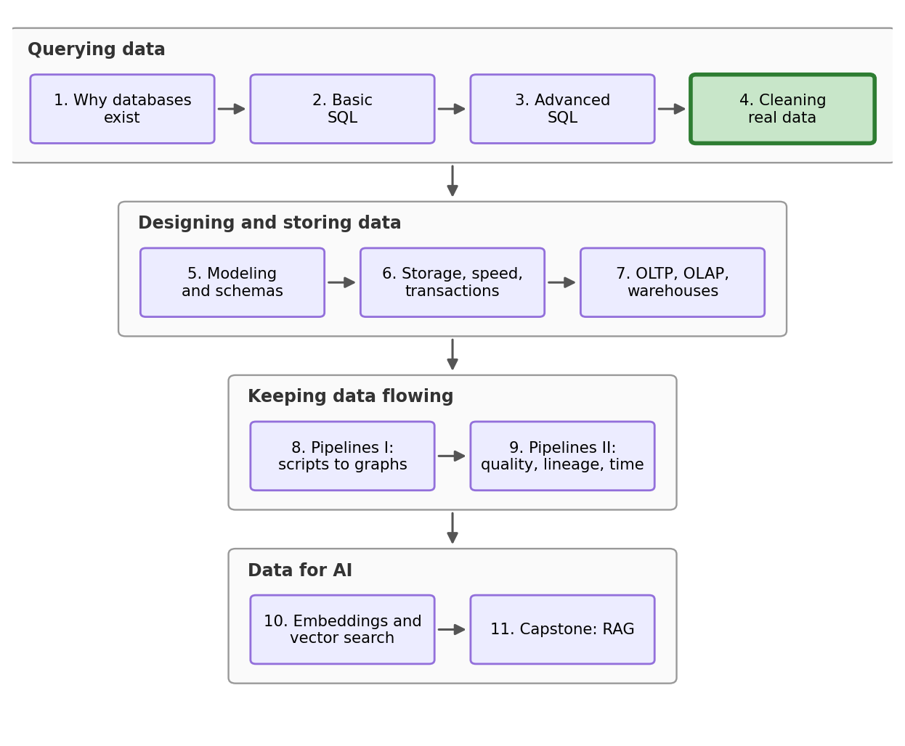
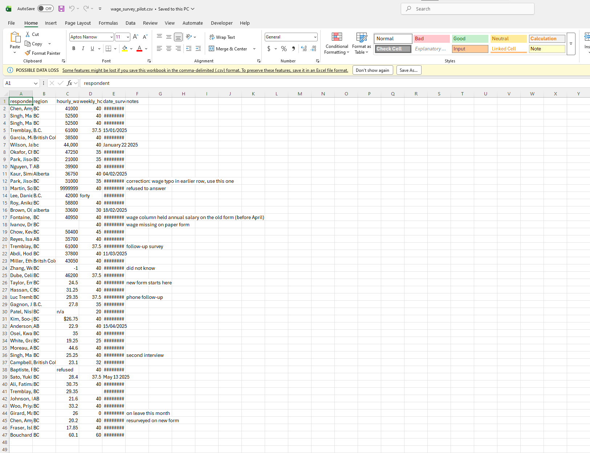
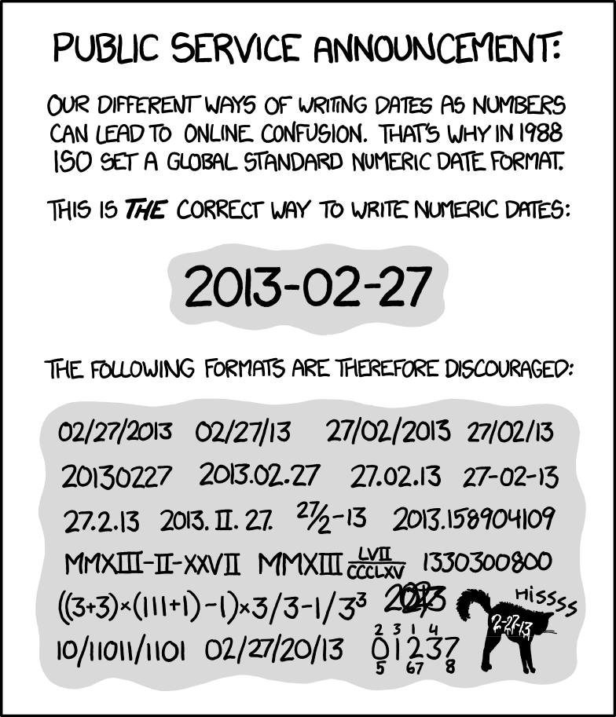
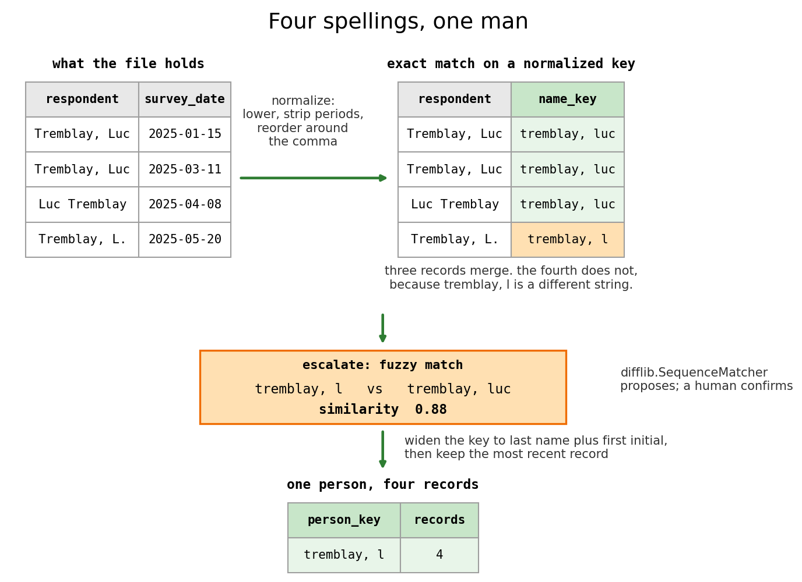

## Outline

### Prerequisites

- Notebook 3 of this stream: CTEs, views, window functions, and `COALESCE`.

### Learning Outcomes

By the end of this notebook you will be able to:

1. Profile a raw file and find the issues which do not cause SQL errors.
2. Write a whole cleaning process as a **SQL view** over raw data you never modify, and state its advantages versus fixing things manually.
3. Resolve people recorded under several names with a **normalized key** and **fuzzy matching**.
4. Run the same analysis under several defensible cleaning rules, and understand that cleaning rules actually change the answer.

## 1. Where we are in the stream

{fig-alt="Stream roadmap: four arcs, Querying data (NB1-4), Designing and storing data (NB5-7), Keeping data flowing (NB8-9), and Data for AI (NB10-11), with the current notebook highlighted." width=85%}

Three notebooks in, and every query we have written has (mostly) just worked. That was not luck. The survey came out of software that refused incorrect entries and standardized spellings and variables, and somebody set that software up.

Real data does not always arrive like that; like today. Before the main survey existed the team ran a **pilot**: 46 interviews over six months, kept in one spreadsheet that three people took turns editing. It has resurfaced, and the research lead wants one number out of it, the average hourly wage. That is your job today. (A disclosure before we start: like the survey, the pilot file is constructed for this stream, because a cleaning lesson only works when every failure is planted and known in advance. This file carries all five of Notebook 1's failure modes on purpose.)

This is the notebook where you stop being a person who queries data and start being the person who makes data queryable. It is also the last stop before Notebook 5, where we design the schema that would have prevented all of this in the first place.

## 2. The file

```{python}
import itertools
import difflib
import sqlite3
import pandas as pd
import numpy as np
import matplotlib.pyplot as plt
```

Our cleaning starts before we even load the data. Left alone, `read_csv` guesses a type for each column and treats a fixed list of tokens (blank, `NA`, `n/a`, `null`, and friends) as missing, so `n/a` would silently become NaN before we had the chance to work with it. `refused` is not on that list, so it survives, but it forces the whole column to be read as text instead of numbers, which is its own kind of quiet damage. We want the true file, not a guess of what could be in it: `dtype=str` reads everything as text and `keep_default_na=False` leaves the blanks alone.

```{python}
raw = pd.read_csv("datasets/wage_survey_pilot.csv", dtype=str, keep_default_na=False)

conn = sqlite3.connect("datasets/wage_survey.db")
raw.to_sql("survey_raw", conn, index=False, if_exists="replace")
pd.read_csv("datasets/provinces.csv").to_sql("provinces", conn, index=False, if_exists="replace")
```

```{python}
%load_ext sql
%config SqlMagic.autopandas = True
%config SqlMagic.displaycon = False
%config SqlMagic.feedback = 0
%sql sqlite:///datasets/wage_survey.db
```

Now we inspect the data. 

```{python}
%%sql
SELECT * FROM survey_raw LIMIT 6
```



Manpreet Singh appears twice. One province (British Columbia) is spelled four different ways. Two of the six dates are written in a format the other four are not. And somebody's wage is `44,000`, which is an impossible hourly wage.

If we ask for the average anyway, without any cleaning we get:

```{python}
%%sql
SELECT COUNT(*) AS records,
       ROUND(AVG(CAST(hourly_wage AS REAL)), 2) AS avg_hourly_wage
FROM survey_raw
```

236,336.79 dollars an hour. `CAST(x AS REAL)` tells SQLite to read a value as a decimal number, and it did that for all 46 rows without a single error. This is the whole problem with messy data: nothing failed, and the answer is nonsensical.

::: {.callout-important}
## Raw data is immutable

`survey_raw` is a copy of the file the survey office sent, and nothing in this notebook will modify it. No `UPDATE`, no `DELETE`, no editing the spreadsheet by hand. Every fix will be a `SELECT` that derives a **new** column from an old one.

This is the single most important habit in the notebook. A hand edit disappears the moment you close the file, and nobody, including you next week, can tell what you changed, why and what was there before.
:::

## 3. What is actually broken

So rather than hunt these one at a time, let's count all of them in one query.

`UNION ALL` stacks the results of several queries into one table as long as they return the same columns, so each line below is one problem and how many rows have it. 

Where does the list of queries to check even come from? Reading the six rows above is a good start, and it is what caught the province spellings, but it does not scale: this file holds 46 records, the next one could be 2TB of data, and no amount of scrolling finds the one row in a million that ruins your average. What scales is running the same fixed set of checks every time without looking at the data at all: distinct values in each category, minimum and maximum of each number, how many entries fail to convert to the type you expect, and the row count against the number of distinct people. Those are all aggregates, so the database answers them in one pass whether the file holds 46 rows or 46 million. We can keep the query list as a test suite to re-run whenever we need (which is exactly what Notebook 9 builds).

```{python}
%%sql
SELECT 'wage written as text (n/a, refused, blank)' AS problem,
       COUNT(*) AS records FROM survey_raw WHERE hourly_wage IN ('', 'n/a', 'refused')
UNION ALL
SELECT 'wage is a code, not a number (9999999, -1)',
       COUNT(*) FROM survey_raw WHERE CAST(hourly_wage AS REAL) IN (-1, 9999999)
UNION ALL
SELECT 'wage has punctuation in it ($ or ,)',
       COUNT(*) FROM survey_raw WHERE hourly_wage LIKE '%$%' OR hourly_wage LIKE '%,%'
UNION ALL
SELECT 'hours written as text (forty, blank)',
       COUNT(*) FROM survey_raw WHERE weekly_hours IN ('', 'forty')
UNION ALL
SELECT 'date SQLite cannot read',
       COUNT(*) FROM survey_raw WHERE date(date_surveyed) IS NULL
UNION ALL
SELECT 'distinct spellings of two provinces',
       COUNT(DISTINCT region) FROM survey_raw
UNION ALL
SELECT 'records, and distinct names among them',
       COUNT(DISTINCT respondent) FROM survey_raw
```

There is our damage report. A few notes on what these mean:

`9999999` and `-1` are **sentinel values**: numbers chosen to mean "no value here" in a column which normally has no way to say so. Here `9999999` means the respondent refused and `-1` means they did not know. This convention is older than SQL and it is still used everywhere in survey data. A sentinel passes every type check you can throw at it, and poisons your average, which is most of where that 236,336.79 came from.

The punctuation is worse, because `CAST` does not fail. Handed text it cannot read it just returns 0 and moves on:

```{python}
%%sql
SELECT hourly_wage, CAST(hourly_wage AS REAL) AS what_cast_gives
FROM survey_raw
WHERE hourly_wage LIKE '%$%' OR hourly_wage LIKE '%,%'
```

A real wage of `$26.75` turns into 0, and a 44,000 dollar salary turns into **44.0**, because `CAST` stopped reading at the comma. Forty-four dollars an hour is a completely believable number, and that is what makes it dangerous. It survives every sanity check you would think to run.

SQLite understands exactly one written form of dates, the ISO 8601 form `2025-01-14` (YYYY-MM-DD) and returns NULL for everything else. This is not SQLite being fussy: ISO dates sort correctly as plain text, so `survey_date < '2025-04-01'` just works immediately. The alternatives are ambiguous, since `04/02/2025` could be February or April, and the only reason we can tell this file is day-first is that another row reads `15/01/2025` and there is no fifteenth month.



## 4. The cleaning script

Now we write the fix. All of it, once, as a view.

Notebook 3 used `CREATE VIEW` to store a query permanently inside the database file, and that is exactly what a cleaning process should be: it copies no data, it re-runs itself every time anyone selects from it. Anybody with the file can read what it does, argue with it, and improve it. `DROP VIEW IF EXISTS` in front makes the pair safe to re-run.

Read the comments down the right-hand side (marked with **--**). Each one is a decision, and each decision is a line somebody could disagree with:

```{python}
%%sql
DROP VIEW IF EXISTS pilot_typed
```

```{python}
%%sql
CREATE VIEW pilot_typed AS
WITH months(month_name, month_num) AS (            -- a little month-name lookup table, built right here
    VALUES ('January', '01'), ('February', '02'), ('March', '03'), ('April', '04'),
           ('May', '05'), ('June', '06'), ('July', '07'), ('August', '08'),
           ('September', '09'), ('October', '10'), ('November', '11'), ('December', '12')
),
dated AS (
    SELECT r.rowid AS row_id, r.respondent, r.region, r.hourly_wage, r.weekly_hours, r.notes,
           CASE
             WHEN date(r.date_surveyed) IS NOT NULL THEN r.date_surveyed                -- this one is already the right shape, so leave it alone
             WHEN instr(r.date_surveyed, '/') > 0                                       -- instr looks for a slash, which is how we spot 15/01/2025
                  THEN substr(r.date_surveyed, 7, 4) || '-' ||                          -- substr cuts a piece out of the text: here, the year
                       substr(r.date_surveyed, 4, 2) || '-' ||                          -- then the month, and || glues the pieces together
                       substr(r.date_surveyed, 1, 2)                                    -- and the day, so 15/01/2025 comes back as 2025-01-15
             ELSE substr(r.date_surveyed, -4) || '-' || m.month_num || '-' ||           -- for "January 22 2025", counting back finds the year
                  printf('%02d', CAST(substr(r.date_surveyed, instr(r.date_surveyed, ' ') + 1) AS INTEGER))
           END AS survey_date                                                           -- printf writes day 8 as 08, so the dates all line up
    FROM survey_raw AS r
    LEFT JOIN months AS m ON m.month_name = substr(r.date_surveyed, 1, instr(r.date_surveyed, ' ') - 1)
)
SELECT row_id, TRIM(respondent) AS respondent, survey_date, notes,                      -- TRIM shaves off any stray spaces around the name
       CASE WHEN UPPER(TRIM(region)) IN ('BC', 'B.C.', 'BRITISH COLUMBIA', 'BRITSH COLUMBIA')
                 THEN 'British Columbia'                                                -- all four of these spellings mean this one province...
            WHEN UPPER(TRIM(region)) IN ('AB', 'ALBERTA') THEN 'Alberta'                -- ...and these two mean the other. We decided that, not SQL
       END AS province,                                                                 -- with no ELSE, a spelling we have not seen lands here as NULL
       CASE WHEN weekly_hours IN ('', 'forty') THEN NULL
            ELSE CAST(weekly_hours AS REAL) END AS weekly_hours,                        -- 'forty' and the blanks are unknown, but a real 0 stays 0
       NULLIF(NULLIF(                                                                   -- NULLIF blanks out a value we name, and we name two below
           CASE WHEN hourly_wage IN ('', 'n/a', 'refused') THEN NULL
                ELSE CAST(REPLACE(REPLACE(hourly_wage, ',', ''), '$', '') AS REAL)      -- REPLACE strips the punctuation first
           END, 9999999), -1) AS wage_reported                                          -- then both sentinels become NULL
FROM dated
```

Let's think about a couple of our cleaning decisions.

The `CASE` for provinces has no `ELSE`, which is on purpose. A `CASE` with no matching branch returns NULL, so if the survey office ever sends a row spelled `B C`, it lands in a NULL group instead of being quietly folded into a province. Given the choice between a rule that guesses and a rule that leaves a null where the guess would be, we take the null.

The hours rule is also important. Three entries read as zero hours if you just `CAST` them, and only one of those is a person who worked zero hours: Mathieu Girard, who was on leave and said so in the notes. `forty` and the blank are unknown. Zero and unknown are different values, and a careless `CAST` makes them identical.

Here are the same six rows we started with, after we ran the script:

```{python}
%%sql
SELECT * FROM pilot_typed ORDER BY row_id LIMIT 6
```

Four spellings of BC have become one, and both awkward dates are gone: Luc Tremblay's `15/01/2025` and Peter Novak's `January 22 2025` come back as `2025-01-15` and `2025-01-22`. Novak's wage reads 44000.0 too, rather than the 44.0 a plain `CAST` gave us. 

Now that the column is finally made of numbers, look down it: all six hourly wages are in the tens of thousands.

## 5. The column that changed meaning

Now that the dates work we can ask a question that was impossible five minutes ago: what does this survey look like over time? `strftime('%Y-%m', d)` formats a date, `%Y` being the year and `%m` the month, which gives us something to group on. The `<<` arrow is Notebook 1's trick for storing a result in a Python variable so we can plot it.

```{python}
%%sql monthly <<
SELECT strftime('%Y-%m', survey_date) AS month,
       COUNT(*) AS records,
       ROUND(AVG(wage_reported), 2) AS avg_wage
FROM pilot_typed
GROUP BY month
```

```{python}
plt.figure(figsize=(9, 5))
plt.bar(monthly["month"], monthly["avg_wage"], color="tab:green")
plt.yscale("log") #log scale on y-axis
plt.ylabel("average of the wage column (log scale)")
plt.title("Something happened to this column in April")
plt.show()
```

We need a log scale to fit it on one chart. January to March average in the tens of thousands. April to June average in the tens. This is not normal at all, no labour market does that.

The people filling in the form wrote down what happened:

```{python}
%%sql
SELECT respondent, date_surveyed, hourly_wage, notes
FROM survey_raw
WHERE notes LIKE '%form%'
```

The old form asked for an annual salary, the new one asks for an hourly wage, and both answers went into a column called `hourly_wage`. Notebook 1 listed this failure as "no enforced types or meaning: a column is whatever anyone types into it". The column name lied for three months of the data.

The fix is arithmetic: an annual salary divided by the weeks and hours worked becomes a hourly wage, so `salary / (weekly_hours * 52)` for everything collected before April.

That is a big assumption to make on the strength of a note in a spreadsheet, so let's test it. Several people were interviewed more than once and some of those repeats exist across the form change, which gives us a free check: if the rule is right, a person's converted salary should land near the hourly wage they reported later (with a small possibility of a raise or a job change).

```{python}
%%sql
WITH converted AS (
    SELECT respondent, survey_date, wage_reported, weekly_hours,
           CASE WHEN survey_date < '2025-04-01'
                THEN ROUND(wage_reported / (weekly_hours * 52), 2)
                ELSE wage_reported
           END AS hourly_rate
    FROM pilot_typed
)
SELECT * FROM converted
WHERE respondent IN (SELECT respondent FROM pilot_typed GROUP BY respondent HAVING COUNT(*) > 1)
ORDER BY respondent, survey_date
```

Manpreet Singh's January salary of 52,500 over a 40-hour week converts to **25.24** an hour. In April, on the new form, he reported **25.25**. One cent apart, from two different forms four months apart. Amy Chen converts to 19.71 in January and reports 20.20 in June, which is likely to be a raise. The rule holds, and now we can add it to the pipeline.

## 6. One person, four names

There is one more big problem in the data. Luc Tremblay was interviewed four times, but he only shows up twice, because the file spells his name three different ways and grouping on `respondent` only catches the identical ones.

```{python}
%%sql
SELECT COUNT(*) AS records, COUNT(DISTINCT respondent) AS name_strings
FROM survey_raw
```

Forty-one name strings across 46 records, and whether that is 41 people is a question the file cannot answer. A spreadsheet has no notion of identity, so `Tremblay, Luc` and `Luc Tremblay` are unrelated pieces of text to it. Working out which records are the same person is called **entity resolution**, and it is one of the standard problems in survey and administrative data, where the same person shows up as `Smith, J.`, `John Smith` and `J. Smith `.

The first logical move is a **normalized key**, which rewrites the name so the differences you do not care about disappear. `TRIM` and `LOWER` kill spacing and capitalization, `REPLACE(x, '.', '')` kills the periods, and since the comma tells us whether a name is written last-first or first-last, `instr` and `substr` can put both into the same order.

```{python}
%%sql
WITH keyed AS (
    SELECT TRIM(respondent) AS respondent,
           LOWER(CASE WHEN instr(respondent, ',') > 0                            -- the last name on its own,
                      THEN TRIM(substr(respondent, 1, instr(respondent, ',') - 1))
                      ELSE substr(respondent, instr(respondent, ' ') + 1)
                 END) AS last_name,                                              -- which we use in the HAVING below
           LOWER(CASE WHEN instr(respondent, ',') > 0
                      THEN TRIM(substr(respondent, 1, instr(respondent, ',') - 1)) || ', ' ||
                           TRIM(REPLACE(substr(respondent, instr(respondent, ',') + 1), '.', ''))
                      ELSE substr(respondent, instr(respondent, ' ') + 1) || ', ' ||
                           substr(respondent, 1, instr(respondent, ' ') - 1)
                 END) AS name_key
    FROM survey_raw
)
SELECT last_name, name_key, COUNT(*) AS records, COUNT(DISTINCT respondent) AS spellings
FROM keyed
GROUP BY name_key
HAVING records > 1                                                               -- keys that pulled records together,
    OR last_name IN (SELECT last_name FROM keyed                                 -- plus any key that shares a last name
                     GROUP BY last_name HAVING COUNT(DISTINCT name_key) > 1)     -- with a different key
ORDER BY records DESC, name_key
```

Four people account for ten of the 46 records, and the key worked: `Luc Tremblay` and `Tremblay, Luc` now produce the same `tremblay, luc`, but look at the last row. `Tremblay, L.` normalizes to `tremblay, l`, which is still a different string, so he sits on his own with a single record while his other three are grouped above him. Any key you build will have a case like this, because exact matching is by nature - exact.

So we escalate one step further to **fuzzy matching**: instead of asking whether two strings are equal, we can mathematically measure how similar they are. `difflib.SequenceMatcher(None, a, b).ratio()` returns a number between 0 and 1 where 1 means identical, and `itertools.combinations` computes every pair of names. We set a similarity bar of 0.6, but you can experiment with different bars. 

(Learn more about comparing text and other natural language processing techniques in this prAxIs notebook: [Text Analysis Overview](https://ubcecon.github.io/praxis-ubc/docs/text_analysis/text_analysis.html).)

```{python}
names = sorted(pd.read_sql("SELECT DISTINCT TRIM(respondent) AS name FROM survey_raw", conn)["name"])

candidates = [(a, b, round(difflib.SequenceMatcher(None, a.lower(), b.lower()).ratio(), 2))
              for a, b in itertools.combinations(names, 2)
              if difflib.SequenceMatcher(None, a.lower(), b.lower()).ratio() >= 0.6] # The 0.6 here is our bar, change it and see what happens. 

print(len(names), "names,", len(names) * (len(names) - 1) // 2, "pairs compared")
pd.DataFrame(candidates, columns=["name_a", "name_b", "similarity"]).sort_values("similarity", ascending=False)
```

Three pairs clear the bar and all three are Luc Tremblay. Note that 41 names took 820 comparisons, and the pair count grows with the square of the records, so a million records would be 500 billion comparisons. Real data systems avoid that with **blocking**: only compare records inside groups that could plausibly match at all, usually formed on something computationally simple like a last name or a postal code.



::: {.callout-important}
## Fuzzy matching proposes, but a human should always decide

That output is a review list for us, not a set of merges we must make. Splitting one person into two records costs you a slightly smaller sample. Merging two people into one invents a person who does not exist and corrupts every variable at once. Those two mistakes are not equally bad, so you set the threshold low, look at the result, and decide.
:::

We look, and all four records are clearly the same man. To record that decision we widen the key to last name plus first initial, and take each person's most recent record with `ROW_NUMBER()`, which is Notebook 3's `RANK()` except it never ties, so we can be sure we kept exactly one row per person.

```{python}
%%sql
DROP VIEW IF EXISTS pilot_clean;
DROP VIEW IF EXISTS pilot_records
```

Two views, because there are two useful grains here (Check Notebook 2). `pilot_records` is one row per interview, with the conversion and the key attached. `pilot_clean` is one row per person.

```{python}
%%sql
CREATE VIEW pilot_records AS
SELECT *,
       CASE WHEN survey_date < '2025-04-01'                                  -- section 5's conversion, now permanent
            THEN ROUND(wage_reported / (weekly_hours * 52), 2)
            ELSE wage_reported END AS hourly_wage,
       LOWER(CASE WHEN instr(respondent, ',') > 0                            -- last name plus first initial
                  THEN TRIM(substr(respondent, 1, instr(respondent, ',') - 1)) || ', ' ||
                       substr(TRIM(REPLACE(substr(respondent, instr(respondent, ',') + 1), '.', '')), 1, 1)
                  ELSE substr(respondent, instr(respondent, ' ') + 1) || ', ' ||
                       substr(respondent, 1, 1) END) AS person_key
FROM pilot_typed
```

```{python}
%%sql
CREATE VIEW pilot_clean AS
WITH numbered AS (
    SELECT *, ROW_NUMBER() OVER (PARTITION BY person_key                         -- newest record first
                                 ORDER BY survey_date DESC, row_id DESC) AS record_number
    FROM pilot_records
)
SELECT person_key, respondent, survey_date, province, weekly_hours, hourly_wage, notes
FROM numbered WHERE record_number = 1                                            -- keep only the newest
```

```{python}
%%sql
SELECT COUNT(*) AS people,
       COUNT(hourly_wage) AS wages_we_can_use,
       ROUND(AVG(hourly_wage), 2) AS avg_hourly_wage
FROM pilot_clean
```

Thirty-nine people, 33 usable wages, with an average of $25.40 an hour. That is the number the research lead asked for, and unlike the 236,336.79 we can defend every step between the file and it. Additionally, re-running the whole thing is one `SELECT`. Done!

## 7. The same script, eight ways

This is the most important part of this notebook, far more than any numerical result we have found.

Look back at what we just wrote and count the places we made a cleaning decision. Convert the old-form salaries, or drop those records as not comparable? One row per person, or one row per interview? How we deal with NULL values. Everyone, or only the full-time workers, the way Notebook 2's briefing did it? None of those is wrong. A careful analyst could pick any combination and defend it properly.

So let's stop arguing and run all of them. Because the cleaning is code, this costs us one function:

```{python}
records = pd.read_sql("SELECT * FROM pilot_records", conn)

def average_wage(convert_units, one_row_per_person, full_time_only):
    d = records.copy()
    d["wage"] = (d["hourly_wage"] if convert_units                              # convert the old form...
                 else d["wage_reported"].where(d["survey_date"] >= "2025-04-01"))  # ...or drop those records
    if full_time_only:
        d = d[d["weekly_hours"] >= 30]
    if one_row_per_person:
        d = d.sort_values(["survey_date", "row_id"]).drop_duplicates("person_key", keep="last")
    wages = d["wage"].dropna()
    return {"convert": convert_units, "per_person": one_row_per_person, "full_time": full_time_only,
            "n": len(wages), "mean": round(wages.mean(), 2)}

specs = pd.DataFrame([average_wage(c, p, f)
                      for c, p, f in itertools.product([True, False], repeat=3)])
specs.sort_values("mean")
```

Each result here is one of our possible defendable cleaning pipelines. We show eight pipelines, and the answers run from **25.29 to 29.56**. That is a spread of 4.27 dollars an hour, about 17%, on the same 46 interviews. We also plot it:

```{python}
s = specs.sort_values("mean").reset_index(drop=True)
fig, (top, bot) = plt.subplots(2, 1, figsize=(9, 6), height_ratios=[2, 1], sharex=True)

top.scatter(s.index, s["mean"], color="tab:green", s=70, zorder=3)
top.axhline(25.40, color="black", linestyle="--", linewidth=1, label="the pipeline we wrote: 25.40")
top.set_ylabel("average hourly wage")
top.set_title("Eight defensible cleaning pipelines, eight answers")
top.margins(y=0.25)
top.grid(axis="y", alpha=0.3)
top.legend(loc="upper left")

for row, switch in enumerate(["convert", "per_person", "full_time"]):
    on = s[switch].to_numpy()
    bot.scatter(s.index[on], [row] * on.sum(), color="tab:green", s=45)
    bot.scatter(s.index[~on], [row] * (~on).sum(), color="lightgrey", s=45)
bot.set_yticks([0, 1, 2], ["convert old form", "one row per person", "full-time only"])
bot.set_xticks([])
bot.set_xlabel("each column is one pipeline, green means the choice was switched on")
plt.show()
```

Read the bottom panel. The four pipelines on the left all converted the old-form salaries and the four on the right all dropped them. This single decision accounts for essentially the whole spread. This is of course a dramatic example, but decisions like this stack up and accuracy is important. Whether you keep one row per person or one per interview moves the answer only by a few cents.

::: {.callout-important}
## This is a real method

Running your analysis under every defensible version of your choices, instead of picking one and hoping, is called a **multiverse analysis** (Steegen et al., 2016), and the plot above is a **specification curve** (Simonsohn et al., 2020). When 29 research teams were handed the same dataset and the same question, they produced 29 different answers: about two thirds found a significant effect and about a third found no significant effect at all (Silberzahn et al., 2018).

You cannot do any of this if your cleaning lives in a spreadsheet you edited by hand. It costs one function only because the cleaning was code.
:::

## 8. What we do not fix

Some things in this file cannot be repaired, because repairing them would mean knowing values we do not have, but that does not mean we just ignore them.

Two rules worth having. First, the statistical one is the rule behind every boxplot: take the first and third quartiles, and flag anything more than 1.5 interquartile ranges outside them. `NTILE(4)` is the window function that splits the ordered rows into quarters. Second, the `CASE` without an `ELSE` shows up again here, returning the wage for one quarter and NULL for the rest, and `MAX` ignores NULLs.

```{python}
%%sql
WITH quartiles AS (
    SELECT hourly_wage, NTILE(4) OVER (ORDER BY hourly_wage) AS quarter
    FROM pilot_clean WHERE hourly_wage IS NOT NULL
),
fence AS (
    SELECT MAX(CASE WHEN quarter = 1 THEN hourly_wage END) AS q1,
           MAX(CASE WHEN quarter = 3 THEN hourly_wage END) AS q3 FROM quartiles
)
SELECT person_key, province, hourly_wage, weekly_hours,
       (SELECT ROUND(q3 + 1.5 * (q3 - q1), 2) FROM fence) AS high_fence
FROM pilot_clean
WHERE hourly_wage > (SELECT q3 + 1.5 * (q3 - q1) FROM fence)
   OR hourly_wage < (SELECT q1 - 1.5 * (q3 - q1) FROM fence)
```

Two people, and neither is an error. Emile Bouchard earns 60.10 an hour and works 60 hours a week, which is feasible for a real person, not an error. A statistical fence finds the records furthest from the middle, which is not the same as finding the records that are wrong. This is a check we run, but we never outright delete what it prints out, a human analyst decides. Our action would be different if the wage was 6010.00 an hour. 

The other rule knows something about wages. Every province in `provinces` carries its legal minimum wage, and a wage below it is not unusual, it is outright impossible:

```{python}
%%sql
SELECT c.person_key, c.province, c.hourly_wage, p.minimum_wage, c.notes
FROM pilot_clean AS c
JOIN provinces AS p ON c.province = p.province
WHERE c.hourly_wage < p.minimum_wage
```

One record, and it does not immediately look incorrect. Jisoo Park's converted salary comes to 17.03 against a British Columbia minimum of 17.40, and her note says this row is already the correction to an earlier typo. So either the correction is wrong, or her hours are wrong, or that number was never annual in the first place. We cannot tell from here, and that is the answer: this row needs an email to the survey office, not a decision from us. We flag it and for now keep it, till we get a response. 

Last, the six people with no usable wage at all. The tempting fix is to fill the holes with the column's mean, let's see what that does. The variance is the average squared distance from the mean, which SQL can compute as the average of the squares minus the square of the average:

```{python}
%%sql
WITH filled AS (
    SELECT COALESCE(hourly_wage, (SELECT AVG(hourly_wage) FROM pilot_clean)) AS wage
    FROM pilot_clean
)
SELECT (SELECT COUNT(hourly_wage) FROM pilot_clean) AS n_observed,
       ROUND((SELECT AVG(hourly_wage * hourly_wage) - AVG(hourly_wage) * AVG(hourly_wage)
              FROM pilot_clean), 2) AS variance_observed,
       (SELECT COUNT(*) FROM filled) AS n_filled,
       ROUND((SELECT AVG(wage * wage) - AVG(wage) * AVG(wage) FROM filled), 2) AS variance_filled
```

The mean cannot move, because filling holes with the mean by definition keeps it in the same spot, and that is exactly why the trick feels safe. The variance falls from 73.33 to 62.05, about 15%. Every standard error and confidence interval you compute afterwards inherits this reduction, so your results look more precise than your survey ever was. This is not the approach we should take, instead leave the empty spots, and print the count next to the mean. This is far more honest than artificially reducing our survey variance. 

## 9. Conclusion

The pilot's average hourly wage is 25.40, on 33 usable wages from 39 people, and the more useful output is what we used to get that number: two views anybody can run in one line, a list of what we decided, three flagged records, and a chart showing how much the answer moves when the decisions change.

Notebook 1 listed five ways a shared file goes wrong. This one (on purpose) had all five, and you have now handled each: a person under four spellings, a correction appended instead of applied, a column that changed meaning halfway through, four spellings of one province, and no rules anywhere to stop any of it. The habit underneath them is what makes all the difference at work. Raw data is immutable, cleaning is code, and the reason is not tidiness. It is that a cleaning script can be re-run, argued with, improved, and run eight ways in an afternoon, and a spreadsheet you edited by hand can do none of those things.

That script is also a pipeline! It has inputs it never modifies, a fixed sequence of steps, and a reproducible output. Give it a schedule and a way to fail loudly and you have the result of Notebook 8. First though, Notebook 5 asks the obvious question: what if the database had simply refused to accept `Britsh Columbia` and `refused` in the first place? And how can we make it do just that?

::: {.callout-note}
## You can now answer these interview questions

- What is entity resolution, and why is an exact match on a name not enough?
- Why should raw data never be edited in place?
- What is a sentinel value, and what makes it dangerous?
- What does filling missing values with the column mean do to a variance estimate?

<details><summary>Show / hide model answers</summary>

- It is working out which records refer to the same real thing when nothing in the data says so. Exact matching fails because the same person appears with different spacing, punctuation, capitalization, name order and abbreviations, we can use a key or fuzzy similarity (or other techniques) to resolve this. 
- Because a hand edit is invisible. It destroys your ability to see what the data originally said, to re-run the cleaning after finding a mistake in step two, and to let anyone else check what you changed. Deriving new columns from an untouched raw table keeps all three.
- A number used to mean "no value", like `9999999` or `-1`. It is dangerous because it is a perfectly valid number, so it passes every type check and poisons every average, sum, minimum and maximum without raising an error.
- It leaves the mean unchanged by construction and shrinks the variance, because every filled value sits exactly at the centre with zero deviation. Standard errors and confidence intervals computed afterwards come out too narrow, so the results look more precise than the data supports.

</details>
:::

## Connections

- **Back to Notebook 3:** views turned out to be an excellent tool for a cleaning pipeline, and the window functions that ranked earners by province here rank a person's records by date so we can keep one.
- **Forward to Notebook 5:** none of this work would have been necessary if the pilot had been collected under a schema. Next we design the tables ourselves: entities and relationships, primary and foreign keys, and the constraints that make a database reject a bad row or value immediately instead of six months later.

### References

- Christen, P. (2012). *Data Matching: Concepts and Techniques for Record Linkage, Entity Resolution, and Duplicate Detection.* Springer. The standard reference for section 6, including blocking.
- Little, R. J. A., & Rubin, D. B. (2019). *Statistical Analysis with Missing Data* (3rd ed.). Wiley. Where the missing-value choices at the end of section 8 are treated properly.
- Munroe, R. *ISO 8601.* xkcd 1179. https://xkcd.com/1179/
- Silberzahn, R., Uhlmann, E. L., Martin, D. P., et al. (2018). *Many analysts, one data set: making transparent how variations in analytic choices affect results.* Advances in Methods and Practices in Psychological Science, 1(3), 337-356. https://doi.org/10.1177/2515245917747646
- Simonsohn, U., Simmons, J. P., & Nelson, L. D. (2020). *Specification curve analysis.* Nature Human Behaviour, 4, 1208-1214. https://doi.org/10.1038/s41562-020-0912-z The plot in section 7.
- SQLite. *Built-in scalar SQL functions.* https://www.sqlite.org/lang_corefunc.html `TRIM`, `REPLACE`, `substr`, `instr`, `printf` and `NULLIF`.
- SQLite. *Date and time functions.* https://www.sqlite.org/lang_datefunc.html Why section 3 only accepts one date format.
- Steegen, S., Tuerlinckx, F., Gelman, A., & Vanpaemel, W. (2016). *Increasing transparency through a multiverse analysis.* Perspectives on Psychological Science, 11(5), 702-712. https://doi.org/10.1177/1745691616658637
- Ziemann, M., Eren, Y., & El-Osta, A. (2016). *Gene name errors are widespread in the scientific literature.* Genome Biology, 17, 177. https://doi.org/10.1186/s13059-016-1044-7 A fifth of published genetics papers had gene names silently corrupted by a spreadsheet's type guessing.

---
