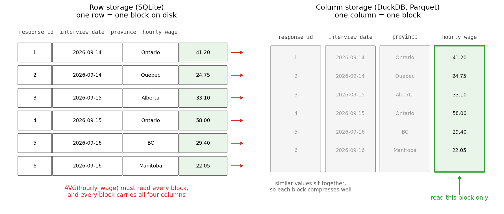

## Outline

### Prerequisites

- Notebook 5 of this stream: the designed schema.

### Learning Outcomes

By the end of this notebook you will be able to:

1. Control a **transaction** with `BEGIN`, `COMMIT` and `ROLLBACK`, and undo a mistake.
2. Explain **ACID**, and demonstrate atomicity, isolation and durability with a crash we cause on purpose.
3. Make a slow query fast with an **index**, prove what changed with **EXPLAIN QUERY PLAN**, and state what the speed costs.
4. Explain **row** and **column** storage, and predict which workloads each one wins.
5. Justify **Parquet** over CSV for data you keep.

## 1. Where we are in the stream

```{mermaid}
flowchart TB
    subgraph ARC1["Querying data"]
        direction LR
        NB1["1. Why databases<br/>exist"] --> NB2["2. Basic<br/>SQL"] --> NB3["3. Advanced<br/>SQL"] --> NB4["4. Cleaning<br/>real data"]
    end
    subgraph ARC2["Designing and storing data"]
        direction LR
        NB5["5. Modeling<br/>and schemas"] --> NB6["6. Storage, speed,<br/>transactions"] --> NB7["7. OLTP, OLAP,<br/>warehouses"]
    end
    subgraph ARC3["Keeping data flowing"]
        direction LR
        NB8["8. Pipelines I:<br/>scripts to graphs"] --> NB9["9. Pipelines II:<br/>quality, lineage, time"]
    end
    subgraph ARC4["Data for AI"]
        direction LR
        NB10["10. Embeddings and<br/>vector search"] --> NB11["11. Capstone: RAG"]
    end
    ARC1 --> ARC2 --> ARC3 --> ARC4
    style NB6 fill:#c8e6c9,stroke:#2e7d32,stroke-width:3px
```

Notebook 5's design was accepted, and the survey office is building the wave 2 intake software with it. The schema says what a valid record is. We also received a new email from the survey office for this notebook's task.

> **The launch review, from the survey office.** "Three questions before we sign off. One: interviewers' laptops have died mid-interview in the past, so tell us what a crash does to the data. Two: looking up a respondent's history has to stay instant once this thing holds years of responses. Three: the research side wants analytics on the archive without waiting all day, and wants to know what file format we keep the history in."

Three questions, and in this notebook we answer each with an experiment (fun)! Along the way we meet the machinery underneath everything this stream has done so far: how a database writes without losing data, how it finds one row without reading them all, and how the same data can sit on disk in shapes whose speed differs a hundredfold.

## 2. A quarter of a million rows

Every experiment today needs something the 1,000-row survey cannot give us: enough data for speed to matter. So we simulate the load: two years of wave 2 operation, 250,000 interview responses, 250 times the survey we have been querying. The grain is one row per response, and the same person can appear many times, once per interview they gave.

```{python}
import os
import time
import sqlite3
import numpy as np
import pandas as pd
```

`numpy`'s random generator does the manufacturing. `default_rng(42)` builds a generator with a fixed seed, so every run of this notebook produces the identical dataset. From it, `integers` draws whole numbers in a range, `choice` picks from a list with given probabilities (we use roughly the six provinces' population shares), and `normal` and `lognormal` draw from those two distributions, with `clip` bounding the results to sane ranges. `np.arange` counts off the response ids, 1 through n, and the dates are a fixed launch day (`pd.Timestamp`) plus a random number of days (`pd.to_timedelta`).

```{python}
rng = np.random.default_rng(42)
n = 250_000

provinces = ["Ontario", "Quebec", "British Columbia", "Alberta", "Manitoba", "Saskatchewan"]
weights = [0.42, 0.23, 0.15, 0.13, 0.04, 0.03]
industries = ["Construction", "Education", "Finance", "Health care", "Hospitality",
              "Manufacturing", "Public administration", "Retail", "Technology"]

big = pd.DataFrame({
    "response_id": np.arange(1, n + 1),
    "respondent_id": rng.integers(1, 60_001, n),
    "interview_date": pd.Timestamp("2026-09-01") + pd.to_timedelta(rng.integers(0, 730, n), unit="D"),
    "province": rng.choice(provinces, n, p=weights),
    "industry": rng.choice(industries, n),
    "age": rng.integers(19, 66, n),
    "weekly_hours": rng.normal(37, 6, n).clip(5, 80).round(1),
    "hourly_wage": rng.lognormal(3.6, 0.33, n).clip(17.40, None).round(2),
})
big.head()
```

Note, Saskatchewan made the province list this time as we are past those issues.

Into SQLite it goes, through the same `to_sql` as always, in a fresh database file. One adjustment first so this all works: SQLite keeps dates as ISO text (Notebook 4's `2025-01-14` format), so we convert the dates to text with `.dt.strftime`, the `pandas` equivalent of the SQL `strftime` from Notebook 4, on a duplicate of the dataframe made with `.copy()`. And to be clear about what we are building: this is a staging-style scratch table with no keys and no constraints, because today we are measuring the engine, not working with the data. Notebook 5 would be really upset with us right now, but luckily it's not here to see. If this was a real database, we would also add all of Notebook 5's content.


```{python}
conn = sqlite3.connect("datasets/wage_responses.db")

for_sqlite = big.copy()
for_sqlite["interview_date"] = for_sqlite["interview_date"].dt.strftime("%Y-%m-%d")
for_sqlite.to_sql("responses", conn, index=False, if_exists="replace")
```

A quarter of a million rows written. Two small tools before we measure anything. `conn.execute` hands the database a single SQL statement, the plumbing that `pd.read_sql` wraps for us, and the statement `VACUUM` compacts the database file, rewriting it with no dead space left over from earlier runs, so the size we measure is the size of the data every time. `os.path.getsize` then asks the operating system how big a file is, in bytes, so we can watch the database grow throughout the notebook:

```{python}
conn.execute("VACUUM")

print(f"{os.path.getsize('datasets/wage_responses.db') / 1e6:.0f} MB on disk")
pd.read_sql("SELECT COUNT(*) AS responses, COUNT(DISTINCT respondent_id) AS respondents FROM responses", conn)
```

About 17 MB, holding 250,000 responses from 59,037 distinct respondents. Time to break things.

## 3. The undo button

Question one from the office is about crashes, and the machinery that answers it is the **transaction**: a group of statements the database promises to treat as one unit, all of it or none of it. Three commands control one. `BEGIN` opens the transaction, `COMMIT` makes everything since `BEGIN` permanent, and `ROLLBACK` throws everything since `BEGIN` away.

To drive them we need something new: a connection we control by hand. Python's `sqlite3` normally manages commits behind the scenes, so we open a second connection to the same file and pass `isolation_level=None`, which switches that autopilot off. On this connection nothing is committed unless we say so inside SQL itself, and our commands travel to it through `.execute`, which we met when compacting the file. This is necessary for the experiment, but you don't have to focus too much on the mechanism itself.

```{python}
txn = sqlite3.connect("datasets/wage_responses.db", isolation_level=None)
```

Now, the demonstration. Gallery #3 in Notebook 3 had a colleague running an `UPDATE` with no `WHERE` and overwriting every row of a practice table, and our advice was to rehearse on a copy. Transactions are the professional version of that advice. Watch us make the exact same catastrophic mistake, on the real table, on purpose. First, the truth we are about to destroy:

```{python}
pd.read_sql("SELECT ROUND(AVG(weekly_hours), 2) AS avg_hours FROM responses", txn)
```

An average of 37.01 hours a week. Open a transaction and destroy it:

```{python}
txn.execute("BEGIN")
txn.execute("UPDATE responses SET weekly_hours = 40")

pd.read_sql("SELECT ROUND(AVG(weekly_hours), 2) AS avg_hours FROM responses", txn)
```

Every one of 250,000 values now reads exactly 40. In Notebook 3 this was the disaster. Here it is a rehearsal, because the transaction is still open, and nothing has been committed:

```{python}
txn.execute("ROLLBACK")

pd.read_sql("SELECT ROUND(AVG(weekly_hours), 2) AS avg_hours FROM responses", txn)
```

We are back to 37.01 again. 250,000 overwrites, undone by one command. That is what a transaction offers: between `BEGIN` and the moment you commit, the database lets you see your changes, check them, and walk them back. If you are familiar with version control like Git this is exactly like that.

## 4. Crashing on purpose

A `ROLLBACK` is you changing your mind. The office's question is more extreme: what if the machine dies before anyone gets to decide? To find out, we pretend to be the dying laptop ourselves. A third connection opens a transaction and loads a batch of a thousand arriving interviews, which we fake by copying the first thousand responses under new ids:

```{python}
crash = sqlite3.connect("datasets/wage_responses.db", isolation_level=None)
crash.execute("BEGIN")
crash.execute("""INSERT INTO responses
                 SELECT response_id + 1000000, respondent_id, interview_date, province,
                        industry, age, weekly_hours, hourly_wage
                 FROM responses
                 WHERE response_id <= 1000""")

pd.read_sql("SELECT COUNT(*) AS what_the_writer_sees FROM responses", crash)
```

The writing connection counts 251,000 rows. Now ask the same question through our other connection, at the same moment:

```{python}
pd.read_sql("SELECT COUNT(*) AS what_everyone_else_sees FROM responses", conn)
```

250,000. The writer sees its work in progress; everyone else sees the last committed state, and will keep seeing it until the writer commits. Uncommitted work is invisible to the outside world, which is perfect as if we are working at adding new data and our co-worker is doing some analysis it would be bad if his answers kept changing every few seconds. 

> **Predict first.** The interviewer's laptop dies right now, transaction open, 1,000 rows written but not committed. After the machine restarts, how many rows does the table hold?

```{python}
crash.close()

pd.read_sql("SELECT COUNT(*) AS after_the_crash FROM responses", conn)
```

250,000. The batch is simply gone, as if it never started, and that is exactly what we want: not 251,000, and not some value in between. Closing the connection with the transaction open plays the part of the crash; a real power cut leaves a half-written journal file behind, and SQLite uses it to roll the file back to the last committed state the next time anything connects. Either way the rule holds, and it is the same rule that refused our 1,000-row load in Notebook 5: a transaction finishes entirely or leaves no trace.

For completeness, here is the run where the laptop survives long enough to commit:

```{python}
survivor = sqlite3.connect("datasets/wage_responses.db", isolation_level=None)
survivor.execute("BEGIN")
survivor.execute("""INSERT INTO responses
                    SELECT response_id + 1000000, respondent_id, interview_date, province,
                           industry, age, weekly_hours, hourly_wage
                    FROM responses
                    WHERE response_id <= 1000""")
survivor.execute("COMMIT")
survivor.close()

pd.read_sql("SELECT COUNT(*) AS after_a_commit FROM responses", conn)
```

251,000, from every connection, forever. Once `COMMIT` returns, the change has been forced onto the disk itself, and a crash one millisecond later cannot revoke it. Our load test does not need the extra thousand rows, so we remove them again, on the manual connection, where every statement commits itself:

```{python}
txn.execute("DELETE FROM responses WHERE response_id > 1000000")

pd.read_sql("SELECT COUNT(*) AS back_to_normal FROM responses", conn)
```

::: {.callout-important}
## ACID

What we just demonstrated has a name that appears in every database book and a fair number of interviews. A transaction is **ACID**:

**Atomic**: all or nothing, the crashed batch left zero rows, never 400. **Consistent**: every rule of the schema holds before and after, never half-enforced in between; Notebook 5's constraints rely on this. **Isolated**: connections do not see each other's unfinished work, our second connection counted 250,000 while the first counted 251,000. **Durable**: committed means written to disk, and a crash after commit loses nothing.

Notebook 1 promised that a database will "never lose a row, and never let two edits collide." This is the machinery behind that promise. 
:::

## 5. What a commit costs

Durability is not free. Committing means forcing bytes onto the physical disk and waiting for the disk to confirm, which is one of the slowest core operations a computer can run. That has a consequence for how you load data.

::: {.callout-caution}
## Wrong-query gallery #5

A colleague wrote the nightly loader for the intake system. It saves each response the moment it is processed, and it is taking forever. We can have a look, timing it with a new tool: `time.perf_counter()` reads a high-precision stopwatch, so reading it before and after a job and subtracting gives the job's duration. This pattern appears in every timing in the rest of the notebook.

```{python}
start = time.perf_counter()

for i in range(500):
    txn.execute("INSERT INTO responses VALUES (?, ?, '2027-01-15', 'Ontario', 'Technology', 30, 40.0, 35.00)",
                (2_000_000 + i, 12345))

print(f"500 saves, one commit each: {time.perf_counter() - start:.2f} seconds")
```

Around a second for five hundred rows, on this machine. The full nightly batch is 50,000 rows. Why is it so slow, and what one change fixes it?

<details><summary>Show / hide answer</summary>

The `txn` connection commits after every statement, so this loop is 500 transactions, and each commit waits for the disk. The added rows themselves are not the cost; the commits are. The fix is to make the batch what it already is conceptually, one unit of work:

```{python}
start = time.perf_counter()

txn.execute("BEGIN")
for i in range(500):
    txn.execute("INSERT INTO responses VALUES (?, ?, '2027-01-15', 'Ontario', 'Technology', 30, 40.0, 35.00)",
                (3_000_000 + i, 12345))
txn.execute("COMMIT")

print(f"500 saves, one commit total: {time.perf_counter() - start:.3f} seconds")

txn.execute("DELETE FROM responses WHERE response_id >= 2000000")   # remove both test batches again
```

Same 500 rows, one commit, a few milliseconds: several hundred times faster here, and your exact numbers will differ based on your machine, but the ratio is the core result. One caution before you batch everything in sight: the intake software itself should keep committing per response, because each response must survive the very next crash. Batching is for bulk jobs, where losing an uncommitted half-batch costs a re-run and nothing more.

</details>
:::

## 6. Finding one row in 250,000

Question two from the survey office: respondent lookup has to stay instant. Here is the lookup, timed. Respondent 54001 is the busiest person in our simulation, with 14 interviews across the two years:

```{python}
start = time.perf_counter()
one_person = pd.read_sql("SELECT * FROM responses WHERE respondent_id = 54001", conn)
print(f"{1000 * (time.perf_counter() - start):.1f} ms to find {len(one_person)} rows")
```

Tens of milliseconds for 14 rows. That sounds fast until you scale it: it means the database examined all 250,000 rows to find them, and at 25 million rows the same lookup takes a hundred times longer. We do not have to guess that it examined everything, because SQLite will describe its own strategy. Run `EXPLAIN QUERY PLAN` before any query and instead of running it, the database reports how it would. The report comes back as a small table, and `.iloc[0]` pulls the first row's value out of a dataframe column so we can read the strategy in full:

```{python}
plan = pd.read_sql("EXPLAIN QUERY PLAN SELECT * FROM responses WHERE respondent_id = 54001", conn)
print(plan["detail"].iloc[0])
```

`SCAN responses`: read the table top to bottom, checking every row. This is the most simple and not very efficient method. A phone book does not make you read every entry to find one person. It keeps the entries sorted, so you can open near the middle, see which half your name is in, and repeat. Each step halves the search, and halving is extraordinarely effective: 250,000 rows collapse in about 18 steps, and a billion rows in about 30.

An **index** is that sorted phone book, built as a side structure on a column you choose, with each entry pointing back to its row in the table. The tree-shaped form databases use is called a **B-tree**, and it is the default nearly everywhere because staying sorted buys ranges too: "everyone between here and here" is one walk along the leaves. (The main alternative, a hash table like Python's dictionaries, answers exact matches brilliantly and ranges never.) We will not go too deep into B-Tree's here as it is more of a computer science topic with data structures and algorithms, but if you are curious and want to read more [B-Tree's Introduction](https://www.geeksforgeeks.org/dsa/introduction-of-b-tree-2/). 

Building one is a single statement naming the table and column:

```{python}
start = time.perf_counter()
conn.execute("CREATE INDEX idx_responses_respondent ON responses(respondent_id)")
print(f"index built in {time.perf_counter() - start:.1f} seconds")
```

The same lookup again:

```{python}
start = time.perf_counter()
one_person = pd.read_sql("SELECT * FROM responses WHERE respondent_id = 54001", conn)
print(f"{1000 * (time.perf_counter() - start):.2f} ms to find {len(one_person)} rows")
```

Around a millisecond, roughly thirty times faster on this machine, and the gap widens as tables grow, because the scan grows with the table and the tree walk barely grows at all. The plan confirms the strategy changed:

```{python}
plan = pd.read_sql("EXPLAIN QUERY PLAN SELECT * FROM responses WHERE respondent_id = 54001", conn)
print(plan["detail"].iloc[0])
```

`SEARCH` using the index, instead of `SCAN`. The stopwatch tells you something is slow; the plan tells you why.

So why not index every column? Because an index is a real data structure that has to be stored and maintained:

```{python}
print(f"{os.path.getsize('datasets/wage_responses.db') / 1e6:.0f} MB on disk")
```

About 20 MB now, up from 17: one index on one integer column grew the database by roughly a sixth. The bigger cost is on writes. Every `INSERT` now has to place the new row in the table and slot its entry into the sorted tree, and a second index would mean a third structure to update. Indexes convert write speed into read speed, so you buy them for the lookups you actually make, and no more.

## 7. Why analytics reads columns

Question three starts with a complaint. The research side does not look up individuals; it asks summary questions across everything, like the regional briefing from Notebook 2, but this time all the `SELECETS` will be 250 times the size. Here is that question, timed:

```{python}
question = """SELECT province, COUNT(*) AS responses, ROUND(AVG(hourly_wage), 2) AS avg_wage
              FROM responses
              GROUP BY province
              ORDER BY avg_wage DESC"""

start = time.perf_counter()
by_province = pd.read_sql(question, conn)
print(f"SQLite: {1000 * (time.perf_counter() - start):.0f} ms")
by_province
```

A couple of hundred milliseconds. And read the counts beside the averages before quoting the table. Manitoba sits on top with the second-smallest sample in the table. The provinces barely differ because we drew them all from one distribution; the number that matters today is the time. Two hundred milliseconds for one question is fine, until it is a dashboard running fifty questions on a table a hundred times bigger.

Notice what the query needed: two columns. And notice what SQLite had to do anyway: read the entire table, because of how it stores rows. SQLite is a **row store**: each row's values sit together on disk, which is perfect for the intake side, since saving one response writes one block, and fetching respondent 54001 reads a few. A **column store** flips the layout: all values of one column sit together, so a query touches only the columns it mentions, and each block compresses beautifully because similar values are neighbours.

{width=100%}

The column store we can test this claim on is **DuckDB**: like SQLite it is free, runs inside the notebook, and keeps its data in a single file or in memory, and unlike SQLite it stores columns and processes them in bulk. It has one more trick which is amazing for our use case: it can see the dataframes in your session and query them by name. We don't have to re-run everything. The `.df()` on the end of a DuckDB command asks for the result as a dataframe, the job `pd.read_sql` has been doing for SQLite:

```{python}
import duckdb

duck = duckdb.connect()
duck.execute("CREATE TABLE responses AS SELECT * FROM big")
duck.execute("SELECT COUNT(*) AS loaded FROM responses").df()
```

Now the identical question:

```{python}
start = time.perf_counter()
duck_answer = duck.execute(question).df()
print(f"DuckDB: {1000 * (time.perf_counter() - start):.0f} ms")
duck_answer
```

Identical command on an identical table, and on this machine tens of times faster, down to single digit miliseconds. Notebook 1 said SQL is declarative: you state what you want and the engine decides how. Today that stopped being an abstract thing we said. We asked the same command to two different engines, and they chose differently because their storage shapes differ, one reading every block of every row, the other reading two column strips.

Neither engine is the better one. SQLite wins the intake workload of many small precious writes, DuckDB wins the analytical workload of few enormous reads, and the same organization usually needs both at once. This core tension, and the architecture the industry built to resolve it, is the whole of Notebook 7.

## 8. What format to keep it in

The last question is the archive. The office will keep the raw response history for years, outside any database, in files. The most obvious answer is CSV, which is where we started this stream. Let us give the intunitive answer a fair test:

```{python}
start = time.perf_counter()
big.to_csv("datasets/wage_responses.csv", index=False)
print(f"CSV: written in {time.perf_counter() - start:.1f} s, "
      f"{os.path.getsize('datasets/wage_responses.csv') / 1e6:.0f} MB")
```

> **Predict first.** The same dataframe is about to be written as **Parquet**, a format designed for exactly this job. It stores columns rather than rows, section 7's idea carried into the file itself, and compresses each column strip. The CSV is about 15 MB. Where does the Parquet land?

```{python}
start = time.perf_counter()
big.to_parquet("datasets/wage_responses.parquet")
print(f"Parquet: written in {time.perf_counter() - start:.1f} s, "
      f"{os.path.getsize('datasets/wage_responses.parquet') / 1e6:.0f} MB")
```

3 MB, five times smaller, written faster than the CSV. (`to_parquet` works because the `pyarrow` library is installed; it is the standard engine for Parquet in Python.) Reading shows the same order:

```{python}
start = time.perf_counter()
from_csv = pd.read_csv("datasets/wage_responses.csv")
print(f"read the CSV back:     {time.perf_counter() - start:.2f} s")

start = time.perf_counter()
from_parquet = pd.read_parquet("datasets/wage_responses.parquet")
print(f"read the Parquet back: {time.perf_counter() - start:.2f} s")
```

A insignificant gap at this size can balloon at a real scale, where a CSV must be parsed character by character while Parquet's columns load nearly ready to use. But speed and size are a far smaller reason to choose parquet compared to the next part. Compare what survived the round trip:

```{python}
print("interview_date from the CSV:    ", from_csv["interview_date"].dtype)
print("interview_date from the Parquet:", from_parquet["interview_date"].dtype)
```

The CSV returned our dates as `object`, which is plain text, because a CSV stores no types at all, and every `read_csv` starts the guessing game that opened Notebook 4. The Parquet returned `datetime64`, exactly what we wrote, because a Parquet file carries a schema inside it: every column's name and type travel with the data. Notebook 5 taught that types belong in the schema, and Parquet is that idea in file form. An archive that cannot forget its own types is an archive Notebook 4 never has to rescue.

One more payoff, and it previews the next notebook. DuckDB treats a Parquet file as a table you can query in place, no loading step at all:

```{python}
duck.execute("""SELECT province, ROUND(AVG(hourly_wage), 2) AS avg_wage
                FROM 'datasets/wage_responses.parquet'
                GROUP BY province
                ORDER BY avg_wage DESC
                LIMIT 3""").df()
```

That is a query running against a file sitting in a folder. A pile of Parquet files sitting in some cheap storage plus an engine that queries them, is what industry calls a data lake, and Notebook 7 gives it its proper introduction.

## 9. Conclusion

The launch review gets its three answers, each with an experiment attached, and we can go home early. A crash mid-write cannot half-save an interview: transactions are atomic, the batch that died with the laptop left zero rows, and a second connection stay's isolated from uncommitted work. Respondent lookup stays instant at scale: an index took the search from a scan of everything to a tree walk, `EXPLAIN QUERY PLAN` proved the strategy changed, and the output was a sixth more disk and slower writes. And the archive goes to Parquet, smaller than CSV, faster, and carrying its schema inside, with DuckDB querying it in place for the research side.

Underneath all three runs one idea: the shape data takes on disk decides what is fast, what is safe, and what is possible. The intake side wants rows, transactions, and an index on respondents. The research side wants columns and doesn't care about single rows. One copy of the data cannot be the best shape for both jobs, and pretending otherwise is where a lot of slow systems come from. Splitting the two properly is Notebook 7.

::: {.callout-note}
## You can now answer these interview questions

- What is a transaction, and what does ACID stand for?
- A production query is slow. How do you diagnose it, how do you fix it, and what does the fix cost?
- Why do analytical databases store data by column?
- Why would you archive data as Parquet instead of CSV?

<details><summary>Show / hide model answers</summary>

- A group of statements the database applies as one unit. Atomic: all or nothing. Consistent: every rule holds before and after. Isolated: concurrent connections do not see each other's unfinished work. Durable: once committed, a crash loses nothing.
- Read its plan with `EXPLAIN QUERY PLAN` (or `EXPLAIN` elsewhere); a `SCAN` on a large table with a selective filter wants an index on the filtered column, turning the scan into a `SEARCH`. The cost is disk space and slower writes, since every insert or update must also maintain the index.
- Analytical queries touch few columns of many rows. Storing each column together means reading only the columns the query names, and similar neighbouring values compress well, so the engine moves far fewer bytes for the same answer.
- Parquet is column-oriented and compressed, several times smaller and faster to read than CSV, and it stores each column's type inside the file, so nothing about the data has to be guessed on the way back in.

</details>
:::

## Connections

- **Back to Notebook 5:** the schema said what may be stored; today was how it is stored. The all-or-nothing behaviour behind Notebook 5's refused load now has its name and its mechanism, the atomic transaction.
- **Forward to Notebook 7:** we saw one engine win at writing rows and another at reading columns. Next, the architecture built on that split: transactional and analytical databases, star schemas, the ETL between them, and where warehouses and lakes fit.

### References

- Haerder, T., & Reuter, A. (1983). *Principles of transaction-oriented database recovery.* ACM Computing Surveys, 15(4), 287-317. The paper that coined ACID.
- Kleppmann, M. (2017). *Designing Data-Intensive Applications.* O'Reilly. Chapter 3 is this notebook in book form: B-trees, column storage, and why each exists.
- Malan, D. (2024). *CS50's Introduction to Databases with SQL.* Harvard University. https://cs50.harvard.edu/sql/ The lecture on optimizing covers indexes and transactions.
- SQLite. *Atomic commit in SQLite.* https://www.sqlite.org/atomiccommit.html How the journal file makes section 4's crash survivable.
- SQLite. *EXPLAIN QUERY PLAN.* https://www.sqlite.org/eqp.html Reading SCAN and SEARCH, from the engine's own documentation.
- Winand, M. *Use the Index, Luke!* https://use-the-index-luke.com A free book on indexes and the queries that use or defeat them.
- DuckDB. *Why DuckDB.* https://duckdb.org/why_duckdb The design goals behind section 7's benchmark.
- Apache Software Foundation. *Apache Parquet documentation.* https://parquet.apache.org/docs/ The column format carrying section 8's schema.

---
