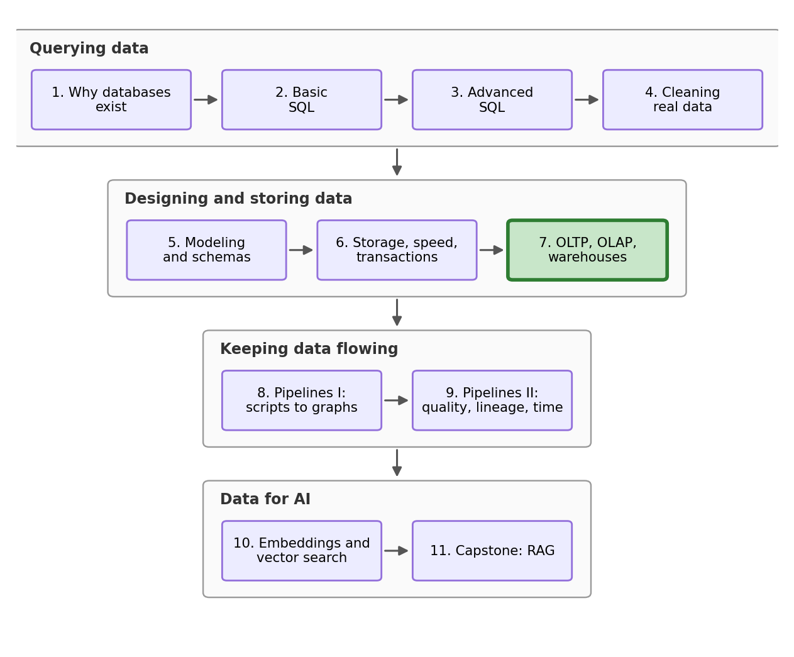
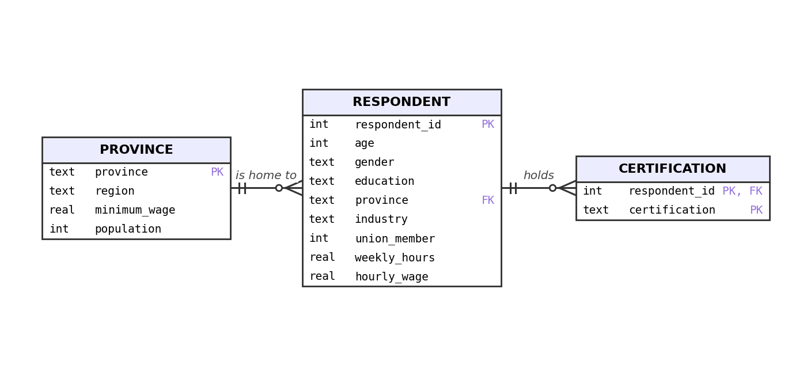
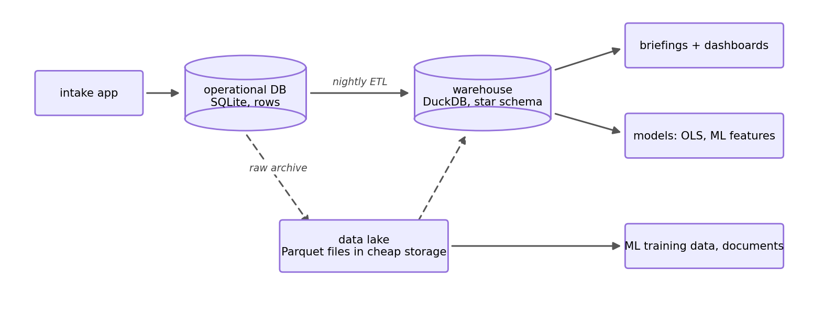

## Outline

### Prerequisites

- Notebook 6 of this stream: transactions, indexes, and row versus column storage.

### Learning Outcomes

By the end of this notebook you will be able to:

1. Explain **OLTP** and **OLAP** workloads, and why one database serves both poorly.
2. Design a **star schema**: a fact table at a set grain, with dimension tables around it.
3. Write an **ETL** script that moves data from the transactional system into the warehouse.
4. Pull a model-ready table from the warehouse, and check an OLS regression against the truths we built into the data.
5. Understand **warehouses** and **data lakes** against what we already learned, and say how ML systems feed from them.

## 1. Where we are in the stream

{fig-alt="Stream roadmap: four arcs, Querying data (NB1-4), Designing and storing data (NB5-7), Keeping data flowing (NB8-9), and Data for AI (NB10-11), with the current notebook highlighted." width=85%}

Wave 2 of our survey launched in September. The office has been extra busy since. The intake software has been writing interviews into Notebook 5's schema for months, the crash test and the index from Notebook 6 succeeded and saved us a couple of times, and everyone was happy for a while. Then two emails arrived on the same morning.

> **The freeze report, from the survey office.** "Since the research team got access, the intake app freezes for seconds at a time, always in the afternoon. Interviewers are sitting there watching a spinner while a respondent waits on the line. We think it's your colleagues' queries. Can they please stop?"

> **The plea, from the research lead.** "The office wants us off the live system, which is rich coming from them, because querying it is miserable anyway: every question takes three joins and over a second, and that is today, at a quarter million rows. We need somewhere to actually work. Can we have our own database?"

Both emails are right, and they are describing the same core issue, just from different perspectives. This notebook is about why the conflicting points are built directly into the architecture, and about the standard industry answer: give the analysts their own database, made specifically for reading, and copy the data across on a schedule.

## 2. Two kinds of questions

The survey intake app asks tiny questions constantly: save this response, show me this respondent's history. Each one reads only a handful of rows, needs every column of them, and must finish instantly without ever losing data. The research side asks enormous questions but far less frequently: average wage by region and month over two years. Each one touches every row in the database, needs two or three columns of them, and nobody minds if it takes a bit to run, as long as it does not take the intake down with it.

The industry names for these two workloads are **OLTP**, online transaction processing, and **OLAP**, online analytical processing. The same split appears everywhere data lives. For example a university's registration system is OLTP: thousands of students each writing one enrolment row that must never be lost or have an error. The dean's enrolment-trends report is OLAP: something like GPA averages for Economics over the last 20 years. A bank's card terminal is OLTP; its fraud-pattern analysis is OLAP.

|  | Transactional (OLTP) | Analytical (OLAP) |
|---|---|---|
| Who is asking | the intake app, hundreds of times an hour | a few analysts, a few times a day |
| A typical job | save one response, fetch one history | summarize two years of everything |
| Rows touched | a few | all of them |
| Columns touched | all of them | two or three |
| What good means | instant, and never loses a row | scans fast |

Notebook 5 taught that writers need normalization: one fact in one place, so an update cannot half-happen. Notebook 6 taught that readers want columns: scan only what the question names. Both lessons are correct, and in those lessons we showed different databases with different engines. One database cannot be both shapes at once.

## 3. Survey Wave 2

To show the issue and its fix, we need to remake the live system. So we simulate it: the wave 2 operational database, exactly as the intake software would have built it, with two new years of data. We take full advantage of being the simulator. The wages will not be random noise; we will write some economic concepts into them, education and union premiums, an age gradient, a wage trend, with values we choose. At the end of the notebook a regression gets to rediscover them, and because we placed the values into the data, we can accurately grade how well the regression did. 

```{python}
import os
import time
import sqlite3
import duckdb
import numpy as np
import pandas as pd
import statsmodels.formula.api as smf
import matplotlib.pyplot as plt
```

First, the lookup table, and it is Notebook 2's `provinces.csv` plus the Saskatchewan row that Notebook 5 discovered was missing, this time appended in `pandas` (`.loc[len(...)]` writes one new row onto the end of a dataframe):

```{python}
provinces_df = pd.read_csv("datasets/provinces.csv")
provinces_df.loc[len(provinces_df)] = ["Saskatchewan", "Prairies", 15.00, 1253569]
provinces_df
```

Now 60,000 respondents, generated with the same method as Notebook 6:

```{python}
rng = np.random.default_rng(42)
n_people = 60_000

respondents = pd.DataFrame({
    "respondent_id": np.arange(1, n_people + 1),
    "age": rng.integers(19, 66, n_people),
    "gender": rng.choice(["Woman", "Man", "Nonbinary"], n_people, p=[0.48, 0.48, 0.04]),
    "education": rng.choice(["High school", "College diploma", "Bachelor's degree", "Graduate degree"],
                            n_people, p=[0.30, 0.25, 0.30, 0.15]),
    "union_member": rng.integers(0, 2, n_people),
    "industry": rng.choice(["Construction", "Education", "Finance", "Health care", "Hospitality",
                            "Manufacturing", "Public administration", "Retail", "Technology"], n_people),
    "province": rng.choice(provinces_df["province"], n_people,
                           p=provinces_df["population"] / provinces_df["population"].sum()),
})
respondents.head()
```

And 250,000 interview responses over two years, where we add a wage formula. The constants at the top are the sample truths of this fictitious world: finishing college adds 10 log points to your wage, a bachelor's 25, a graduate degree 40, union membership 12, every year of age 0.4, and the whole labour market drifts up 3 percent a year. The dates are a fixed launch day plus `pd.to_timedelta` random days. This is the whole reason the stream simulates its data: the teaching requires knowing the truth. We know this world's truths because we wrote them, so the end of this notebook can check whether the warehouse gives them back. Real data comes with no answer key. Keep these numbers in mind; they come back at the end.

```{python}
# Below are the constants of our simulated world
EDUCATION_PREMIUM = {"High school": 0.00, "College diploma": 0.10, "Bachelor's degree": 0.25, "Graduate degree": 0.40}
UNION_PREMIUM = 0.12
AGE_PREMIUM = 0.004
ANNUAL_GROWTH = 0.03

n_resp = 250_000
responses = pd.DataFrame({
    "response_id": np.arange(1, n_resp + 1),
    "respondent_id": rng.integers(1, n_people + 1, n_resp),
    "interview_date": pd.Timestamp("2026-09-01") + pd.to_timedelta(rng.integers(0, 730, n_resp), unit="D"),
    "weekly_hours": rng.normal(37, 6, n_resp).clip(5, 80).round(1),
})

traits = responses.merge(respondents, on="respondent_id")
years_in = (traits["interview_date"] - pd.Timestamp("2026-09-01")).dt.days / 365

log_wage = (3.2
            + traits["education"].map(EDUCATION_PREMIUM)
            + UNION_PREMIUM * traits["union_member"]
            + AGE_PREMIUM * traits["age"]
            + ANNUAL_GROWTH * years_in
            + rng.normal(0, 0.25, n_resp))

responses["hourly_wage"] = np.exp(log_wage).clip(17.40, None).round(2)
print(f"mean wage = {responses['hourly_wage'].mean():.2f}")
```

A mean wage of 39.00, similar to every accurate wage this stream has produced. The wage was *produced* by education, union status and age, but the response table does not *store* those columns. They live once, on the respondent. That is Notebook 5's normalization working correctly, and it is also exactly why the analysts will need joins.

The office built the intake database on Notebook 5's design, so we recreate it faithfully: keys, constraints, `STRICT`, Notebook 5's foreign-key pragma for the connection, and Notebook 6's index on the column the app searches all day. In the next cell we re-create the schema. 

```{python}
op = sqlite3.connect("datasets/wage_wave2.db")
op.execute("PRAGMA foreign_keys = ON")

op.execute("DROP TABLE IF EXISTS response")
op.execute("DROP TABLE IF EXISTS respondent")
op.execute("DROP TABLE IF EXISTS province")
op.execute("""CREATE TABLE province (
    province      TEXT    PRIMARY KEY,
    region        TEXT    NOT NULL,
    minimum_wage  REAL    NOT NULL CHECK (minimum_wage > 0),
    population    INTEGER NOT NULL CHECK (population > 0)) STRICT""")
op.execute("""CREATE TABLE respondent (
    respondent_id INTEGER PRIMARY KEY,
    age           INTEGER NOT NULL CHECK (age BETWEEN 15 AND 100),
    gender        TEXT    NOT NULL,
    education     TEXT    NOT NULL,
    union_member  INTEGER NOT NULL CHECK (union_member IN (0, 1)),
    industry      TEXT    NOT NULL,
    province      TEXT    NOT NULL REFERENCES province(province)) STRICT""")
op.execute("""CREATE TABLE response (
    response_id   INTEGER PRIMARY KEY,
    respondent_id INTEGER NOT NULL REFERENCES respondent(respondent_id),
    interview_date TEXT   NOT NULL,
    weekly_hours  REAL    NOT NULL CHECK (weekly_hours BETWEEN 0 AND 100),
    hourly_wage   REAL    NOT NULL CHECK (hourly_wage > 0)) STRICT""")
op.execute("CREATE INDEX idx_response_respondent ON response(respondent_id)")
```

Here we place the data into the database which has the schema. 

```{python}
provinces_df.to_sql("province", op, index=False, if_exists="append")
respondents.to_sql("respondent", op, index=False, if_exists="append")

for_op = responses.copy()
for_op["interview_date"] = for_op["interview_date"].dt.strftime("%Y-%m-%d")
for_op.to_sql("response", op, index=False, if_exists="append")

pd.read_sql("""SELECT (SELECT COUNT(*) FROM province) AS provinces,
                      (SELECT COUNT(*) FROM respondent) AS respondents,
                      (SELECT COUNT(*) FROM response) AS responses""", op)
```

6 provinces, 60,000 respondents, 250,000 responses. Watch the system do the job it was designed for. Respondent 55585 is the simulation's most common participant, with a whole 15 interviews:

```{python}
start = time.perf_counter()
history = pd.read_sql("SELECT * FROM response WHERE respondent_id = 55585", op)
print(f"{1000 * (time.perf_counter() - start):.1f} ms to fetch {len(history)} rows")
```

About a millisecond, thanks to the index. Writes are just as comfortable. The `intake` connection below stands in for the intake software itself, autocommitting like Notebook 6's manual connection so each saved response never gets deleted, and with one new setting: `timeout=0.5` tells it to give up after half a second of waiting instead of the default five, which will matter shortly.

```{python}
intake = sqlite3.connect("datasets/wage_wave2.db", isolation_level=None, timeout=0.5)
intake.execute("PRAGMA foreign_keys = ON")

start = time.perf_counter()
intake.execute("INSERT INTO response VALUES (300000, 12345, '2028-09-01', 38.0, 41.50)")
print(f"one response saved in {1000 * (time.perf_counter() - start):.1f} ms")
intake.execute("DELETE FROM response WHERE response_id = 300000")
```

Milliseconds to read, milliseconds to write. As an OLTP system, this database is excellent. We have half of our solution fixed (at least so it seems), the survey workers are happy for now. Now we add the analysts.

## 4. Analysts

Here is the research team's most common question, the regional briefing from Notebook 2 has expanded a bit since we worked on it (as most projects do): wages, response counts and union shares, by region and month, pulled from everything. On the operational schema this question costs three tables and two joins, because the facts it needs are normalized apart, this is expected but let's see how long it takes:

```{python}
briefing = """SELECT p.region, strftime('%Y-%m', x.interview_date) AS month,
                     COUNT(*) AS responses,
                     ROUND(AVG(x.hourly_wage), 2) AS avg_wage,
                     ROUND(AVG(r.union_member), 3) AS union_share
              FROM response AS x
              JOIN respondent AS r ON x.respondent_id = r.respondent_id
              JOIN province AS p ON r.province = p.province
              GROUP BY p.region, month
              ORDER BY month, p.region"""

start = time.perf_counter()
briefing_table = pd.read_sql(briefing, op)
print(f"{time.perf_counter() - start:.1f} s for {len(briefing_table)} rows")
briefing_table.head(3)
```

Over a second, for one question, and the research lead runs dozens a day on a table that doubles every two years (many proper databases are far larger so imagine if this took a few minutes to run). Annoying for the analyst; now watch what it does to everyone else. We play both sides at once. The analyst starts the big read and gets partway through it: `.execute` on a connection hands back a **cursor**, an object that walks the results one row at a time, and `.fetchone()` takes a single row and then stops, mid-scan, like an analyst whose laptop is chewing through results:

```{python}
analyst = sqlite3.connect("datasets/wage_wave2.db")
cursor = analyst.execute("SELECT * FROM response")
cursor.fetchone()
```

> **Predict first.** The analyst's query is now mid-scan, holding the database's read lock. At this exact moment, an interviewer finishes a call and the intake app tries to save the response. What happens?

```{python}
#| error: true
intake.execute("INSERT INTO response VALUES (300001, 12345, '2028-09-01', 38.0, 41.50)")
```

`database is locked`. Notebook 6 taught that only one connection may write at a time; this is the worst case scenario. While a reader is inside the file, SQLite will not let a writer commit, so the intake app waited its half-second and gave up, with a respondent on the line. The freeze ends the moment the analyst's query finishes:

```{python}
cursor.fetchall()

start = time.perf_counter()
intake.execute("INSERT INTO response VALUES (300001, 12345, '2028-09-01', 38.0, 41.50)")
print(f"saved in {1000 * (time.perf_counter() - start):.1f} ms once the analyst finished")
intake.execute("DELETE FROM response WHERE response_id = 300001")
```

We reproduced the office's afternoon freezes and the issue behind them. Before anyone emails "just use a bigger database": which on paper seems like a fair response. We could just throw more compute at it and hopefully it goes away. SQLite has a mode that lets readers and writers coexist, and client-server systems like PostgreSQL handle concurrency far more gracefully. But no setting removes the deeper conflicts. The analyst's scan still competes for the same disk, memory and cache the intake needs. The analyst still pays two joins for every question, because the data is shaped for writers. And every analyst with production access is one `UPDATE` without a `WHERE` away from being a common error from Notebook 3 (and a very awkward email). The workloads want different shapes, different engines. So we give them exactly that.

## 5. The warehouse and the star

The analysts' own database has a name: a **data warehouse**, a second database that exists only to be read, rebuilt from the operational system based off of scheduled updates. Nobody edits it by hand (Notebook 5). The warehouse is allowed to copy facts around for reading speed, which is called **denormalization**, and doing it produces the most widely used design in analytics: the **star schema**.

A star schema sorts every column possible into one of two piles. The **fact table** sits in the middle and holds measurements, the numbers you aggregate: wages, hours, one row per event. **Dimension tables** sit around it and hold descriptions, the words you group by: who, where, when (people, countries, time, postal codes). Every analytical question in this stream has had the same skeleton, a number summarized by some words (wage by province), and the star is that skeleton: words become just one join away.

{fig-alt="Entity relationship diagram of PROVINCE, RESPONDENT, and CERTIFICATION with every column, type, and key labelled." width=95%}

Two of these tables you can recognize: `dim_respondent` is the respondent table from before, and `dim_province` is the lookup table that we have been using since Notebook 2. `dim_date` is the new warehouse idea: the calendar is data too. Storing every date's year, month and quarter once, in a table, means no query ever computes `strftime` again; time becomes something you join to, and "by month" or "by quarter" becomes a `GROUP BY` on a ready-made column.

::: {.callout-important}
## A fact table states its grain

The first sentence of any warehouse design is the fact table's grain: here, **one row per interview response**. Every measure in the table must be true at that grain, and every question answered from it inherits that grain. In notebook 2 we once averaged wages at the wrong grain, and Notebook 3 showed the gap this led to (45 cents), all without an error message; a star schema in a warehouse makes that mistake difficult to make, because the grain is not a convention someone remembers, it is the published shape of the central table.
:::

The fact table also shows off denormalization: it carries `province` even though the operational schema stores province on the respondent, so that a by-region question does not have to route through `dim_respondent`. And it carries `full_time`, a variable representing Notebook 2's 30-hour StatCan line, precomputed once instead of re-derived inside every analyst's `CASE` expression forever.

## 6. ETL: The Connection

We need something to build all that from the current live system, and that something has a name you will see in almost every data job posting: **ETL**, extract, transform, load. **Extract** copies the raw tables out of the operational database, one pass, ideally at 3 a.m. when the intake system is asleep. **Transform** reshapes them into the star: joins, derived columns, renames, exactly the kind of work Notebooks 3 and 4 did, now standardized and scheduled. **Load** writes the result into the warehouse. Here is each of those steps.

Extract:

```{python}
raw_responses = pd.read_sql("SELECT * FROM response", op)
raw_respondents = pd.read_sql("SELECT * FROM respondent", op)
raw_provinces = pd.read_sql("SELECT * FROM province", op)

print(f"extracted {len(raw_responses):,} responses, {len(raw_respondents):,} respondents, {len(raw_provinces)} provinces")
```

Transform. `pd.to_datetime` turns the stored ISO text back into real dates so the `.dt` accessor can pull years, months and quarters out of them; the merge stamps each response with its respondent's province; and the comparison builds the full-time dummy variable:

```{python}
raw_responses["interview_date"] = pd.to_datetime(raw_responses["interview_date"])

fact = raw_responses.merge(raw_respondents[["respondent_id", "province"]], on="respondent_id")
fact["full_time"] = (fact["weekly_hours"] >= 30).astype(int)          # Notebook 2's 30-hour line; built as a 0/1 dummy variable
fact["date"] = fact["interview_date"].dt.strftime("%Y-%m-%d")
fact_response = fact[["response_id", "respondent_id", "province", "date",
                      "full_time", "weekly_hours", "hourly_wage"]]

dim_respondent = raw_respondents                                      # one row per person: already a dimension
dim_province = raw_provinces

dim_date = pd.DataFrame({"date": sorted(fact["date"].unique())})      # the calendar, stored once
dates = pd.to_datetime(dim_date["date"])
dim_date["year"] = dates.dt.year
dim_date["month"] = dates.dt.month
dim_date["year_month"] = dates.dt.strftime("%Y-%m")
dim_date["quarter"] = dates.dt.quarter
```

Load, into the engine Notebook 6 taught for this workload. Handing `duckdb.connect` a filename gives the warehouse permanent space on disk, the same way SQLite files work, and `CREATE OR REPLACE TABLE` is `CREATE TABLE` that overwrites any previous version, so tonight's run replaces last night's:

```{python}
warehouse = duckdb.connect("datasets/wage_warehouse.duckdb")
warehouse.execute("CREATE OR REPLACE TABLE fact_response AS SELECT * FROM fact_response")
warehouse.execute("CREATE OR REPLACE TABLE dim_respondent AS SELECT * FROM dim_respondent")
warehouse.execute("CREATE OR REPLACE TABLE dim_province AS SELECT * FROM dim_province")
warehouse.execute("CREATE OR REPLACE TABLE dim_date AS SELECT * FROM dim_date")

warehouse.execute("""SELECT (SELECT COUNT(*) FROM fact_response) AS facts,
                            (SELECT COUNT(*) FROM dim_respondent) AS respondents,
                            (SELECT COUNT(*) FROM dim_province) AS provinces,
                            (SELECT COUNT(*) FROM dim_date) AS dates""").df()
```

A quarter million facts, three dimensions around them, and the whole warehouse file is about 2 MB against the operational database's 16, due to column compression. Notebook 4 ended by pointing out that its cleaning script was already a pipeline; this is a second one, and it currently has one serious flaw we are choosing to ignore. It runs when we run it, and it assumes it always finishes. What happens when a scheduled ETL dies halfway through is the opening example of our next notebook.

## 7. Analytics, unblocked

Let's now compare the analyst's perspective on this new warehouse model with the star schema:

```{python}
star_briefing = """SELECT p.region, d.year_month,
                          COUNT(*) AS responses,
                          ROUND(AVG(f.hourly_wage), 2) AS avg_wage,
                          ROUND(AVG(r.union_member), 3) AS union_share
                   FROM fact_response AS f
                   JOIN dim_respondent AS r ON f.respondent_id = r.respondent_id
                   JOIN dim_province AS p ON f.province = p.province
                   JOIN dim_date AS d ON f.date = d.date
                   GROUP BY p.region, d.year_month
                   ORDER BY d.year_month, p.region"""

start = time.perf_counter()
star_table = warehouse.execute(star_briefing).df()
print(f"{1000 * (time.perf_counter() - start):.0f} ms for {len(star_table)} rows")
star_table.head(3)
```

Tens of milliseconds, tens of times faster here, the same 72 rows with the same numbers. And notice the two less flashy improvements. The query joins to purpose-built tables where month and region are ready-made columns rather than expressions, and it runs on a machine the intake app has never heard of. The analysts can work on this warehouse as much as they want and nobody from the survey department is affected.

## 8. The warehouse feeds the model

The last stop for most warehouse data is not a chart; it is a model. Every regression you have run in an econometrics course started from a table that looked suspiciously clean, one row per observation, outcome and regressors side by side. That table is a warehouse product, and now we can manufacture it ourselves: one star query, with Notebook 2's `CASE` building the dummy variables on the way out.

```{python}
model_data = warehouse.execute("""
    SELECT f.hourly_wage, r.age, r.union_member,
           CASE WHEN r.education = 'College diploma' THEN 1 ELSE 0 END AS college,
           CASE WHEN r.education = 'Bachelor''s degree' THEN 1 ELSE 0 END AS bachelor,
           CASE WHEN r.education = 'Graduate degree' THEN 1 ELSE 0 END AS graduate
    FROM fact_response AS f
    JOIN dim_respondent AS r ON f.respondent_id = r.respondent_id""").df()

model_data["log_wage"] = np.log(model_data["hourly_wage"])
model_data.head(3)
```

A quarter million rows, model-ready. `statsmodels` is Python's standard econometrics library, the one behind most regression output you have seen in COMET, and its formula interface reads like R: outcome on the left of the `~`, regressors on the right. We will run a regression on log_wage with regressors for whether the person has a college, bachelor's, or graduate degree, whether they are a union member, and their age. 

```{python}
fit = smf.ols("log_wage ~ college + bachelor + graduate + union_member + age", data=model_data).fit()

comparison = pd.DataFrame({
    "built_in": {"college": 0.10, "bachelor": 0.25, "graduate": 0.40, "union_member": 0.12, "age": 0.004},
    "estimated": fit.params.round(4),
}).reindex(["college", "bachelor", "graduate", "union_member", "age"])
comparison
```

We wrote a 0.10 college premium into the world; the regression, seeing only the warehouse, reports 0.0981. Bachelor's: 0.25 built in, 0.2482 found. Graduate: 0.40 and 0.3969. Union: 0.12 and 0.1202. Age: 0.004 and 0.0040. The intake system collected the facts, the ETL shaped them, the warehouse served them, and the model at the end recovered the true values from our fake world. When the numbers are real instead of simulated, there are lots more resources to read like the [Causal ML stream](https://ubcecon.github.io/praxis-ubc/docs/Causal_ML/notebook_01_prediction_inference_causality.html) which begins exactly where this regression stops, with the question of when a coefficient like 0.12 should have a causal reading.

## 9. Warehouses, lakes, and ML

If we take a step back from our two small files and made up example of a survey company, you will see that we are looking at the standard architecture of nearly every proper data-serious organization:

{fig-alt="The intake app writes to the operational SQLite database; a nightly ETL loads the DuckDB warehouse, a raw archive feeds the Parquet data lake, and the warehouse and lake feed briefings, models, and ML training data."}

The one box we have not built is the **lake**, and Notebook 6 already gave us its entire technology: Parquet files in cheap storage, queryable where they lie. A warehouse is curated, star-shaped, and answers known questions fast. A lake is the opposite: keep everything raw and cheap, including data nobody has a schema for yet, logs, documents, images, and impose structure later, when a question finally arrives. Archiving tonight's raw response extract to the lake, before any of our transforms touched it, is one line:

```{python}
raw_responses.to_parquet("datasets/response_archive.parquet")

warehouse.execute("SELECT COUNT(*) AS rows_in_the_lake FROM 'datasets/response_archive.parquet'").df()
```

Machine learning eats from both sides of this diagram. The features behind a production fraud or churn model are warehouse queries, aggregates per customer, refreshed on a schedule; teams industrialize this with tools called feature stores, and underneath the branding they are ETL into fact tables. The training corpus of a large language model is the lake pattern at a huge, hard to even imagine, scale. Crawled documents in cheap storage, filtered and deduplicated by pipelines. And the RAG capstone this stream ends with is a small lake of documents, an ETL that chunks and embeds them, and a retrieval query, which is why Notebooks 10 and 11 will feel less like new material than like this notebook just tailored to AI.

## 10. Conclusion

Two emails solved by one architecture and we are done for the day. The intake system keeps its normalized rows, its transactions and its index, and never sees an analyst again. The analysts get a warehouse: a star schema in a columnar engine, rebuilt nightly by thirty lines of ETL.

The unresolved thread is the word "nightly". Our ETL ran because we ran it, top to bottom, and it worked because nothing went wrong. Real pipelines run unattended, at 3 a.m., on data that arrives broken, on machines that may die mid-way through. Making that safely function is the entire third arc of this stream, and it starts with Notebook 8 doing to our ETL what Notebook 6 did to the database: killing it halfway through, on purpose, and seeing what happens. 

::: {.callout-note}
## You can now answer these interview questions

- What is the difference between OLTP and OLAP, and why not serve both from one database?
- What is a star schema? What belongs in the fact table, and what makes a good dimension?
- What is ETL, and what kind of work belongs in the transform step?
- What is the difference between a data warehouse and a data lake?

<details><summary>Show / hide model answers</summary>

- OLTP is many tiny reads and writes that must be instant and never lose data; OLAP is few enormous read-only scans. They want different table shapes (normalized rows versus denormalized columns), different engines, and isolation from each other, so organizations run an operational database for the first and a warehouse for the second, connected by ETL.
- A denormalized design for analytics: a central fact table holding measures at one declared grain, joined to dimension tables holding the descriptive attributes you filter and group by.
- Extract copies data out of source systems, transform reshapes it (joins, derived columns, cleaning, conforming types), load writes it into the warehouse. The transform step owns every derivation that analysts would otherwise each redo: flags, calendar attributes, standardized categories.
- A warehouse holds curated, schema-shaped tables built to answer known questions fast. A lake holds raw files, cheap and often without a schema, kept because storage is usually cheap; structure gets imposed at read time, when a new question arrives.

</details>
:::

## Appendix: the modern database landscape

Everything in this stream runs on two in-process engines, chosen so that nothing stands between you and the ideas. The same ideas ship under many other names, and you now know what each of them mean:

| Engine | What it is | Where you will meet it |
|---|---|---|
| SQLite | in-process OLTP, one file | phones, browsers, apps, this stream |
| PostgreSQL | client-server OLTP, open source | the default backend of the modern web |
| MySQL / MariaDB | client-server OLTP, open source | older web stacks, WordPress, legacy systems |
| SQL Server / Oracle | client-server OLTP, commercial | corporate and government back offices |
| DuckDB | in-process OLAP, one file | laptops-as-warehouses, this stream |
| ClickHouse | client-server OLAP, open source | self-hosted analytics at scale |
| BigQuery, Redshift, Snowflake | cloud warehouses | the rented version of Notebook 7 |
| Databricks | cloud lakehouse | warehouse tooling on top of a Parquet lake |

Two notes for the day a job hands you credentials to one of these. First, you connect with a connection string, and its password belongs in an environment variable, never typed into code, the same separation-of-code-and-data instinct as Notebook 3's `?` placeholders. Second, BigQuery's on-demand pricing bills by bytes scanned, which converts Notebook 6's lesson into money: `SELECT *` over a petabyte-scale table is a real invoice. Snowflake and provisioned Redshift bill by compute time instead, but scanning fewer columns still means less I/O and a shorter, cheaper run, so naming your columns is no longer just clean code, it saves money everywhere.

## Connections

- **Back to [Notebook 5](notebook_05_designing_data.qmd) and [Notebook 6](notebook_06_storage_speed_transactions.qmd):** normalization protects the writers, columns serve the readers, and this notebook stopped choosing between them by running both, with ETL as the bridge.
- **Forward to [Notebook 8](notebook_08_pipelines_one.qmd):** our ETL ran perfectly because we babysat it and watched. Next, it runs unattended, dies halfway through, and double-counts everything on the retry, which is how idempotency, incremental loads and pipelines-as-graphs enter the stream.

### References

- Codd, E. F., Codd, S. B., & Salley, C. T. (1993). *Providing OLAP to user-analysts: An IT mandate.* Codd & Associates. The white paper that coined OLAP, by the same Codd as Notebook 5's relational model.
- Kimball, R., & Ross, M. (2013). *The Data Warehouse Toolkit* (3rd ed.). Wiley. The book behind facts, dimensions, grain, and every star schema in industry.
- Kleppmann, M. (2017). *Designing Data-Intensive Applications.* O'Reilly. Chapter 3's second half is the OLTP/OLAP split and column storage.
- Armbrust, M., Ghodsi, A., Xin, R., & Zaharia, M. (2021). *Lakehouse: A new generation of open platforms that unify data warehousing and advanced analytics.* CIDR. Where the warehouse and lake stories are heading.
- Seabold, S., & Perktold, J. (2010). *statsmodels: Econometric and statistical modeling with Python.* Proceedings of the 9th Python in Science Conference. Section 8's regression library.
- DataTalksClub. *Data engineering zoomcamp.* https://github.com/DataTalksClub/data-engineering-zoomcamp A free, full course on the tools this notebook builds by hand.

---
