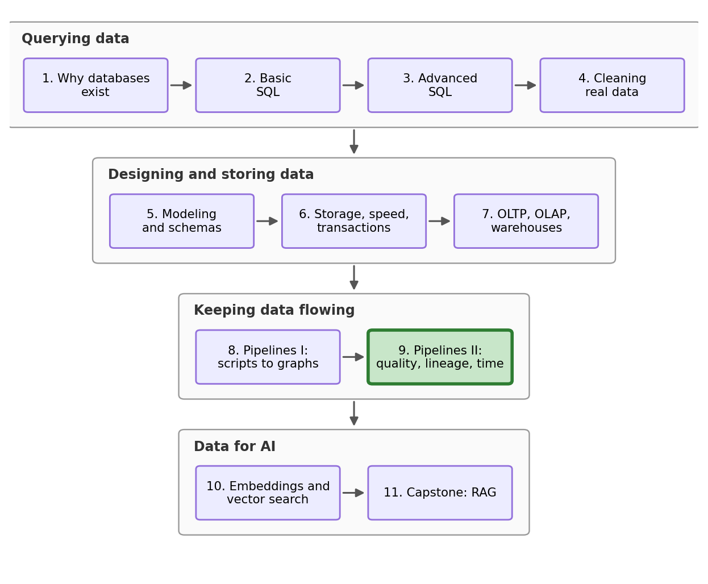

## Outline

### Prerequisites

- Notebook 8 of this stream: idempotent loads, incremental extracts, the task functions, and the `run_pipeline` executor.

### Learning Outcomes

By the end of this notebook you will be able to:

1. Explain how a pipeline can show no errors while its data is wrong, and why "succeeded" and "correct" are different.
2. Write data-quality checks (volume, nulls, schema, ranges) in SQL and add them into a DAG as a **validate** task that stops bad batches.
3. Use `nx.ancestors` and `nx.descendants` to read **lineage** off a pipeline graph, compute the blast radius of a bad batch, and re-run only what was poisoned.
4. Explain the **logical date**: why a run is *for* a slice of time, no matter when it executes.
5. Describe a scheduler as a loop, a clock, and state, and run a safe **backfill**.

## 1. Where we are in the stream

{fig-alt="Stream roadmap: four arcs, Querying data (NB1-4), Designing and storing data (NB5-7), Keeping data flowing (NB8-9), and Data for AI (NB10-11), with the current notebook highlighted." width=85%}

Notebook 8 changed our scripts into a proper data pipeline which is idempotent, incremental, logged, and run by an executor that refuses cycles and contains failures. Every improvement we built works against one type of issue, the job that *fails*. This notebook is about a deeper issue: the job that succeeds on broken data.

> **The reply-all, Monday 9:04 a.m.** "The November report says the average wage is over four thousand dollars an hour. October says forty. I pulled Friday's pipeline log: every task says success, no retries, nothing skipped. So the pipeline is fine and the data is insane. Explain how both of those can be true, and fix it."

We will write checks that find bad data, lineage that tells us exactly what a bad batch touched, and finally time itself, because a pipeline that can safely re-run any month of its own past is a pipeline that can heal.

## 2. Everything Notebook 8 built, in four cells

We rebuild the world as Notebook 8 left it: the simulated wage survey with its built-in truths, the SQLite intake system, the DuckDB warehouse loaded through October 2028, and the pipeline itself. If any of this feels unfamiliar, revisit Notebooks 7 and 8; nothing in these four cells is new except two small changes we flag below. Do not focus too much on the code syntax itself in these cells; this is done so these notebooks can be run independently. The concepts below them are what really matters. 

```{python}
#Import our libraries
import sqlite3
from datetime import datetime
import duckdb
import networkx as nx
import numpy as np
import pandas as pd
import matplotlib.pyplot as plt
```

First our simulated world. `simulate_month` is Notebook 8's generator and we load all of it into one dataframe. 

```{python}
rng = np.random.default_rng(42)
EDUCATION_PREMIUM = {"High school": 0.00, "College diploma": 0.10, "Bachelor's degree": 0.25, "Graduate degree": 0.40}
UNION_PREMIUM, AGE_PREMIUM, ANNUAL_GROWTH = 0.12, 0.004, 0.03

provinces_df = pd.read_csv("datasets/provinces.csv")
provinces_df.loc[len(provinces_df)] = ["Saskatchewan", "Prairies", 15.00, 1253569]

n_people = 60_000
respondents = pd.DataFrame({
    "respondent_id": np.arange(1, n_people + 1),
    "age": rng.integers(19, 66, n_people),
    "gender": rng.choice(["Woman", "Man", "Nonbinary"], n_people, p=[0.48, 0.48, 0.04]),
    "education": rng.choice(["High school", "College diploma", "Bachelor's degree", "Graduate degree"],
                            n_people, p=[0.30, 0.25, 0.30, 0.15]),
    "union_member": rng.integers(0, 2, n_people),
    "industry": rng.choice(["Construction", "Education", "Finance", "Health care", "Hospitality",
                            "Manufacturing", "Public administration", "Retail", "Technology"], n_people),
    "province": rng.choice(provinces_df["province"], n_people,
                           p=provinces_df["population"] / provinces_df["population"].sum()),
})

def simulate_month(first_day, days_in_month, first_id, n):
    batch = pd.DataFrame({
        "response_id": np.arange(first_id, first_id + n),
        "respondent_id": rng.integers(1, n_people + 1, n),
        "interview_date": pd.Timestamp(first_day) + pd.to_timedelta(rng.integers(0, days_in_month, n), unit="D"),
        "weekly_hours": rng.normal(37, 6, n).clip(5, 80).round(1),
    })
    traits = batch.merge(respondents, on="respondent_id")
    years_in = (traits["interview_date"] - pd.Timestamp("2026-09-01")).dt.days / 365
    log_wage = (3.2 + traits["education"].map(EDUCATION_PREMIUM) + UNION_PREMIUM * traits["union_member"]
                + AGE_PREMIUM * traits["age"] + ANNUAL_GROWTH * years_in + rng.normal(0, 0.25, n))
    batch["hourly_wage"] = np.exp(log_wage).clip(17.40, None).round(2)
    batch["interview_date"] = batch["interview_date"].dt.strftime("%Y-%m-%d")
    return batch

history = simulate_month("2026-09-01", 730, 1, 250_000)
september = simulate_month("2028-09-01", 30, 250_001, 10_400)
october = simulate_month("2028-10-01", 31, 260_401, 10_400)
loaded = pd.concat([history, september, october], ignore_index=True)

print(f"responses so far: {len(loaded)}")
print(f"mean wage = {loaded['hourly_wage'].mean():.2f}")
```

270,800 responses with a mean wage of 39.08, exactly where Notebook 8 left us. Now both systems: the intake database on Notebook 5's strict schema, and the warehouse star with the fact table loaded through October.

```{python}
op = sqlite3.connect("datasets/wage_wave2.db")
op.execute("PRAGMA foreign_keys = ON")
op.execute("DROP TABLE IF EXISTS response")
op.execute("DROP TABLE IF EXISTS respondent")
op.execute("DROP TABLE IF EXISTS province")
op.execute("""CREATE TABLE province (province TEXT PRIMARY KEY, region TEXT NOT NULL,
    minimum_wage REAL NOT NULL CHECK (minimum_wage > 0), population INTEGER NOT NULL CHECK (population > 0)) STRICT""")
op.execute("""CREATE TABLE respondent (respondent_id INTEGER PRIMARY KEY,
    age INTEGER NOT NULL CHECK (age BETWEEN 15 AND 100), gender TEXT NOT NULL, education TEXT NOT NULL,
    union_member INTEGER NOT NULL CHECK (union_member IN (0, 1)), industry TEXT NOT NULL,
    province TEXT NOT NULL REFERENCES province(province)) STRICT""")
op.execute("""CREATE TABLE response (response_id INTEGER PRIMARY KEY,
    respondent_id INTEGER NOT NULL REFERENCES respondent(respondent_id), interview_date TEXT NOT NULL,
    weekly_hours REAL NOT NULL CHECK (weekly_hours BETWEEN 0 AND 100),
    hourly_wage REAL NOT NULL CHECK (hourly_wage > 0)) STRICT""")
op.execute("CREATE INDEX idx_response_respondent ON response(respondent_id)")
provinces_df.to_sql("province", op, index=False, if_exists="append")
respondents.to_sql("respondent", op, index=False, if_exists="append")
loaded.to_sql("response", op, index=False, if_exists="append")

warehouse = duckdb.connect("datasets/wage_warehouse.duckdb")

people = pd.read_sql("SELECT * FROM respondent", op)
first_fact = loaded.merge(people[["respondent_id", "province"]], on="respondent_id")
first_fact["full_time"] = (first_fact["weekly_hours"] >= 30).astype(int)
first_fact = first_fact.rename(columns={"interview_date": "date"})[
    ["response_id", "respondent_id", "province", "date", "full_time", "weekly_hours", "hourly_wage"]]

calendar = pd.DataFrame({"date": pd.date_range("2026-09-01", "2028-12-31").strftime("%Y-%m-%d")})
days = pd.to_datetime(calendar["date"])
calendar["year"] = days.dt.year
calendar["month"] = days.dt.month
calendar["year_month"] = days.dt.strftime("%Y-%m")
calendar["quarter"] = days.dt.quarter

warehouse.execute("CREATE OR REPLACE TABLE fact_response AS SELECT * FROM first_fact")
warehouse.execute("CREATE OR REPLACE TABLE dim_respondent AS SELECT * FROM people")
warehouse.execute("CREATE OR REPLACE TABLE dim_province AS SELECT * FROM provinces_df")
warehouse.execute("CREATE OR REPLACE TABLE dim_date AS SELECT * FROM calendar")
warehouse.execute("""CREATE OR REPLACE TABLE monthly_report AS
    SELECT d.year_month, COUNT(*) AS responses, ROUND(AVG(f.hourly_wage), 2) AS avg_wage
    FROM fact_response AS f JOIN dim_date AS d ON f.date = d.date
    GROUP BY d.year_month ORDER BY d.year_month""")

warehouse.execute("SELECT * FROM monthly_report ORDER BY year_month DESC LIMIT 3").df()
```

October has a mean wage of 40.27, September 40.11, and August 40.05. The warehouse is healthy and the wages drift up on the trend we built in, perfect. Next, the task functions, with the two changes. First, the big one: Notebook 8's extract used a watermark system which has a flaw. A watermark only moves forward, so a row that arrives late, or gets corrected, behind the watermark is invisible forever. From tonight onwards, the extract pulls one whole month, the month named in the `run_month` variable, and re-pulling a month is safe because the load is idempotent. Second, the transform now pins `full_time` to the same type the fact table uses.

```{python}
def log(message):
    print(f"[{datetime.now().strftime('%H:%M:%S')}] {message}")

run_month = ["2028-10"]          #Run-month variable, replaces NB8's watermark

def extract_responses():
    month = run_month[0]
    pulled = pd.read_sql("SELECT * FROM response WHERE interview_date LIKE ?", op, params=(month + "%",))
    warehouse.execute("CREATE OR REPLACE TABLE staging_responses AS SELECT * FROM pulled")
    log(f"extract_responses: {len(pulled)} rows for {month}")

def extract_respondents():
    people_now = pd.read_sql("SELECT * FROM respondent", op)
    warehouse.execute("CREATE OR REPLACE TABLE staging_respondents AS SELECT * FROM people_now")
    log(f"extract_respondents: {len(people_now)} rows")

def archive_raw():
    batch = warehouse.execute("SELECT * FROM staging_responses").df()
    if len(batch) == 0:
        log("archive_raw: nothing new to archive")
        return
    month = batch["interview_date"].min()[:7]
    batch.to_parquet(f"datasets/archive_{month}.parquet")
    log(f"archive_raw: {len(batch)} rows to the lake ({month})")

def transform():
    warehouse.execute("""CREATE OR REPLACE TABLE staging_fact AS
        SELECT s.response_id, s.respondent_id, r.province,
               CAST(s.interview_date AS VARCHAR) AS date,          -- pin the types, even on an empty night
               CAST(CASE WHEN s.weekly_hours >= 30 THEN 1 ELSE 0 END AS BIGINT) AS full_time,
               s.weekly_hours, s.hourly_wage
        FROM staging_responses AS s
        JOIN staging_respondents AS r ON s.respondent_id = r.respondent_id""")
    log("transform: staging_fact rebuilt")

def load():
    warehouse.execute("""DELETE FROM fact_response WHERE substr(date, 1, 7) IN
                         (SELECT DISTINCT substr(date, 1, 7) FROM staging_fact)""")
    warehouse.execute("INSERT INTO fact_response SELECT * FROM staging_fact")
    log("load: fact_response up to date")

def report():
    warehouse.execute("""CREATE OR REPLACE TABLE monthly_report AS
        SELECT d.year_month, COUNT(*) AS responses, ROUND(AVG(f.hourly_wage), 2) AS avg_wage
        FROM fact_response AS f JOIN dim_date AS d ON f.date = d.date
        GROUP BY d.year_month ORDER BY d.year_month""")
    log("report: monthly_report refreshed")
```

And the graph plus its executor, copied from Notebook 8 without any changes.

```{python}
pipeline = nx.DiGraph()
pipeline.add_edges_from([
    ("extract_responses", "transform"),
    ("extract_respondents", "transform"),
    ("extract_responses", "archive_raw"),
    ("transform", "load"),
    ("load", "report"),
])

def run_pipeline(graph, tasks):
    if not nx.is_directed_acyclic_graph(graph):
        raise ValueError("this graph has a cycle: no run order exists")
    finished, failed, skipped = [], [], []
    for name in nx.topological_sort(graph):
        blocked = [task for task in graph.predecessors(name) if task in failed or task in skipped]
        if blocked:
            skipped.append(name)
            log(f"SKIP {name} (upstream trouble: {blocked[0]})")
            continue
        try:
            tasks[name]()
            finished.append(name)
        except Exception as error:
            failed.append(name)
            log(f"FAIL {name}: {error}")
    return finished, failed, skipped

tasks = {"extract_responses": extract_responses, "extract_respondents": extract_respondents,
         "archive_raw": archive_raw, "transform": transform, "load": load, "report": report}

print("one possible valid order:", list(nx.topological_sort(pipeline)))
```

We are all caught up and can continue into the new content.

## 3. The pipeline succeeded, but the outcome is very wrong

On November 1, the survey office shipped version 2 of its intake app. The release notes were just three bullet points, and one of them said: *"wages are now stored in cents, following standard practice for money fields."* Storing money as integer cents is standard practice; it avoids decimal rounding bugs. The issue is that nobody updated the pipeline.

We play the app upgrade ourselves: generate a normal November, multiply its wages by one hundred, and let it flow into the intake system, which is what happened all month.

```{python}
november = simulate_month("2028-11-01", 30, 270_801, 10_400)
november["hourly_wage"] = (november["hourly_wage"] * 100).round(2)
november.to_sql("response", op, index=False, if_exists="append")

print(f"november min wage = {november['hourly_wage'].min():.2f}")
print(f"november max wage = {november['hourly_wage'].max():.2f}")
```

The lowest wage in the batch is 1,740.00 and the highest is 12,191.00. Notebook 5's schema inspected every single row on the way in, and let them all through, because its `CHECK (hourly_wage > 0)` asks only one question: is the wage positive? All of these wages are positive and correctly formatted numbers. These are theoretically valid wages for the schema. The schema judges a row against a set rule, but it cannot know that the rule's author assumed dollars.

> **Predict first.** Friday night the pipeline runs on this month. The wages are one hundred times too big. Which task fails first: the extract, the transform, the load, or the report?

```{python}
run_month[0] = "2028-11"
run_pipeline(pipeline, tasks)

warehouse.execute("SELECT * FROM monthly_report ORDER BY year_month DESC LIMIT 3").df()
```

If you named any step, you are wrong: none of them failed. Let's look at the log above: six successes. The extract copied 10,400 legal rows, the transform joined and typed them correctly, the idempotent load landed them exactly once, and the report faithfully averaged what it was given: 4,033.57 dollars an hour for November, right above October's 40.27. Here is Monday morning's chart:

```{python}
report_df = warehouse.execute("SELECT * FROM monthly_report ORDER BY year_month").df()

plt.figure(figsize=(9, 5))
plt.bar(report_df["year_month"], report_df["avg_wage"], color="tab:green")
plt.xticks(range(0, len(report_df), 3), rotation=45)
plt.ylabel("average hourly wage")
plt.title("The monthly report, Monday morning")
plt.show()
```

This is the answer to the email's first question. The pipeline is fine and the outcome is crazy because everything we built in Notebook 8 defends against *failure*: crashes, retries, duplicates, cycles. We never looked into correctness of the data itself. "The pipeline ran" and "the data is right" are different statements, and until this notebook, we only ever worked on the first one. We can easily diagnose the issue as a unit failure (dollars vs cents) by looking at the intake-app update notes. Let's now make sure nothing like this happens again. 

## 4. Quality as assertions

::: {.callout-important}
## Data quality as assertions

A **data-quality check** is a query with a pre-stated opinion: it computes a fact about a batch ("how many rows?", "how many nulls?", "what is the largest wage?") and checks if that seems correct. Checks turn expectations about data into code that runs every night with the pipeline, which is exactly what constraints did for single rows in Notebook 5, just at the scale of a full batch.
:::

We write four different checks, and every one is aimed at `staging_fact`: the batch sitting on the loading dock, after transformation and before the load. We place it here purposefully so a bad batch caught in staging has touched nothing that our report reads.

Each check is a small Python function returning two things, a verdict and a detail string. `check_volume` counts the staged rows and demands a plausible month; every month in our report holds a little over ten thousand responses, so we accept 8,000 to 13,000 and let a human judge anything outside it. `check_nulls` demands zero rows with missing key fields. `check_schema` compares the staged table's columns and types against the fact table, using `DESCRIBE` (a SQL command that lists a table's columns and their types) and pandas' `.equals`, which is `True` only when two dataframes agree completely. `check_range` demands every wage and every weekly-hours value sit within bounds which our survey has never left (and a bit of extra room on the upper bound so if the survey found someone who earns more than our previous maximum it passes). Then `validate` runs all four, logs each verdict, and raises an error naming the failures. 

```{python}
def check_volume():
    n = warehouse.execute("SELECT COUNT(*) FROM staging_fact").df().iloc[0, 0]
    ok = 8_000 <= n <= 13_000
    return ok, f"{n} rows staged (expected 8,000 to 13,000)"

def check_nulls():
    n = warehouse.execute("""SELECT COUNT(*) FROM staging_fact
        WHERE response_id IS NULL OR date IS NULL OR hourly_wage IS NULL""").df().iloc[0, 0]
    return n == 0, f"{n} rows with missing key fields"

def check_schema():
    staged = warehouse.execute("DESCRIBE staging_fact").df()[["column_name", "column_type"]]
    target = warehouse.execute("DESCRIBE fact_response").df()[["column_name", "column_type"]]
    ok = staged.equals(target)
    return ok, "staging_fact matches fact_response" if ok else "staging_fact does not match fact_response"

def check_range():
    n = warehouse.execute("""SELECT COUNT(*) FROM staging_fact
        WHERE hourly_wage NOT BETWEEN 15 AND 500 OR weekly_hours NOT BETWEEN 0 AND 100""").df().iloc[0, 0]
    return n == 0, f"{n} rows with values outside plausible ranges"

def validate():
    problems = []
    for check in [check_volume, check_nulls, check_schema, check_range]:
        passed, detail = check()
        log(f"{'PASS' if passed else 'FAIL'} {check.__name__}: {detail}")
        if not passed:
            problems.append(check.__name__)
    if problems:
        raise RuntimeError(f"validation failed: {', '.join(problems)}")
    log("validate: batch is clean")
```

The staging table still holds the poisoned batch, so let's run our new data-quality checks on it.

```{python}
#| error: true
validate()
```

Three tests pass and one fails. The volume is correct (10,400 which is normal), nothing is null, and the schema matches. One `FAIL` line, and we clearly see that all of our rows now have values outside of our plausible range. This data would now not be accepted further into the pipeline. 

## 5. The checks in the pipeline

If we have to run these checks manually every time, eventually we will forget or make a mistake. `validate` needs to live *inside* the graph, between the transform and the load, so that no batch can reach the fact table without passing through it. We add it in now. 

```{python}
pipeline.remove_edge("transform", "load")
pipeline.add_edge("transform", "validate")
pipeline.add_edge("validate", "load")
tasks["validate"] = validate

print("one possible valid order:", list(nx.topological_sort(pipeline)))
```

The order now reads extract, extract, archive, transform, **validate**, load, report. Here is the new shape shown visually with `networkx`:

```{python}
positions = {"extract_responses": (0, 1), "extract_respondents": (0, 0), "archive_raw": (1.1, 1.6),
             "transform": (1.1, 0.5), "validate": (2.2, 0.5), "load": (3.3, 0.5), "report": (4.4, 0.5)}

plt.figure(figsize=(11, 4.5))
nx.draw(pipeline, positions, with_labels=True, node_color="#c8e6c9", edgecolors="#2e7d32",
        node_size=6500, font_size=8, edge_color="#666666", arrowsize=20, width=1.6)
plt.margins(x=0.10, y=0.15)
plt.show()
```

We have added the validate node. Worth noting one thing: the `archive_raw` node is connected off of the extract node, and it never hits the validate checks, so the data lake still receives whatever actually arrived, even if it is poisoned and nonsensical. This is deliberate: the warehouse is meant to be clean, while the lake is for investigations, and investigators want the evidence untouched.

> **Predict first.** The intake system still holds the newly cents-refactored November, and the extract will happily pull all 10,400 rows of it again. Walk the new graph in your head: which tasks run, which fails, which get skipped?

```{python}
run_pipeline(pipeline, tasks)
```

Both extracts ran, the archive ran, the transform ran, `validate` failed with the same one-line diagnosis as before. Once that happened the executor correctly skipped `load` and `report`. Notice what we did *not* do. We never modified `run_pipeline`. To the executor, `validate` is just another task that can fail, and skipping everything downstream of a failure is what it has done since Notebook 8. We did not add any new logic; this is the same damage-containment machinery we built last notebook, but now it also serves data quality by just adding one new node and two edges. 

This is just four data quality checks, but we could have feasibly added 400 more and the underlying mechanism would work flawlessly for them too. 

```{python}
nov_max = warehouse.execute("SELECT MAX(hourly_wage) FROM fact_response WHERE date >= '2028-11-01'").df().iloc[0, 0]
print(f"max November wage still in the warehouse = {nov_max:.2f}")
print(warehouse.execute("SELECT COUNT(*) FROM fact_response").df().iloc[0, 0], "facts in the warehouse")
```

This is the limit of our data-quality gate: 12,191.00 is still in the fact table. The warehouse holds 281,200 facts, and 10,400 of them are still incorrect. A gate stops new poisoned data from reaching the warehouse, but it does nothing about poison that got through before the gate existed. To fix this we need to know precisely what Friday's batch touched. Luckily our graph already knows; we just need to ask it directly. 

## 6. Lineage: what did it touch?

::: {.callout-important}
## Lineage

**Lineage** (also called provenance) is the answer to two questions about any piece of data: *what was it computed from*, and *what was computed from it*. In a pipeline DAG like ours both answers can be computed from simple graph traversals. Everything upstream of a node is `nx.ancestors(graph, node)`; everything downstream is `nx.descendants(graph, node)`. Upstream is "where did it come from". Downstream is "where did it go".
:::

Both of those `networkx` functions return a set of node names, which by default has no order. So we print these sets the way the pipeline actually flows: a two-line helper walks the DAG's own topological order and keeps the tasks in our set. First question: the report is wrong, where did the data come from?

```{python}
def in_dag_order(task_set):
    return [task for task in nx.topological_sort(pipeline) if task in task_set]

print("report depends on:", in_dag_order(nx.ancestors(pipeline, "report")))
```

Five tasks, and every one of them a place the corruption could have possibly begun. That list is where an investigation would start looking. Second question, which is the one that matters for cleaning up our mess. The response extract delivered the bad batch, so what is downstream of it?

```{python}
print("extract_responses feeds:", in_dag_order(nx.descendants(pipeline, "extract_responses")))
```

This is the **blast radius** of our poisoned data: the archive, the transform, the validate stage, the load, the report. The graph told us exactly what nodes the poisoned data might have affected, and this is why real data teams treat lineage as a required property of their data platform: when something goes wrong, "what else is wrong?" can't be a guess.

**Your turn.** Suppose instead that `extract_respondents` had delivered a corrupted file. Before running the next cell, write down its blast radius (if you need help scroll up to the `networkx` node and edge visualization of our pipeline). 

```{python}
print("extract_respondents feeds:", in_dag_order(nx.descendants(pipeline, "extract_respondents")))
```

Four tasks instead of five, and `archive_raw` is not included this time. The lake archives raw responses only, so a bad respondent file poisons every derived table and leaves the lake clean. The blast radius depends on where the poison enters the pipeline, which is exactly why we compute it directly. 

Now to move on to the repair. First we fix the source itself. The app team ships a patch the same afternoon, and the office corrects the November rows in the intake system with an `UPDATE` query, Notebook 3's tool, just dividing the November wages by one hundred. The `commit` afterwards makes the change permanent and visible to every other connection, which is Notebook 6's transaction rules at work. 

```{python}
op.execute("UPDATE response SET hourly_wage = ROUND(hourly_wage / 100, 2) WHERE interview_date LIKE '2028-11%'")
op.commit()

pd.read_sql("""SELECT MIN(hourly_wage) AS min_wage, ROUND(AVG(hourly_wage), 2) AS avg_wage,
               MAX(hourly_wage) AS max_wage FROM response WHERE interview_date LIKE '2028-11%'""", op)
```

November wages in the intake system now run from 17.40 to 121.91 with an average of 40.34 dollars. This looks correct and would pass our validation step. 

The second step: recompute the blast radius. `graph.subgraph(nodes)` keeps just the named nodes and the arrows among them, and our executor runs any graph it is handed. So we re-run only the affected section of our graph.

```{python}
affected = nx.descendants(pipeline, "extract_responses") | {"extract_responses"}
print("recomputing:", in_dag_order(affected))

run_pipeline(pipeline.subgraph(affected), tasks)

warehouse.execute("SELECT * FROM monthly_report ORDER BY year_month DESC LIMIT 3").df()
```

Six tasks ran and `extract_respondents` never appears in the log, because it was never in the blast radius to begin with, so we never re-ran it. The re-pulled November passed all four checks this time, `archive_raw` rewrote the lake's poisoned November file from the corrected source (you can see it in the log above), and the report now says 10,400 responses, with an average wage of 40.34, which fits the trend we put into our data (October is at 40.27). The subgraph run only worked because Notebook 8 made tasks hand data to each other through storage. `transform` needed the respondents, and found `staging_respondents` still in the warehouse from the last full run. Storage handoffs are what make partial recomputation possible at all.

The whole recovery was one `UPDATE` at the source and one targeted run. It was surprisingly easy, because we had such strong infrastructure set up already. No complex cleanup script, no manual `DELETE` against the fact table, no "restore from Tuesday's backup and hope."

## 7. Time and our pipeline

Let's take a step back from our poisoned data; this last section is different. What have we been doing by hand all notebook? We manually set `run_month[0]`, we called `run_pipeline`, we remembered that September and October were fine, that November was corrupted and then repaired. We acted as a **scheduler**. 

On a server in the real world, the thing that runs a pipeline at 3 a.m. is `cron`, which is the operating system's alarm clock. Setting a time every day to run a pipeline is just one simple line, but the hard part is what `run_month` has been doing in the background the whole time. 

::: {.callout-important}
## The logical date

Every pipeline run is *for* a given slice of time. This notebook's run was for November. The repair we ran in section 6 (which in our notebook's lore was days later) was also for November. Same logical date, different real world dates (Friday 3am vs Monday 11am). Once runs are labeled by what they are for, "has November succeeded yet?" becomes a question with a stored answer we can query. Re-running the past can now be a feature; we can effectively time-travel with our data and pipeline. A scheduler is just a loop over logical dates: skip the ones that succeeded, run the ones that have not.
:::

So a scheduler is three small things: a **loop** over the months that exist, a **clock** that says which months those are, and **state** that remembers each month's outcome (success or blocked). Ours keeps state in a dictionary. September and October are in the warehouse and healthy, so we seed the state with those two facts and let the scheduler discover the rest; `run_state.get(month)` reads a month's entry and returns `None` if there is none.

```{python}
run_state = {"2028-09": "success", "2028-10": "success"}

def scheduler(months):
    for month in months:
        if run_state.get(month) == "success":
            log(f"scheduler: {month} already succeeded, skipping")
            continue
        run_month[0] = month
        finished, failed, skipped = run_pipeline(pipeline, tasks)
        run_state[month] = "success" if not failed else "blocked"
        log(f"scheduler: {month} -> {run_state[month]}")
```

The whole nightly operation is now one call. Hand it the calendar and watch it think:

```{python}
scheduler(["2028-09", "2028-10", "2028-11"])
print(run_state)
```

It skipped the two months it knew about as their state read as correct and re-ran November (we purposefully for this exercise did not inform the scheduler that November was fixed). The full run cost a few seconds and changed nothing, all four checks passed inside a normal scheduled run, and the state now records November as a success. Because every task is idempotent, we can run it as much as we want and nothing breaks, and look how simple the syntax is! Let's call it again:

```{python}
scheduler(["2028-09", "2028-10", "2028-11"])
```

Three skips, and zero real work. Notebook 8 told you that Apache Airflow, a real industry orchestration tool, is our `run_pipeline` with more machinery attached. Now you have met the biggest piece of that machinery: its *scheduler* is this loop, with the `months` list generated from a schedule and `run_state` kept in its own database so it survives restarts. And here is what that loop plus that state look like as a product:

{width=70%}

Due to this beautiful property one more option has opened up to us now: we can run a **backfill**, which is running the past on purpose (time-travel more or less). We can recompute old logical dates if something about them changed, a late file, a corrected source, a new column. 

We just got a new small task from the survey office: three late entries have arrived, October interviews that a field office only just submitted. Notebook 8's watermark extract would never have seen these rows; they are dated behind everything already loaded.

```{python}
late = simulate_month("2028-10-01", 31, 281_201, 3)
late.to_sql("response", op, index=False, if_exists="append")
late[["response_id", "interview_date", "hourly_wage"]]
```

Three late rows, dated October 8, 14 and 29. Now the backfill: `run_state.pop("2028-10")` removes October's entry, which is us telling the scheduler "your memory of October is no longer valid," and then we hand it the same calendar as always.

```{python}
run_state.pop("2028-10")
scheduler(["2028-09", "2028-10", "2028-11"])

warehouse.execute("SELECT * FROM monthly_report ORDER BY year_month DESC LIMIT 3").df()
```

Our pipeline skips September and November. But October is re-extracted at 10,403 rows, revalidated, reloaded, and the report now counts 10,403 October responses with the average still at 40.27. A backfill is the scheduler with a hole in its memory, and it is only this simple because of everything we have built beneath it: month-scoped extracts that can view the past, checks that guard from poisoned data, and idempotent loads that land the same month twice without doubling it.

```{python}
print(warehouse.execute("SELECT COUNT(*) FROM fact_response").df().iloc[0, 0], "facts in the warehouse")
```

281,203 facts: the full history, a repaired November, and three late entries. 

## 8. Conclusion

The email for this notebook asked for two things. The explanation: the intake app started collecting values in cents, every row passed Notebook 5's row-level constraints because wages in cents are positive numbers, and every task succeeded because Notebook 8's defenses only watch for total pipeline failures, so the pipeline was fine and the data was incorrect; both can be true. The guarantee to fix this forever: four checks now run on every batch of new data, a validate node stands between the transform and the fact table so a bad month is refused before it enters the warehouse, lineage turns "what else is wrong?" into a graph query with a complete answer, and the scheduler's state plus month-scoped extracts mean any slice of the past can be recomputed whenever we want, safely.

The deeper lesson is that **"succeeded" and "correct" are different claims.** The executor can certify the first. Only your written-down expectations, which run as checks on the values, can certify the second. 

This is the end of the "keeping data flowing" section of this stream. The survey now lives in a system that loads itself, checks itself, explains itself, and heals itself. It's basically a full employee at this point with all the things it can do independently. Next, the stream turns to what all of this plumbing was for. In Notebook 10 the warehouse grows a text column, someone asks it to "find responses about job insecurity," and every tool from Notebooks 2 through 9 fails, because none of them knows what words *mean*. We are entering the final section of this stream! 

::: {.callout-note}
## You can now answer these interview questions

- Your nightly pipeline shows all green, and an analyst says the numbers are wrong. How is that possible, and what do you add?
- What is data lineage, and what do you actually do with it during an incident?
- What is a backfill, and what has to be true about your pipeline before backfills are safe?

<details><summary>Show / hide model answers</summary>

- Green means every task ran without raising an error; it says nothing about the values flowing through. A unit change, a half-empty file, or a schema drift can pass through a technically perfect run. The fix is data-quality checks (volume, nulls, schema, ranges) as a validate task inside the DAG, so a bad batch fails loudly before it reaches anything a report touches.
- Lineage is the record of what each dataset was computed from and what was computed from it; in a DAG it is `ancestors` and `descendants` of a node. During an incident it gives the suspect list (upstream of the wrong number) and the blast radius (downstream of the bad input), so you recompute exactly what was poisoned instead of guessing.
- A backfill is deliberately re-running past logical dates. It is safe only when extracts are scoped to the slice of time being re-run (so the past is re-readable) and loads are idempotent (so re-landing a slice replaces it instead of duplicating it). Then a backfill is just clearing state and letting the scheduler do its normal job.

</details>
:::

## Connections

- **Back to Notebook 4:** there, cleaning was quality applied manually, only once, after the mess had already happened. Section 4's checks are the same judgments written as code and executed before every load, which is why the outline of `check_range` should feel familiar: it is the outlier check from Notebook 4.
- **Back to Notebook 8:** the executor's skip machinery and the idempotent, month-scoped load were built to survive crashes. This notebook pointed the same two tools at bad data and they became a quality gate and a repair kit, with zero changes to the executor itself.
- **Forward to Notebook 10:** the pipeline arc is complete, and the stream turns to data for AI systems. The warehouse we can now trust is about to meet a question SQL cannot answer, and the answer to that, embeddings, is the entrance to the stream's flashy finale.

### References

- dbt Labs. *Data tests.* https://docs.getdbt.com/docs/build/data-tests In dbt, section 4's checks become declarations attached to models; every test is a query that must return zero rows.
- Apache Software Foundation. *Apache Airflow concepts: DAG Runs.* https://airflow.apache.org/docs/apache-airflow/stable/core-concepts/dag-run.html Logical dates, data intervals, catchup, and backfill: section 7 with a database, a UI, and twenty years of scar tissue.
- pandera documentation. https://pandera.readthedocs.io/ Data validation for dataframes in Python, the closest open-source relative of our four check functions.
- Reis, J., & Housley, M. (2022). *Fundamentals of Data Engineering.* O'Reilly. The industry-wide view of data quality, orchestration, and operations that this notebook compresses into one incident.

---
