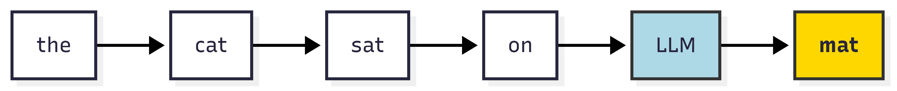
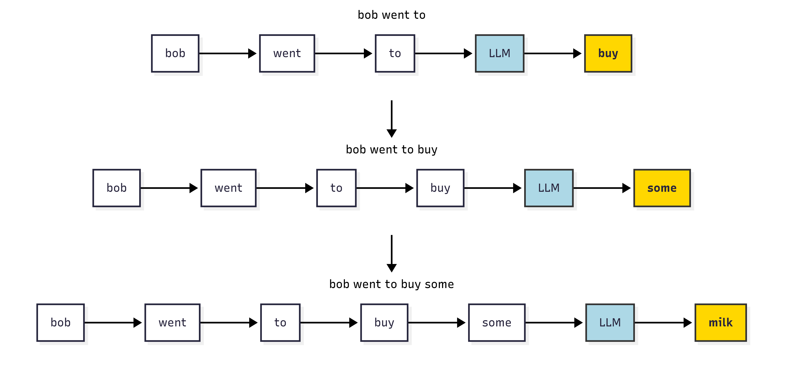

This notebook explores how large language models (LLMs) work by linking their probability-based predictions to real-world applications. We start with the basics of next-word prediction, then extend the idea to forecasting stock prices using news sentiment.

### Prerequisite

Before you start, make sure you have the required libraries installed, if not, **uncomment the lines below (i.e. remove the #) and run the cell to install them**:

```{python}
# # Core packages
# !pip install \
#     datasets==3.6.0 \
#     transformers \
#     pandas \
#     numpy \
#     statsmodels \
#     holidays \
#     plotly \
#     ipywidgets \
#     scikit-learn \
#     matplotlib \
#     seaborn \
#     torch
# !pip3 install torch torchvision --index-url https://download.pytorch.org/whl/cpu --quiet
```

**Important:** Run this cell to load the libraries we need for running this notebook.

```{python}
# load libraries we need to run this notebook
import os
import glob
import warnings
from datetime import datetime, timedelta
from math import sqrt
import numpy as np
import pandas as pd
import matplotlib.pyplot as plt
import seaborn as sns
import yfinance as yf
import datasets
from datasets import load_dataset
from transformers import pipeline, AutoTokenizer, AutoModelForCausalLM
from statsmodels.tsa.statespace.sarimax import SARIMAX
import holidays
import plotly.graph_objects as go
from plotly.subplots import make_subplots
import ipywidgets as widgets
from IPython.display import display, clear_output
from sklearn.metrics import mean_squared_error, mean_absolute_error
from forecast_plot import create_plot
import torch
import torch.nn.functional as F
from sklearn.metrics import confusion_matrix, ConfusionMatrixDisplay,classification_report    
```

### 1 Introduction: Distribution of LLM Predictions

Large language models like ChatGPT do something that seems very simple: **Next word prediction**.

What does that mean? It means that given a sequence of words, the model predicts the next word in the sequence. For example, if the input is "The cat sat on the", the model might predict "mat" as the next word.



We saw an example of predicting just one word. These models predict only one word at a time, but they can do this for very long sequences of words.

For example: "bob went to the store" to buy some milk.



Here, let's say we will output a total of $T$ words to form a sentence, $w_1, w_2, \ldots, w_{t-1}, w_t$ are the words in the sentence and the subscript $t$ means the word is at the position $t$. 

What the model does is learning the **probability distribution** of the next word given the previous words. It is to create a list of non-negative numbers, one for each possible next word, that add up to 1.

Given the previous words $w_1, w_2, \ldots, w_{t-1}$, the probability of predicting the next word $w_{t}$ is called **conditional probability**: it essentially measures for all words in the vocabulary, "the probability of the next word being this word, based on what was already said".

Mathematically, this is defined as below:

$$
P(w_t \mid w_1, w_2, \ldots, w_{t-1}) = \frac{P(w_1, w_2, \ldots, w_{t-1}, w_t)}{P(w_1, w_2, \ldots, w_{t-1})}
$$

LLMs can approximate this probability by learning from training datasets. Then, when they make predictions, they will select the word at position $t$ as the word with the maximum $P(w_t \mid w_1, w_2, \ldots, w_{t-1})$.

With **chain rule**, the model can also use the conditionals for every position to calculate the probability of a whole sentence:

$$
P(w_1, w_2, \ldots, w_T) = \prod_{t=1}^T P(w_t\mid w_1, \ldots w_{t-1})
$$

These models give a probability distribution over the entire vocabulary (all the words the model was trained on). We can then pick the word with the highest probability as the next word or we can sample from this distribution to get more varied (creative) outputs.

Let's look at an example of how this works in practice:

```{python}
warnings.filterwarnings("ignore")

# Example vocabulary
vocab = ['buy', 'some', 'milk', 'along', 'the', 'way']

# Probabilities at each step (toy example)
probs_step1 = [0.8, 0.05, 0.05, 0.03, 0.04, 0.03]  # 'buy' high
probs_step2 = [0.05, 0.7, 0.1, 0.05, 0.05, 0.05]   # 'some' high
probs_step3 = [0.05, 0.05, 0.75, 0.05, 0.05, 0.05] # 'milk' high

prob_distributions = [probs_step1, probs_step2, probs_step3]
step_labels = ['Step 1: Predict "buy"', 'Step 2: Predict "some"', 'Step 3: Predict "milk"']

fig, axes = plt.subplots(3, 1, figsize=(8, 8), sharey=True)

for i, ax in enumerate(axes):
    sns.barplot(x=vocab, y=prob_distributions[i], palette='muted', ax=ax)
    ax.set_title(step_labels[i])
    ax.set_ylim(0, 1)
    ax.set_ylabel('Probability' if i == 0 else '')
    ax.set_xlabel('Vocabulary')
    # Highlight the max prob bar in gold
    max_idx = prob_distributions[i].index(max(prob_distributions[i]))
    ax.bar(max_idx, prob_distributions[i][max_idx], color='gold')

    for patch, token, prob in zip(ax.patches, vocab, prob_distributions[i]):
        height = patch.get_height()
        ax.annotate(
            f"{prob:.2f}",                            
            xy=(patch.get_x() + patch.get_width() / 2, height),  
            xytext=(0, 3),       
            textcoords="offset points",
            ha='center', va='bottom',
            fontsize=9
        )

plt.tight_layout()
plt.show()
```

```{python}
# Load a pre-trained model and tokenizer from Hugging Face
Next_word_prediction = "distilbert/distilgpt2"
tokenizer = AutoTokenizer.from_pretrained(Next_word_prediction)
model = AutoModelForCausalLM.from_pretrained(Next_word_prediction)
model.eval()

device = torch.device("cuda" if torch.cuda.is_available() else "cpu")
model.to(device)
print("Loaded:", Next_word_prediction, "on", device)
```

```{python}
# Return top-1 next-token predictions + probabilities
def predict_next_word(sentence, k=5, temperature=1.0):

    inputs = tokenizer(sentence, return_tensors="pt").to(device)

    with torch.no_grad():
        out = model(**inputs)
        logits = out.logits[0, -1, :]

    logits = logits / temperature
    probs = torch.nn.functional.softmax(logits, dim=-1)

    topk = torch.topk(probs, k)

    top_probs = topk.values.detach().cpu().tolist()
    top_ids = topk.indices.detach().cpu().tolist()

    top_tokens = [tokenizer.decode([i]) for i in top_ids]

    print("Sentence:", sentence)
    print("Prediction (top-1):", repr(top_tokens[0]), "| prob =", round(top_probs[0], 3))
    print()

    for t, p in zip(top_tokens, top_probs):
        print(f"{repr(t):>10}  {p:.3f}")
```

Let's use the model to predict the next word in a sentence.

> *Try changing the sentence below to see how the predicted next word changes.*

```{python}
predict_next_word("The cat sat on the")
```

### 2 Sampling and Temperature

The example above (“bob went to the store”) shows us the process of generating $T=3$: at each step, the model calculates the conditional probability of the next word and then selects the word with the highest probability to insert into the sentence. The final output we obtain is "buy some milk".

To get more creative responses you change the distribution at the output where you pick the next word. Very simply this involves making the distribution sharper or flatter.
If you make the distribution sharper, you are more likely to pick the word with the highest probability. If you make it flatter, you are more likely to pick a word that is not the most probable one.

This is called **temperature**. A higher temperature makes the distribution flatter, while a lower temperature makes it sharper. You would want to use a temperature of more than 1 $(1.2-1.5)$ for creative responses, and a temperature of less than 1 $(0.1 - 0.5)$ for more focused responses. For a balanced response, you can use a temperature of $0.7-1$.
Another set of parameters are called top-p and top-k sampling.

```{python}
warnings.filterwarnings("ignore")

np.random.seed(42)

# Example vocabulary
vocab = [
    'apple', 'banana', 'cherry', 'date', 'elderberry',
    'fig', 'grape', 'honeydew', 'kiwi', 'lemon',
    'mango', 'nectarine', 'orange', 'papaya', 'quince',
    'raspberry', 'strawberry', 'tangerine', 'ugli', 'watermelon'
]

# Normalize to sum to 1
vocab_size = len(vocab)
base_probs = np.random.rand(vocab_size)
base_probs /= base_probs.sum()  

def apply_temperature(probs, temp):
    logits = np.log(probs + 1e-20)
    scaled_logits = logits / temp
    exp_logits = np.exp(scaled_logits)
    return exp_logits / exp_logits.sum()

temperatures = [0.5, 1.0, 1.5]
distributions = [apply_temperature(base_probs, t) for t in temperatures]

fig, axes = plt.subplots(3, 1, figsize=(8, 8), sharey=True)
for i, (ax, dist, temp) in enumerate(zip(axes, distributions, temperatures)):
    sns.barplot(x=vocab, y=dist, palette='muted', ax=ax)
    ax.set_title(f'Temperature = {temp}')
    ax.set_ylim(0, 0.25)
    ax.set_ylabel('Probability' if i == 0 else '')
    ax.set_xlabel('Vocabulary')
    ax.tick_params(axis='x', rotation=90)

    # Highlight the max-prob bar in gold
    max_idx = dist.argmax()
    ax.patches[max_idx].set_color('gold')

    # Annotate each bar with its probability
    for patch, prob in zip(ax.patches, dist):
        height = patch.get_height()
        ax.annotate(
            f"{prob:.2f}",
            xy=(patch.get_x() + patch.get_width() / 2, height),
            xytext=(0, 3),            # 3 points vertical offset
            textcoords="offset points",
            ha='center', va='bottom',
            fontsize=9
        )

plt.tight_layout()
plt.show()
```

In the example above, we see how the probability distribution changes with different temperatures. A high temperature (1.5) results in a flatter distribution, meaning the model is more likely to sample from less probable tokens, while a low temperature (0.5) results in a sharper distribution, favoring the most probable tokens.

```{python}
# Visualize next-word probability distribution
def plot_next_token_distribution(sentence, k=20, temperature=1.0):

    inputs = tokenizer(sentence, return_tensors="pt").to(device)

    with torch.no_grad():
        out = model(**inputs)
        logits = out.logits[0, -1, :]

    logits = logits / temperature
    probs = F.softmax(logits, dim=-1)

    topk = torch.topk(probs, k)
    top_probs = topk.values.detach().cpu().tolist()
    top_ids = topk.indices.detach().cpu().tolist()
    top_tokens = []
    for i in top_ids:
        tok = tokenizer.decode([i])
        tok = tok.replace("\n", "\\n")
        top_tokens.append(tok)

    plt.figure(figsize=(10, 4))
    ax = sns.barplot(x=top_tokens, y=top_probs, palette="muted")

    ax.set_title(f"Top-{k} next-token distribution (temperature={temperature})")
    ax.set_xlabel("Next token")
    ax.set_ylabel("Probability")
    ax.set_ylim(0, max(top_probs) * 1.25)
    ax.tick_params(axis="x", rotation=45)

    max_idx = int(torch.tensor(top_probs).argmax().item())
    ax.patches[max_idx].set_color("gold")

    for patch, prob in zip(ax.patches, top_probs):
        height = patch.get_height()
        ax.annotate(
            f"{prob:.2f}",
            xy=(patch.get_x() + patch.get_width() / 2, height),
            xytext=(0, 3),
            textcoords="offset points",
            ha="center",
            va="bottom",
            fontsize=9
        )
    plt.tight_layout()
    plt.show()
```

Now let's apply the same idea to our own sentence using a real language model.

> *Try changing the sentence or the temperature below to see how the distribution changes.*

```{python}
plot_next_token_distribution("The cat sat on the", temperature=1.0)
```

Note that while this is with words and language, the same idea applies to any sequential data, like stock prices, weather data, etc. The model looks at what happened before and tries to guess what comes next.

If you are interested in understanding the inner workings of these models, take a look at the interactive visualization at [The Illustrated Transformer](https://poloclub.github.io/transformer-explainer/) . It provides an excellent, hands-on way to explore the core ideas behind modern language models.


So, just like it guesses the next word in a sentence, it can guess the next day's temperature or the next movement in a stock price, based on the pattern it sees in the earlier numbers.

```{python}
n = 10
m = 9

# Generate actual data: random walk + small trend
actual_data = np.cumsum(np.random.normal(0, 1, n)) + 50

# Predictor approximates entire data closely with small noise everywhere
predicted = actual_data + np.random.normal(0, 0.2, n)

# Posterior uncertainty: low and roughly constant over entire period
posterior_std = np.full(n, 0.3)

upper = predicted + posterior_std
lower = predicted - posterior_std

plt.figure(figsize=(6,6))
plt.plot(range(n), actual_data, label="Actual Data", color='blue')
plt.plot(range(n), predicted, label="Predicted", color='orange')
plt.axvline(x=m-1, color='black', linestyle='--', label="Observed / Future Split")

plt.xlabel("Time")
plt.ylabel("Value")
plt.title("Stock price over time.")
plt.legend()
plt.show()
```

Typically, when building a model to predict stock prices, you would use more information than just the past prices. For example, you might include things like public sentiment (how people feel about the stock), news headlines, or other features that could influence the price.

In the examples below, that's exactly what we're going to try! We'll see how adding these extra features can help the model make better predictions about what happens next.

### 3 Classifying Headline Sentiment with LLM

Earlier, we explored how **large language models (LLMs)** predict the *next word* by learning the probability distribution of possible outcomes based on context.

Now, we apply a similar idea to **entire sentences**: in this case, financial news headlines. Instead of predicting the next word, the model assigns a probability to each **sentiment category** (e.g. POSITIVE, NEGATIVE, or NEUTRAL).

In other words, instead of predicting:

$$
P(w_t \mid w_1, w_2, \ldots, w_{t-1})
$$

We now predict:

$$
P( Sentiment\mid headline)
$$

This is like asking:

> *Given the words in this sentence, what is the most likely emotion behind it?*

#### How it works:

-   A pre-trained model reads the headline.
-   It assigns probabilities to the sentiment labels.
-   We keep only **positive** or **negative** headlines, since those are more likely to affect stock prices.

We will rely on some AI tools to figure this out.

BERT (short for *Bidirectional Encoder Representations from Transformers*) is a pretrained language model that learns a word's meaning by looking at the words *before and after* it, so it understands context and tone well. And Hugging Face is an open-source platform and Python library that hosts many pretrained models (like BERT) and provides easy tools.

In this notebook, we are going to use Hugging Face's `pipeline()` function to load a **RoBERTa** model: an optimized version of the BERT model trained to understand the tone of text. Although it is specifically trained on tweets and social media text. It's well-suited to handling short, informal writing like news headlines.

This builds directly on our earlier discussion of LLMs predicting **probability distributions**, but here, the prediction is over **sentiment classes** rather than words.

This process converts unstructured text into structured sentiment labels that we can analyze quantitatively.

We now apply a pre-trained **large language model** to each headline.

It returns:

- `POSITIVE`: news that sounds good (e.g., "profits surge")
- `NEGATIVE`: news that sounds bad (e.g., "lawsuit filed")
- `NEUTRAL`: news that is neither clearly negative or positive.

> *Can you think of a positive and negative news headline?*

Note that we will skip `NEUTRAL` news to focus on strong market signals.

```{python}
warnings.filterwarnings("ignore")
# Here we are just specifying the classifier (AI model) that decides on a sentiment 

classifier = pipeline("sentiment-analysis", model="cardiffnlp/twitter-roberta-base-sentiment-latest", device=-1)

# define a function to classify sentiment of each text 
def classify_sentiment(text):
    return classifier(text)[0]["label"].upper()

# we'll also define a helper that returns the confidence score of the model.
def classify_with_score(text):
    result = classifier(str(text), truncation=True, max_length=512)[0]
    return result["label"].upper(), result["score"]
```

Before seeing what the model says, let's test our own intuition. Given the headlines below, would you say they are positive, negative, or neutral?

```{python}
headlines = [
    "Operating profit rose to EUR 17.1 mn from EUR 14.8 mn in the corresponding period of 2007.",
    "The company was ordered to pay damages worth 8.8 million euros.",
    "Sales for the third quarter were flat compared to the same period last year.",
    "The rights issue was subscribed to 102 percent.",
    "The company faces a wave of new lawsuits following the product recall.",
    "Quarterly revenue in line with market expectations.",
    "SVB Financial Group, the former parent company of Silicon Valley Bank, filed for Chapter 11 bankruptcy in March 2023 following the bank's collapse and FDIC receivership"
]

print("Roberta's Sentiment Analysis\n" + "=" * 60)
for headline in headlines:
    label, score = classify_with_score(headline)
    print(f"\nHeadline : {headline}")
    print(f"Predicted: {label}  (confidence: {score:.2f})")
```


### 4 Applying Sentiment Classification to Real News

Thus far, we've applied our sentiment classifier to a handful of example sentences and trusted it's work. But it's highly likely your own opinion on at least a few of these sentences different from the models'. So how reliable is the model on actual financial text?

To answer that, we'll use the financial phrasebank, a benchmark dataset frequently used in NLP research. The dataset contains 3435 financial news sentences that have been soured from financial news archives. Each sentence has been labelled as positive, negative or neutral by a panel of domain experts in finance. [You can read more about the methodology here.](). We use the version where at least 75% of the annotators agreed on the label to ensure a somewhat objective "true" label.

```{python}
#We'll load the data directly from huggingface. 
phrasebank = load_dataset(
    "takala/financial_phrasebank", "sentences_75agree",
    split="train", trust_remote_code=True)
phrasebank_df = phrasebank.to_pandas()

label_names = phrasebank.features["label"].names  #labels are one of positive, negative, or neutral.
true_labels = []
for label in phrasebank_df["label"]:
    true_labels.append(label_names[label].upper())
phrasebank_df["true_label"] = true_labels

print(f"size of dataset: {len(phrasebank_df)} sentences")
print(f"\n")
print(f"label distribution:")
print(phrasebank_df["true_label"].value_counts())
phrasebank_df[["sentence", "true_label"]].head()
```

Let's take a look at a few examples within this dataset.

```{python}
for _, row in phrasebank_df.sample(5, random_state=42).iterrows():
    print(f"Label: {row['true_label']}  Sentence: {row['sentence']}")
```

### Running the classifier

We'll now apply the RoBERTa classifier to each sentence. This will give us both a predicted label as a confidence score (the model's probability for its chosen label). We'll classify a balanced sample of 150 sentences per class, but if you want to run this on the full dataset just remove `.apply(sample_group)`.

Note that running this code may take some time. If you're running this code a second time, feel free to comment out the first 5 lines 

```{python}

phrasebank_df["true_label"] = phrasebank_df["label"].apply(lambda x:          
  label_names[x].upper())                                                       
                                                                                
sample_df = pd.concat(                 
        [grp.sample(min(150, len(grp)), random_state=42)                          
        for _, grp in phrasebank_df.groupby("true_label")],                      
        ignore_index=True) #don't reassign sample_df to phrasebank_df if you don't want a sample, or change 150 to some other number for a larger (or smaller) sample.

results = [classify_with_score(x) for x in sample_df["sentence"]]
sample_df["pred_label"] = [r[0] for r in results]
sample_df["confidence"] = [r[1] for r in results] 
sample_df.to_csv("datasets/phrasebank_predictions.csv", index=False)
phrasebank_df = sample_df

phrasebank_df[["sentence", "true_label", "pred_label", "confidence"]].head()
```

### Confusion matrices

A *confusion matrix* gives us a glance at how often the model agrees with what the expert labels, and, when it gets things wrong, what label it predicted instead of the correct one. Each row represents the true label, each column is what the model predicted. A perfect model would have a diagonal matrix with 0s in every row that isn't equal to it's column version.

```{python}
cm = confusion_matrix(phrasebank_df["true_label"], phrasebank_df["pred_label"], labels=["POSITIVE", "NEUTRAL", "NEGATIVE"])

fig, ax = plt.subplots(figsize=(7, 5))
disp = ConfusionMatrixDisplay(confusion_matrix=cm, display_labels=["POSITIVE", "NEUTRAL", "NEGATIVE"])
disp.plot(ax=ax, colorbar=False, cmap="twilight_shifted")
ax.set_title("RoBERTa vs. the experts, financial phrasebank dataset")
plt.tight_layout()
plt.show()

print(classification_report(phrasebank_df["true_label"], phrasebank_df["pred_label"], labels=["POSITIVE", "NEUTRAL", "NEGATIVE"]))
```

> Which class does the model struggle with the most? Why might that be?

#### Does confidence necessarily predict accuracy?

Recall that LLMs product a probability distribution over all possible outcomes. The confidence score is the probability that the model assigns to it's top prediction. Here, we test whether that probability carries any real information, ie, is the model more confident when it is correct?

> Keep the results of this section in mind when a LLM tells you it's certain about something you ask it ;)

```{python}
phrasebank_df["correct"] = phrasebank_df["pred_label"] == phrasebank_df["true_label"] #new boolean column for when model is correct vs when it isnt


fig, ax = plt.subplots(figsize=(9,5))

ax.hist(phrasebank_df[phrasebank_df['correct']]['confidence'], bins=100, alpha=0.7, color="green",density=True, label="Model got correct prediction")

ax.hist(phrasebank_df[~phrasebank_df['correct']]['confidence'], bins=100, alpha=0.7, color="tomato",density=True, label="Model got incorrect prediction")

ax.set_xlabel("Model confidence score")
ax.set_ylabel("Density")
ax.set_title("Confidence Score Distribution")
ax.legend()
plt.tight_layout()
plt.show()

print(f"Mean confidence — correct:   {phrasebank_df[phrasebank_df['correct']]['confidence'].mean()}")
print(f"Mean confidence — incorrect: {phrasebank_df[~phrasebank_df['correct']]['confidence'].mean()}")
```

> We see that a model's probability score isn't cosmetic: when it's wrong, it's more likely to be less sure, but not always so!

### 5 Getting Stock Price Data


### Key Takeaways

- **Large language models (LLMs)** predict the next word in a sequence by learning the probability distribution of possible outcomes based on context.
- LLMs can also be used to predict future values in a time series, such as stock prices, by incorporating additional features like public sentiment.
- **The SARIMAX model** is a powerful forecasting model that allows us to include external information, such as news sentiment, in our predictions.
- We must evaluate the model's performance using metrics like **MAE** and **RMSE** to ensure its predictions are reliable.

### Glossary

- **Large Language Model (LLM)**: A type of AI model that predicts the next word in a sequence based on the context of previous words.
- **Next Word Prediction**: The task of predicting the next word in a sequence given the previous words.
- **Sentiment Analysis**: The process of determining the emotional tone behind a series of words, used to understand the sentiment expressed in text.
- **SARIMAX Model**: A statistical model used for forecasting time series data that can incorporate external variables.
- **Mean Absolute Error (MAE)**: A measure of prediction accuracy that calculates the average absolute difference between predicted and actual values.
- **Root Mean Squared Error (RMSE)**: A measure of prediction accuracy that calculates the square root of the average of squared differences between predicted and actual values.

### References

- Kirsch, N. (2024, April 29). 10 Best AI Stocks Of August 2024. Forbes Advisor. [https://www.forbes.com/advisor/investing/best-ai-stocks/](https://www.forbes.com/advisor/investing/best-ai-stocks/)
- Chen, J. (2023, October 6). *Efficient Market Hypothesis (EMH): Forms and criticisms*. Investopedia. [https://www.investopedia.com/terms/e/efficientmarkethypothesis.asp](https://www.investopedia.com/terms/e/efficientmarkethypothesis.asp)
- Yahoo Finance. (n.d.). Yahoo Finance — Stocks, financial news, quotes, and market data. Retrieved August 1, 2025, from [https://ca.finance.yahoo.com/](https://ca.finance.yahoo.com/)
- Aroussi, R. (n.d.). yfinance [Python package]. GitHub. Retrieved August 1, 2025, from [https://github.com/ranaroussi/yfinance](https://github.com/ranaroussi/yfinance)
- Li, T. (2025). finvizfinance (Version 1.1.1) [Python package]. PyPI. Retrieved August 1, 2025, from [https://pypi.org/project/finvizfinance/](https://pypi.org/project/finvizfinance/)
- GeeksforGeeks. (2023, September 27). Complete guide to SARIMAX in Python. [https://www.geeksforgeeks.org/python/complete-guide-to-sarimax-in-python/](https://www.geeksforgeeks.org/python/complete-guide-to-sarimax-in-python/)
- Sprenger, T. O., Tumasjan, A., Sandner, P. G., & Welpe, I. M. (2014, February 5). *Twitter sentiment and stock market movements: The predictive power of social media*. VoxEU. [https://cepr.org/voxeu/columns/twitter-sentiment-and-stock-market-movements-predictive-power-social-media](https://cepr.org/voxeu/columns/twitter-sentiment-and-stock-market-movements-predictive-power-social-media)
- Wolf, T., Debut, L., Sanh, V., Chaumond, J., Delangue, C., Moi, A., … Rush, A. M. (2020). Transformers: State-of-the-art natural language processing. Proceedings of the 2020 Conference on Empirical Methods in Natural Language Processing: System Demonstrations, 38–45. [https://huggingface.co/transformers/](https://huggingface.co/transformers/)
- Sanh, V., Debut, L., Chaumond, J., & Wolf, T. (2019). DistilGPT2 [Pretrained language model]. Hugging Face. [https://huggingface.co/distilbert/distilgpt2](https://huggingface.co/distilbert/distilgpt2)
- Paszke, A., Gross, S., Massa, F., Lerer, A., Bradbury, J., Chanan, G., … Chintala, S. (2019). PyTorch: An imperative style, high-performance deep learning library. Advances in Neural Information Processing Systems, 32. [https://pytorch.org/](https://pytorch.org/)