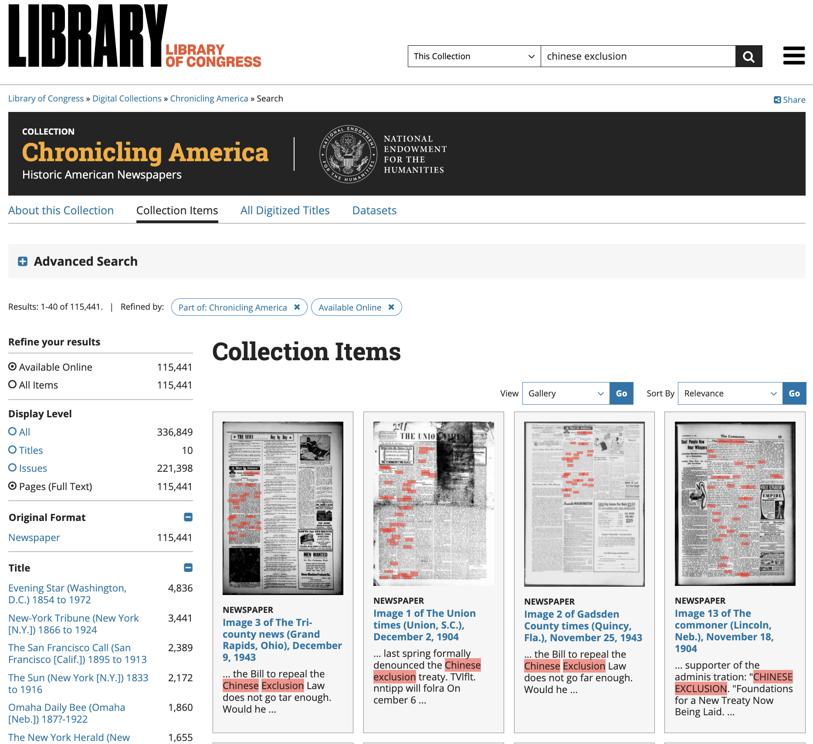
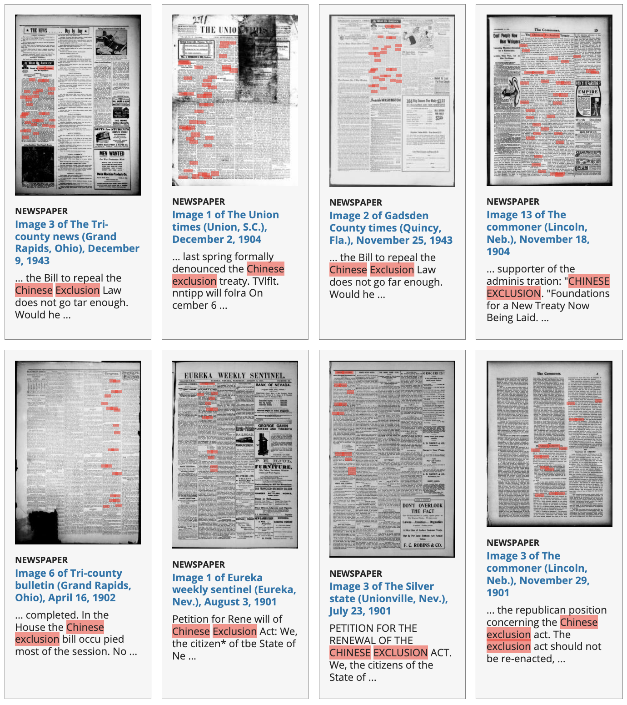
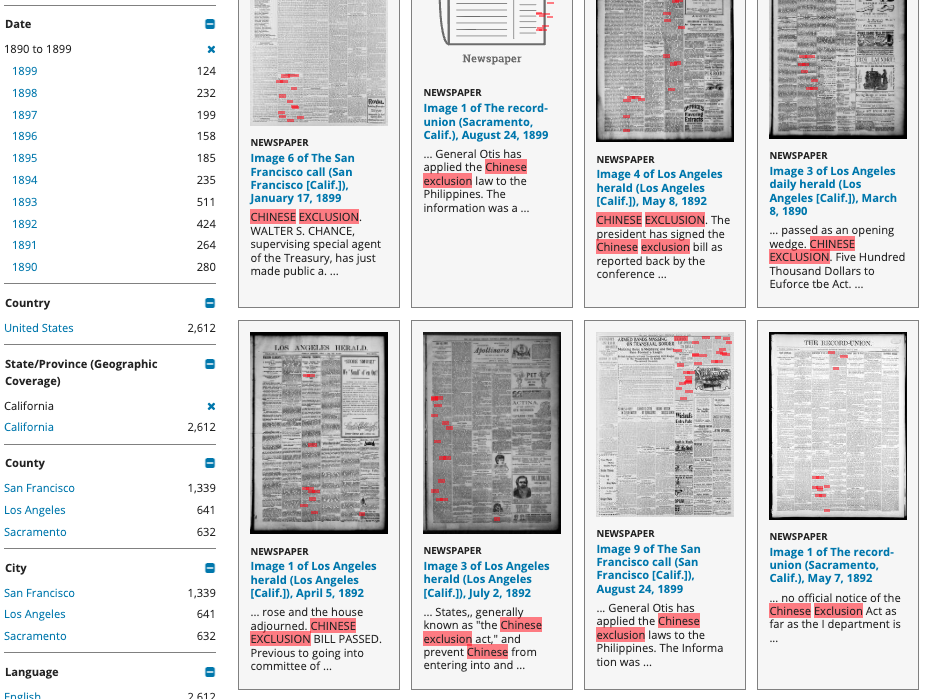
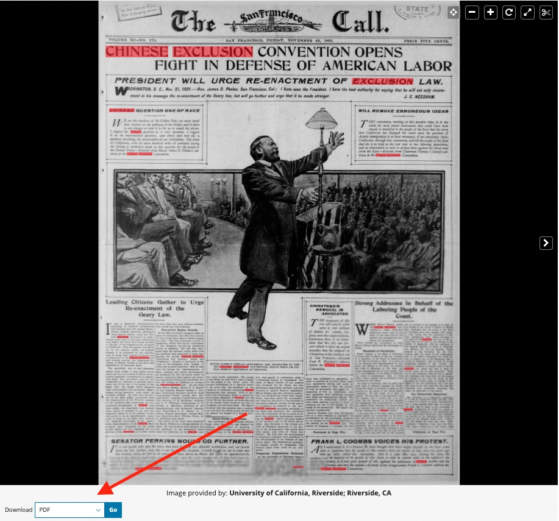
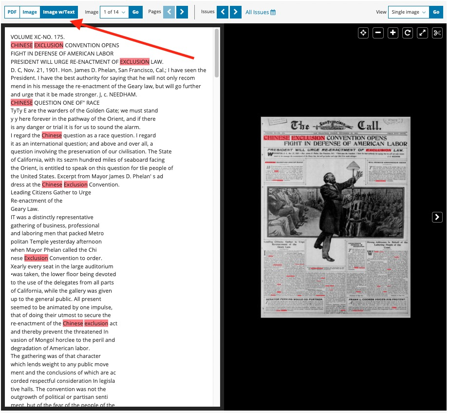
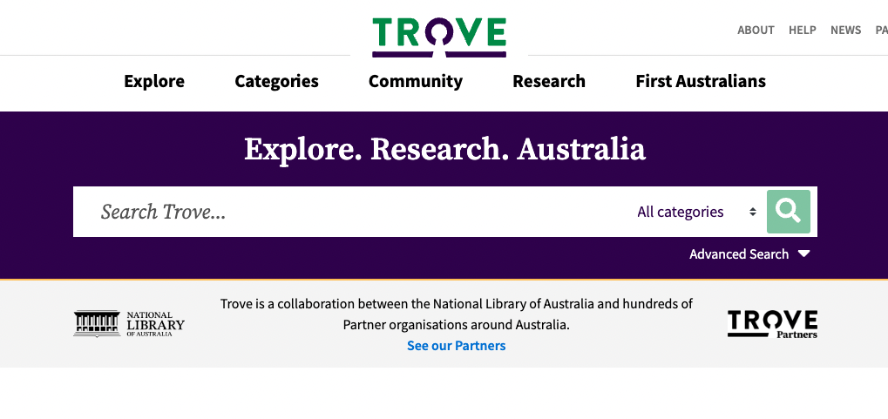
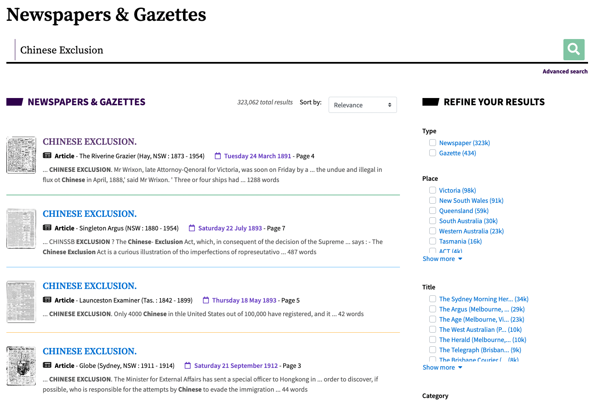
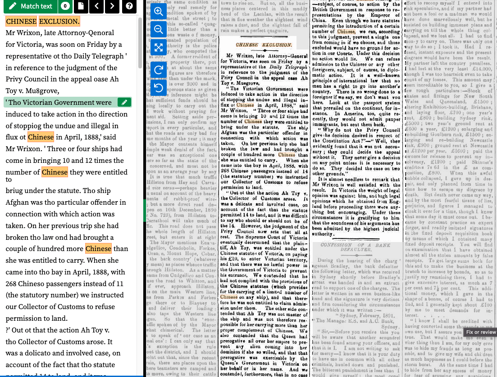
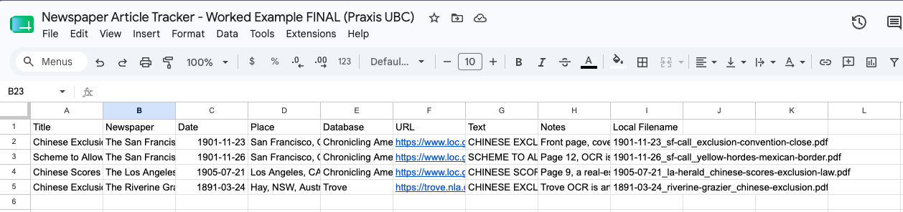

## Introduction

Before we can analyze historical news, whether by reading closely or by using computational tools, we need to get our hands on the newspapers themselves. This walkthrough shows you how to do that using two free, public databases of digitized historical newspapers:

- [**Chronicling America**](https://www.loc.gov/collections/chronicling-america/about-this-collection/) (Library of Congress) — millions of digitized U.S. newspaper pages from 1770 to 1963, with no copyright restrictions.
- [**Trove**](https://trove.nla.gov.au/) (National Library of Australia) — Australia's equivalent collection, with digitized newspapers going back to 1803.

Both databases work like an ordinary website: you type a search, click on results, and download articles.

A digitized newspaper is really two things: an **image** of the original page, and **computer-generated text (OCR)** extracted from it. The image is for human eyes; the text is what makes it readable and searchable by computers.

::: {.callout-note}
## Our running example
Throughout this guide we search for coverage of Chinese immigration and exclusion, ca. 1880–1905. This topic is a natural comparison across the two databases: the United States passed the Chinese Exclusion Act in 1882, and Australia passed the Immigration Restriction Act (the "White Australia" policy) in 1901. How did newspapers in each country talk about these events? You'll follow the same steps with your own topic afterward.
:::

### Learning objectives

1. Search each database and filter results by date, place, and newspaper.
2. Open an article and read it as a scan of the original page.
3. Download the article as a PDF and view its OCR text.
4. Compare the page image to the raw text, and spot OCR errors.
5. Keep track of the articles you collect in a simple spreadsheet.

## Chronicling America (United States)

Chronicling America is maintained by the Library of Congress. Everything in it is free to use, with no copyright restrictions. You can find it at the [Chronicling America collection page](https://www.loc.gov/collections/chronicling-america/).

### Searching for a topic

1. Go to the [Chronicling America collection page](https://www.loc.gov/collections/chronicling-america/).
2. Find the search box near the top of the page.
3. Type your search terms. For our example, try: `Chinese exclusion`
4. Press Enter or click the search button.

{width=90%}

You should see a list of results — each one a newspaper page where your search terms appear. The matched words are usually highlighted on the page image.

{width=90%}

### How the collection was built

Before searching any database, it's worth asking a deceptively simple question: *how did this material get here?*

Chronicling America is the public face of the **National Digital Newspaper Program (NDNP)**, a partnership between the National Endowment for the Humanities and the Library of Congress. Under the NDNP, institutions in each state (university libraries, state archives, historical societies) apply for grants to select and digitize newspapers from their own state. The Library of Congress hosts the results; it does not choose them.

This has an important consequence: ***coverage is uneven***. States that joined the program early and won repeated grants (like California) are represented by hundreds of thousands of pages, while states that joined late contribute far less. Within a state, coverage also reflects what each partner chose to prioritize and what survived on microfilm in the first place.

Why does this matter for your research? Suppose you search "Chinese exclusion" and get 4,000 hits from California but only 200 from Illinois. It is tempting to conclude the topic was discussed far more in California. But the difference may simply be that far more California pages are in the database. Raw hit counts across states (or across time) measure the shape of the database at least as much as the shape of history.

If you want to compare places or periods, the safer strategy is to pick specific newspapers you know are comparable — similar city size, similar run of dates, similar politics. Then compare coverage *within* those titles.

You can check what's actually in the database:

- Read [about the collection](https://www.loc.gov/collections/chronicling-america/about-this-collection/) at the Library of Congress.
- Browse [all digitized titles](https://www.loc.gov/collections/chronicling-america/?fa=partof:chronicling+america) to see how many papers, and which years, your state actually has.
- See the [list of NDNP awardees by state](https://www.loc.gov/ndnp/listawardees.html).

### Narrowing your results

A broad search can return tens of thousands of pages. Use the filters (usually on the left side of the results page) to narrow things down:

- **Date**: restrict to a range, e.g. 1880 to 1905.
- **Location / State**: e.g., California, where coverage of Chinese exclusion was especially heavy.
- **Newspaper**: limit to a single title if you want to follow one paper's coverage over time.

{width=90%}

::: {.callout-tip}
## Search tips
- Put phrases in quotation marks to search them as a unit: `"Chinese exclusion act"`.
- Historical vocabulary matters. Newspapers of the era used terms we would not use today; searching period vocabulary (however uncomfortable) is often necessary to find period coverage. Think about what words *the newspapers themselves* would have used.
- For example, a search for "Chinese immigrants" finds far less than the terms the papers actually used: "Chinamen," "Celestials," "coolie labor."
- Fewer, more distinctive words usually beat long queries.
:::

### Opening and reading an article

Click on any result to open the **page viewer**. You are now looking at a scan of the actual newspaper page. You can:

- Zoom in and out with the controls (or your scroll wheel).
- Drag the page around to move between columns.
- Use the arrows to flip to the previous/next page of that issue.

### Downloading the PDF

On the page viewer, look for the download options (often labeled "Download" or shown as icons near the image). Choose PDF.

For our example, we'll use ["Chinese Exclusion Convention Opens Fight in Defense of American Labor," The San Francisco Call, November 22, 1901, front page](https://www.loc.gov/resource/sn85066387/1901-11-22/ed-1/?sp=1&q=chinese+exclusion).

{width=90%}

The PDF saves to your computer like any other download. Open it — it's simply the newspaper page as an image you can read, print, or file away. This is the version you'd use for **close reading**.

### Viewing the OCR text

Now for the interesting part. On the same page viewer, look for an option labeled "Image w/Text" (sometimes "OCR" or "Full text"). Click it.

{width=90%}

What you're seeing is the computer's attempt to *read* the page image and turn it into typed text. This text is what makes the page searchable. When you searched "Chinese exclusion," the database was searching this OCR text, not the images.

You can save this text: select all of it (Ctrl+A / Cmd+A), copy, and paste into a plain text file (using Notepad on Windows or TextEdit on a Mac), or use the text download option `OCR(ALTO)`. Save it with the same name as your PDF so the pair stays together, e.g. `1882-05-10_daily-alta.pdf` and `1882-05-10_daily-alta.txt`.

{width=90%}

## Trove (Australia)

Trove is run by the National Library of Australia and works on the same principle: scanned newspaper pages plus searchable OCR text, all through a normal website. You can find it at the [Trove newspapers page](https://trove.nla.gov.au/newspaper/).

### Searching for a topic

1. Go to the [Trove newspapers page](https://trove.nla.gov.au/newspaper/).
2. Type your search into the search box. For our example: `Chinese immigration restriction`
3. Press Enter.

{width=90%}

### How the collection was built

Trove's digitized newspapers come from the **Australian Newspaper Digitisation Program (ANDP)**, coordinated by the National Library of Australia together with the state and territory libraries. Titles are selected based on historical significance, how heavily they're used, geographic coverage, and whether a good microfilm copy exists to scan from.

There is a second route into Trove that Chronicling America doesn't have: since 2010, outside contributors (local councils, historical societies, public libraries, even individuals) can nominate a newspaper and *pay for* its digitization. Hundreds of organizations have done so. This is wonderful for access, but it means some titles are in Trove because a local group championed them, not because a curator judged them representative.

The scale of what's missing is worth sitting with: roughly 7,700 newspapers have been published in Australia, but only about 1,800 titles are in Trove. Which ~1,800? The ones that funding, microfilm availability, and local enthusiasm favored. Even digitized titles may have gaps — Trove usually includes only one edition per day, even for papers that printed several.

Where to check:

- Read about [Trove's digitised newspapers](https://trove.nla.gov.au/landing/newspapers).
- Browse the [full list of digitised titles](https://trove.nla.gov.au/newspaper/about), including forthcoming titles.
- Explore the [Trove Data Guide](https://tdg.glam-workbench.net/) — an excellent, honest look under the hood.

::: {.callout-important}
## The golden rule of database research
***Always find out how the database you're searching was created.*** Every digital collection is the product of decisions (funding, selection, copyright, survival) made long before you typed your search. If you don't know those decisions, you can draw conclusions that are exactly backwards: mistaking a gap in the archive for a silence in history. Look for the "About" page before you trust the search box.
:::

### Narrowing your results

Use the filters (on the right side) to refine:

- **Decade / year**: e.g., 1890s–1900s for the lead-up to the Immigration Restriction Act.
- **State**: e.g., Victoria or New South Wales.
- **Category**: you can restrict to "Article" and exclude advertising and family notices.

{width=90%}

### Opening and reading an article

Click a result to open the article view. Trove shows you a **split screen**: the OCR text on the left, and the scanned image of the article on the right (the exact layout can vary). You can zoom the image and click through to see the full page the article came from.

::: {.callout-note}
## A Trove quirk worth knowing
Trove lets registered users *correct* the OCR text, and many volunteers do. This means some popular articles have unusually clean text (because a human fixed it) while obscure ones remain garbled. Keep this in mind when comparing OCR quality across articles.
:::

### Downloading the PDF and the text

Look for the Download button on the article view. Trove lets you choose what to download:

- **PDF** — the article (or the full page) as an image.
- **Text** — the OCR text as a plain text file.

Download both for your chosen article.

## Comparing the Image to the Text

You now have, for at least one article in each database:

1. a **PDF** — what the newspaper page actually looked like, and
2. a **text file** — what the computer *thinks* the page says.

Open them side by side and read a paragraph in each.

{width=90%}

### What to look for

You will almost certainly find errors in the OCR text. Common ones in nineteenth-century newspapers:

- Confused letters: *e* read as *c*, *rn* read as *m*, the long *ſ* read as *f*.
- Broken words where the scan is smudged, faded, or torn.
- Column confusion: text from neighboring columns jumbled together.
- Missing passages where the page is damaged.

### Why this matters

This messy text is the raw material for *every* computational method you might hear about: word counts, topic models, sentiment analysis, machine learning, large language models. Three implications:

1. **Search is imperfect.** If the OCR misread a word, searching for that word will not find the page. Absence of search results is not evidence of absence.
2. **Counts are noisy.** Any method that counts words inherits the OCR's mistakes.
3. **Reading still matters.** The scan, the thing you close-read, remains the ground truth. Computational methods extend your reach across millions of pages; they don't replace checking the image.

The good news: OCR quality is an active research area, and modern AI-based methods can dramatically improve it. We'll touch on this in the seminar, and there are follow-up tutorials for anyone who wants to go further (see @sec-further).

## Keeping Track: A Simple Spreadsheet

Once you're collecting more than a handful of articles, you need a system. A simple spreadsheet in Excel, Google Sheets, or Numbers is all it takes: **one row per article**, with columns for the headline, the newspaper, the date, the place, which database you found it in, the URL, the article's OCR text, and your notes.

Here is the tracker with three articles from *The San Francisco Call* and *The Los Angeles Herald* on Chinese exclusion:

{width=95%}

Rather than building this from scratch, start from our [template spreadsheet](https://docs.google.com/spreadsheets/d/1Rdv1zcft4v4u5o63JrNeAIA68BAFrxNKiT2FYr7h7ZU/edit?usp=sharing), which has all the columns set up along with our example articles. Open the link, then choose File → Make a copy to get your own editable version.

### The Text column

One column deserves special attention. Paste the article's full OCR text (the machine-readable text you saved earlier) directly into the Text cell for each row. It will look cramped, and that's fine.

The moment you do this, your spreadsheet stops being a mere finding aid and becomes a **dataset**: each row pairs an article's text with its metadata. Every form of text analysis you might do later (qualitative coding, word counts, sentiment analysis, machine learning) starts from *exactly* this structure. If you build this habit now, you are already doing computational social science. The computer just hasn't been asked to do anything yet.

One practical difference between our two databases will show up here. _Trove_ segments its pages into individual articles, so its downloaded text is already just the article. _Chronicling America's_ OCR is *page-level*: the text file contains everything on the page (your article, its neighbors, and the advertisements) jumbled together. You'll need to find your article within it and trim away the rest before pasting. Look at the Notes column in our example: we had to cut a patent-medicine ad and a murder inquest out of one article's text.

### Three habits worth adopting from day one

- **Write dates as YYYY-MM-DD** (e.g., 1882-05-10). They sort correctly and are unambiguous.
- **Always record the URL.** Six months from now, this is how you (or a reader of your work) get back to the source.
- **Use the Notes column.** Record the page number, the OCR quality, what you had to trim, and anything that struck you. Notes like these are the seed of qualitative coding.

## Now You Try

Pick a topic of your own, ideally one that appears in *both* the American and Australian press. Some prompts:

- A comparative event: the gold rushes (California 1849; Victoria and NSW 1851).
- A person, ship, disaster, or scandal reported internationally.
- A theme from your own research interests, tested in the period these databases cover.

Then work through the checklist:

1. Search your topic in Chronicling America. Adjust your search terms until the results look relevant.
2. Filter by date and place.
3. Choose one article. Download the PDF and save the OCR text.
4. Repeat steps 1–3 in Trove.
5. Compare each PDF against its OCR text. Note the worst OCR error you can find.
6. Start a spreadsheet from the template and enter your articles, pasting the OCR text into the Text column.

::: {.callout-warning}
## A note on difficult material
Historical newspapers contain racist language and viewpoints, especially on topics like immigration and exclusion. Encountering this material is part of doing this history; reproducing its framing is not. Quote deliberately and provide context.
:::

## Where to Go Next {#sec-further}

This walkthrough covered *collecting* newspapers; if you're curious about *analyzing* them, the Praxis project has free, self-paced materials that pick up where this guide ends:

- [Text Analysis Overview](https://ubcecon.github.io/praxis-ubc/docs/History_and_News/text_analysis_simplified.html) — the natural next step. A survey of text analysis approaches, beginning with hand-coded qualitative analysis and building up from there. This is the basis for the lecture portion of our session. **NOT A LIVE LINK YET, WILL BE LIVE WHEN ALL APPROVED + MERGED IN**

- [Optical Character Recognition (OCR)](https://ubcecon.github.io/praxis-ubc/docs/OCR/ocr_stub.html) — remember the garbled text you found today? This tutorial shows how OCR works, why it fails on historical print, and how modern AI-based tools can dramatically clean it up.

- [Introduction to Sentiment Analysis](https://ubcecon.github.io/praxis-ubc/docs/SOCI-280/soci_280_bert_stub.html) — how researchers measure the tone of texts at scale, using modern language models.

- [Embedding-Driven Text Analysis: Justice Crease and Chinese Immigrants](https://ubcecon.github.io/praxis-ubc/docs/hist_workshop/text_embeddings_workshop_stub.html) — a full worked example of AI-assisted historical research, on the very topic we searched today: it asks whether the BC judge who struck down the 1884 Chinese Regulation Act did so out of anti-discrimination principle or economic interest, using word embeddings and zero-shot classification on his legal writings. A glimpse of where these methods can go and, importantly, an honest account of where they fall short and why human interpretation remains essential.

All Praxis modules are free and open on the [Praxis UBC website](https://ubcecon.github.io/praxis-ubc/).

You now know how to find a historical newspaper article, hold both its image and its text in your hands, and understand the difference between the two. Everything else builds on that.

## References

- Library of Congress. [About Chronicling America](https://www.loc.gov/collections/chronicling-america/about-this-collection/).
- National Endowment for the Humanities. [National Digital Newspaper Program](https://www.neh.gov/divisions/preservation/national-digital-newspaper-program).
- National Library of Australia. [Trove digitised newspapers](https://trove.nla.gov.au/landing/newspapers).
- Sherratt, Tim. [Trove Data Guide](https://tdg.glam-workbench.net/).
