## Section 1: Traditional Qualitative Coding


Qualitative research often begins with **hand-coded analysis**, where researchers create a codebook and apply categories to text manually


#### **The convention**

Imagine you have a giant pile of stories, surveys or interviews, researchers first make a **list of buckets** (this list is called a *codebook*). Then one by one, they **read the text and put each piece into the right bucket**. 

Examples of buckets might be emotions such as happy, angry, sad; or topics about money, about family, etc. **Researchers can freely decide the buckets they need.**

---

### 1.1 Deductive and Inductive Coding 


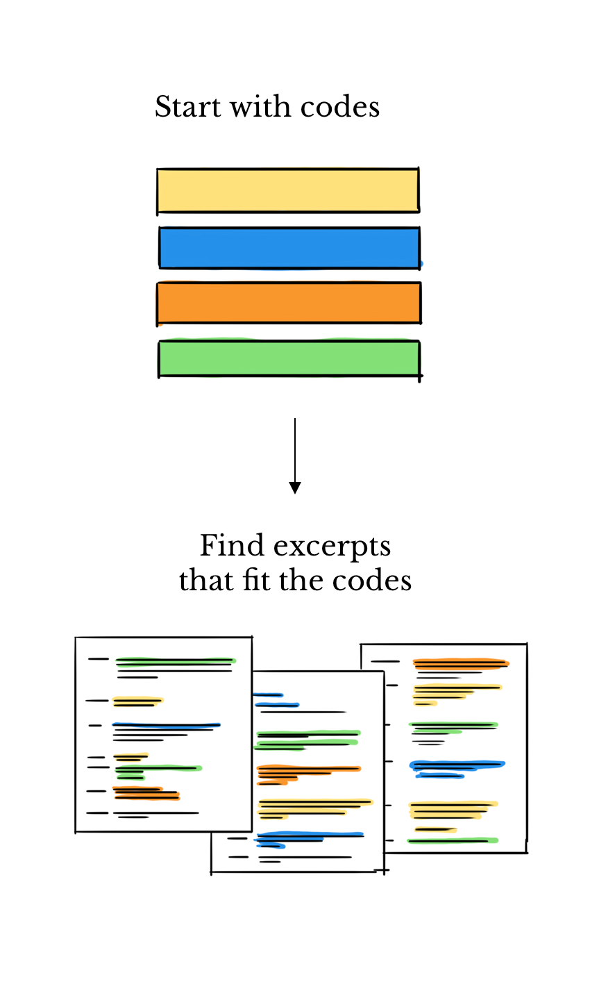{fig-align="center" width="40%" fig-cap="Deductive coding: start with pre-set categories and apply them to text."}

---

This is called **hand-coding** because people do it by hand and not a computer. It works well but it's slow and requires people who have been expertly trained. It also works the other way around, **you can read the text and come up with buckets.**

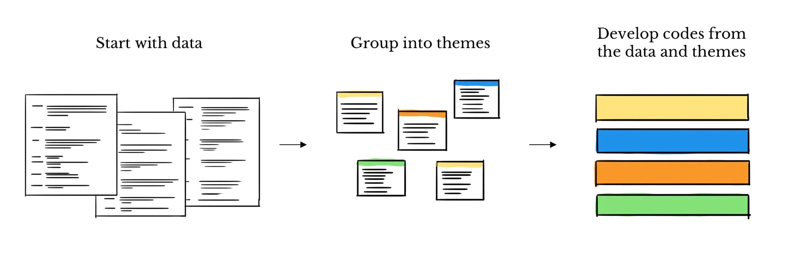{fig-align="center" width="40%" fig-cap="Inductive coding: categories emerge from the text during analysis."}

---

### Example of Deductive Coding 


Imagine coding voter interviews into pre-set buckets like **Economy, Healthcare, Immigration**.

::: {.smaller}

| Comment                                    | Code (Bucket) | Why?                                              |
| :----------------------------------------- | :------------ | :------------------------------------------------ |
| "Groceries and gas are too expensive."     | Economy       | Clearly about financial concerns.                 |
| "I want better access to doctors."         | Healthcare    | Fits the "Healthcare" bucket.                     |
| "The government should secure the border." | Immigration   | Matches the "Immigration" bucket.                 |
| "I don't trust politicians at all."        | (none)        | Doesn't fit the pre-set buckets, so it's skipped. |

:::

- Coding helps researchers move from raw words to structured insights. 
- It turns scattered comments into clear evidence about what people care about.

<!-- ## 1.1 Example Hand-Coding financial decisions

Researchers re-analyzed **32 focus group transcripts** on how people make financial decisions.  
A team of six coders manually created categories like *credit reports*, *auto purchases*, and *rules of thumb*, and then assigned text line-by-line. This showed how traditional hand-coding can reveal patterns in how people think about money, but also how labor-intensive the process is.   -->

---

### 1.2 Recent Updates: Crowdsourcing  


#### A Newer Way

Hand-coding takes a long time. So now, people sometimes ask **lots of regular internet workers** to help, this approach is called **crowdsourcing**.

#### Examples 

- **[Amazon Mechanical Turk (MTurk)](https://www.mturk.com/)**  

  MTurk is an online marketplace for small tasks. Researchers or companies post simple jobs (like labeling sentences, clicking through images, or filling surveys). Workers around the world complete these tasks for small payments. In research, MTurk is often used to quickly get lots of human-coded data without hiring a big team of experts. 
  
  **Example usage**: A researcher who uploads 1,000 tweets and asks MTurk workers to tag them as positive, negative, or neutral.

- **[Prolific Academic](https://www.prolific.com/academic-researchers)**  

  Prolific is also an online platform for research participants, but it's designed specifically for academic studies. Participants sign up to take part in surveys, experiments, and labeling tasks. Researchers like it because Prolific tends to have higher-quality, more reliable participants compared to MTurk. It also gives access to specific demographics (age, country, education, etc.), which is useful for social science studies.
  
  **Example usage**: A political science researcher who runs a survey about voting behavior, targeting only UK residents, using Prolific.

---

### Inter-Coder Reliability

Instead of only using experts, researchers **pay many workers online** to sort the text.  

- **Good part:** This is way faster and cost-efficient.  
- **Bad part:** Workers don't always agree. For instance you and I may disagree whether pineapple belongs on pizza.    

When two researchers code the same text, they don't always agree.  

- One coder might tag *"My boss always calls me by a nickname instead of my real name"* as **Workplace Inequality**.  
- Another coder might put it under **Identity & Respect**.  

::: callout-note
Why it matters: Inter-coder reliability helps show that your coding system is **trustworthy** and not just one person's opinion.
:::

---

### How do researchers measure agreement?


- **Percent Agreement**  
  Just count how often coders pick the same label. This is easy, but doesn't account for chance.

- **Cohen's Kappa (κ)**  
  Adjusts for agreement that could happen just by chance. Values range from -1 (no agreement) to 1 (perfect agreement).

- **Krippendorff's Alpha**  
  More flexible. Works with multiple coders, different types of data, and missing values.  
  *Often used in social science research.*

---

### 1.3 Section Conclusion


:::{.larger style="font-size: 1.2em;"}
In this section, we explored the foundational methods of qualitative text analysis, including traditional hand-coding and crowdsourcing approaches. These techniques, while effective, can be time-intensive and rely heavily on human expertise. 


As we move forward, we'll delve into how modern computational methods, powered by **machine learning**, are revolutionizing text analysis—making it faster and able to handle far larger amounts of text. Let's see how technology is transforming this process.
:::

## Section 2: Computational Text Analysis


**Machine Learning (ML)** is a way of teaching computers to learn from examples, rather than giving them explicit step-by-step instructions. It combines ideas from statistics and computer science. 

::: {.smaller}
- **What is ML?**  
  ML builds computer programs that find patterns in data and get better as they see more examples.  

- **Why it matters for data analysis:**  
  ML automates tasks like sorting texts into categories or grouping similar texts together, letting researchers analyze far more text than any team could read by hand.  
:::

ML is the backbone of modern data analysis. It works with both structured data (neat and uniform, like a spreadsheet) and unstructured data (messier, like a pile of raw text).

We can split up ML-based methods into two categories: **Supervised** and **Unsupervised** learning.

---

### 2.1 Supervised Machine Learning


In supervised learning, a model is trained on a dataset of documents that have already been **labeled by humans**. 

Supervised learning typically takes 3 steps:

1. **Training**: The model first analyzes this pre-labeled data to learn the clues (ex: patterns of words and phrasing) associated with each category. 
2. **Testing**: We set aside some labeled data the model has never seen, and check how well the model's guesses match the human-provided labels.
3. **Application**: Once trained and evaluated, the model can then process new, *unseen* text for tasks like spotting names and places (entity identification), judging the tone of a text (sentiment analysis), translation, and other sorting tasks. 

---

### 2.1.1 But first, text preprocessing...


Before we can proceed with an analysis of our texts, we need to *preprocess* them using a series of steps. 

We do this because supervised learning models cannot work with raw text^[  True for classical models. However even modern models like GPTs still work with numerical representations of textual data under the hood, even if they take in raw text as inputs. ]: under the hood, the models we will meet shortly are *math formulas* that operate on *numbers*. **They have no inherent ability to understand strings of text**.

Text preprocessing usually involves the following steps:

1. **Tokenization** 
2. **Text normalization** (sometimes)
3. **Stop word removal**
4. **Vectorization** (turning text into numbers; we will see a few ways to do this)


---

### Tokenization and stopword removal


A **token** is a small unit of text, usually a word (or a piece of a word), created by chopping a larger text into pieces the model can process.

```
Sentence: The pack of chihuahuas chased after the frightened cat.

List of tokens: ['the', 'pack', 'of', 'chihuahua', '##s', 'chased', 'after', 'the', 'frightened', 'cat', '.']

String of tokens: the pack of chihuahua ##s chased after the frightened cat .
```
:::{.smaller style="font-size: 0.7em;"}
  An example using a real tokenizer (from the BERT model, which we will meet later). Notice it split "chihuahuas" into "chihuahua" + "##s": tokenizers sometimes break longer words into smaller pieces. 
:::


A **stopword** is an extremely common word in natural language, such as "the," "a," or "is", that is often removed from text during preprocessing as it carries virtually no meaningful information on its own. 

Since these words add noise without contributing any unique information, removing them allows the model to focus on the more meaningful words that actually differentiate documents. 

```
Original Tokens:    ['the', 'pack', 'of', 'chihuahua', '##s', 'chased', 'after', 'the', 'frightened', 'cat', '.']

Tokens (stopwords removed):    ['pack', 'chihuahua', '##s', 'chased', 'frightened', 'cat', '.']
```

---

### Text normalization

Sometimes, a researcher may want to add a few additional preprocessing steps. These can include:

- **Stemming**: Reducing words to their root form, or stem. 
- **Lemmatization**: Reducing a word to its base or dictionary form, known as the lemma

Text normalization can often be useful, but it isn't strictly necessary. 

In fact, stemming and lemmatization of tokens can reduce topic readability as well as conflate terms with different meanings^[Consult [Maria Antoniak's guide](https://maria-antoniak.github.io/2022/07/27/topic-modeling-for-the-people.html) on when to/when not to normalize tokens.].

That's not to say don't stem/lemmatize, just don't do so blindly--  think very carefully about *why* you are doing so and how it affects your model. 

---

### Vectorization: Bag of Words

ML models are fundamentally based on math, so they need numbers to work with. **Vectorization** is the process of translating text into numbers. 

Different techniques turn text into numbers in different ways. The two simplest methods are Bag of Words (BoW) and TF-IDF.


#### What is Bag of Words?

Consider a spreadsheet where each column corresponds to a document, and each row is *the number of times each word shows up in the document*. 


**Example**:

**Sentence**: "The pack of chihuahuas chased after the frightened cat." 

**Its BoW representation**: $<2,1,1,1,1,1,1,1>$ ("the" appears twice, every other word once) 

---

#### Strength:

1. Resulting matrix values are extremely easy to interpret.

#### Limitations: 

1. The resulting table fills up with mostly zeros very fast, since each document uses only a small fraction of all possible words.
2. It ignores word order: "The dog chased after the cat" has the same representation as "the cat chased after the dog".
3. **Every word is treated equally, so common words dominate.**

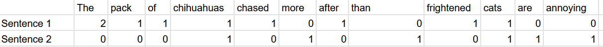

Recall the BoW representation of the two sentences from the previous slide. Now imagine if instead of each document being a single sentence, it was hundreds-- even after stopword removal, very frequent words would still dominate and be considered important. Are they actually important? Probably not. 

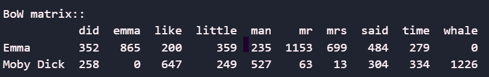

---

### Vectorization: TF-IDF

What if instead of looking at aggregate counts for words, we looked at their *importance* relative to other documents? 

**TF-IDF** calculates a word's importance by multiplying its frequency within a document by a score that increases for words that are rare across the entire collection of documents, and penalises for words that are common across documents. In plain terms: a word matters if it is common in *this* document but rare everywhere else.

::: callout-note
 TF-IDF works best with corpora (a *corpus* is just a collection of texts) containing many medium-length documents (ex: collections of news articles). In general, the more documents we have, the better this method will perform.
:::

#### Some useful libraries (only relevant if you want to try this in code):

::: {.columns}
::: {.column width="50%"}

- **R Language** :

  - SnowballC
  - tidytext

:::
::: {.column width="50%"}

- **Python Language**:

  - Scikit-learn
  - nltk

:::
:::

---

### 2.1.2 Supervised learning statistical frameworks


Supervised methods usually fall into two categories: regression and classification.

- **Regression** is used to predict a number (ex: predicting which year a given court case is from based on its language)

- **Classification** is used to predict a category (ex: predicting if the author of a tweet is a Republican or Democrat)

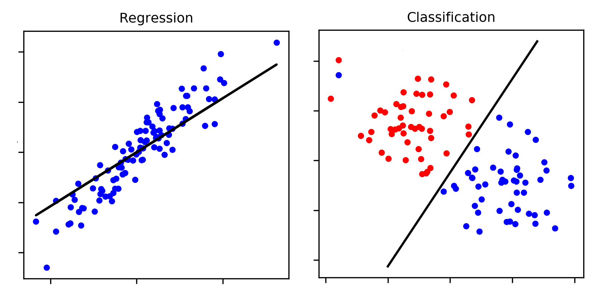

Below, we will provide an overview of a few foundational methods commonly used in supervised learning for text analysis.

---

### Example 1: Naive Bayes Classifier

#### What is Naive Bayes?
- A **Naive Bayes** classifier guesses which category a text belongs to based on probabilities.
- It treats each word as its own **separate clue**, ignoring how words work together (this simplifying assumption is the "naive" part).
- It uses pre-labeled data to learn which words are common in each category, then uses those word clues to sort new, unseen texts.

#### How it works:
1. **Training Phase**: The model calculates the probability of each word appearing in each class (e.g., Jane Austen vs. Herman Melville).
2. **Prediction Phase**: For a new text, the model calculates the probability of it belonging to each class based on the words it contains. It then assigns the text to the class with the **highest probability**.

---

#### Example:
- **Task**: Classify whether a sentence is from Jane Austen or Herman Melville.
- **Sentence**: "The white whale swam in the sea."
- **Key Features**: Counts of words like "white," "whale," "swam," and "sea."

#### Why Melville?
- Words like **"whale"** and **"sea"** are far more common in Melville's writing.
- The model calculates higher probabilities for these words in the **Melville class**.
- **Result**: The sentence is classified as Melville.

#### Strengths:
- It is simple and fast to run.
- It works well with small datasets.

#### Limitations:
- It treats every word as an independent clue, which is not how language actually works.
- It struggles when meaning depends on how words combine.

---

### Example 2: Logistic Regression


#### What is Logistic Regression?

- **Logistic regression** is a statistical method for sorting things into one of two categories (e.g., determining if a sentence belongs to Melville or Austen's works).
- It calculates the probability of an outcome falling into one of two categories using an **s-shaped curve**.

#### Key Features:

- **No Independence Assumption**: Unlike Naive Bayes, logistic regression does not treat each word as a separate clue. Instead, it learns how word clues combine to influence the decision.
- **Learns the Dividing Line**: Rather than building a profile of what each category typically looks like (as Naive Bayes does), it directly learns the boundary that best separates the two categories.

---

#### When to Use:

- **Easy to Interpret**: The model gives each word a score showing how strongly it pushes a text toward one category or the other.
  - Example: A high score on the word "whale" suggests its presence significantly increases the probability of a sentence being classified as Melville's work.
- **Confidence Levels**: Rather than just an answer, it tells you how confident it is (e.g., "90% likely Melville"), which is useful for nuanced decision-making.

#### Strengths:

- Works well when you want to see exactly which words drove the decision.
- Suitable for texts where words combine in complex ways.


:::{.column width="75%"}
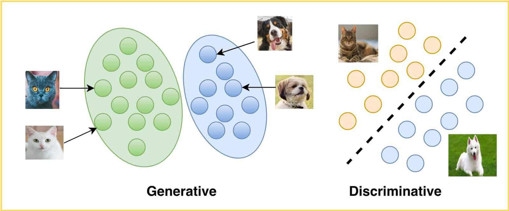
:::

---

### Example 3: Support Vector Machines

#### What is SVM?

- **Support Vector Machines** (SVMs) aim to find the best dividing line between two groups.
- The "best" line is the one that leaves the **widest possible gap** between the groups.

#### Key Features:

- It focuses on the **most difficult-to-classify, borderline cases** (these are called the support vectors).
- It works well even when there are **many different words to keep track of** (e.g., small collections of texts with large vocabularies).

#### When to Use:

- **Many Words, Few Documents**: Small collections of texts with large vocabularies.
- **Clearly Distinct Groups**: When the categories are well-separated.
- **Labels Only**: When you just need an answer, not a confidence level.

#### Strengths:

- It handles thousands of distinct words without trouble.
- It is less resource intensive: it only needs to remember the borderline cases.
- It can draw both straight and curved dividing lines.

#### Limitations:

- It can be thrown off by messy or unusual examples.
- It requires careful adjustment of its settings to work well.

---

### Visual comparison of the three methods on a binary classification task

Below are the results of running each of the three methods discussed on a set of sentences from *Moby Dick* and *Emma*. 

Each dot below is one sentence. We've limited the bag of words vectorizer to the 20 most frequent words, excluding common English stop words. To draw the sentences on a flat chart, we compressed the word counts down to two dimensions using a technique called PCA; sentences that use similar words end up near each other.

::: {.columns}
::: {.column width="33%"}
#### Logistic Regression + PCA
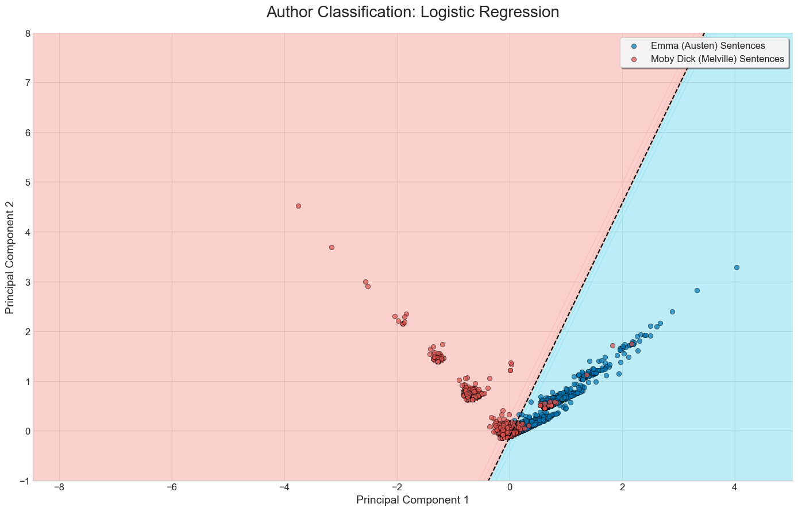
:::
::: {.column width="33%"}
#### SVM + PCA
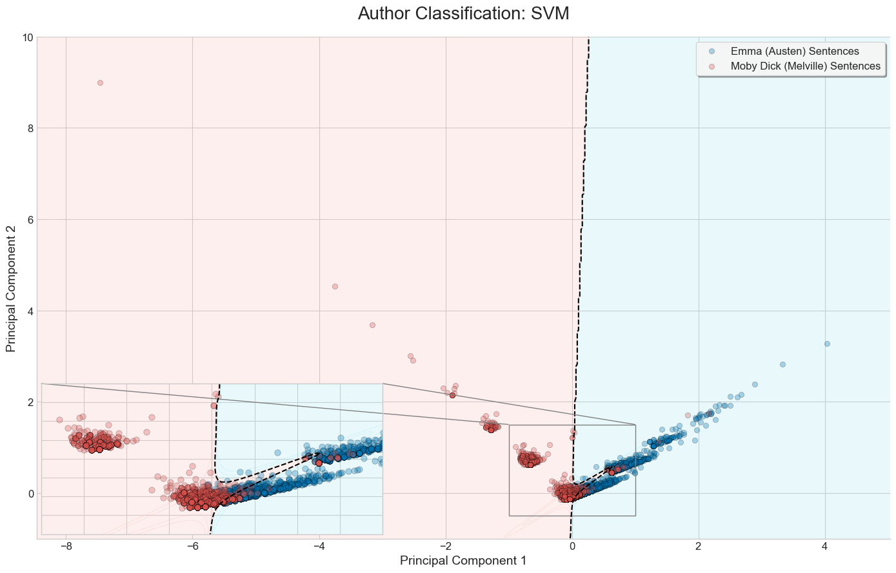
:::
::: {.column width="33%"}
#### Naive Bayes + PCA
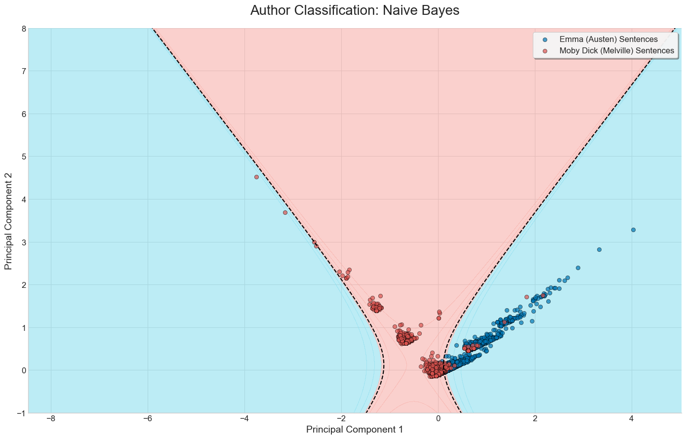
:::
:::

---

### 2.2 Unsupervised learning 


Thus far, all the examples of statistical methods we've covered are instances of **supervised learning**. In supervised learning, we already know what our labels are going to be, the task is assigning the right labels to the right sentences. 

**Problems**: What if we didn't know what our labels were? What if we wanted the labels to emerge from the data itself?

- **Unsupervised learning** uses ML algorithms to discover hidden patterns and structures in our data, based *solely on the data itself*, without any predefined labels to guide the process. 

-  **Examples**: Clustering, topic modelling, word embeddings

---

### 2.2.1 Topic modelling


A **topic** is a label that is assigned to textual data which details the subjects within the text^[Credit to Dr. W.J.B. Mattingly's excellent [guide on topic modelling](https://topic-modeling.pythonhumanities.com/intro.html) for the explanation examples. ]. Consider the following two sentences:

1. French cuisine is some of the best in the world, despite the often lack of spices. 
2. I've always loved Japanese food, mainly because I prefer fish raw rather than cooked. 

What topic would you assign to each of the two texts? "French food" and "Japanese food" might come to mind. What about the next pair of sentences?

1. French cuisine is some of the best in the world, despite the often lack of spices. 
2. Dogs are very loud and unhygienic, yet people still love having them around. 

What topics would you assign now? Even though sentence 1 is the same as in the previous example, a more general description of "food" might make more sense here. 

- The point is that **topics are corpus-specific**. 
- The topics we assign to a given text are not just dependent on the text itself, but on the other texts surrounding it. 

A **cluster** is the formal name for the group of texts that an algorithm identifies as being similar *before* we assign a topic label. The goal of a clustering algorithm is to find these natural groupings in the data automatically, **without any human guidance**. 


---

### 2.2.2 Hard Clustering methods: $k$-means and Hierarchical clustering

We can split clustering methods into two groups: Hard clustering methods and soft clustering methods. 

**Hard clustering methods** assign texts to *a single* topic. For example, a text can either be about food, about dogs, but not both. The two most famous examples of this are k-means and hierarchical clustering.

- **$k$-means Clustering** is the simplest form of clustering: 

  - It starts by placing *k* group centers at random, then keeps adjusting them until each text sits as close as possible to the center of its group. 
  - $k$-means requires the researcher to set the number of cluster centers, so it's best suited when there's a clear hypothesis about the expected number of clusters. 

- **Hierarchical Clustering** is a method of cluster analysis that seeks to build a hierarchy of clusters. 

  - It groups data points into a tree-like structure, called a dendrogram, without requiring the number of clusters to be predetermined. 
  - The algorithm works by either progressively merging the closest clusters together, or by starting with one giant cluster and progressively splitting it.
  -  A researcher can then decide how many clusters to use by "cutting" the resulting tree at a given height. 

- Use Hierarchical Clustering when the number of natural clusters in the text is unknown, and the primary goal is to simply explore the relationships between documents. Ideal for small(er) datasets. 

---

### 2.2.3 Soft Clustering methods: LDA for topic modelling


**Soft clustering methods**, unlike hard clustering, allow a single text to belong to multiple clusters with varying degrees of membership. This is particularly useful when texts contain overlapping themes or topics. For example, a document discussing "climate change" and "economic policy" could be partially assigned to both clusters. A typical example of this is Latent Dirichlet Allocation.

**Latent Dirichlet Allocation** (LDA) is a popular topic-finding recipe: it discovers topics in a collection of documents by identifying words that frequently appear together. 

- LDA is a *soft clustering* method: it can assign a given text from a corpus to *more than one topic*. 
- LDA works by assuming that each document is a mixture of various underlying topics (and in turn, that each topic is a mixture of words). 
- Then, the algorithm tries to figure out which words belong to which topics, and which topics belong to which documents. 

#### Limitations

- Like K-means, the number of topics must be specified manually, with there being no right answer. It quickly becomes a game of trial and error.

- LDA is ultimately a Bag of Words model, so it doesn't understand context.

---

### 2.2.4 LDA as a method of dimensionality reduction


Despite its limitations, LDA remains a powerful tool for discovering topics and for boiling text down to something simpler (this is called dimensionality reduction). Instead of describing each document by thousands of individual word counts, we can describe it with just a few numbers: how much of each topic it contains.

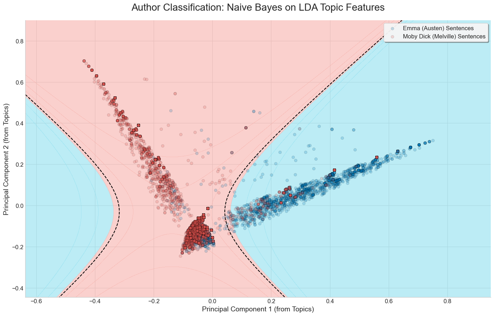

---

### 2.2.5 Embeddings


Recall how we mentioned vectorization methods like BoW and TF-IDF are context insensitive? **Word embeddings are another vector representation of text**, which is context-sensitive. 

In short, a word embedding model reads a massive amount of text and learns to represent each word as a list of numbers (a vector) that captures its meaning, based on the company the word keeps. We can then apply that model to our own collection of texts to generate *context-sensitive* representations. 

- Consider two sentences: "*The film was incredible*" and "*That movie is amazing*". 
  - A BoW model only cares about word counts, so it would conclude that the sentences are completely unrelated (no words are in common!). 
  - With Word2Vec, the word *film* lies closely to *movie* in an embedding space. Likewise, *incredible* and *amazing* sit closely together.

- As word embeddings capture semantic meaning, a word embedding model would correctly notice that the two sentences are quite similar. 

- **Word2Vec** is one of the most popular tools for creating word embeddings. It learns word meanings by playing a guessing game over and over: predict a word from its neighbours.

---

### 2.2.6 Return to unsupervised methods: BERT

The primary issue with Word2Vec is that the resulting representations are *static*: each word gets exactly one fixed meaning, no matter what sentence it appears in. Hence, the representations of the words in "The dog chased after the cat" and "The cat chased after the dog" are identical. 

What if instead we could generate **dynamic embeddings**, that change based on our textual corpus? 

- **Bidirectional Encoder Representations from Transformers (BERT)** generates such dynamic embeddings: 
  - It looks at the entire sentence surrounding a word, weighing the relationship between every word, to work out what that word means in context.
  - Additionally, it keeps track of the exact order of words, so it knows who did what to whom.

- In our "The dog chased the cat" and "The cat chased the dog" examples, BERT would correctly understand that the subject-object roles are reversed, and hence assign two different meanings. 

::: {.columns}
::: {.column width="80%"}
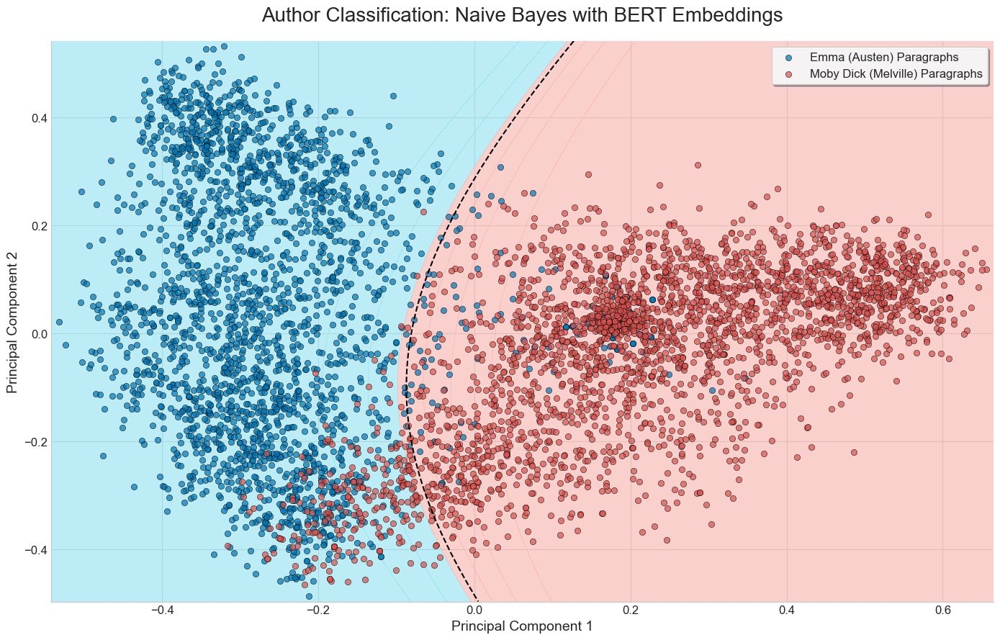
:::
:::

---

### 2.3 Natural Language Processing


**Natural Language Processing (NLP)** is a branch of AI enabling computers to understand, interpret, and generate human language. It combines the scientific study of language with machine learning. 

NLP plays a critical role in computational text analysis by providing the tools and techniques to process and analyze large volumes of unstructured text data: 

- NLP enables the extraction of meaningful patterns and insights from text.
- NLP makes computational text analysis scalable and efficient, allowing researchers to analyze vast corpora of text data, identify trends, and make data-driven decisions.

As we delve deeper into computational methods, we will see how NLP bridges the gap between raw text and actionable insights. 

---

### 2.3.1 Dependency Relationships


At the core of NLP is the concept of dependency. **Dependency** analysis examines the grammatical structure of a sentence to find which words are related and how.  

- Each word's grammatical role—such as subject, verb, or object—contributes to the overall structure of the sentence.  
- **Example**: In the sentence "He bought a car," the verb "bought" links all of the other words.  
  - "He" is the subject.  
  - "The car" is the object.  
- Dependency parsing is the process by which these relationships are mapped out, creating a visual structure (called a parse tree).  
- Parse trees make the underlying grammatical links explicit.  
- In computational linguistics and NLP, identifying these dependencies is fundamental for tasks like:  
  - Machine translation  
  - Question answering  
  - Summarization  

An example of a parse tree for "He bought a new car."

:::{.column width="70%"}
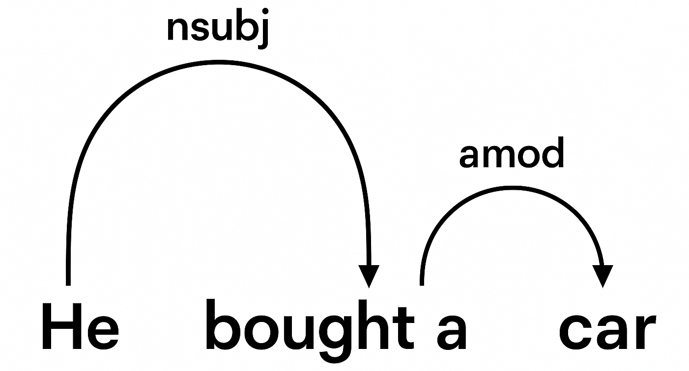.
:::

These parse trees help explain meanings in complex sentences for the computer. They make a map of semantic meaning. 

---

### 2.3.2 Named Entity Recognition (NER) / Object Detection 


**Named Entity Recognition (NER)** is a technique in NLP that identifies and classifies named entities in text into predefined categories like person, organization, location, dates. 

- A **named entity** is a real-world object that can be denoted with a proper name, for instance:
  - The University of British Columbia 
  - Vancouver
  - August 20 
- These categories can include, but are not limited to, names of individuals, organizations, locations, expressions of times, quantities, medical codes, monetary values and percentages, among others. 
- Essentially, NER is “the process of taking a string of text (i.e., a sentence, paragraph or entire document), and identifying and classifying the entities that refer to each category." (IBM)

There are two steps in this process:

1. Identifying the entity
2. Categorizing the entity 

An example of this could be scanning a stock market report and extracting names of stocks and dates:

::: {.columns}
::: {.column width="70%"}
](media/Named-Entity-Recognition.jpg)
:::
::: {.column width="50%"}
:::
:::

---

### 2.3.3 Grammatical Parsing


- **Grammatical parsing** is the process of examining the grammatical structure and relationships inside a given sentence or text.  
  - It involves analyzing the text to determine the roles of specific words, such as nouns, verbs, and adjectives, as well as their interrelationships (Intellipaat).  

- Rather than simply identifying individual words like in Named Entity Recognition:  
  - Grammatical parsing uncovers how those words fit together.  
  - A significant part of this process is the parse tree, which helps the computer understand the structure.  

- One possible technique is **Top-Down Parsing**:  
  - Begins with the whole sentence and works downward.  
  - Breaks the sentence into smaller and smaller grammatical pieces, much like diagramming a sentence in a grammar class.  
  - Checks that the sentence fits the grammar rules of the language.  
  - Keeps going until every individual word has been matched to a grammatical role.  

#### Example

- **Sentence**: "John is playing a game"
- **Grammatical Form**: *Sentence = S = Noun Phrase (NP)  + Verb Phrase (VP) + Preposition Phrase (PP)*

:::{.column width="80%"}
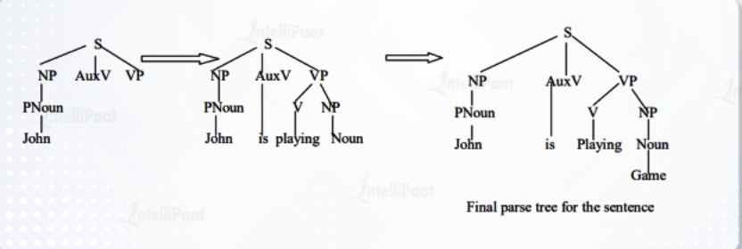
:::

In the image above the Top-Down Parser looks through identifying that John is a noun, then moves back up and examines the next word until it finally reaches a full sentence structure. 

---

### 2.4 Recent Updates

#### Learning goals (2–3 minutes)

- Differentiate **encoder** vs **decoder** style models at a glance
- Understand **what NLI is** and how it enables **zero-shot** labeling
- Know the four **modern workflows**: zero-shot, few-shot, **RAG**, fine-tuning
- Grasp **privacy trade-offs**: APIs, chat, local vs. cloud

Before diving into Large Language Models (LLMs) and their specific methods, let’s zoom out and see the **big picture of transformer families** (the brains behind LLMs). 

---

### Encoders vs. Decoders: Three Families of Transformer Models  


Think of transformers as "readers" and "writers".  

1. **Encoder-only**: the readers which are best at understanding text, such as BERT and RoBERTa.  
2. **Decoder-only**: the writers which are best at generating text such as GPT, Claude and LLaMA.  
3. **Encoder–decoder**: readers + writers which are best at transforming one text into another (translation, summarization), such as T5 and BART.  


#### Typical use of each form
:::{.smaller style="font-size: 0.8em;"}
| **Model Type**      | **Examples**           | **Strengths**                                                            | **Weaknesses**                                                    | **Typical Use Cases**                                                               |
| ------------------- | ---------------------- | ------------------------------------------------------------------------ | ----------------------------------------------------------------- | ----------------------------------------------------------------------------------- |
| **Encoder-only**    | BERT, RoBERTa, DeBERTa | Deep understanding of text; strong at context                            | Cannot generate long text                                         | Classification (sentiment, spam, topics), NLI, embeddings, Named Entity Recognition |
| **Decoder-only**    | GPT-3, GPT-4, LLaMA    | Strong text generation; fluent and creative                              | Weaker at fine-grained text understanding; risk of hallucinations | Chatbots, drafting, coding, summarization, open Q&A                                 |
| **Encoder–decoder** | T5, BART, MarianMT     | Excellent at transforming input into output; strong for structured tasks | More complex training; higher computational requirements          | Machine translation, summarization, question answering                              |
:::


<!-- Presenter note:
Keep this short: “We’re covering concepts only. Think ‘what exists and why it matters.’”
-->

---

### 2.4.1 Natural Language Inference (NLI) and Zero-Shot Learning


**What is Natural Language Inference (NLI)?**
Natural Language Inference (NLI) is a task where a model is given two sentences and must decide if the second sentence makes sense based on the first.

- **Premise** = the original statement.  
- **Hypothesis** = the statement we want to check against the premise.  

The model has to choose between three possibilities: 

1. **Entailment (Yes)** — the hypothesis fits with the premise.  
2. **Contradiction (No)** — the hypothesis clashes with the premise.  
3. **Neutral (Maybe)** — there isn’t enough information to decide.  

---

### Example of NLI


| Premise                    | Hypothesis                   | Answer Type            | Why?                                                   |
| -------------------------- | ---------------------------- | ---------------------- | ------------------------------------------------------ |
| A man is riding a bicycle. | A man is outdoors.           | **Entailment (Yes)**   | Riding a bike usually implies being outside.           |
| A man is riding a bicycle. | A man is swimming.           | **Contradiction (No)** | You cannot ride a bike and swim at the same time.      |
| A man is riding a bicycle. | The man is wearing a helmet. | **Neutral (Maybe)**    | The premise doesn’t tell us if he is wearing a helmet. |


This task is important because it shows the model isn’t just matching words, it’s making an **inference about meaning (reasoning)**.

---

### From NLI to Zero-Shot Learning  

Now imagine this: A student is able to pass an exam on a subject they’ve never studied. They do it by **generalizing** knowledge from other subjects.  

Zero-Shot Learning (ZSL) works the same way for AI. Instead of needing thousands of training examples for a task, we can reframe classification as an NLI problem:  

- The **premise** is the text we want to classify.  
- The **hypotheses** are the possible labels, rewritten as simple sentences.  
  - Example: *"This review is positive."*, *"This review is negative."*, *"This review is neutral."*  

The model then tests: *Does the premise support this hypothesis?* The one that fits best is then chosen as the label.  

#### Example

- Premise: *"The café’s coffee is absolutely amazing!"*  
- Hypotheses:  
  1. *"This review is positive."*  
  2. *"This review is negative."*  
  3. *"This review is neutral."*  
- Model's answer: **Positive** — no labeled training data required.

---

### Why BERT Matters for NLI and Zero-Shot

For years, teaching computers to classify text meant building huge labeled datasets. You had to hand-code thousands of examples, as you had to teach the student (the model) before it could pass the exam. This was expensive and time-consuming.

This changed with **BERT (Bidirectional Encoder Representations from Transformers)**

- Released by Google in 2018 [Original Paper: *BERT: Pre-training of Deep Bidirectional Transformers for Language Understanding* (Devlin et al., 2018)](https://arxiv.org/abs/1810.04805), it was the first widely adopted **encoder-only transformer**.  
- Reads text in **both directions** (left-to-right and right-to-left), capturing full context.  
- Pretrained on large text corpora, then fine-tuned for specific tasks.  

#### Why it was a breakthrough  
- Earlier models only saw text one way or used static word embeddings.  
- BERT allowed deep understanding of meaning in context (e.g., “bank” in “river bank” vs. “bank account”).  
- Set new performance records on tasks like NLI, question answering, and classification.  
- Remains the backbone of modern **zero-shot and inference tasks**.  

---

### With NLI-based zero-shot methods, we can: 

- **Scale** human codebooks or categories across a very large corpus.  
- **Prototype quickly**: test out categories before committing to labeling thousands of documents.  
- **Explore free-text responses** in surveys or interviews without heavy preprocessing. You don't need to read an entire review to tell the customer is unhappy. 

These methods are powered by **encoder-only transformers (models designed mainly to read text)** like BERT, RoBERTa, and DeBERTa, which are strong at understanding relationships between sentences. 

- **Before 2020**: Zero-shot classification was rare because models lacked the scale and pretraining needed to generalize without labeled examples (They weren't smart enough). 
- **Now**: With strong NLI models, we can classify text cheaply and effectively even without training data (teaching the model). 

#### Applications

- Identifying harmful or discriminatory language in online communities  
- Grouping open-ended survey responses into themes (positive, negative, political, etc.) 
- Quickly scanning archival or policy documents for relevant topics  

---

### Beyond Text: Zero-Shot in Vision

Zero-shot learning is not just for text. 

- Vision-language systems combine images and text in the same "meaning space". 
- This allows a model to classify **images it has never seen before** using natural-language descriptions.  

For example, given a new photo of an animal, the model can choose between descriptions like *"a photo of a zebra"* or *"a photo of a horse"* even if "zebra" was never explicitly labeled in its training data.  

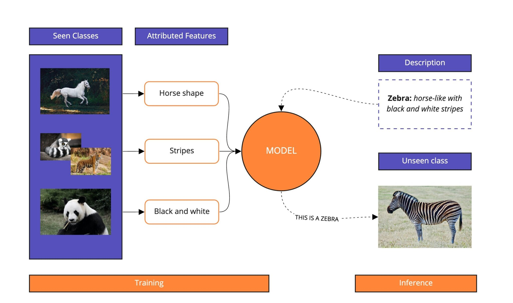{fig-align="center" width="80%"}

---

### 2.4.2 Classification and discovery using decoder only models

#### What are they? 
Decoder-only transformers (pattern matchers like GPT) generate text one word at a time. With the right prompts, they can **classify, summarize, or find patterns**.

#### Why it matters:  
- Works without special training for many tasks.   
- Lets us explore and scale categories quickly.  
- Used in most modern chatbots and APIs (ChatGPT, Claude, Llama, etc.).

###### Using these models in practice :

**APIs vs. Chat**  
- *APIs*: They allow you to connect the model to your own system. Good for automation.  
- *Chat UIs*: Easy to use and quick. Good for testing ideas. 
**Local vs. Cloud**  
- *Local*: data stays private; needs hardware. 
- *Cloud*: easy access; data leaves your system.  

**Applications**  
- Auto-tagging document and moderating text   
- Detecting customer intent in messages   
- Drafting summaries and themes  

::: callout-important
**Watch outs**
- Models can “hallucinate” (make things up).
- Results depend on how you phrase the prompt.
- Privacy risks if data leaves your system.
- Costs add up if used at scale. 
:::

---

### 2.4.2.1 Four Ways to Guide Large Language Models 

There are **four main ways** we can get large language models (LLMs) to handle classification or generation tasks. They range from the simplest, asking the model directly (such as when we generally use ChatGPT), to the most advanced -- retraining it on your own data (teaching a model). 

1. **Zero-shot** : Ask the model directly. No training data.  
  *Example:* "Classify this as positive or negative."
2. **Few-shot** : Add a handful of examples to guide the model.  
  *Example:* Show 3 labeled reviews, then give it a new one.
3. **RAG (Retrieval-Augmented Generation)** : Model looks up facts from your own documents and uses what it already knows.  
  *Why:* reduces "hallucinations" and keeps answers grounded.
4. **Fine-tuning** : Retrain the model on your data (eg. specialising in Legal text)  
  *Best for:* consistent style, domain knowledge, large-scale use.

::: callout-tip
Think of it as a ladder:  
Start with **zero-shot**, move up to **few-shot**, then **RAG**, and finally **fine-tuning**. Each step gives the model more guidance.
:::

---

### 2.4.2.2 LLMs: APIs vs. Chat-Based Interfaces  

:::{.larger style="font-size: 1.2em;"} 
LLMs can be used in **two main ways**: 

1. **APIs** to connect the model into your own systems.  
2. **Chat-based interfaces** interact directly through a conversational window.

Both have strengths and weaknesses, depending on their applications. 
:::

---

### APIs (Application Programming Interfaces)  

Think of an API as a "pipeline": You send text to the model in the background, and it sends a response back. There is no chat window, it runs quietly inside your systems.  

#### Strengths

- It's great for **automation** (batch jobs, workflows, scheduled tasks).  
- Can **integrate with existing apps** (e.g., surveys, chatbots, customer support).  
- Scales to handle **large datasets** consistently.  

::: callout-note
**Use Case: Parliamentary Debates with APIs**  
Suppose you have thousands of pages of parliamentary debate transcripts. An API can automatically sort speeches into categories like **economic policy**, **immigration**, or **climate change** — without hand-labeling every document.  

This helps researchers trace how issues rise and fall over time, while still leaving room for close reading of key passages.
:::

#### Limitations 

- Needs **technical setup** (developers, coding, integration).  
- Not designed for **interactive exploration**: instead of "chatting", you send structured requests, usually in the form of code. 

---

### Chat-Based Interfaces 

This is the familiar **conversational window** — you type, the model replies.  

#### Strengths

- Extremely **intuitive** — no setup required.  
- Perfect for **brainstorming, Q&A, and demos**.  
- Great for **quick experiments** when you want to test an idea on the fly.  

#### Limitations

- Harder to **scale or automate** (each interaction is manual).  
- Answers may be **less consistent** in formatting compared to API outputs.  

###### Why This Matters
- **APIs** = best for *quiet, large-scale automation and production systems*.  
- **Chat** = best for *human-in-the-loop exploration and design*.  

In practice, most research teams combine both approaches:

- Use **chat interfaces** to quickly test categories or explore how a model interprets a few interview excerpts.  
- Use **APIs** to scale up, applying those same categories across thousands of transcripts, survey responses, or archival documents.  

---

### 2.4.2.3 Local models vs. sending data to a company

#### The choice:

Do you run the model **on your own machine (local)**, or do you **send data to a company’s servers (cloud/hosted APIs)**?

::: callout-important
**UBC Policy Reminder**  
All researchers at UBC must follow UBC's data security and privacy rules:

- Only certain AI models and platforms are permitted for research use.  
- Models that send data outside Canada (e.g., some commercial APIs) are restricted.  
- For instance tools like *DeepSeek* are **not approved** for handling research data.  
- When in doubt, consult UBC’s [Research Ethics Board](https://ethics.research.ubc.ca/) or IT guidelines before uploading sensitive material.  

**Rule of thumb:** If your data includes interviews, transcripts, or personal information, you likely need to keep it local or use UBC-approved services.
:::

---

### Local Models

- Data stays in your own environment, so you have more **privacy & control**.  
- No outside company sees your text.  
- Good for sensitive data (health, finance, legal).  
- Downsides: needs **hardware (GPUs, storage)** and technical setup.


### Cloud / Hosted APIs

- Example: OpenAI, Anthropic, Google, Microsoft.  
- **Fast start, easy to use**; no setup needed.  
- Access to **state-of-the-art** models.  
- Downsides: data leaves your system, subject to **company policies**.  
- Pay per use; can be expensive at scale. 

::: callout-important
**Cost Considerations: APIs at Scale**

When using APIs, pricing is typically based on the number of *tokens* (small chunks of text) processed. As of July 15, 2026, the flagship models from the two largest providers charge:

- **OpenAI GPT-5.6 (Sol)**: approximately **$5 per 1 million input tokens** and **$30 per 1 million output tokens**.
- **Anthropic Claude Opus 4.8**: approximately **$5 per 1 million input tokens** and **$25 per 1 million output tokens**.

**Example Scenario:** A company processes **10,000 customer reviews daily**, with each review consisting of 100 input tokens and generating 50 output tokens.

- For Claude Opus 4.8:
  - Input cost = (10,000 × 100) / 1,000,000 × $5 ≈ **$5**
  - Output cost = (10,000 × 50) / 1,000,000 × $25 ≈ **$12.50**
  - **Total Daily Cost ≈ $17.50 → Monthly Cost ≈ $525**

Understanding these costs is essential for budgeting and scaling API usage effectively. Prices change quickly (and both providers offer smaller models at a fraction of these flagship rates), so always check the providers' current pricing pages before budgeting a project.
:::

---

### Quick Comparison

| Local Models              | Cloud/Hosted APIs       |
|---------------------------|-------------------------|
| Privacy & control         | Easy & instant access   |
| Needs hardware setup      | No setup needed         |
| Good for sensitive data   | Best models available   |
| Higher upfront effort     | Ongoing usage costs     |

::: callout-important

**Rule of thumb:**

- If privacy is critical use a **local model**.  
- If speed & cutting-edge accuracy matter use **cloud APIs**.  
:::

---

### 2.5 AI ethics


Another very important component of doing text analysis and working with Artificial Intelligence more generally is **AI Ethics**. From IBM: 

> "Examples of AI ethics issues include data responsibility and privacy, fairness, explainability, robustness, transparency, environmental sustainability, inclusion, moral agency, value alignment, accountability, trust, and technology misuse."

- Being mindful of AI ethics is present in all fields, but an example closer to text analysis is how NLP technologies interpret, classify, and often generate human language which is deeply tied to culture, and identity. 
- Without proper ethics considerations these technologies can create biases and discriminate. 
- All pre-trained word embedding models are inherently biased because they learn patterns from large corpora which can often reflect social or historical inequalities.
- An example of this could be linking certain jobs with one gender or groups with a stereotype.

Some solutions to this are:

- Training a model from scratch with carefully curated data (which can be very costly). 
- You can also attempt to use bias mitigation techniques, like fine-tuning the model or using special training methods designed to counteract bias. 

Both of these techniques still do not fully eliminate the bias just mitigate it, so it is important to acknowledge and clearly flag the bias in any work you are doing. This allows readers to understand the limitations of the model and have a greater understanding of the results. 

---

### A Real World Example 

[Read More](https://www.reddit.com/r/changemyview/comments/1k8b2hj/meta_unauthorized_experiment_on_cmv_involving/)

A current case of AI Ethics being neglected comes from the sub-reddit [r/changemyview](https://www.reddit.com/r/changemyview/). Where researchers from the University of Zurich conducted an unauthorized experiment to study AI-driven persuasion on real people. They used bots who posed as real people in order to try to persuade real people to change their world views, and posted over 1,700 comments. 

These AI bots pretended to be many things including:

* AI pretending to be a victim of rape
* AI acting as a trauma counselor specializing in abuse
* AI accusing members of a religious group of "caus[ing] the deaths of hundreds of innocent traders and farmers and villagers."
* AI posing as a black man opposed to Black Lives Matter
* AI posing as a person who received substandard care in a foreign hospital.

### Results of the case

- This study went against the rules posted on r/changemyview and a complaint was filed against the University of Zurich and the Institutional Review Board (IRB). Even the IRB is not perfect as the study received IRB approval beforehand. 

- This case reached the news being published in the Washington Post, Atlantic and Science.org. 

- Following the news and intense criticism the researchers apologized and decided not to publish the formal results. 

The bottom line is **whenever performing any kind of research it is essential to be aware of ethics and proper conduct**.

## 3. Sources

- National University Library. [Coding Qualitative Data Guide](https://resources.nu.edu/c.php?g=1007180&p=7392331). Accessed 2025-08-18.

- National University Library. [Dissertation Center — Analysis and Coding Example: Qualitative Data](https://resources.nu.edu/c.php?g=1007180). Accessed 2025-08-18.

- Amazon. [Amazon Mechanical Turk](https://www.mturk.com/). Accessed 2025-08-18.

- Prolific. [Prolific for Academic Researchers](https://www.prolific.com/academic-researchers). Accessed 2025-08-18.

- Delve. [The Essential Guide to Coding Qualitative Data](https://delvetool.com/guide). Accessed 2025-08-18.

- Chen, M., Aragon, C., et al. [Using Machine Learning to Support Qualitative Coding in Social Science Research](https://faculty.washington.edu/aragon/pubs/hcml-qualitative-coding-ml-chen-acm-tiis-Mar2018.pdf). ACM Transactions on Interactive Intelligent Systems, 2018.

- Mattingly, W. J. B. [Topic Modeling for the People](https://topic-modeling.pythonhumanities.com/intro.html). Accessed 2025-08-18.

- Antoniak, M. [Topic Modeling for the People (Practical Guide)](https://maria-antoniak.github.io/2022/07/27/topic-modeling-for-the-people.html). Accessed 2025-08-18.

- Springer. [Word Embeddings (Book Landing Page)](https://link.springer.com/book/10.1007/978-3-031-02177-0). Accessed 2025-08-18.

- IBM. [What is Natural Language Processing?](https://www.ibm.com/think/topics/natural-language-processing). Accessed 2025-08-18.

- Amazon Web Services. [What is NLP?](https://aws.amazon.com/what-is/nlp/). Accessed 2025-08-18.

- Towards Data Science. [Natural Language Processing: Dependency Parsing](https://towardsdatascience.com/natural-language-processing-dependency-parsing-cf094bbbe3f7/). Accessed 2025-08-18.

- IBM. [What is Named Entity Recognition?](https://www.ibm.com/think/topics/named-entity-recognition). Accessed 2025-08-18.

- LINCS Project. [Named Entity Recognition](https://lincsproject.ca/docs/terms/named-entity-recognition). Accessed 2025-08-18.

- Intellipaat. [What is Parsing in NLP?](https://intellipaat.com/blog/what-is-parsing-in-nlp/). Accessed 2025-08-18.

- Cogito Tech. [Named Entity Recognition Overview](https://www.cogitotech.com/natural-language-processing/named-entity-recognition/). Accessed 2025-08-18.

- Sánchez, Y. [Zero-Shot Text Classification](https://medium.com/@asanchezyali/zero-shot-text-classification-c737db000005). Accessed 2025-08-18.

- Modulai. [Zero-Shot Learning in NLP](https://modulai.io/blog/zero-shot-learning-in-nlp/). Accessed 2025-08-18.

- Wikipedia. [Zero-shot learning](https://en.wikipedia.org/wiki/Zero-shot_learning). Accessed 2025-08-18.

- Devlin, J., Chang, M.-W., Lee, K., & Toutanova, K. [BERT: Pre-training of Deep Bidirectional Transformers for Language Understanding](https://arxiv.org/abs/1810.04805). arXiv preprint, 2018.

- IBM. [AI Ethics: Principles and Practices](https://www.ibm.com/think/topics/ai-ethics). Accessed 2025-08-18.

- Reddit. [Unauthorized Experiment on r/changemyview](https://www.reddit.com/r/changemyview/comments/1k8b2hj/meta_unauthorized_experiment_on_cmv_involving/). Accessed 2025-08-18.

- Science.org. [Unethical AI Research on Reddit Under Fire](https://www.science.org/content/article/unethical-ai-research-reddit-under-fire). Accessed 2025-08-18.
