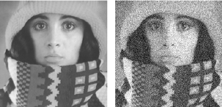
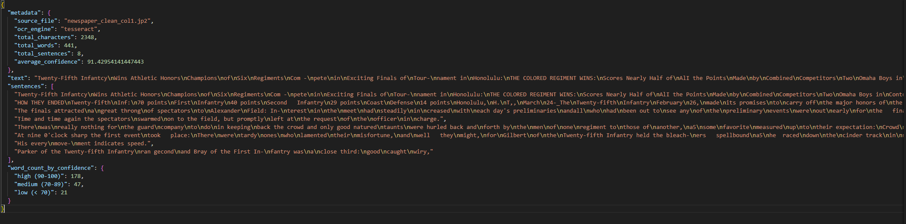

## Setup and Library Loading

Before we begin, we need to install and import the necessary libraries. This notebook uses several Python packages for OCR, image processing, and text analysis.

::: {.callout-tip}
**Installation Note:** If you're running this notebook for the first time, uncomment and run the installation commands below. Some libraries require additional system dependencies:

- **Poppler**: Required for PDF conversion - install via `conda install poppler` or system package manager
:::

Install the necessary packages: 
```{python}
# Uncomment the line below to install packages:
#!pip install pytesseract easyocr opencv-python Pillow matplotlib pandas numpy nltk jiwer pdf2image surya-ocr poppler anthropic
```

Load the required packages:
```{python}
import os
import re
os.environ["KMP_DUPLICATE_LIB_OK"] = "TRUE" # avoid OpenMP conflicts between libraries
import json
import warnings
warnings.filterwarnings('ignore')
import copy
from PIL import Image, ImageDraw, ImageFont
import cv2
import numpy as np
import easyocr
import pandas as pd
import matplotlib.pyplot as plt
import nltk
from nltk.tokenize import word_tokenize, sent_tokenize
from nltk.stem import PorterStemmer, WordNetLemmatizer
from jiwer import wer, cer
from pdf2image import convert_from_path
import gc
import torch
from surya.foundation import FoundationPredictor
from surya.recognition import RecognitionPredictor
from surya.detection import DetectionPredictor
from surya.layout import LayoutPredictor
from surya.settings import settings
nltk.download('punkt')
nltk.download('wordnet')
nltk.download('averaged_perceptron_tagger')
```

Here we define helper functions for loading and displaying images, and prepare the output directory. These functions will help us a lot throughout the notebook. 

```{python}
def load_image(path):
    #Load an image from pdf, jp2, tif, jpg, or png and return as RGB numpy array.
    if path.endswith('.pdf'):
        from pdf2image import convert_from_path
        pages = convert_from_path(path, dpi=300)
        return np.array(pages[0])
    else:
        img = Image.open(path)
        if img.mode != 'RGB':
            img = img.convert('RGB')
        return np.array(img)

def display_image(img, title="Image", figsize=(10, 8)):
    plt.figure(figsize=figsize)
    if len(img.shape) == 2:
        plt.imshow(img, cmap='gray')
    else:
        plt.imshow(img)
    plt.title(title)
    plt.axis('off')
    plt.tight_layout()
    plt.show()
    plt.close()

def display_images_side_by_side(img1, img2, title1="Before", title2="After", figsize=(14, 6)):
    fig, axes = plt.subplots(1, 2, figsize=figsize)

    if len(img1.shape) == 2:
        axes[0].imshow(img1, cmap='gray')
    else:
        axes[0].imshow(img1)
    axes[0].set_title(title1)
    axes[0].axis('off')

    if len(img2.shape) == 2:
        axes[1].imshow(img2, cmap='gray')
    else:
        axes[1].imshow(img2)
    axes[1].set_title(title2)
    axes[1].axis('off')

    plt.tight_layout()
    plt.show()
    plt.close()

os.makedirs('output', exist_ok=True)
print("Output directory ready: ./output/")
```

## Introduction

Before we begin it is important to define how a computer can read text in the first place.

### Digitized Text vs. Machine-Readable Text

Humans and computers see text, and images differently. When you open a scanned document or a photograph of a page on your computer, you can read the words on screen but your computer cannot. You can see the context and what the image or text represents from a computer's perspective there is no difference from a photograph of a landscape. In this case images are treated as visual, pixel-based graphics which are rendered onto your computer monitor, but the computer does not know exactly what it is rendering the same way a human viewing the images does. It could be a picture of your family, the ocean, a letter or a painting. 

**Machine-readable text**, by contrast, is stored as character data (e.g., Unicode, or ASCII ) that software can search, sort, count, and analyze. A PDF or a Word document already contains machine-readable text. A normal picture does not. This distinction matters because nearly every computational text-analysis method (keyword search, topic modeling, named-entity recognition, embeddings) requires machine-readable text as input. If your source material exists only as images (scans, photographs, microfilm captures), you need a way to bridge the gap. That is exactly what OCR does.

### What is OCR?

**Optical Character Recognition (OCR)** is the technology that converts different types of documents: scanned paper documents, photographs of text, or images containing text into editable and searchable digital text.

For humanities researchers, OCR opens up vast archives of historical documents, enabling:

- **Digitization**: Converting physical archives into searchable digital collections
- **Corpus Building**: Creating large text datasets for computational analysis
- **Accessibility**: Making historical documents searchable and accessible to researchers worldwide
- **Text Mining**: Enabling large-scale analysis of historical texts

### What You'll Learn

By the end of this notebook, you will be able to:

1. **Understand OCR vs VLM** and be able to choose which model/tool to use
2. **Extract text** from historical documents using EasyOCR and Surya OCR
3. **Pre-process images** to improve OCR accuracy
4. **Handle complex document layouts** like multi-column newspapers
5. **Evaluate OCR quality** using standard metrics (CER, WER, Confidence Intervals)
6. **Post-process OCR output** for downstream analysis
7. **Scale your workflow** for batch processing

## Part 1: Traditional OCR

### 1.1 What is Text Extraction?

Text extraction from documents falls into three main categories:

1. **Printed Text**: Machine-generated text (newspapers, books, typed documents)
   - Best suited for traditional OCR engines
   - High accuracy achievable with good quality scans

2. **Handwritten Text**: Human-written manuscripts, letters, notes
   - Requires specialized HTR models
   - Accuracy varies significantly based on handwriting style

3. **Mixed Content**: Documents with text, illustrations, tables
   - Requires layout analysis before text extraction
   - May need different approaches for different regions

#### Available OCR Tools

| Tool | Type | Strengths | Best For |
|------|------|-----------|----------|
| **Tesseract** | Open-source | Fast, accurate on clean text | Printed documents |
| **EasyOCR** | Open-source | Multi-language, deep learning | Diverse scripts |
| **Surya OCR** | Open-source | Multi-language, layout detection, CPU-friendly | Complex layouts |
| **Transkribus** | Freemium | Excellent HTR, crowdsourcing | Handwritten documents |
| **Azure Document Intelligence** | Paid | Enterprise-grade, form extraction | Business documents |
| **AWS Textract** | Paid | Table extraction, scalable | Structured documents |

### 1.2 How Does Traditional OCR Work?

Traditional OCR systems convert images of text into machine-readable characters through a multi-stage pipeline. While early OCR relied on template matching (comparing characters against a library of known fonts), modern tools like EasyOCR and Tesseract use deep learning to achieve far greater accuracy.

#### The OCR Pipeline

Most OCR systems follow a two-stage process:

1. **Text Detection**: First, the system locates *where* text appears in the image. This involves identifying bounding boxes around words, lines, or paragraphs. Deep learning models scan the image and predict regions likely to contain text, even when text is rotated, curved, or partially obscured.

2. **Text Recognition**: Once text regions are detected, a separate model reads *what* the text says. This typically uses a neural network architecture called a **CRNN (Convolutional Recurrent Neural Network)** that processes the image sequence and outputs a string of characters. You can read more about CNN's at [A Related Notebook](https://ubcecon.github.io/praxis-ubc/docs/intro_to_cnns/intro_to_cnn.html). 

#### Why Deep Learning Changed OCR

Traditional template-matching OCR required near-perfect conditions: clean scans, standard fonts, and horizontal text. Deep learning models learn patterns from millions of examples, enabling them to:

- Recognize text in varied fonts, sizes, and styles
- Handle noise, blur, and degradation common in historical documents
- Detect text at any angle or orientation
- Generalize to scripts and languages they weren't explicitly programmed for

**EasyOCR** specifically uses a CRAFT (Character Region Awareness for Text) detector for finding text, paired with a CRNN-based recognizer. This combination makes it particularly effective for documents with complex layouts or mixed content.

### 1.3 EasyOCR Demo

**EasyOCR** is a newer, deep-learning-based OCR library that supports 80+ languages. It provides built-in support for detecting text regions.

::: {.callout-warning}
**GPU Acceleration**: EasyOCR can use GPU for faster processing. If you have a CUDA-capable GPU, it will be automatically detected. On CPU, processing may take a few seconds.
:::

We will first load our sample image, a clean newspaper column:
```{python}
img_path = "data/simple/newspaper_clean_col1.jp2"
img = load_image(img_path)
display_image(img, title="Sample Newspaper Column", figsize=(8, 12))
```

This is just one vertical column of clear text, for this notebook this will act as our most basic example. 

We load the EasyOCR package and set it to read English with `easyocr.Reader(['en'])`.
```{python}
reader = easyocr.Reader(['en'], gpu=False) 
```

```{python}
results = reader.readtext(img)

print(f"EasyOCR detected {len(results)} text regions")
print("\nFirst 10 detections:")
for i, (bbox, text, conf) in enumerate(results[:10]):
    print(f"  {i+1}. '{text}' (confidence: {conf:.2%})")

extracted_text = '\n'.join([text for (bbox, text, conf) in results])

ocr_df = pd.DataFrame({
    'text': [text for (bbox, text, conf) in results],
    'conf': [conf * 100 for (bbox, text, conf) in results]
})

print(f"\nTotal text length: {len(extracted_text)} characters")
print(f"Average confidence: {ocr_df['conf'].mean():.1f}%")
```

EasyOCR scanned the newspaper image and identified 246 separate regions containing text, returning each one with its bounding box coordinates, the recognized text, and a confidence score. 

##### Confidence Metrics

Confidence scores are numerical metrics; typically ranging from 0 to 1 (0% to 100%) which indicates an AI or machine learning model's level of certainty in its prediction or classification. They represent the probability that the model's output is correct. A more technical definition is that: When an OCR model predicts a character, it computes a softmax probability distribution over all possible output classes. The confidence score is the maximum probability (the model's estimated likelihood that its top prediction is correct). For example if an OCR model sees a deformed or smudged **e** it does not say immediately that it is an e, but calculates a probability for all characters (e,c,a,7,.,0 etc). The confidence score we see is the highest value of this prediction. 

Crucially **confidence scores are not accuracy**, softmax normalizes over the model's known vocabulary, not over ground truth. It is a valuable metric, but do not overly rely on it or tunnel vision on pushing the highest confidence. Low confidence is often more informative than high, it gives insights on the model's true uncertainty. 

#### Visualizing EasyOCR Bounding Boxes

One advantage of EasyOCR is that it provides polygonal bounding boxes that can better fit rotated or curved text:

```{python}
img_with_boxes = img.copy()

for (bbox, text, conf) in results:
    pts = np.array(bbox, dtype=np.int32)
    color = (0, int(255 * conf), int(255 * (1 - conf))) # green=high, red=low
    cv2.polylines(img_with_boxes, [pts], isClosed=True, color=color, thickness=2)

display_image(img_with_boxes, title="EasyOCR Text Detections (Green=High Conf, Red=Low Conf)", figsize=(10, 14))
```

We can very clearly visually see the way in which EasyOCR is reading the text. Green boxes represent high confidence while red are lower confidence (we do not see any fully red boxes as there are no very low confidence regions).

The overall confidence from EasyOCR is at 91.4% which is not bad, but it is worth keeping in mind that this is a very basic example and the model is still making some mistakes. If we were to use a more difficult sample EasyOCR will struggle. 


### 1.4 Paid Tools Overview

While open-source tools work well for many use cases, commercial solutions offer additional features:

| Tool | Pricing | Key Features | Best For |
|------|---------|--------------|----------|
| **Transkribus** | Freemium (500 pages/month free) | HTR, crowdsourcing, model training | Historical manuscripts |
| **Arkindex** | Free for researchers | Document processing pipelines | Archives |
| **eScriptorium** | Free (self-hosted) | Medieval manuscripts, collaborative | Academic projects |
| **Azure Document Intelligence** | Pay-per-page (~$1.50/1000 pages) | Form extraction, tables, structure | Business documents |
| **AWS Textract** | Pay-per-page (~$1.50/1000 pages) | Tables, forms, scalable API | Enterprise integration |
| **Google Cloud Vision** | Pay-per-image (~$1.50/1000 images) | Multi-language, handwriting | Diverse content |

## Part 2: Vision Language Models

### 2.1 What Are VLMs?

**Vision Language Models (VLMs)** take a fundamentally different approach to document understanding. Rather than pattern-matching characters like traditional OCR, VLMs understand documents as a whole, interpreting text, layout, and visual context together.

#### Bottom-Up vs Top-Down Approaches

| Approach | Traditional OCR | Vision Language Models |
|----------|-----------------|------------------------|
| **Method** | Character-by-character recognition | Whole-document understanding |
| **Layout** | Separate step | Integrated |
| **Context** | Limited | Full document context |
| **Errors** | Isolated character mistakes | More coherent (or coherently wrong!) |

#### When to Use OCR vs VLMs

**Use Traditional OCR when:**

- Documents are clean and well-formatted
- You need character-level confidence scores
- Processing speed is critical
- Resources are limited

**Use VLMs when:**

- Documents have complex layouts
- Text quality is poor or degraded
- You need to extract structured information
- Handwritten and printed text are mixed

::: {.callout-warning}
**GPU Requirements**: Most VLMs require significant GPU memory (8GB+). For CPU-only systems, consider Surya OCR which works well on CPU.
:::

### 2.2 How Do VLMs Work?

Vision Language Models combine two powerful components: a **vision encoder** that "sees" the image and a **language model** that "reasons" about what it sees. This architecture allows them to understand documents the way humans do; taking in the whole page at once rather than reading character by character.

#### The VLM Architecture

VLMs typically follow a three-stage process:

1. **Visual Encoding**: The image is divided into small patches (like tiles in a mosaic) and processed by a vision encoder. Often a Vision Transformer (ViT). This converts the raw pixels into a sequence of visual embeddings that capture shapes, patterns, and spatial relationships.

2. **Cross-Modal Fusion**: The visual embeddings are combined with text understanding capabilities. This can happen through:
   - **Early fusion**: Visual and text tokens are merged and processed together
   - **Late fusion**: Separate processing streams that combine at the output stage
   - **Cross-attention**: The language model attends to relevant parts of the image when generating text

3. **Text Generation**: A language model (often a transformer decoder) generates the output text, guided by what it "saw" in the image. Because this is a language model, it can produce grammatically coherent text and use context to fill in gaps.

#### Why VLMs "Understand" Documents Differently

Traditional OCR processes text in isolation; each character or word is recognized independently. VLMs take a fundamentally different approach, they have the whole context of the document and can generate correct grammatical sentences based on that context. They also have built-in layout understanding as they can "see" the document. 

For example, if a historical document has a smudged word, traditional OCR might output nonsense characters. A VLM can use surrounding context like the topic of the paragraph, common phrases of the era, grammatical structure in order to infer the most likely word.

**The Trade-off**: VLMs are more powerful but also much more resource-intensive. They excel at understanding *what a document means* but may sometimes "hallucinate" plausible-sounding text that wasn't actually in the image. This will be familiar to anyone who has used ChatGPT or other LLMs in the past. Traditional OCR is more literal. It only outputs what it detects, errors and all.

### 2.3 Surya OCR Demo

**Surya OCR** is a practical middle ground, it uses deep learning (transformer-based models) but works well on CPU, making it accessible without specialized hardware. It supports 90+ languages and includes built-in text detection and layout analysis.

```{python}
#!pip install surya-ocr
```

Let's try running Surya OCR on the same newspaper column and look at the results. This will take longer to run than EasyOCR. We can then compare the confidence and findings. 

```{python}
foundation_predictor = FoundationPredictor()
rec_predictor = RecognitionPredictor(foundation_predictor)
det_predictor = DetectionPredictor()

surya_img = Image.fromarray(img)
surya_results = rec_predictor([surya_img], det_predictor=det_predictor)
surya_result = surya_results[0]

surya_texts = [line.text for line in surya_result.text_lines]
surya_scores = [line.confidence for line in surya_result.text_lines]

print(f"Surya OCR detected {len(surya_texts)} text regions")
print("\nFirst 10 detections:")
for i, (text, conf) in enumerate(zip(surya_texts[:10], surya_scores[:10])):
    print(f"  {i+1}. '{text}' (confidence: {conf:.2%})")

surya_full_text = ' '.join(surya_texts)
print(f"\n[Total characters extracted: {len(surya_full_text)}]")
print(f"Average confidence: {np.mean(surya_scores):.1%}")
print("\nFull text preview:")
print(surya_full_text[:2000])

del rec_predictor, det_predictor, foundation_predictor
gc.collect()
if torch.cuda.is_available():
    torch.cuda.empty_cache()
``` 


Output text sample: "<b>Twenty-Fifth Infantry</b> <b>Wins Athletic Honors</b> Champions of Six Regiments Com- pete in Exciting Finals of Tour- nament in Honolulu. THE COLORED REGIMENT WINS. Scores Nearly Half of All the Points Made by Combined Competitors Two Omaha Boys in Contest." 

EasyOCR had an Average confidence: 91.4% while Surya had an average confidence of 99.4%. It is worth noting that confidence is not everything and it is important to actually review the results or compare them to a "ground-truth" (the actual text inside of the document often in a .txt format). The text preview looks correct, but this was a very simple example. Let's try on something far more difficult. 

#### Testing on Handwritten Documents

Our example here will be a handwritten letter from the American Civil war from Alexander Parker Crittenden to his wife, Clara Crittenden dated to December 11, 1864. We can see how EasyOCR and Surya handle this more difficult handwritten example. 

```{python}
letter_pages = convert_from_path("data/simple/handwritten_letter_page1.pdf", dpi=300, poppler_path=r'D:\poppler\poppler-25.12.0\Library\bin')
letter_img = np.array(letter_pages[0])
display_image(letter_img, title="Handwritten Letter (Civil War Era)", figsize=(10, 12))
```

The text is handwritten in cursive along with there being lots of background noise from the next page bleeding into the frame. Let's first try EasyOCR. 

```{python}
easyocr_hw_results = reader.readtext(letter_img)
easyocr_hw_text = '\n'.join([text for (bbox, text, conf) in easyocr_hw_results])
easyocr_hw_confs = [conf for (bbox, text, conf) in easyocr_hw_results]

print("EasyOCR:")
print(f"Regions detected: {len(easyocr_hw_results)}")
print(f"Avg confidence: {np.mean(easyocr_hw_confs):.2%}")
print(f"\nExtracted text (first 500 chars):\n{easyocr_hw_text[:500]}")
```

EasyOCR has performed very poorly and the output for the actual body of the letter is mostly random symbols and nonsensical. This is an excellent example to not follow average confidence blindy as the average confidence is 29.82% which should imply that it is slightly legible. The average confidence here is skewed by the lines above the letter from the University of Washington which are not handwritten. 

Let's try now with Surya: 

```{python}
foundation_predictor = FoundationPredictor()
rec_predictor_hw = RecognitionPredictor(foundation_predictor)
det_predictor_hw = DetectionPredictor()

surya_hw_img = Image.fromarray(letter_img)
surya_hw_results = rec_predictor_hw([surya_hw_img], det_predictor=det_predictor_hw)
surya_hw_result = surya_hw_results[0]

surya_hw_texts = [line.text for line in surya_hw_result.text_lines]
surya_hw_scores = [line.confidence for line in surya_hw_result.text_lines]
surya_hw_text = '\n'.join(surya_hw_texts)

print("--- Surya OCR ---")
print(f"Regions detected: {len(surya_hw_texts)}")
print(f"Avg confidence: {np.mean(surya_hw_scores):.2%}")
print(f"\nExtracted text (first 500 chars):\n{surya_hw_text[:500]}")

del rec_predictor_hw, det_predictor_hw, foundation_predictor
gc.collect()
if torch.cuda.is_available():
    torch.cuda.empty_cache()
```

This output is far far better, Surya has read the text quite accurately. It is night and day from EasyOCR, it is not perfect but you can determine the general content of the letter. 

```{python}
comparison = pd.DataFrame({
    'Metric': ['Regions detected', 'Avg confidence', 'Total characters'],
    'EasyOCR': [len(easyocr_hw_results), f"{np.mean(easyocr_hw_confs):.2%}", len(easyocr_hw_text)],
    'Surya OCR': [len(surya_hw_texts), f"{np.mean(surya_hw_scores):.2%}", len(surya_hw_text)]
})
display(comparison)

del reader
gc.collect()
if torch.cuda.is_available():
    torch.cuda.empty_cache()
```

Both engines struggle a bit more with handwritten text. Traditional OCR is built for printed characters, so the low confidence scores and garbled output here are expected. VLMs perform much better. We have seen both great OCR and poor OCR, so what can we do to get the best results, how can we help the models. You can just throw different models at text and hope it works, but there are many tools and techniques which can be used to improve the OCR quality. In the next section we will look at developing a full pipeline to give the models a leg-up by giving them the best possible source and then post-processing techniques to analyze the output. 

## Part 3: Pre-processing 

A complete OCR workflow involves three stages: **pre-processing**, **text extraction**, and **post-processing**. Each stage can significantly impact final accuracy.

Pre-processing transforms raw document images into formats optimized for OCR. Each technique below uses a different image to highlight what that step does best.

#### 3.1 Grayscale Conversion

Converting to grayscale simplifies the image from three colour channels (RGB) down to one. By removing colour, it reduces noise and improves contrast between text and background. This also lowers file size which is critical for computation time and can be very impactful for batch-processing lots of documents. Here we use a colour photograph of the UBC campus:

```{python}
ubc_img = load_image("data/pre_processing_example/ubc_preprocess.jpg")
ubc_gray = cv2.cvtColor(ubc_img, cv2.COLOR_RGB2GRAY)
display_images_side_by_side(ubc_img, ubc_gray, "Original (UBC)", "Grayscale (UBC)")
```

Now let's try the same thing on a very different image — a handwritten restaurant menu on a blackboard:

```{python}
menu_img = load_image("data/pre_processing_example/colourful-restaurant-menu-written-on-blackboard-style-sign-DH7FAJ.jpg")
menu_gray = cv2.cvtColor(menu_img, cv2.COLOR_RGB2GRAY)
display_images_side_by_side(menu_img, menu_gray, "Original (Menu)", "Grayscale (Menu)")
```

This will help OCR models "see" the text and extract it. Grayscale helps OCR clearly see and analyze text as it reduced color noise and channel complexity. The image is simplified and allows the model to extract the text. 

#### 3.1.1 Binarization

Binarization converts the image to pure black and white. **Otsu's method** is a, global automatic image thresholding algorithm that converts grayscale images into binary (black and white) by determining an optimal threshold that separates pixels into foreground and background classes. It automatically finds the optimal threshold:

First we will apply Otsu's method to our image of UBC to show what it does: 
```{python}
otsu_thresh, ubc_binary = cv2.threshold(ubc_gray, 0, 255, cv2.THRESH_BINARY + cv2.THRESH_OTSU)

print(f"Otsu selected threshold: {otsu_thresh:.0f} (out of 255)")
display_images_side_by_side(ubc_img, ubc_binary, "Original", "Otsu's Binarization")
```

Now let's apply binarization to a noisy newspaper page:

```{python}
noisy_img = load_image("data/simple/newspaper_noisy.jp2")
noisy_gray = cv2.cvtColor(noisy_img, cv2.COLOR_RGB2GRAY)

otsu_thresh, otsu_binary = cv2.threshold(noisy_gray, 0, 255, cv2.THRESH_BINARY + cv2.THRESH_OTSU)

display_images_side_by_side(noisy_img, otsu_binary, "Original", "Otsu's Binarization")
```

We can see that the end result is much clearer. It is black text on a pure white background as opposed to the gray, the smudges have also decreased on the margins of the newspaper. 

#### 3.1.2 Denoising

Noise in images is "the random, unwanted variation in brightness or colour information in digital images, appearing as a grainy, speckled, or mottled texture." An example is 

Removing noise can dramatically improve OCR accuracy. Let's first see what denoising does on a noisy image without text:

```{python}
noisy_notext = load_image("data/pre_processing_example/noise_cleanup_example_notext.png")
noisy_notext_gray = cv2.cvtColor(noisy_notext, cv2.COLOR_RGB2GRAY)

denoised_notext = cv2.fastNlMeansDenoising(noisy_notext_gray, h=10)
display_images_side_by_side(noisy_notext, denoised_notext, "Original (Noisy)", "Denoised")
```

The image of the woman on the left has small visible specks on it which could hinder OCR quality, on the right it is far clearer. 

Now let's apply the same technique to a noisy image that contains text:

```{python}
noisy_text = load_image("data/pre_processing_example/noise_text.png")
noisy_text_gray = cv2.cvtColor(noisy_text, cv2.COLOR_RGB2GRAY)

denoised_text = cv2.fastNlMeansDenoising(noisy_text_gray, h=10)
display_images_side_by_side(noisy_text, denoised_text, "Original (Noisy Text)", "Denoised")
```

The text is much clearer and easier to read. 

#### 3.1.3 Deskewing

Rotated documents hurt OCR accuracy. Let's detect and correct rotation:

First we will make a function called deskew which we will apply later in the notebook. It determines the skew of the image and then rotates it to be facing upwards. 
```{python}
# Detect skew angle via Hough lines and rotate to correct it
def deskew(image):
    if len(image.shape) == 3:
        gray = cv2.cvtColor(image, cv2.COLOR_RGB2GRAY)
    else:
        gray = image.copy()

    edges = cv2.Canny(gray, 50, 150, apertureSize=3)
    lines = cv2.HoughLines(edges, 1, np.pi/180, 200)

    if lines is None:
        return image, 0

    angles = []
    for rho, theta in lines[:, 0]:
        angle = np.degrees(theta) - 90
        if -45 < angle < 45:
            angles.append(angle)

    if not angles:
        return image, 0

    median_angle = np.median(angles)

    (h, w) = image.shape[:2]
    center = (w // 2, h // 2)
    M = cv2.getRotationMatrix2D(center, median_angle, 1.0)
    rotated = cv2.warpAffine(image, M, (w, h), flags=cv2.INTER_CUBIC,
                              borderMode=cv2.BORDER_REPLICATE)

    return rotated, median_angle
```

We now apply our deskew function on some example text:
```{python}
skewed_img = load_image("data/pre_processing_example/deskew_example.jpg")
deskewed, angle = deskew(skewed_img)
print(f"Detected skew angle: {angle:.2f} degrees")

display_images_side_by_side(skewed_img, deskewed, "Original", f"Deskewed ({angle:.2f}°)")
```

The text was dynamically rotated. This greatly improves OCR as skewed text hurts OCR accuracy because models expect horizontal baselines, even a few degrees of tilt causes character errors. 

#### 3.1.4 Contrast Enhancement using CLAHE

**CLAHE (Contrast Limited Adaptive Histogram Equalization)** improves readability of an image by fixing the lighting.

We will use our grayscale image of UBC and improve the contrast. It first runs histogram equalization that stretches the brightness levels so the darks get darker and the lights get lighter, giving you more contrast. CLAHE runs histogram equalization in small squares across the whole document, there is also contrast limiting to not over-amplify the noise. 

```{python}
clahe = cv2.createCLAHE(clipLimit=2.0, tileGridSize=(8, 8))
ubc_enhanced = clahe.apply(ubc_gray)

display_images_side_by_side(ubc_gray, ubc_enhanced, "Original Grayscale", "CLAHE Enhanced")
```

::: {.callout-warning}
**Over pre-processing**: Doing too much pre-processing can degrade the image quality and make it nearly illegible. A clean PDF run through aggressive binarization + denoising will lose information. Be careful when running pre-processing, not every document needs every step. They can hurt more than help. Look at the output and test various techniques. 
:::

### 3.2 Layout Analysis

Historical newspapers and various other documents often have complex multi-column layouts. Without proper layout analysis, OCR might read across columns incorrectly.

#### Why Layout Analysis Matters

Consider this scenario:

```
Column 1           Column 2
-----------        -----------
The mayor          Meanwhile,
announced today    across town
that the city      residents
```

Without layout analysis, OCR might read: "The mayor Meanwhile, announced today across town..."

Surya OCR includes a `LayoutPredictor` that detects and classifies document regions into types like Text, Table, Figure, SectionHeader, and more. It also assigns a reading order so you know which region to process first. 

Let's load our more difficult newspaper example and run Layout Analysis on it. 

```{python}
multicolumn_path = "data/simple/newspaper_multicolumn.jp2"
multicolumn_img = load_image(multicolumn_path)
multicolumn_pil = Image.fromarray(multicolumn_img)

display_image(multicolumn_img, title="Multi-Column Newspaper Front Page", figsize=(12, 14))
```

Compared to our single column, this is far more difficult with various columns, titles, images and sub-headings. We will run the Surya OCR LayoutPredictor which will detect regions of text and just like the EasyOCR example from earlier put boxes around them. It also comes with confidence scores. 

```{python}
foundation_predictor = FoundationPredictor(checkpoint=settings.LAYOUT_MODEL_CHECKPOINT)
layout_predictor = LayoutPredictor(foundation_predictor)

layout_results = layout_predictor([multicolumn_pil])
layout = layout_results[0]

print(f"Detected {len(layout.bboxes)} layout regions:\n")
for box in layout.bboxes:
    print(f"  [{box.label}] position {box.position}, confidence {box.confidence:.2%}")

del layout_predictor, foundation_predictor
gc.collect()
if torch.cuda.is_available():
    torch.cuda.empty_cache()
```

```{python}
annotated_img = copy.deepcopy(multicolumn_pil)
draw = ImageDraw.Draw(annotated_img)

for box in layout.bboxes:
    poly = [(int(p[0]), int(p[1])) for p in box.polygon]
    draw.line(poly + [poly[0]], fill="red", width=4)
    draw.text((poly[0][0], poly[0][1] - 14), f"{box.label} ({box.position})", fill="red")

display_image(np.array(annotated_img), title="Detected Layout Regions", figsize=(12, 14))
```

The algorithm has successfully ran and we can see red boxes around all of the major text sections, images and titles including tiny subheadings. This is an excellent tool and gives even more context to OCR. 

### 3.3 Post-processing

OCR output often contains errors and requires cleaning. Post-processing can include:

1. **Spell checking and correction**
2. **Text normalization** (tokenization, lemmatization)
3. **Structured output** (JSON(.json), Markdown(.md), TEXT(.txt))

Tokenization is the process of breaking down the raw text output generated from a scanned image or document into smaller, distinct, and manageable units called tokens. This simplifies data analysis, and Natural Language Processing (NLP) tasks. 

#### Text Normalization with NLTK

We will use our simple newspaper column example from earlier. We have the sample text and we will first turn it into smaller tokens, and then stem and lemmatize the tokens. Tokens in this context refer to the smaller units that the OCR can see. While words are human-readable units of language, tokens are the smaller, fragmented building blocks that AI models (LLMs) use to process text efficiently. 

```{python}
sample_text = """
Twenty-Fifth Infantry Wins Athletic Honors

Champions of Six Regiments Compete in Exciting Finals of Tournament in Honolulu.

THE COLORED REGIMENT WINS.

Scores Nearly Half of All the Points Made by Combined Competitors Two Omaha Boys in Contest.
"""

tokens = word_tokenize(sample_text)
sentences = sent_tokenize(sample_text)

print("Tokenization Results:")
print(f"  Words: {len(tokens)}")
print(f"  Sentences: {len(sentences)}")
print(f"\nFirst 20 tokens: {tokens[:20]}")
```

The tokens here are just words as we are giving the raw correct text to the function, there is no OCR required, if it was complex OCR like with the handwritten letter the tokens that the model uses might be a little different from words. 

Next we will run stemming and lemmatization on our tokens. "Stemming and lemmatization are text preprocessing techniques that reduce the inflected forms of words across a text data set to one common root word or dictionary form, also known as a “lemma” in computational linguistics."

```{python}
stemmer = PorterStemmer()
lemmatizer = WordNetLemmatizer()

test_words = ['running', 'competed', 'competitors', 'athletics', 'winning']

print("\nStemming vs Lemmatization:")
for word in test_words:
    stem = stemmer.stem(word)
    lemma = lemmatizer.lemmatize(word)
    print(f"  {word:15} -> Stem: {stem:12} | Lemma: {lemma}")
```

Stemming can be very useful for text analysis as all conjugations and versions of similar words are reduced to the root stem. It is vital for many NLP (natural language processing) techniques. 

#### Structured Output

Converting OCR output to structured formats enables downstream analysis:

We make a function to save the .json output of our OCR. 
```{python}
#Create a structured JSON output from OCR results.
def create_structured_output(text, ocr_data_df, source_file):
    words = word_tokenize(text)
    sentences = sent_tokenize(text)

    output = {
        "metadata": {
            "source_file": source_file,
            "ocr_engine": "tesseract",
            "total_characters": len(text),
            "total_words": len(words),
            "total_sentences": len(sentences),
            "average_confidence": float(ocr_data_df['conf'].mean()) if 'conf' in ocr_data_df else None
        },
        "text": text.strip(),
        "sentences": sentences,
        "word_count_by_confidence": {
            "high (90-100)": len(ocr_data_df[ocr_data_df['conf'] >= 90]),
            "medium (70-89)": len(ocr_data_df[(ocr_data_df['conf'] >= 70) & (ocr_data_df['conf'] < 90)]),
            "low (< 70)": len(ocr_data_df[ocr_data_df['conf'] < 70])
        }
    }

    return output
```

This will be for our simple newspaper column example:

```{python}
structured = create_structured_output(extracted_text, ocr_df, "newspaper_clean_col1.jp2")

with open('output/document.json', 'w') as f:
    json.dump(structured, f, indent=2)

print("Structured Output:")
print(json.dumps(structured['metadata'], indent=2))
print(f"\nWord count by confidence: {structured['word_count_by_confidence']}")
print(f"\nSaved to: output/document.json")
```

A .json is less human-readable than a .txt, but it is excellent for machine processing and programming tasks. Here our .json looks like:



.json files are great tools for Natural Language Processing (NLP) techniques examples of which are: 

- **Named-Entity Recognition (NER)** — automatically identify people, places, dates, and organizations mentioned in the document.
- **Topic Modeling** — discover recurring themes across a large corpus of digitized documents.
- **Sentiment / Stance Analysis** — measure tone or opinion in editorials, letters, or testimony.
- **Text Embeddings & Semantic Search** — convert passages into vector representations so you can search by meaning rather than exact keywords.

For hands-on examples of several of these techniques, see the prAxIs [Text Embeddings Workshop](https://ubcecon.github.io/praxis-ubc/docs/hist_workshop/text_embeddings_workshop.html) module.

#### LLM-Based Correction

For high-value documents, Large Language Models can correct OCR errors using contextual understanding that rule-based methods lack.

::: {.callout-note}
The cell below requires an `ANTHROPIC_API_KEY` environment variable set in your shell before launching the notebook. It calls Claude Haiku 4.5 and costs roughly **$0.001 per run** on a page of text. The code is commented out by default to avoid accidental API charges.
:::

```{python}
# LLM-based OCR correction with Claude Haiku 4.5 
# Requires: ANTHROPIC_API_KEY env var.
#
# import anthropic
#
# client = anthropic.Anthropic()          # reads ANTHROPIC_API_KEY from env
#
# correction_prompt = (
#     "The following text was extracted from a historical newspaper using OCR. "
#     "Please correct any obvious OCR errors while preserving the original meaning "
#     "and historical language. Do not modernize spelling or grammar.\n\n"
#     "OCR TEXT:\n"
#     f"{extracted_text}\n\n"
#     "CORRECTED TEXT:"
# )
#
# message = client.messages.create(
#     model="claude-haiku-4-5",
#     max_tokens=2048,
#     messages=[{"role": "user", "content": correction_prompt}],
# )
#
# corrected_text = message.content[0].text
#
# # ── Display results ──────────────────────────────────────────────────
# print("=== Corrected Text ===\n")
# print(corrected_text)
#
# # ── Before / after snippet comparison ────────────────────────────────
# snippet_len = 500
# print("\n\n=== Before / After Comparison (first 500 chars) ===")
# print(f"\nBEFORE (raw OCR):\n{extracted_text[:snippet_len]}")
# print(f"\nAFTER  (LLM corrected):\n{corrected_text[:snippet_len]}")
```

Here is the output from running the cell above on our EasyOCR newspaper extraction (first 5 sentences shown):

```
=== Corrected Text ===

Twenty-Fifth Infantry Wins Athletic Honors

Champions of Six Regiments Compete in Exciting Finals of Tournament in Honolulu.

THE COLORED REGIMENT WINS.

Scores Nearly Half of All the Points Made by Combined Competitors Two Omaha Boys in Contest.

HOW THEY ENDED
Twenty-fifth Inf. ..................... 70 points
First Infantry ........................ 40 points
Second Infantry ....................... 29 points
Coast Defense ......................... 14 points

Honolulu, H. T., March 24—The Twenty-fifth Infantry February 26, made good its
promises to carry off the major honors of the big military athletic meet, finishing
in the finals against three other regiments with seventy points to its credit out
of a total of one hundred and fifty-four.

```

The LLM corrected several common OCR errors: `Infantcy` → `Infantry`, `AlI` → `All`, `T,,` → `T.,`, `24-_The` → `24—The`, and rejoined hyphenated line breaks (`Com-pete` → `Compete`, `Tour-nament` → `Tournament`). It also replaced colons with periods where appropriate and reconstructed the tabular score layout.

It is useful to have LLM corrections in an OCR pipeline as it is a low-risk method to drastically improve output quality. 

### 3.4 Evaluation: Measuring OCR Quality

Evaluating OCR accuracy requires comparing extracted text against a known "ground truth." We use two standard metrics:

- **Character Error Rate (CER)**: Percentage of characters that are wrong
- **Word Error Rate (WER)**: Percentage of words that are wrong

We first load our correct .txt version of the newspaper column.
```{python}
with open("data/simple/ground_truth_clean.txt", "r") as f:
    ground_truth = f.read()

print("Ground Truth (first 500 characters):")
print(ground_truth[:500])
```

And then we compare it with our EasyOCR output to see how the model performed.
```{python}
gt_normalized = ground_truth.lower().strip()
ocr_normalized = extracted_text.lower().strip()

word_error_rate = wer(gt_normalized, ocr_normalized)
char_error_rate = cer(gt_normalized, ocr_normalized)

print("OCR Evaluation Metrics:")
print(f"\nWord Error Rate (WER):      {word_error_rate:.2%}")
print(f"Character Error Rate (CER): {char_error_rate:.2%}")
print(f"\nWord Accuracy:      {1 - word_error_rate:.2%}")
print(f"Character Accuracy: {1 - char_error_rate:.2%}")
```

::: {.callout-note}
**Interpreting Error Rates:**

- **CER < 5%**: Excellent - minimal manual correction needed
- **CER 5-10%**: Good - some manual review recommended
- **CER 10-20%**: Fair - significant post-processing needed
- **CER > 20%**: Poor - consider improving source images or using different OCR approach
:::

We can see that there are lots of errors from the EasyOCR output with only ~20% of words being correct and ~17% of characters being incorrect. This is a simple way to see the quality of the output. 

#### Confidence-Based Quality Flagging

We can use confidence scores to automatically flag words that likely need manual review. We set a threshold (in this case 70%), and we flag all other. These could also be fed into a LLM for editing.  

```{python}
low_conf_threshold = 70
low_conf_words = ocr_df[ocr_df['conf'] < low_conf_threshold][['text', 'conf']]

print(f"Words with confidence below {low_conf_threshold}%:")
print(f"  Total flagged: {len(low_conf_words)} out of {len(ocr_df)} ({len(low_conf_words)/len(ocr_df):.1%})")

if len(low_conf_words) > 0:
    print("\n  Sample low-confidence words:")
    display(low_conf_words.head(20))
```

We have a list of our worst text regions. With many of them being incorrect or just partial segments.

```{python}
# cleanup demo images from Parts 1-3 and clear Jupyter output cache
del img, img_with_boxes, surya_img, surya_result, surya_results
del letter_pages, letter_img, surya_hw_img, surya_hw_result, surya_hw_results
del easyocr_hw_results
del ubc_img, ubc_gray, ubc_binary, ubc_enhanced
del menu_img, menu_gray
del noisy_img, noisy_gray, otsu_binary
del noisy_notext, noisy_notext_gray, denoised_notext
del noisy_text, noisy_text_gray, denoised_text
del skewed_img, deskewed
del multicolumn_img, multicolumn_pil
get_ipython().history_manager.output_hist.clear()
gc.collect()
if torch.cuda.is_available():
    torch.cuda.empty_cache()
```

## Part 4: Real-World Case Studies

Parts 1–3 used curated, relatively clean sample images. Real archival documents are messier: faded ink, unusual fonts, handwritten annotations, and centuries of wear. We have seen different OCR models along with many techniques, in this section we put it all together into a full OCR workflow which we run on two different historical documents spanning different eras and formats.

### 4.1 Al Capone (Legal Documents)

Our first real-world documents come from the Al Capone tax evasion case (1931). Legal documents of this era were typically typewritten, which should be favorable for OCR; but the scan quality and age of the documents introduce challenges. We have two items from this collection: the verdict (a GIF scan) and the first two pages of witness testimony (a PDF).

#### Loading the Raw Documents

```{python}
alcapone_verdict_raw = load_image("data/alcapone/alcapone_verdict.gif")

testimony_pages = convert_from_path(
    "data/alcapone/alcapone_testimony.pdf",
    dpi=300,
    first_page=1,
    last_page=2,
    poppler_path=r'D:\poppler\poppler-25.12.0\Library\bin' 
)
alcapone_testimony_p1_raw = np.array(testimony_pages[0])
alcapone_testimony_p2_raw = np.array(testimony_pages[1])

alcapone_documents = {
    "verdict": alcapone_verdict_raw,
    "testimony_p1": alcapone_testimony_p1_raw,
    "testimony_p2": alcapone_testimony_p2_raw,
}

for label, img in alcapone_documents.items():
    display_image(img, title=f"Al Capone — {label} (raw)", figsize=(10, 12))
```

We can see that most of the text is written on a typewriter, and we have testimonial signatures on the first page. 

#### Preprocessing

Before running OCR we chain the same techniques introduced in Part 3 into a single pipeline function. The ordering matters: we convert to grayscale first (required by all subsequent steps), deskew to correct any rotation, denoise to remove speckle, apply CLAHE to boost local contrast, and finally binarize with Otsu's method to produce a clean black-and-white image.

```{python}
# our pre-processing pipeline (reuses a single array to save memory)
def preprocess_for_ocr(image):
    img = cv2.cvtColor(image, cv2.COLOR_RGB2GRAY)
    img, angle = deskew(img)
    img = cv2.fastNlMeansDenoising(img, h=10)
    clahe = cv2.createCLAHE(clipLimit=2.0, tileGridSize=(8, 8))
    img = clahe.apply(img)
    _, img = cv2.threshold(img, 0, 255, cv2.THRESH_BINARY + cv2.THRESH_OTSU)
    return img, angle
```

```{python}
alcapone_preprocessed = {}
for label, img in alcapone_documents.items():
    processed, angle = preprocess_for_ocr(img)
    alcapone_preprocessed[label] = processed
    print(f"{label}: detected skew angle = {angle:.2f}°")

display_images_side_by_side(
    alcapone_documents["verdict"], alcapone_preprocessed["verdict"],
    "Verdict — Raw", "Verdict — Preprocessed", figsize=(14, 10))
display_images_side_by_side(
    alcapone_documents["testimony_p1"], alcapone_preprocessed["testimony_p1"],
    "Testimony Page 1 — Raw", "Testimony Page 1 — Preprocessed", figsize=(14, 10))
display_images_side_by_side(
    alcapone_documents["testimony_p2"], alcapone_preprocessed["testimony_p2"],
    "Testimony Page 2 — Raw", "Testimony Page 2 — Preprocessed", figsize=(14, 10))
```

The output is much clearer with minimal noise and just black text on a white background. This will vastly improve OCR quality. 

#### Layout Analysis

Before running OCR, we use Surya's `LayoutPredictor` (Section 3.2) to identify document regions (Text, Table, SectionHeader, etc). Rather than feeding the entire page to the OCR engine and hoping it avoids non-text areas, we extract only the text-bearing regions and process them in reading order. This produces cleaner results because the recognizer never sees figures, decorations, or blank margins. For large batches this will also reduce computation time. 

```{python}
TEXT_LABELS = {"Text", "SectionHeader", "Title", "Caption", "Table",
               "ListItem", "Footnote", "PageHeader", "PageFooter"}

foundation_predictor = FoundationPredictor(checkpoint=settings.LAYOUT_MODEL_CHECKPOINT)
layout_predictor = LayoutPredictor(foundation_predictor)

alcapone_layouts = {}

for label, processed_img in alcapone_preprocessed.items():
    pil_img = Image.fromarray(cv2.cvtColor(processed_img, cv2.COLOR_GRAY2RGB))
    layout_results = layout_predictor([pil_img])
    layout = layout_results[0]
    alcapone_layouts[label] = layout

    print(f"{label}: {len(layout.bboxes)} regions detected")
    for box in layout.bboxes:
        marker = "*" if box.label in TEXT_LABELS else " "
        print(f"  {marker} [{box.label}] position {box.position}, confidence {box.confidence:.2%}")

    annotated = copy.deepcopy(pil_img)
    draw = ImageDraw.Draw(annotated)
    for box in layout.bboxes:
        poly = [(int(p[0]), int(p[1])) for p in box.polygon]
        color = "green" if box.label in TEXT_LABELS else "red"
        draw.line(poly + [poly[0]], fill=color, width=4)
        draw.text((poly[0][0], poly[0][1] - 14), f"{box.label} ({box.position})", fill=color)

    display_image(np.array(annotated), title=f"{label} — Layout Regions (green = OCR, red = skip)", figsize=(10, 12))
    print()

del layout_predictor, foundation_predictor
gc.collect()
if torch.cuda.is_available():
    torch.cuda.empty_cache()
```

We can see green and red boxes around regions of interest in our documents. This improves our OCR quality by giving the OCR model information on what to expect in each section (text, section header, Table, Footnote), and how to interpret and analyze this text. 

#### Layout-Guided OCR

Now we run Surya's recognition on only the text-bearing regions identified above, in reading order. For each region we crop the preprocessed image using the layout bounding box, run OCR on that crop, and collect the results. This avoids feeding blank margins, decorative elements, or non-text areas to the model.

```{python}
foundation_predictor = FoundationPredictor()
rec_predictor = RecognitionPredictor(foundation_predictor)
det_predictor = DetectionPredictor()

alcapone_ocr_results = {}

for label, processed_img in alcapone_preprocessed.items():
    layout = alcapone_layouts[label]
    text_boxes = sorted(
        [b for b in layout.bboxes if b.label in TEXT_LABELS],
        key=lambda b: b.position,
    )

    all_texts = []
    all_scores = []
    h, w = processed_img.shape[:2]

    for box in text_boxes:
        xs = [p[0] for p in box.polygon]
        ys = [p[1] for p in box.polygon]
        x1 = max(0, int(min(xs)))
        y1 = max(0, int(min(ys)))
        x2 = min(w, int(max(xs)))
        y2 = min(h, int(max(ys)))

        crop = processed_img[y1:y2, x1:x2]
        if crop.size == 0:
            continue

        pil_crop = Image.fromarray(cv2.cvtColor(crop, cv2.COLOR_GRAY2RGB))
        results = rec_predictor([pil_crop], det_predictor=det_predictor)
        result = results[0]

        all_texts.extend([line.text for line in result.text_lines])
        all_scores.extend([line.confidence for line in result.text_lines])

    full_text = " ".join(all_texts)

    alcapone_ocr_results[label] = {
        "texts": all_texts,
        "scores": all_scores,
        "full_text": full_text,
    }

    print(f"{label}:")
    print(f"  Text regions used: {len(text_boxes)} of {len(layout.bboxes)}")
    print(f"  Lines detected   : {len(all_texts)}")
    print(f"  Avg confidence   : {np.mean(all_scores):.2%}" if all_scores else "  Avg confidence   : N/A")
    print(f"  Text preview     : {full_text[:300]}...\n")

del rec_predictor, det_predictor, foundation_predictor
gc.collect()
if torch.cuda.is_available():
    torch.cuda.empty_cache()
```

Output Text Preview Page 1: "IN THE DISTRICT COURT OF THE UNITED STATES FOR THE NORTHERN DISTRICT OF ILLINOIS PASTERN DIVISION _____ L'Oldeelling Sufrey & Martha 4. 6. Smart. (Burr Dugan Ambrou Mewhant. W.J. Henrich W/ Ma Vormely Leogs W. Larsen nate 6 Brown"

Output Text Preview Page 3: "sented to another grand jury. ( The in enumeration of overt acts the defendant and others are charged with substantial offenses within the period of the statute of limitations for which a heavier penalty is provided than that possible under the conspiracy indictment."

The model gives us a confidence value along with a preview of the text. The first page with the handwritten signatures has a much lower confidence than the rest of the document (we have seen previously how OCR struggles on handwritten text). The text preview also looks quite high quality. The third page specifically has a 99.09% confidence. 

#### Post-Processing: Confidence Analysis

We divide every OCR line into three confidence tiers: high (>= 90%), medium (70–89%), and low (< 70%) - and flag the low-confidence lines for manual review. We could then send these low-confidence regions to an LLM for autocorrection. 

```{python}
summary_rows = []
for label, res in alcapone_ocr_results.items():
    scores = np.array(res["scores"])
    n = len(scores)
    high = int(np.sum(scores >= 0.90))
    medium = int(np.sum((scores >= 0.70) & (scores < 0.90)))
    low = int(np.sum(scores < 0.70))
    summary_rows.append({
        "Document": label,
        "Lines": n,
        "Avg Confidence": f"{np.mean(scores):.2%}" if n else "N/A",
        "High (>=90%)": f"{high} ({high/n:.0%})" if n else "0",
        "Medium (70-89%)": f"{medium} ({medium/n:.0%})" if n else "0",
        "Low (<70%)": f"{low} ({low/n:.0%})" if n else "0",
    })

summary_df = pd.DataFrame(summary_rows)
display(summary_df)

print("\n Low-confidence lines (< 70%) for manual review")
for label, res in alcapone_ocr_results.items():
    low_lines = [(t, s) for t, s in zip(res["texts"], res["scores"]) if s < 0.70]
    if low_lines:
        print(f"\n{label} ({len(low_lines)} lines):")
        for text, score in low_lines:
            print(f"  [{score:.2%}] {text}")
    else:
        print(f"\n{label}: no low-confidence lines")
```

The handwritten signatures on the verdict are where we are having lower model performance.  

#### Structured Output & Export

Finally, we save each document's OCR results in both JSON (machine-readable) and plain text formats. The `create_surya_structured_output` function mirrors the `create_structured_output` helper from Part 3, adapted for Surya's line-level output with confidence scores.

```{python}
def create_surya_structured_output(full_text, texts, scores, source_file):
    words = word_tokenize(full_text)
    sentences = sent_tokenize(full_text)
    scores_arr = np.array(scores)

    output = {
        "metadata": {
            "source_file": source_file,
            "ocr_engine": "surya",
            "total_lines": len(texts),
            "total_characters": len(full_text),
            "total_words": len(words),
            "total_sentences": len(sentences),
            "average_confidence": float(np.mean(scores_arr)) if len(scores_arr) else None,
        },
        "text": full_text.strip(),
        "sentences": sentences,
        "lines": [
            {"text": t, "confidence": float(s)} for t, s in zip(texts, scores)
        ],
        "confidence_distribution": {
            "high (>=90%)": int(np.sum(scores_arr >= 0.90)),
            "medium (70-89%)": int(np.sum((scores_arr >= 0.70) & (scores_arr < 0.90))),
            "low (<70%)": int(np.sum(scores_arr < 0.70)),
        },
    }
    return output

file_labels = {
    "verdict": "alcapone_verdict",
    "testimony_p1": "alcapone_testimony_p1",
    "testimony_p2": "alcapone_testimony_p2",
}

for label, res in alcapone_ocr_results.items():
    structured = create_surya_structured_output(
        res["full_text"], res["texts"], res["scores"],
        source_file=file_labels[label],
    )

    json_path = f"output/{file_labels[label]}.json"
    txt_path = f"output/{file_labels[label]}.txt"

    with open(json_path, "w", encoding="utf-8") as f:
        json.dump(structured, f, indent=2, ensure_ascii=False)

    with open(txt_path, "w", encoding="utf-8") as f:
        f.write(structured["text"])

    print(f"Saved: {json_path}  ({structured['metadata']['total_words']} words)")
    print(f"Saved: {txt_path}")
    print()
```

#### Ground Truth Evaluation (Testimony)

For the testimony pages we have a human transcription, which lets us compute the same WER and CER metrics introduced in section 3.4. This is the real test: confidence scores tell us what the *model* thinks, but error rates tell us what actually happened.

```{python}
with open("data/alcapone/correct_text/correct_testimony.txt", "r") as f:
    testimony_ground_truth = f.read()

print("Ground truth (first 500 characters):")
print(testimony_ground_truth[:500])
```

We can preview the ground truth testimony and then concatenate the OCR output from both testimony pages and compare against the full ground truth.

```{python}
testimony_ocr_text = (
    alcapone_ocr_results["testimony_p1"]["full_text"]
    + " "
    + alcapone_ocr_results["testimony_p2"]["full_text"]
)

def normalize_for_comparison(text):
    text = text.lower().strip()
    text = re.sub(r'\s+', ' ', text)
    return text

gt_normalized = normalize_for_comparison(testimony_ground_truth)
ocr_normalized = normalize_for_comparison(testimony_ocr_text)

word_error_rate = wer(gt_normalized, ocr_normalized)
char_error_rate = cer(gt_normalized, ocr_normalized)

print("TESTIMONY OCR EVALUATION")
print(f"\nWord Error Rate (WER):      {word_error_rate:.2%}")
print(f"Word Accuracy:              {1 - word_error_rate:.2%}")
print(f"\nCharacter Error Rate (CER): {char_error_rate:.2%}")
print(f"Character Accuracy:         {1 - char_error_rate:.2%}")
```

The preprocessing into OCR into post-processing pipeline is now complete for the Al Capone documents. For the verdict we relied on confidence scores alone, but the testimony evaluation with ground truth gives us a concrete measure of how well the pipeline actually performed.

We can see that we have a low WER and CER. This is a good score, and could be improved further with post-processing techniques like LLM correction. This worked well for the typewritten case, but let's try something even more ambitious.

```{python}
# cleanup Al Capone data and clear Jupyter output cache
del alcapone_documents, alcapone_preprocessed, alcapone_layouts
del alcapone_ocr_results, testimony_ground_truth, testimony_ocr_text
get_ipython().history_manager.output_hist.clear()
gc.collect()
if torch.cuda.is_available():
    torch.cuda.empty_cache()
```

### 4.2 Medieval Medical Manuscripts

Our most challenging case: pages from medieval medical and astrological texts. Unlike the typewritten Al Capone documents, these are handwritten in medieval scripts with abbreviations, Latin text, and marginal annotations. We apply the same preprocessing, Surya OCR, confidence analysis, export pipeline used above. Here we do not have a ground truth and will have to rely on confidence scores and an eye test. 

We will be using *Cirogia vulgare. Ricettario. Antidotarium vulgare* which was published between 1300 and 1350 in Latin and Medical/Astrological texts in English published between 1551 and 1553. 

To be clear this is difficult for OCR and we are not expecting an excellent result using a relatively simple and non-computationally intensive model (Surya) that is not specifically trained for medieval text like this. 

#### Loading the Raw Documents

We load and display our documents:
```{python}
medieval_chirurgia_raw = load_image("data/medieval_medical_manuscripts/cirogia_vulgare_1.jpg")
medieval_calendar_raw = load_image("data/medieval_medical_manuscripts/calendars_3.jpg")

medieval_documents = {
    "chirurgia_vulgare": medieval_chirurgia_raw,
    "calendar_3": medieval_calendar_raw,
}

for label, img in medieval_documents.items():
    display_image(img, title=f"Medieval — {label} (raw)", figsize=(10, 12))
```

#### Preprocessing

We reuse the `preprocess_for_ocr` pipeline defined in section 4.1. Medieval manuscripts may have significant skew from uneven binding and faded ink, so the deskew and CLAHE steps are especially important here.

```{python}
medieval_preprocessed = {}
for label, img in medieval_documents.items():
    processed, angle = preprocess_for_ocr(img)
    medieval_preprocessed[label] = processed
    print(f"{label}: detected skew angle = {angle:.2f}°")

display_images_side_by_side(
    medieval_documents["chirurgia_vulgare"], medieval_preprocessed["chirurgia_vulgare"],
    "Chirurgia Vulgare — Raw", "Chirurgia Vulgare — Preprocessed", figsize=(14, 10)
)
display_images_side_by_side(
    medieval_documents["calendar_3"], medieval_preprocessed["calendar_3"],
    "Calendar 3 — Raw", "Calendar 3 — Preprocessed", figsize=(14, 10)
)
```

Once again the output is far clearer with minimal noise and black text on a pure white background. 

#### Layout Analysis

Layout analysis on medieval manuscripts is especially valuable. These documents mix body text, marginal annotations, decorated initials, and tabular elements (the calendar page). By identifying regions first, we can feed only text-bearing areas to the OCR engine and skip illuminations and decorations that would produce garbage output.

```{python}
foundation_predictor = FoundationPredictor(checkpoint=settings.LAYOUT_MODEL_CHECKPOINT)
layout_predictor = LayoutPredictor(foundation_predictor)

medieval_layouts = {}

for label, processed_img in medieval_preprocessed.items():
    pil_img = Image.fromarray(cv2.cvtColor(processed_img, cv2.COLOR_GRAY2RGB))
    layout_results = layout_predictor([pil_img])
    layout = layout_results[0]
    medieval_layouts[label] = layout

    print(f"--- {label}: {len(layout.bboxes)} regions detected ---")
    for box in layout.bboxes:
        marker = "*" if box.label in TEXT_LABELS else " "
        print(f"  {marker} [{box.label}] position {box.position}, confidence {box.confidence:.2%}")

    annotated = copy.deepcopy(pil_img)
    draw = ImageDraw.Draw(annotated)
    for box in layout.bboxes:
        poly = [(int(p[0]), int(p[1])) for p in box.polygon]
        color = "green" if box.label in TEXT_LABELS else "red"
        draw.line(poly + [poly[0]], fill=color, width=4)
        draw.text((poly[0][0], poly[0][1] - 14), f"{box.label} ({box.position})", fill=color)

    display_image(np.array(annotated), title=f"{label} — Layout Regions (green = OCR, red = skip)", figsize=(10, 12))
    print()

del layout_predictor, foundation_predictor
gc.collect()
if torch.cuda.is_available():
    torch.cuda.empty_cache()
```

With our layout set we can run the proper OCR. 

#### Layout-Guided OCR

```{python}
foundation_predictor = FoundationPredictor()
rec_predictor = RecognitionPredictor(foundation_predictor)
det_predictor = DetectionPredictor()

medieval_ocr_results = {}

for label, processed_img in medieval_preprocessed.items():
    layout = medieval_layouts[label]
    text_boxes = sorted(
        [b for b in layout.bboxes if b.label in TEXT_LABELS],
        key=lambda b: b.position,
    )

    all_texts = []
    all_scores = []
    h, w = processed_img.shape[:2]

    for box in text_boxes:
        xs = [p[0] for p in box.polygon]
        ys = [p[1] for p in box.polygon]
        x1 = max(0, int(min(xs)))
        y1 = max(0, int(min(ys)))
        x2 = min(w, int(max(xs)))
        y2 = min(h, int(max(ys)))

        crop = processed_img[y1:y2, x1:x2]
        if crop.size == 0:
            continue

        pil_crop = Image.fromarray(cv2.cvtColor(crop, cv2.COLOR_GRAY2RGB))
        results = rec_predictor([pil_crop], det_predictor=det_predictor)
        result = results[0]

        all_texts.extend([line.text for line in result.text_lines])
        all_scores.extend([line.confidence for line in result.text_lines])

    full_text = " ".join(all_texts)

    medieval_ocr_results[label] = {
        "texts": all_texts,
        "scores": all_scores,
        "full_text": full_text,
    }

    print(f"--- {label} ---")
    print(f"  Text regions used: {len(text_boxes)} of {len(layout.bboxes)}")
    print(f"  Lines detected   : {len(all_texts)}")
    print(f"  Avg confidence   : {np.mean(all_scores):.2%}" if all_scores else "  Avg confidence   : N/A")
    print(f"  Text preview     : {full_text[:300]}...\n")

del rec_predictor, det_predictor, foundation_predictor
gc.collect()
if torch.cuda.is_available():
    torch.cuda.empty_cache()
```

Text Output Sample Manuscript: "fichelosso ouesto aten similiance cola sinci bid trure whamest nesia tructo Avouani Suarvan chellangue no aborron troppooue roaltro chempevins tisse losso. sicometra mountmento, esuces listimo pāno vilins. onero vitera chemol to mellio-uniavum mattre elosso colape na ouero cotenta fi come dirintozeo.."

Text Output Sample Horoscope: "The Pathures and properties Of the Fixed Starres. Ander the 16 degre of V. Snieb rifeth & forme topes offi<br>the nature of 4. Invites a hora constant to в п Under the 16. degre of V. driet rifeth, & flarre topes off<br>the nature of 4. Inpiter 6: h. Galmene they of be borne<br>sonder his confectati..."

The output here does not seem bad, it is in Latin for the first document which is a good sign. If we run the output for the first document into DeepTL we end up with: 

"This little thing looks like a tiny, two-sided, double-edged blade. Avouani Suarvan's tongue doesn't really hate anything, but it can cut through other things. As for the mounting, the result is a very thin sheet. I'm adding a new layer to the best-of-the-best matrix, and I've also included some content, as if to make it more detailed."

As for the second image (the horoscope) it is in English so it will be easier to understand. The output is messy with obvious issues, but it is in very old English and can be roughly understood. 

We sadly do not have the actual text so we can not compare like with the Al Capone case, but for a very difficult test we have done relatively well. 

#### Post-Processing: Confidence Analysis

Medieval handwriting is far harder for OCR engines than typewritten text, so we expect lower confidence scores and more low-confidence lines than the Al Capone documents.

```{python}
summary_rows = []
for label, res in medieval_ocr_results.items():
    scores = np.array(res["scores"])
    n = len(scores)
    high = int(np.sum(scores >= 0.90))
    medium = int(np.sum((scores >= 0.70) & (scores < 0.90)))
    low = int(np.sum(scores < 0.70))
    summary_rows.append({
        "Document": label,
        "Lines": n,
        "Avg Confidence": f"{np.mean(scores):.2%}" if n else "N/A",
        "High (>=90%)": f"{high} ({high/n:.0%})" if n else "0",
        "Medium (70-89%)": f"{medium} ({medium/n:.0%})" if n else "0",
        "Low (<70%)": f"{low} ({low/n:.0%})" if n else "0",
    })

summary_df = pd.DataFrame(summary_rows)
display(summary_df)

print("\nLow-confidence lines (< 70%) for manual review")
for label, res in medieval_ocr_results.items():
    low_lines = [(t, s) for t, s in zip(res["texts"], res["scores"]) if s < 0.70]
    if low_lines:
        print(f"\n{label} ({len(low_lines)} lines):")
        for text, score in low_lines:
            print(f"  [{score:.2%}] {text}")
    else:
        print(f"\n{label}: no low-confidence lines")
```

Here again we can see the lowest confidence regions. 

#### Structured Output & Export

We reuse the `create_surya_structured_output` function from section 4.1 to save the medieval results.

```{python}
medieval_file_labels = {
    "chirurgia_vulgare": "medieval_chirurgia_vulgare",
    "calendar_3": "medieval_calendar_3",
}

for label, res in medieval_ocr_results.items():
    structured = create_surya_structured_output(
        res["full_text"], res["texts"], res["scores"],
        source_file=medieval_file_labels[label],
    )

    json_path = f"output/{medieval_file_labels[label]}.json"
    txt_path = f"output/{medieval_file_labels[label]}.txt"

    with open(json_path, "w", encoding="utf-8") as f:
        json.dump(structured, f, indent=2, ensure_ascii=False)

    with open(txt_path, "w", encoding="utf-8") as f:
        f.write(structured["text"])

    print(f"Saved: {json_path}  ({structured['metadata']['total_words']} words)")
    print(f"Saved: {txt_path}")
    print()
```

The medieval manuscripts represent the hardest end of our OCR difficulty spectrum. The confidence scores here are much lower than the Al Capone results, reflecting the fundamental challenge of applying modern OCR to handwritten medieval text. For documents like these, OCR output is best treated as a rough draft that requires significant human review and correction.

::: {.callout-note}
**Medieval scripts and OCR limitations.** Standard OCR models, including Surya, are trained primarily on modern printed and typewritten text. Medieval handwriting uses ligatures, abbreviations, and letter forms that differ substantially from modern scripts. Specialized models trained on historical handwriting (such as Kraken or Transkribus) may perform better on these documents.
:::

## Part 5: Batch Processing & Scalability

This next section is more technical and might not be useful for all readers.

When working with historical archives, you rarely process just one document. Real-world digitization projects often involve thousands or even millions of pages. This section covers strategies for scaling your OCR workflow to handle large document collections efficiently and reliably.

### 5.1 Parallelization Strategies

Processing documents one at a time is slow. Modern computers have multiple CPU cores and often GPUs that can work simultaneously. **Parallelization** divides work across these resources to dramatically reduce processing time.

#### CPU vs GPU Parallelization

Image pre-processing tasks (grayscale conversion, binarization, denoising) are **CPU-bound** meaning, they primarily use the processor rather than memory or disk. Python's `concurrent.futures` module provides a straightforward way to parallelize these tasks across multiple CPU cores. The `ThreadPoolExecutor` is suitable for I/O-bound tasks (reading/writing files), while `ProcessPoolExecutor` is better for CPU-bound computation like image processing. 

OCR models like EasyOCR and Surya OCR can use GPUs for faster inference. Unlike CPU parallelization where you run multiple processes, GPU parallelization typically involves **batching**—feeding multiple images through the model simultaneously.

| Approach | Best For | Python Tools |
|----------|----------|--------------|
| **CPU Multi-processing** | Image pre-processing, file I/O | `concurrent.futures.ProcessPoolExecutor`, `multiprocessing` |
| **CPU Threading** | Network requests, file operations | `concurrent.futures.ThreadPoolExecutor`, `threading` |
| **GPU Batching** | Model inference (OCR, VLMs) | Native batch support in EasyOCR, Surya OCR |

::: {.callout-note}
**Linux vs Windows**: Parallelization often performs better on Linux systems. Windows has higher overhead for creating new processes, and some libraries (like `multiprocessing`) behave differently. If you're processing very large archives, consider using a Linux server or cloud VM. This is more accessible than ever with tools like [Windows Subsystem for Linux 2](https://learn.microsoft.com/en-us/windows/wsl/install)
:::

#### Batch Size Tuning

When using GPU-accelerated models, the **batch size**; how many images you process at once can significantly affect performance. Larger batches use GPU memory more efficiently but require more VRAM.

**Batch size guidelines:**

- 4GB GPU: batch_size = 2-4
- 8GB GPU: batch_size = 4-8
- 16GB+ GPU: batch_size = 8-16

Start small and increase until you encounter memory limits.

### 5.2 Progress Tracking and Logging

When processing thousands of documents, visibility into your pipeline's progress is essential. You need to know how far along you are, which files have been processed, and whether any errors occurred.

#### Progress Bars with tqdm

The `tqdm` library provides elegant progress bars that work in terminals, Jupyter notebooks, and scripts. It shows elapsed time, estimated time remaining, and processing speed. Simply wrap any iterable with `tqdm()` to add a progress bar.

#### Structured Logging

For production pipelines, Python's built-in `logging` module provides structured, configurable logging that can write to files, include timestamps, and categorize messages by severity (DEBUG, INFO, WARNING, ERROR). Configure separate handlers for console output (important messages only) and file output (detailed logs).

#### Manifest Files for Tracking

A **manifest file** (CSV or JSON) tracks the status of each document, including metadata like confidence scores, processing time, and any errors. This allows you to resume interrupted jobs and audit your results. Key fields to track:

| Field | Purpose |
|-------|---------|
| `filename` | Original file identifier |
| `status` | success / failed / pending |
| `timestamp` | When processing occurred |
| `processing_time_sec` | Duration for performance analysis |
| `avg_confidence` | OCR quality metric |
| `error_message` | Details if processing failed |

### 5.3 File Organization

A well-organized file structure makes batch processing manageable and reproducible. Poor organization leads to confusion, lost outputs, and difficulty resuming failed jobs.

#### Mirror the Input Directory
When processing a large archive, maintain a parallel output directory structure that mirrors the input. This makes it easy to find the output for any given input file.

```
project/
├── input/
│   ├── archive_1/
│   │   ├── page_001.jp2
│   │   ├── page_002.jp2
│   │   └── ...
│   └── archive_2/
│       ├── doc_001.pdf
│       └── ...
├── output/
│   ├── archive_1/
│   │   ├── page_001_preprocessed.png
│   │   ├── page_001_ocr.json
│   │   ├── page_001_text.txt
│   │   └── ...
│   └── archive_2/
│       └── ...
├── logs/
│   └── ocr_pipeline_20260203.log
└── manifest.csv
```

#### Consistent Naming Conventions

Use consistent, descriptive naming that includes the processing stage:

| Stage | Naming Pattern | Example |
|-------|----------------|---------|
| Original | `{name}.{ext}` | `page_001.jp2` |
| Preprocessed | `{name}_preprocessed.png` | `page_001_preprocessed.png` |
| OCR Output | `{name}_ocr.json` | `page_001_ocr.json` |
| Extracted Text | `{name}_text.txt` | `page_001_text.txt` |
| Corrected Text | `{name}_corrected.txt` | `page_001_corrected.txt` |

### 5.4 Workflow Orchestration

A complete OCR pipeline combines preprocessing, text extraction, and post-processing into an automated workflow. Good orchestration includes checkpoints for resumability and proper error handling.

#### Pipeline Architecture (Pseudocode)

An example pipeline would look something like this: 

```
FUNCTION run_ocr_pipeline(input_directory, output_directory):

    # Initialize tracking
    manifest = load_or_create_manifest(output_directory)
    checkpoint = load_checkpoint(output_directory)

    # Initialize models once (EXPENSIVE: do not recreate per file)
    foundation   = FoundationPredictor()
    rec_pred     = RecognitionPredictor(foundation)
    det_pred     = DetectionPredictor()
    layout_found = FoundationPredictor(checkpoint=LAYOUT_CHECKPOINT)
    layout_pred  = LayoutPredictor(layout_found)

    # Define which layout regions contain text
    TEXT_LABELS = {"Text", "SectionHeader", "Title", "Caption",
                   "Table", "ListItem", "Footnote", "PageHeader", "PageFooter"}

    # Find all files to process
    all_files = find_files(input_directory, pattern="*.jp2")
    files_to_process = filter_already_processed(all_files, checkpoint)

    # Process each file
    FOR each file IN tqdm(files_to_process):

        TRY:
            # Step 1: Load image
            image = load_image(file)

            # Step 2: Preprocess (grayscale → deskew → denoise → CLAHE → Otsu)
            preprocessed, skew_angle = preprocess_for_ocr(image)
            save(preprocessed, get_output_path(file, "_preprocessed.png"))

            # Step 3: Layout analysis on preprocessed image
            layout = layout_pred([to_pil(preprocessed)])[0]
            text_regions = sort_by_position(
                filter(layout.bboxes, label IN TEXT_LABELS)
            )

            # Step 4: Layout-guided OCR (crop each text region, run OCR)
            all_texts  = []
            all_scores = []
            FOR each region IN text_regions:
                crop = preprocessed[region.y1:region.y2, region.x1:region.x2]
                result = rec_pred([to_pil(crop)], det_predictor=det_pred)[0]
                all_texts  += [line.text for line in result.text_lines]
                all_scores += [line.confidence for line in result.text_lines]

            full_text = join(all_texts)

            # Step 5: Post-process — confidence analysis
            avg_confidence = mean(all_scores)
            low_conf_lines = filter(all_texts, score < 0.70)

            # Step 6: Save structured output (JSON + TXT)
            structured = create_surya_structured_output(
                full_text, all_texts, all_scores, source_file=file
            )
            save_json(structured, get_output_path(file, "_ocr.json"))
            save_text(full_text,  get_output_path(file, "_text.txt"))

            # Step 7: Ground truth comparison (if available)
            IF ground_truth_exists(file):
                gt = load_ground_truth(file)
                wer_score = wer(normalize(gt), normalize(full_text))
                cer_score = cer(normalize(gt), normalize(full_text))

            # Update tracking
            update_manifest(manifest, file,
                status="success", confidence=avg_confidence,
                lines=len(all_texts), low_conf=len(low_conf_lines))
            add_to_checkpoint(checkpoint, file)

        CATCH error:
            # Log error but continue processing
            log_error(file, error)
            update_manifest(manifest, file, status="failed", error=error)
            CONTINUE

    # Cleanup GPU memory
    DELETE rec_pred, det_pred, foundation, layout_pred, layout_found
    gc.collect()

    # Final summary
    print_summary(manifest)
```

#### Error Handling and Recovery

When processing thousands of files, some will inevitably fail due to corrupted images, unsupported formats, or unexpected content. A good pipeline catches these errors, logs them, and continues processing. Use `try` functions and make sure that one file does not crash the full pipeline to not waste time and money. 

The checkpoint system allows you to:

1. **Resume interrupted jobs**: If your process crashes or you need to stop, simply run it again and it will skip already-processed files
2. **Retry failures**: Clear specific files from the checkpoint to reprocess them
3. **Audit results**: The manifest provides a complete record of what was processed, when, and with what results

### 5.5 Cloud Computing Options

Local processing works for small projects, but large archives may require cloud resources; either for raw computing power or for access to commercial OCR services. Some options are: Google Colab (for smaller batches), AWS EC2 from Amazon and Google Cloud. 

::: {.callout-tip}
**For UBC Researchers**: The Advanced Research Computing (ARC) Sockeye cluster provides free access to high-performance computing resources, including GPUs. This is an excellent option for processing large document archives without cloud costs. See [UBC ARC Documentation](https://arc.ubc.ca/compute-storage/ubc-arc-sockeye) for access details. It might be worth reaching out. 
:::

#### Managed OCR Services

For very large projects or when you need the highest accuracy, managed services handle infrastructure and provide optimized models:

| Service | Pricing (approx.) | Strengths |
|---------|-------------------|-----------|
| **AWS Textract** | $1.50 / 1,000 pages | Table extraction, forms |
| **Google Document AI** | $1.50 / 1,000 pages | Layout analysis, multiple languages |
| **Azure Document Intelligence** | $1.50 / 1,000 pages | Handwriting, forms |
| **Transkribus** | 500 pages/month free | Historical documents, HTR models |

These services are particularly valuable when:

- You need to process millions of pages quickly
- Documents contain complex tables or forms
- You require handwritten text recognition (HTR)
- Accuracy is more important than cost

### 5.6 Cost and Time Estimation

Before starting a large OCR project, estimate the time and cost to avoid surprises. A realistic estimate accounts for every stage of the pipeline — not just OCR inference.

#### Breaking Down Time per Page

The single biggest mistake is estimating only OCR time. In practice, preprocessing and layout analysis add significant overhead. A more accurate formula breaks the pipeline into stages:

$$
T_{\text{page}} = T_{\text{load}} + T_{\text{preprocess}} + T_{\text{layout}} + T_{\text{ocr}} + T_{\text{postprocess}} + T_{\text{save}}
$$

| Stage | Typical Time (CPU) | Typical Time (GPU) |
|-------|-------------------|-------------------|
| Load + decode image | 0.1–0.5s | 0.1–0.5s |
| Preprocessing (grayscale, deskew, denoise, CLAHE, Otsu) | 0.5–2s | 0.5–2s |
| Layout analysis | 1–3s | 0.3–1s |
| OCR inference | 2–8s | 0.5–2s |
| Post-processing + save | 0.1–0.5s | 0.1–0.5s |
| **Total per page** | **~4–14s** | **~1.5–6s** |

These ranges vary with page size (DPI), document complexity, and number of text regions detected by layout analysis. A page with 15 text regions takes longer than a page with 3.

#### Total Time Estimation

$$
T_{\text{total}} = \frac{T_{\text{page}} \times N_{\text{pages}}}{P}
$$

Where $N_{\text{pages}}$ is the number of documents and $P$ is the parallelism factor.

The parallelism factor depends on your setup. CPU preprocessing can be parallelized across cores, but GPU model inference is typically sequential (one image at a time) unless you batch. A realistic factor for a machine with 4 CPU cores and 1 GPU is around 2–3x, not 4x, because the GPU becomes the bottleneck.

#### Example Scenarios

| Scenario | Pages | Hardware | Time/Page | Parallelism | Total Time | Cost |
|----------|-------|----------|-----------|-------------|------------|------|
| Small project | 500 | Laptop (CPU only) | ~10s | 1x | ~1.4 hours | $0 |
| Medium project | 10,000 | Desktop with GPU | ~3s | 2x | ~4.2 hours | $0 |
| Large project | 100,000 | Cloud GPU ($1/hr) | ~2s | 3x | ~18.5 hours | ~$19 |
| Large project | 100,000 | AWS Textract | managed | managed | ~2–4 hours | ~$150 |

::: {.callout-tip}
**Run a pilot first.** Before committing to a full run, process 50–100 representative pages and time each stage. Multiply up from real measurements rather than estimates. This also lets you catch pipeline bugs early, before you've burned hours of compute.
:::

### 5.7 Reproducibility

Reproducibility ensures that you (or others) can recreate your results exactly. This is essential for academic research and for debugging issues that arise later.

#### Key Elements of Reproducibility

1. **Package Versions**: Record exact versions of all libraries used
2. **Configuration Files**: Store all parameters in version-controlled config files
3. **Model Checkpoints**: Document which OCR models and versions were used
4. **Random Seeds**: Set seeds for any stochastic/random processes
5. **Data Provenance**: Track the source and version of input data

::: {.callout-tip}
**Best Practice**: Create a `requirements.txt` or `environment.yml` file for your project. This allows others to recreate your exact environment. Use Version control (like Git) when necessary. 
:::

## 6.0 Conclusion

This notebook walked through and explained a complete OCR workflow. 

**Parts 1 and 2** introduced two families of text-extraction technology. Traditional OCR engines like EasyOCR use convolutional and recurrent networks trained on character-level features, while Vision Language Models like Surya combine detection, recognition, and layout understanding into a single framework. Both have trade-offs: traditional engines are lightweight and fast; VLMs are more accurate on complex layouts but require more computational power.

**Part 3** discussed preprocessing techniques like grayscale conversion, deskewing, denoising, contrast enhancement (CLAHE), and binarization (Otsu thresholding) which can dramatically improve OCR output. We also covered layout analysis for detecting document structure, and post-processing techniques like tokenization, and evaluation metrics (CER, WER, and confidence scores) for measuring quality.

**Part 4** put everything together on real historical documents. For the Al Capone legal records (1931), we ran the full pipeline: preprocessing, layout-guided OCR, confidence analysis, structured export, and ground-truth evaluation against a human-verified transcript. The medieval medical manuscripts demonstrated the same workflow on much older, more degraded sources where no ground truth exists, relying instead on confidence-based quality assessment.

**Part 5** addressed what happens when your project grows beyond a handful of pages. How to orchestrate and utilize a full OCR pipeline on a large scale.  

#### Where to Go Next

The techniques in this notebook are a starting point. For researchers looking to go further:

- **Downstream analysis**: Once text is extracted, you can apply text analysis methods such as [topic modeling, named-entity recognition, and text embeddings](https://ubcecon.github.io/praxis-ubc/docs/text_analysis/text_analysis.html) to study patterns across large document collections.
- **Fine-tuning**: Both EasyOCR and Surya support fine-tuning on custom datasets. If you are working with a specific script, language, or document style, a small amount of labeled training data can significantly improve accuracy.
- **Handwriting recognition (HTR)**: Handwritten documents remain one of the hardest challenges in OCR. Tools like [Transkribus](https://readcoop.eu/transkribus/) specialize in this area and can be integrated into pipelines similar to the one built here.

::: {.callout-tip}
**Remember**: OCR is not an end in itself. It is the first step in turning physical documents into machine-readable data that can be searched, analyzed, and shared. The quality of every downstream analysis depends on the quality of the text extraction that feeds it, so investing time in preprocessing and evaluation pays off throughout your entire research pipeline.
:::

## 7.0 References

Alamy. (n.d.). *Colourful restaurant menu written on blackboard* [Stock photograph]. Alamy. <https://www.alamy.com/colourful-restaurant-menu-written-on-blackboard-style-sign-image62245978.html>

Amazon Web Services. (n.d.). *Amazon Textract*. <https://aws.amazon.com/textract/>

Berkeley Institute for Cognitive Science. (n.d.). *Otsu's threshold explained*. <https://bic-berkeley.github.io/psych-214-fall-2016/otsu_threshold.html>

Brunner, S. (n.d.). *Deskew* [Computer software]. GitHub. <https://github.com/sbrunner/deskew>

da Costa-Luis, C., Larroque, S. K., Altendorf, K., Mary, H., Korobov, M., Yorav-Raphael, N., Ivanov, I., Bargull, M., Rodrigues, N., Chen, G., & tqdm developers. (n.d.). *tqdm: A fast, extensible progress bar for Python* [Computer software]. GitHub. <https://github.com/tqdm/tqdm>

Google Cloud. (n.d.). *Document AI*. <https://cloud.google.com/document-ai>

IBM. (n.d.). *Stemming and lemmatization*. IBM Think. <https://www.ibm.com/think/topics/stemming-lemmatization>

JaidedAI. (n.d.). *EasyOCR* [Computer software]. GitHub. <https://github.com/JaidedAI/EasyOCR>

Library of Congress. (n.d.-a). *Chronicling America: Historic American newspapers*. <https://www.loc.gov/collections/chronicling-america/titles/>

Library of Congress. (n.d.-b). *Travels in America, 1750–1920*. <https://www.loc.gov/collections/travels-in-america-1750-to-1920/about-this-collection/>

Microsoft Azure. (n.d.). *AI Document Intelligence*. <https://azure.microsoft.com/en-us/products/ai-services/ai-document-intelligence>

Mrázek, P. (n.d.). *Input images for filtering examples* [Image]. ResearchGate. <https://www.researchgate.net/profile/Pavel-Mrazek/publication/225873793/figure/fig3/AS:302795820421145@1449203557624/nput-images-for-the-filtering-examples-Noise-free-on-the-left-used-in-Figures-5-and-6.png>

National Archives and Records Administration. (n.d.). *Al Capone tax evasion case records*. National Archives Catalog. <https://catalog.archives.gov/id/1105475>

NVIDIA. (n.d.). *Vision language models*. NVIDIA Glossary. <https://www.nvidia.com/en-us/glossary/vision-language-models/>

OpenCV. (n.d.-a). *Histogram equalization (CLAHE)*. OpenCV Documentation. <https://docs.opencv.org/4.x/d5/daf/tutorial_py_histogram_equalization.html>

OpenCV. (n.d.-b). *Image thresholding*. OpenCV Documentation. <https://docs.opencv.org/4.x/d7/d4d/tutorial_py_thresholding.html>

Otsu, N. (1979). A threshold selection method from gray-level histograms. *IEEE Transactions on Systems, Man, and Cybernetics*, *9*(1), 62–66. <https://doi.org/10.1109/TSMC.1979.4310076>

Paruchuri, V. (n.d.). *Surya OCR* [Computer software]. GitHub. <https://github.com/VikParuchuri/surya>

prAxIs. (n.d.-a). *Text analysis*. UBC Economics. <https://ubcecon.github.io/praxis-ubc/docs/text_analysis/text_analysis.html>

prAxIs. (n.d.-b). *Text embeddings workshop*. UBC Economics. <https://ubcecon.github.io/praxis-ubc/docs/hist_workshop/text_embeddings_workshop.html>

Python Software Foundation. (n.d.-a). *concurrent.futures — Launching parallel tasks*. Python Documentation. <https://docs.python.org/3/library/concurrent.futures.html>

Python Software Foundation. (n.d.-b). *logging — Logging facility for Python*. Python Documentation. <https://docs.python.org/3/library/logging.html>

READ-COOP. (n.d.). *Transkribus*. <https://readcoop.eu/transkribus/>

ResearchGate. (n.d.). *Noisy image — Gaussian noise example* [Image]. <https://www.researchgate.net/figure/Noisy-image-Gaussian-noise-with-mean-and-variance-0005_fig2_252066070>

Tesseract OCR. (n.d.). *Tesseract open source OCR engine* [Computer software]. GitHub. <https://github.com/tesseract-ocr/tesseract>

UBC Advanced Research Computing. (n.d.). *Sockeye*. <https://arc.ubc.ca/ubc-arc-sockeye>

UBC iSchool. (n.d.). *About*. <https://ischool.ubc.ca/about/>

UBC Learning Media. (n.d.-a). *Channels* [Video]. <https://learning.media.ubc.ca/media/Channels/0_u0aqwm1q>

UBC Learning Media. (n.d.-b). *Raster density and colour adjustments* [Video]. <https://learning.media.ubc.ca/media/6.2+Raster+Density+and+Colour+Adjustments+/0_cuwawgrc>

University of Washington Libraries. (n.d.). *Civil War letters collection*. <https://content.lib.washington.edu/civilwarweb/index.html>

Yale University Library. (n.d.-a). *Collection of calendars, horoscopes, and medical and astrological texts* [Manuscript]. Yale University Library Digital Collections. <https://collections.library.yale.edu/catalog/16960305>

Yale University Library. (n.d.-b). *Cirogia vulgare. Ricettario. Antidotarium vulgare* [Manuscript]. Yale University Library Digital Collections. <https://collections.library.yale.edu/catalog/16960329>

Zhang, L. (n.d.). *High-quality video denoising for motion-based exposure control*. University of Wisconsin–Madison. <https://pages.cs.wisc.edu/~lizhang/projects/autoexpo/content/text.html>
