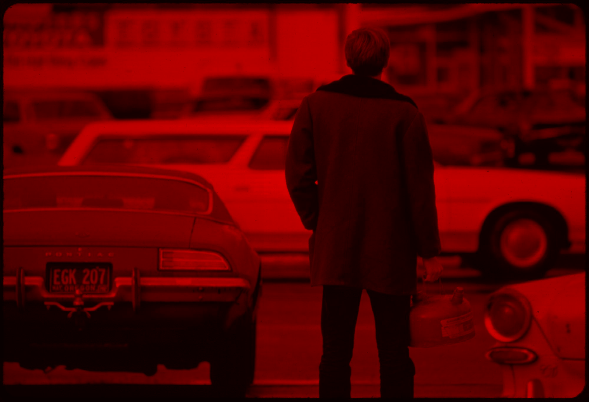
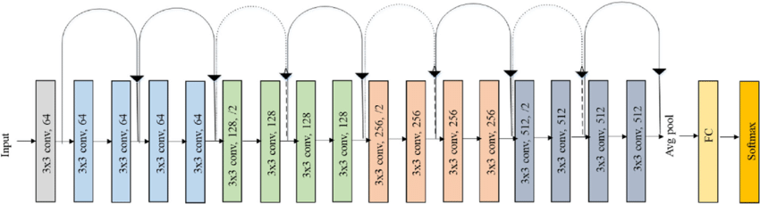

## Setup

This notebook can auto-install missing packages.

If anything installs, **restart the kernel** before continuing. After restart, run the setup cell once more to confirm everything is ready.

```{python}
import importlib.util
import subprocess
import sys

required_packages = [
    "numpy",
    "pandas",
    "matplotlib",
    "pillow",
    "opencv-python",
    "plotly",
    "scikit-learn",
    "ultralytics",
    "easyocr",
    "torch",
    "torchvision",
]

missing = [pkg for pkg in required_packages if importlib.util.find_spec(pkg.split("-")[0]) is None]

if missing:
    print("Installing missing packages:", ", ".join(missing))
    subprocess.check_call([sys.executable, "-m", "pip", "install", "-q", *missing])
    print("\nInstall complete. Please restart the kernel before continuing.")
else:
    print("All required packages are installed.")
```

```{python}
# Load the necessary libraries
import os
from pathlib import Path
import warnings

import numpy as np
import pandas as pd
import matplotlib.pyplot as plt
import matplotlib.patches as patches
import PIL.Image as Image
from PIL import ImageDraw, ImageOps, ImageFilter
import cv2
import plotly.express as px
import plotly.graph_objects as go
import textwrap

from sklearn.cluster import MiniBatchKMeans, KMeans
from sklearn.metrics.pairwise import cosine_similarity
from sklearn.decomposition import PCA
from sklearn.neighbors import NearestNeighbors
from sklearn.model_selection import train_test_split
from sklearn.preprocessing import LabelEncoder
from sklearn.linear_model import LogisticRegression
from sklearn.metrics import accuracy_score, f1_score, ConfusionMatrixDisplay
from sklearn.multiclass import OneVsRestClassifier
from ultralytics import YOLO
import easyocr

import torch
from torchvision import transforms
from torchvision.models import resnet18, ResNet18_Weights
from torchvision.models.feature_extraction import create_feature_extractor
from torchvision.transforms import functional as TF

warnings.filterwarnings("ignore", message=".*pin_memory.*")
```

This notebook uses a subset of the **Documerica** dataset, a 1970s EPA photo archive documenting environmental conditions across the United States.

The subset includes:
1. **Images**: JPG files in `data/documerica_subset`.
2. **Metadata**: `data/subset_documerica_metadata_labeled.csv` with fields such as:
   - `nid`: unique image identifier
   - `title`: short description of scene context
   - `Photographer`: photographer name
   - `date`: capture date
   - `place_name`: location name
   - `coordinates`: latitude/longitude
   - `category`: a descriptive label generated by a Large Language Model based on titles of photos (e.g., **Pollution and Environmental Damage**, **Urban Landscape**, **Transportation and Infrastructure**, etc.)

We will connect pixel-level patterns to metadata-level context through progressively more automated analysis.

```{python}
IMAGE_DIR = "data/documerica_subset"

# Load relabeled metadata 
meta_df = pd.read_csv("data/subset_documerica_metadata_labeled.csv")

# Display the information about the metadata
print(meta_df.info())
print("\nCategory counts:")
print(meta_df["category"].value_counts())
```

```{python}
# Show unique labels of the dataset
meta_df['category'].unique()
```

## 1. Manual Image Transformations

This section builds intuition for how simple operations change the visual signal before automation.

```{python}
# Load an image and display it
sample_nid = 550128

sample_image_path = os.path.join(IMAGE_DIR, f"{sample_nid}.jpg")
sample_image = Image.open(sample_image_path)

# Display the image and its title
plt.figure(figsize=(8, 4))
plt.imshow(sample_image)

# Filter for the row with the specific nid
record = meta_df[meta_df['nid'] == sample_nid]

plt.title(textwrap.fill(record['title'].values[0], width=50))

plt.axis('off')
plt.show()
```

### 1.1 Color Channels and Pixel Distributions

Channel balance and intensity histograms help explain color composition in the scene.

```{python}
# Color histogram of the image
sample_img_rgb = np.array(sample_image)

color = ('r', 'g', 'b')
plt.figure(figsize=(8, 4))
for i, col in enumerate(color):
    histogram = cv2.calcHist([sample_img_rgb], [i], None, [256], [0, 256])
    plt.plot(histogram, color=col)
    plt.xlim([0, 256])
plt.title("Color Histogram")
plt.xlabel("Pixel Intensity")
plt.ylabel("Frequency")
plt.show()
```

```{python}
# Different color channels of the image
channels = cv2.split(sample_img_rgb) # Splits into R, G, B components
zeros = np.zeros_like(channels[0])

plt.figure(figsize=(8, 12))
for i, col in enumerate(color):
    plt.subplot(3, 1, i + 1)
    
    channel_image_components = [zeros, zeros, zeros]
    channel_image_components[i] = channels[i]
    
    # Merge these components back into an RGB image
    colored_channel_img = cv2.merge(channel_image_components)
    
    plt.imshow(colored_channel_img)
    plt.title(f"{col.upper()} Channel")
    plt.axis('off')
plt.show()
```

Below is a GIF showing how separate color channels combine into a full-color image:
{width="500"}

RGB channels carry complementary information, and recombining them restores scene detail.

### 1.2 Convolution, Filtering, and Edges

Filters emphasize different structures (texture, boundaries, or contrast) that later support feature extraction.

```{python}
# Apply the identity filter to the image
identity_kernel = np.array([[0, 0, 0], 
                            [0, 1, 0],
                            [0, 0, 0]])
identity_image = cv2.filter2D(sample_img_rgb, -1, identity_kernel)

# Apply sharpening filter to the image
sharpening_kernel = np.array([[0, -1, 0], 
                             [-1, 5, -1], 
                             [0, -1, 0]])
sharpened_image = cv2.filter2D(sample_img_rgb, -1, sharpening_kernel)

# Apply the Gaussian blur to the image
blurred_image = cv2.GaussianBlur(sample_img_rgb, (5, 5), 0)


# Display the original and sharpened images
fig, axes = plt.subplots(2, 2, figsize=(10, 8))
axes[0, 0].imshow(sample_image)
axes[0, 0].set_title("Original Image") 
axes[0, 1].imshow(identity_image)
axes[0, 1].set_title("Identity Filtered Image")
axes[1, 0].imshow(sharpened_image)
axes[1, 0].set_title("Sharpened Image")
axes[1, 1].imshow(blurred_image)
axes[1, 1].set_title("Gaussian Blurred Image")
for ax in axes.flatten():
    ax.axis('off')
plt.tight_layout()
plt.show()
```

```{python}
# Apply the Canny edge detection algorithm to the sharpened image
gray = cv2.cvtColor(sample_img_rgb, cv2.COLOR_RGB2GRAY)

# Apply sharpening to the grayscale image
gray_sharpened = cv2.filter2D(gray, -1, sharpening_kernel)

edges = cv2.Canny(gray_sharpened, 100, 200)

# Apply the sobel edge detection algorithm to the sharpened image
sobelx = cv2.Sobel(gray_sharpened, cv2.CV_64F, 1, 0, ksize=5)  # Sobel X
sobely = cv2.Sobel(gray_sharpened, cv2.CV_64F, 0, 1, ksize=5)  # Sobel Y
sobel_edges = cv2.magnitude(sobelx, sobely)  # Combine X and Y edges

# Display the edges 
plt.figure(figsize=(8, 6))
plt.subplot(1, 2, 1)
plt.imshow(edges, cmap='gray')
plt.title("Canny Edges")
plt.axis('off')
plt.subplot(1, 2, 2)
plt.imshow(sobel_edges, cmap='gray')
plt.title("Sobel Edges")
plt.axis('off')
plt.tight_layout()
plt.show()
```

```{python}
# Absolute thresholding to create a binary image
absolute_threshold = 80
_, binary_image = cv2.threshold(gray_sharpened, absolute_threshold, 255, cv2.THRESH_BINARY)

# Display the binary image
fig, ax = plt.subplots(1, 2, figsize=(10, 5))
ax[0].imshow(gray_sharpened, cmap='gray')
ax[0].set_title("Sharpened Grayscale Image")
ax[0].axis('off')
ax[1].imshow(binary_image, cmap='gray')
ax[1].set_title("Binary Image (Thresholded)")
ax[1].axis('off')

plt.tight_layout()
plt.show()
```

### 1.3 Geometric Augmentation and Region-Based Focus

Geometric transforms and masking reveal which visual changes preserve or distort useful structure.

Common augmentations include resizing, rotation, flipping, and filtering to simulate variation while preserving core scene content.

```{python}
# A few geometric transformations to see how image structure changes
cropped_img = sample_img_rgb[500:1500, 1000:2000]  # Crop the image to a specific region
resized_img = cv2.resize(sample_img_rgb, None, fx=0.05, fy=0.05, interpolation=cv2.INTER_AREA)
rotated_img = cv2.rotate(sample_img_rgb, cv2.ROTATE_90_CLOCKWISE)
flipped_img = cv2.flip(sample_img_rgb, 1)  # 1 = horizontal flip

# Show transformed images side by side so the differences are easy to spot
fig, ax = plt.subplots(2, 2, figsize=(10, 6))
ax[0, 0].imshow(cropped_img)
ax[0, 0].set_title("Cropped Image")
ax[0, 0].axis("off")


ax[0, 1].imshow(resized_img)
ax[0, 1].set_title("Resized (5% scale)")
ax[0, 1].axis("off")


ax[1, 0].imshow(rotated_img)
ax[1, 0].set_title("Rotated 90° clockwise")
ax[1, 0].axis("off")


ax[1, 1].imshow(flipped_img)
ax[1, 1].set_title("Flipped horizontally")
ax[1, 1].axis("off")


plt.suptitle("Geometric Transformations", fontsize=14)
plt.tight_layout()
plt.show()
```

Beyond cropping, masking lets you isolate a region of interest and hide everything else.

This technique is common in object localization, segmentation, and document cleanup. It focuses computation on the pixels that matter most.

```{python}
# Apply an irregular polygonal mask to the image
mask = np.zeros(sample_img_rgb.shape[:2], dtype="uint8")
(cX, cY) = (sample_img_rgb.shape[1] // 2, sample_img_rgb.shape[0] // 2)

# Create an irregular shape using points
pts = np.array([[cX - 400, cY - 400], [cX + 400, cY - 600], 
                [cX + 600, cY + 200], [cX, cY + 800], 
                [cX - 600, cY + 200]], np.int32)
pts = pts.reshape((-1, 1, 2))
cv2.fillPoly(mask, [pts], 255)

# Apply the mask
masked = cv2.bitwise_and(sample_img_rgb, sample_img_rgb, mask=mask)

# Display the mask and the masked image
plt.figure(figsize=(10, 5))
plt.subplot(1, 2, 1)
plt.imshow(mask, cmap='gray')
plt.title("Mask")
plt.axis('off')

plt.subplot(1, 2, 2)
plt.imshow(masked)
plt.title("Masked Image")
plt.axis('off')
plt.show()
```

```{python}
# Better thresholding for edge detection: blur -> contrast boost -> threshold
def process_image_pipeline(image):
    gray = cv2.cvtColor(image, cv2.COLOR_RGB2GRAY)
    blurred = cv2.GaussianBlur(gray, (5, 5), 0)
    high_contrast = cv2.convertScaleAbs(blurred, alpha=1.6, beta=10)
    binary = cv2.adaptiveThreshold(
        high_contrast, 255, cv2.ADAPTIVE_THRESH_GAUSSIAN_C,
        cv2.THRESH_BINARY, 21, 4
    )
    return gray, blurred, high_contrast, binary

# Apply the pipeline to the sample image
gray, blurred, high_contrast, binary = process_image_pipeline(sample_img_rgb)

fig, ax = plt.subplots(2, 2, figsize=(8, 7))
ax[0, 0].imshow(gray, cmap="gray")
ax[0, 0].set_title("1) Grayscale")
ax[0, 0].axis("off")

ax[0, 1].imshow(blurred, cmap="gray")
ax[0, 1].set_title("2) Gentle blur")
ax[0, 1].axis("off")

ax[1, 0].imshow(high_contrast, cmap="gray")
ax[1, 0].set_title("3) Contrast boosted")
ax[1, 0].axis("off")

ax[1, 1].imshow(binary, cmap="gray")
ax[1, 1].set_title("4) Adaptive threshold")
ax[1, 1].axis("off")

plt.suptitle("Simple Image Processing Pipeline", fontsize=14)
plt.tight_layout()
plt.show()
```

The pipeline above is good for general structure analysis. But sometimes you want something more specific: reading the text visible in one part of an image.

Below, we manually crop, upscale, and threshold a small region to make its text legible. This shows how much hand-tuning is required when you do it without automation. In Section 4.3, we replace this manual workflow with EasyOCR, which detects and transcribes text regions across the full image automatically.

```{python}
# Coordinates found by inspection: y=150:450, x=2400:2600
roi = sample_img_rgb[150:400, 2400:2600]

# Upscale the image to make the text larger 
scale_factor = 4
width = int(roi.shape[1] * scale_factor)
height = int(roi.shape[0] * scale_factor)
upscaled = cv2.resize(roi, (width, height), interpolation=cv2.INTER_CUBIC)

# Enhance readability using image processing
# Convert to grayscale
gray_roi = cv2.cvtColor(upscaled, cv2.COLOR_RGB2GRAY)

# Apply a stronger blur to remove more noise before thresholding
blurred_roi = cv2.GaussianBlur(gray_roi, (5, 5), 0)

# Apply an absolute threshold to highlight the text
threshold_value = 101
binary_text = cv2.threshold(blurred_roi, threshold_value, 255, cv2.THRESH_BINARY)[1]

# Display the steps
fig, ax = plt.subplots(1, 4, figsize=(10, 3))

ax[0].imshow(roi)
ax[0].set_title("1. Original Crop")
ax[0].axis("off")

ax[1].imshow(upscaled)
ax[1].set_title(f"2. Upscaled ({scale_factor}x)")
ax[1].axis("off")

ax[2].imshow(gray_roi, cmap='gray')
ax[2].set_title("3. Grayscale")
ax[2].axis("off")

ax[3].imshow(binary_text, cmap='gray')
ax[3].set_title("4. Absolute Thresholding")
ax[3].axis("off")

plt.tight_layout()
plt.show()
```

## 2. Automating Analysis with Similarity and Clustering

Now we move from manual operations to automated comparison. Each image becomes a numeric vector, and cosine similarity measures how close any two images are in that feature space.

This turns visual judgment into a repeatable, quantitative workflow. We start by building a small working corpus, then run similarity and clustering on top.

```{python}
# Sample a random batch of images to analyze (random selection gives a more representative view)
max_images = 50

demo_df = meta_df.sample(n=min(max_images, len(meta_df)), random_state=123).reset_index(drop=True)
# Add full file path for easy loading
demo_df["img_path"] = demo_df["nid"].astype(int).astype(str) + ".jpg"
demo_df["full_path"] = demo_df["img_path"].apply(lambda p: os.path.join(IMAGE_DIR, p))

# Show how categories are distributed in this batch
category_counts = demo_df['category'].value_counts()
print("Category distribution in the sampled batch:")
print(category_counts)
```

### 2.1 Extracting Visual Word Features

Before extracting keypoints, images are preprocessed (equalizing contrast, blurring noise, and standardizing intensity) to produce more stable features and a cleaner similarity structure. These embeddings were pre-computed for the workshop.

Generating embeddings for a large image collection is slow and computationally expensive. For this workshop, the embeddings were pre-computed and saved to disk so that we can load them instantly and focus on analysis.

```{python}
# Load saved BoVW embeddings and metadata
bovw_features = np.load("data/embeddings/bovw_sift_embeddings.npy")
bovw_meta_df = pd.read_csv("data/embeddings/bovw_sift_embedding_metadata.csv")

demo_df = bovw_meta_df.copy()
demo_df["img_path"] = demo_df["nid"].astype(int).astype(str) + ".jpg"

print("Loaded BoVW embeddings:", bovw_features.shape)
print("Loaded BoVW metadata:", bovw_meta_df.shape)
```

### 2.2 Measuring Similarity

BoVW gives each image a shared visual vocabulary, so similarity scores become directly comparable across the corpus.

```{python}
# Pick one target image and find nearest neighbors using cosine similarity.
target_idx = 0  # Use the first image in this demo batch as the anchor.
sim_scores = cosine_similarity(bovw_features[target_idx:target_idx + 1], bovw_features).ravel()
top_k = min(6, len(sim_scores))
top_idx = np.argsort(sim_scores)[::-1][:top_k]

print("Top similar images (including self):")
for rank, idx in enumerate(top_idx, start=1):
    nid_val = int(demo_df.loc[idx, "nid"])

    title_val = str(demo_df.loc[idx, "title"])

    print(f"{rank}. nid={nid_val} | score={sim_scores[idx]:.3f} | {title_val[:90]}")
```

```{python}
# Visual check by displaying the top 4 matches
show_idx = top_idx[:4]
fig, axes = plt.subplots(2, 2, figsize=(8, 6))
axes = axes.flatten()

for ax_i, idx in zip(axes, show_idx):
    img = Image.open(demo_df.loc[idx, "full_path"])
    ax_i.imshow(img)
    ax_i.set_title(f"nid {int(demo_df.loc[idx, 'nid'])}\nscore {sim_scores[idx]:.2f}")
    ax_i.axis("off")

plt.suptitle("Most Similar Images by BoVW Cosine Similarity", fontsize=13)
plt.tight_layout()
plt.show()
```

A higher cosine similarity means stronger overlap in local texture and structure under the BoVW representation.

Clustering complements similarity: instead of comparing pairs, it groups images by shared visual patterns without any labels. Together, they give both pairwise and corpus-level views of the collection.

```{python}
# Cluster BoVW features into 3 groups and visualize in 2D
n_clusters = 3
cluster_model = KMeans(n_clusters=n_clusters, random_state=42, n_init=10)
cluster_labels = cluster_model.fit_predict(bovw_features)
demo_df["cluster"] = cluster_labels

# Compute the PCA
pca = PCA(n_components=2, random_state=42)
xy = pca.fit_transform(bovw_features)


# Create a DataFrame for visualization
clustering_visualization_df = pd.DataFrame({
    "PCA 1": xy[:, 0],
    "PCA 2": xy[:, 1],
    "Cluster": cluster_labels.astype(str),  # Convert to string for discrete colors
    "Title": demo_df["title"].apply(lambda t: textwrap.fill(str(t).lower(), 
                                                            width=50).replace('\n', '<br>')),
    "Image ID": demo_df["img_path"],
    "Category": demo_df["category"].str.lower()
})

# Create an interactive scatter plot
fig = px.scatter(
    clustering_visualization_df,
    x="PCA 1",
    y="PCA 2",
    color="Cluster",
    hover_data={
        "Title": True,
        "Image ID": True,
        "Category": True,
        "PCA 1": False,
        "PCA 2": False,
        "Cluster": True
    },
    title="BoVW Image Clusters (PCA view)",
    color_discrete_sequence=px.colors.qualitative.G10,  # A high-contrast palette
    width=800, height=600
)

fig.update_traces(marker=dict(size=12, line=dict(width=1, color='DarkSlateGrey')))
fig.show()

print("Cluster sizes:")
print(demo_df["cluster"].value_counts().sort_index())
```

```{python}
# Display 2 images from each cluster to see if they share visual themes
for cluster_id in sorted(np.unique(cluster_labels)):
    
    cluster_images = demo_df[demo_df["cluster"] == cluster_id].head(2)
    fig, axes = plt.subplots(1, 2, figsize=(8, 4))
    for ax_i, (_, row) in zip(axes, cluster_images.iterrows()):
        img = Image.open(row["full_path"])
        ax_i.imshow(img)
        ax_i.set_title(f"Cluster {cluster_id} | nid {int(row['nid'])}")
        ax_i.axis("off")
    plt.suptitle(f"Sample Images from Cluster {cluster_id}", fontsize=13)
    plt.tight_layout()
    plt.show()
```

> Reflection: which visual cues (edges, textures, layouts, or contrast patterns) likely drove these images into the same cluster?

## 3. Deep Learning: Convolutional Neural Networks and Vision Transformers

Now we move from handcrafted BoVW features to learned image embeddings.

BoVW captures local texture patterns. CNNs and ViTs learn richer semantic representations, which are often better for retrieval and classification.

### 3.1 CNN Embeddings

A CNN learns visual patterns layer by layer:
- Early layers detect edges and textures.
- Middle layers combine them into parts and shapes.
- Deeper layers capture objects and scene meaning.

We use a pretrained ResNet-18 and take its final pooled feature vector as the image embedding.



```{python}
# Set up direct file paths in meta_df so we can open images easily in later steps
meta_df["img_path"] = meta_df["nid"].astype(int).astype(str) + ".jpg"
meta_df["full_path"] = meta_df["img_path"].apply(lambda p: os.path.join(IMAGE_DIR, p))
```

```{python}
# Load a pretrained CNN and define small helper utilities
# Use CPU by default so this runs anywhere, but switch to GPU if available.
device = torch.device("cuda" if torch.cuda.is_available() else "cpu")
print(f"Using device: {device}")

# A compact image size keeps full-dataset embedding fast.
IMG_SIZE = 160
BATCH_SIZE = 32

weights = ResNet18_Weights.DEFAULT
cnn_model = resnet18(weights=weights).to(device).eval()

preprocess = transforms.Compose([
    transforms.Resize((IMG_SIZE, IMG_SIZE)),
    transforms.ToTensor(),
    transforms.Normalize(mean=weights.transforms().mean, std=weights.transforms().std),
])

# We tap into multiple ResNet stages for visualization, and avgpool for final embedding.
feature_extractor = create_feature_extractor(
    cnn_model,
    return_nodes={
        "layer1": "layer1",
        "layer2": "layer2",
        "layer3": "layer3",
        "layer4": "layer4",
        "avgpool": "embedding",
    },
).to(device).eval()

print(f"Loaded model: {type(cnn_model).__name__}")
```

We begin by transforming one image as an example:

```{python}
# Show one image and feature maps from different convolution stages
sample_idx = 0
sample_path = demo_df.loc[sample_idx, "full_path"]
sample_title = textwrap.fill(demo_df.loc[sample_idx, "title"], width=60)

img_pil = Image.open(sample_path).convert("RGB")
img_tensor = preprocess(img_pil).unsqueeze(0).to(device)

with torch.no_grad():
    fmap_outputs = feature_extractor(img_tensor)

# Display original image
plt.figure(figsize=(4, 4))
plt.imshow(img_pil)
plt.title(f"Sample image\n{sample_title[:60]}")
plt.axis("off")
plt.show()
```

Feature maps show what the CNN focuses on at each depth:
- Early maps highlight edges and fine textures.
- Middle maps focus on repeated structures and parts.
- Deep maps respond to higher-level semantics.

This helps explain how a CNN builds understanding from pixels to meaning.

```{python}
# Show first channel from each stage to keep the view simple and readable
layers_to_show = ["layer1", "layer2", "layer3", "layer4"]
fig, axes = plt.subplots(1, len(layers_to_show), figsize=(10, 3))

for ax, layer_name in zip(axes, layers_to_show):
    fmap = fmap_outputs[layer_name][0, 0].detach().cpu().numpy()  # [H, W] for one channel
    ax.imshow(fmap, cmap="viridis")
    ax.set_title(f"{layer_name}\n{fmap.shape}")
    ax.axis("off")

plt.suptitle("Feature maps across CNN depth (first channel per block)", y=1.05)
plt.tight_layout()
plt.show()
```

We can see clearly that early layers keep more local textures and edges, while deeper layers become more abstract and semantic. This is why CNN embeddings often group images by meaning, not just raw pixels.

Saving embeddings alongside metadata keeps the workflow modular. We can reuse CNN features for classification, retrieval, and ViT comparisons without recomputing.

```{python}
# Load saved CNN embeddings and metadata
all_embeddings = np.load("data/embeddings/cnn_resnet18_embeddings.npy")
cnn_meta_df = pd.read_csv("data/embeddings/cnn_resnet18_embedding_metadata.csv")

# Minimal alignment fields used later
meta_df["cnn_valid"] = True
meta_df["cnn_emb_idx"] = np.arange(len(meta_df))

print("Loaded CNN embeddings:", all_embeddings.shape)
print("Loaded CNN metadata:", cnn_meta_df.shape)
```

A single embedding is just a numeric fingerprint of an image. 

The embedding of each image exists as a list of numbers, with each number representing a feature of the image. For the model we used, there are 512 dimensions for each image.

```{python}
# Peek at what embeddings look like
print("Embedding matrix:", all_embeddings.shape)
print("One embedding (first 50 dimensions):")
print(np.round(all_embeddings[0, :50], 4))
```

```{python}
# Quick projection to 2D for visual intuition
pca_preview = PCA(n_components=2, random_state=123)
xy_preview = pca_preview.fit_transform(all_embeddings)

# Create a DataFrame for visualization
pca_preview_df = pd.DataFrame({
    "PC1": xy_preview[:, 0],
    "PC2": xy_preview[:, 1],
    "Category": meta_df["category"].str.lower(),
    "Title": meta_df["title"].apply(lambda t: textwrap.fill(str(t).lower(), 
                                                            width=50).replace('\n', '<br>')),
    "Image ID": meta_df["img_path"]
})

# Create an interactive scatter plot
fig = px.scatter(
    pca_preview_df,
    x="PC1",
    y="PC2",
    color="Category",
    hover_data={
        "Title": True,
        "Image ID": True,
        "PC1": False,
        "PC2": False,
        "Category": True
    },
    title="CNN Embeddings Projected to 2D (PCA)",
    color_discrete_sequence=px.colors.qualitative.G10,  # A high-contrast palette
    width=800, height=600
)

fig.update_traces(marker=dict(size=12, line=dict(width=1, color='DarkSlateGrey')))
fig.show()
```

### 3.2 ViT Embeddings

Now we run the same workflow with a Vision Transformer (ViT).

CNNs process local neighborhoods; ViTs split images into patches and model global relationships through self-attention. This often helps capture broader scene context.

```{python}
# Load a pretrained ViT and set up helpers
from torchvision.models import vit_b_16, ViT_B_16_Weights

vit_weights = ViT_B_16_Weights.DEFAULT
vit_model = vit_b_16(weights=vit_weights).to(device).eval()
vit_preprocess = vit_weights.transforms()

# If this cell is rerun, remove old hooks
if "vit_hook_handles" in globals():
    for handle in vit_hook_handles:
        handle.remove()

# Capture hidden states from a few transformer blocks for visualization.
vit_block_outputs = {}
vit_hook_handles = []
block_indices_to_capture = [0, 5, 11]

for idx in block_indices_to_capture:
    handle = vit_model.encoder.layers[idx].register_forward_hook(
        lambda module, inputs, output, idx=idx: vit_block_outputs.__setitem__(f"block_{idx+1}", output.detach())
    )
    vit_hook_handles.append(handle)
```

ViT gives us a complementary style of representation: patch-to-patch relationships are modeled globally, which can capture broader scene context.

```{python}
# Display one image and patch-response maps from different ViT blocks
vit_sample_idx = 0
vit_sample_path = demo_df.loc[vit_sample_idx, "full_path"]
vit_sample_title = str(demo_df.loc[vit_sample_idx, "title"])

vit_img_pil = Image.open(vit_sample_path).convert("RGB")
vit_x = vit_preprocess(vit_img_pil).unsqueeze(0).to(device)

with torch.no_grad():
    _ = vit_model(vit_x)

# Original image
plt.figure(figsize=(4, 4))
plt.imshow(vit_img_pil)
plt.title(f"Sample image\n{textwrap.fill(vit_sample_title, width=50)}")
plt.axis("off")
plt.show()
```

```{python}
# Build simple patch-level response maps from selected transformer blocks
# Output shape per block: [B, num_tokens, hidden_dim] where token 0 is [CLS]
fig, axes = plt.subplots(1, len(block_indices_to_capture), figsize=(10, 3))

for ax, idx in zip(axes, block_indices_to_capture):
    block_name = f"block_{idx+1}"
    tokens = vit_block_outputs[block_name][0]            # [num_tokens, hidden_dim]
    patch_tokens = tokens[1:, :]                         # remove CLS token
    patch_strength = patch_tokens.mean(dim=1).cpu().numpy()

    grid_size = int(np.sqrt(len(patch_strength)))
    patch_map = patch_strength.reshape(grid_size, grid_size)

    ax.imshow(patch_map, cmap="magma")
    ax.set_title(f"{block_name}\n{patch_map.shape}")
    ax.axis("off")

plt.suptitle("ViT patch-response maps across transformer depth", y=1.05)
plt.tight_layout()
plt.show()
```

Earlier blocks focus on local patch patterns, while deeper blocks become more semantic. Even this simple patch map gives a useful intuition for how ViT features evolve.

The ViT embeddings were pre-computed and saved the same way, so they are ready to load in the next cell.

```{python}
# Load saved ViT embeddings and metadata
vit_all_embeddings = np.load("data/embeddings/vit_b16_embeddings.npy")
vit_meta_df = pd.read_csv("data/embeddings/vit_b16_embedding_metadata.csv")

# Minimal alignment fields used later
meta_df["vit_valid"] = True
meta_df["vit_emb_idx"] = np.arange(len(meta_df))

print("Loaded ViT embeddings:", vit_all_embeddings.shape)
print("Loaded ViT metadata:", vit_meta_df.shape)
```

Now each image has a 768-dimensional ViT embedding. Nearby vectors should reflect similar global visual context.

```{python}
# Inspect ViT embeddings and quick 2D projection
print("ViT embedding matrix:", vit_all_embeddings.shape)
print("One embedding (first 50 dims):")
print(np.round(vit_all_embeddings[0, :50], 4))
```

```{python}
vit_pca_preview = PCA(n_components=2, random_state=123)
vit_xy_preview = vit_pca_preview.fit_transform(vit_all_embeddings)

# Create a DataFrame for visualization
vit_pca_preview_df = pd.DataFrame({
    "PC1": vit_xy_preview[:, 0],
    "PC2": vit_xy_preview[:, 1],
    "Category": meta_df["category"].str.lower(),
    "Title": meta_df["title"].apply(lambda t: textwrap.fill(str(t).lower(), 
                                                            width=50).replace('\n', '<br>')),
    "Image ID": meta_df["img_path"]
})

# Create an interactive scatter plot
fig = px.scatter(
    vit_pca_preview_df,
    x="PC1",
    y="PC2",
    color="Category",
    hover_data={
        "Title": True,
        "Image ID": True,
        "PC1": False,
        "PC2": False,
        "Category": True
    },
    title="ViT Embeddings Projected to 2D (PCA)",
    color_discrete_sequence=px.colors.qualitative.G10,  # A high-contrast palette
    width=800, height=600
)

fig.update_traces(marker=dict(size=12, line=dict(width=1, color='DarkSlateGrey')))
fig.show()
```

These clusters are unsupervised visual groups. They won’t perfectly match labels, but they are very helpful for exploration and retrieval.

### 3.3 (Optional) CNN vs ViT: Side-by-Side Comparison

We built two sets of embeddings on the same images: one from a CNN (ResNet-18) and one from a ViT.

Let's compare them directly to build intuition about how these two model families behave differently.

```{python}
# Setup for CNN vs ViT comparison

# Keep rows where both embeddings are valid
comparison_mask = meta_df["cnn_valid"].fillna(False) & meta_df["vit_valid"].fillna(False)
comparison_idx = np.where(comparison_mask.values)[0]

cnn_cmp = all_embeddings[comparison_idx]
vit_cmp = vit_all_embeddings[comparison_idx]
labels_cmp = meta_df.loc[comparison_idx, "category"].astype(str).values

# L2 normalize for cosine similarity comparison and clustering
def l2_normalize(x: np.ndarray, eps: float = 1e-9) -> np.ndarray:
    return x / (np.linalg.norm(x, axis=1, keepdims=True) + eps)

cnn_cmp_n = l2_normalize(cnn_cmp)
vit_cmp_n = l2_normalize(vit_cmp)
```

We first align a shared subset where both embeddings exist, so the comparison is fair and one-to-one.

```{python}
# Neighbor category consistency (shared retrieval-style metric)
def neighbor_agreement(emb: np.ndarray, labels: np.ndarray, k: int = 5) -> float:
    # Ensure labels is a standard numpy array to support 2D indexing
    labels = np.array(labels)
    
    nn = NearestNeighbors(n_neighbors=k + 1, metric="cosine")
    nn.fit(emb)
    _, indices = nn.kneighbors(emb)

    # skip self neighbor at column 0
    neighbor_labels = labels[indices[:, 1:]]
    same = (neighbor_labels == labels[:, None]).mean()
    return float(same)

k = 5
cnn_neighbor_score = neighbor_agreement(cnn_cmp_n, labels_cmp, k=k)
vit_neighbor_score = neighbor_agreement(vit_cmp_n, labels_cmp, k=k)

neighbor_df = pd.DataFrame({
    "Model Family": ["CNN family", "ViT family"],
    f"Top-{k} same-category ratio": [cnn_neighbor_score, vit_neighbor_score],
})

print(neighbor_df.round(3))

plt.figure(figsize=(6, 4))
plt.bar(neighbor_df["Model Family"], neighbor_df[f"Top-{k} same-category ratio"], color=["#4C78A8", "#F58518"])
plt.ylim(0, 1)
plt.title(f"Neighbor category consistency (k={k})")
plt.ylabel("Ratio")
plt.tight_layout()
plt.show()
```

How to read this result? ViT embeddings show a higher category consistency score here, meaning they group the same categories more tightly in nearest-neighbor space than CNN embeddings.

This **does not** mean ViT always wins. On this dataset, ViT embeddings clustered categories a bit more cleanly, but the gap may be smaller or reversed on different data.

```{python}
# Perturbation sensitivity profile (local vs global changes)

# Define a few simple perturbations to apply to the images and see how much they change the embeddings.
def cnn_embed_one(img_pil: Image.Image) -> np.ndarray:
    x = preprocess(img_pil).unsqueeze(0).to(device)
    with torch.no_grad():
        e = feature_extractor(x)["embedding"].flatten(start_dim=1).cpu().numpy()[0]
    return e

# ViT's forward is a bit more complex since we want to capture the CLS token before the head, so we replicate that logic here for single images.
def vit_embed_one(img_pil: Image.Image) -> np.ndarray:
    x = vit_preprocess(img_pil).unsqueeze(0).to(device)
    with torch.no_grad():
        feats = vit_model._process_input(x)
        cls_token = vit_model.class_token.expand(feats.shape[0], -1, -1)
        feats = torch.cat([cls_token, feats], dim=1)
        feats = vit_model.encoder(feats)
        e = feats[:, 0].cpu().numpy()[0]
    return e


# Calculate the cosine similarity between two vectors, with a small epsilon to prevent division by zero
def cosine(a: np.ndarray, b: np.ndarray, eps: float = 1e-9) -> float:
    return float(np.dot(a, b) / ((np.linalg.norm(a) + eps) * (np.linalg.norm(b) + eps)))


# A simple perturbation that occludes the center of the image, which often contains key objects or features
def center_occlude(img_pil: Image.Image, frac: float = 0.35) -> Image.Image:
    arr = np.array(img_pil).copy()
    h, w, _ = arr.shape
    oh, ow = int(h * frac), int(w * frac)
    y0 = (h - oh) // 2
    x0 = (w - ow) // 2
    arr[y0:y0+oh, x0:x0+ow] = 0
    return Image.fromarray(arr)
```

```{python}
# Define a few perturbations to apply to the images and see how much they change the embeddings.
perturbations = {
    "blur (local texture loss)": lambda img: img.filter(ImageFilter.GaussianBlur(radius=2)),
    "color shift": lambda img: TF.adjust_saturation(TF.adjust_brightness(img, 1.25), 0.6),
    "center occlusion (global content loss)": lambda img: center_occlude(img, frac=0.35),
}

rng = np.random.default_rng(123)
n_probe = min(12, len(comparison_idx))
probe_global_idx = rng.choice(comparison_idx, size=n_probe, replace=False)

rows = []
for gidx in probe_global_idx:
    img = Image.open(meta_df.loc[gidx, "full_path"]).convert("RGB")

    cnn_ref = cnn_embed_one(img)
    vit_ref = vit_embed_one(img)

    for perturb_name, perturb_fn in perturbations.items():
        img_p = perturb_fn(img)
        cnn_sim = cosine(cnn_ref, cnn_embed_one(img_p))
        vit_sim = cosine(vit_ref, vit_embed_one(img_p))

        rows.append({
            "perturbation": perturb_name,
            "cnn_cosine": cnn_sim,
            "vit_cosine": vit_sim,
        })
```

```{python}
# Calculate the average cosine similarity for each perturbation type and model family, then reshape for visualization
perturb_df = pd.DataFrame(rows).groupby("perturbation", as_index=False).mean(numeric_only=True)
perturb_long = perturb_df.melt(
    id_vars="perturbation",
    value_vars=["cnn_cosine", "vit_cosine"],
    var_name="model_family",
    value_name="mean_cosine_similarity",
)
perturb_long["model_family"] = perturb_long["model_family"].map({
    "cnn_cosine": "CNN family",
    "vit_cosine": "ViT family",
})
# Display the dataframe with rounded values for better readability
perturb_df["cnn_cosine"] = perturb_df["cnn_cosine"].round(3)
perturb_df["vit_cosine"] = perturb_df["vit_cosine"].round(3)
display(perturb_df)
```

```{python}
fig = px.bar(
    perturb_long,
    x="perturbation",
    y="mean_cosine_similarity",
    color="model_family",
    barmode="group",
    title="Embedding stability under image perturbations",
    height=400, width=700,
)
fig.update_layout(yaxis_title="Higher = embedding changed less")
fig.show()
```

How to read this perturbation test? Higher cosine means the embedding changed less.

In fact, both models were very stable to blur/color changes here, but both changed more when central content was removed. The key takeaway is to focus on the **pattern** of sensitivity, not just one score.

```{python}
# Side-by-side retrieval behavior (qualitative)
def top_neighbors(emb_norm: np.ndarray, query_local_idx: int, top_n: int = 4):
    sims = emb_norm @ emb_norm[query_local_idx]
    order = np.argsort(-sims)
    order = [idx for idx in order if idx != query_local_idx][:top_n]
    return order, sims

rng = np.random.default_rng(2026)
query_local_idx = int(rng.integers(0, len(comparison_idx)))
query_global_idx = int(comparison_idx[query_local_idx])

cnn_nbrs, cnn_sims = top_neighbors(cnn_cmp_n, query_local_idx, top_n=4)
vit_nbrs, vit_sims = top_neighbors(vit_cmp_n, query_local_idx, top_n=4)
```

```{python}
# Set up a side-by-side visualization of the query image and its nearest neighbors in both embedding spaces
fig, axes = plt.subplots(2, 5, figsize=(10, 5))

# Column 0: query image (same in both rows)
query_img = Image.open(meta_df.loc[query_global_idx, "full_path"]).convert("RGB")
query_title = str(meta_df.loc[query_global_idx, "title"])
query_cat = str(meta_df.loc[query_global_idx, "category"])

for r in [0, 1]:
    axes[r, 0].imshow(query_img)
    axes[r, 0].set_title(f"Query\n{query_cat}", fontsize=10)
    axes[r, 0].axis("off")

# Row 0: CNN neighbors
for j, local_idx in enumerate(cnn_nbrs, start=1):
    gidx = int(comparison_idx[local_idx])
    img = Image.open(meta_df.loc[gidx, "full_path"]).convert("RGB")
    cat = str(meta_df.loc[gidx, "category"])
    axes[0, j].imshow(img)
    axes[0, j].set_title(f"CNN #{j}\n{cat}", fontsize=9)
    axes[0, j].axis("off")

# Row 1: ViT neighbors
for j, local_idx in enumerate(vit_nbrs, start=1):
    gidx = int(comparison_idx[local_idx])
    img = Image.open(meta_df.loc[gidx, "full_path"]).convert("RGB")
    cat = str(meta_df.loc[gidx, "category"])
    axes[1, j].imshow(img)
    axes[1, j].set_title(f"ViT #{j}\n{cat}", fontsize=9)
    axes[1, j].axis("off")

axes[0, 0].set_ylabel("CNN family", fontsize=11)
axes[1, 0].set_ylabel("ViT family", fontsize=11)
plt.suptitle("One query, two embedding spaces: how nearest neighbors differ", y=1.02)
plt.tight_layout()
plt.show()
```

> **Reflection**: In the side-by-side retrieval panel, what did each model seem to prioritize: local visual texture, or broader scene context?

The quantitative scores gave ViT a small edge on neighbor consistency for our data, while both families remained fairly robust to mild perturbations.

Use this as a practical rule:
- CNN-style models are often efficient and strong when local patterns matter.
- ViT-style models often help when global relationships across the image matter.

For real projects, always compare both on your own data before deciding.

## 4. Image Classification

In this section, we apply the embeddings from Section 3 to a range of practical tasks:
- **4.1**: category classification using logistic regression
- **4.2**: multi-label classification and object detection with YOLO
- **4.3**: optical character recognition (OCR) with EasyOCR
- **4.4**: image captioning from pre-generated descriptions

Each task builds on the same base: a good image representation that makes applications possible, here we use the ViT embedding that we generated.

### 4.1 Classification using embeddings as features

Suppose you are studying social change in public spaces from images.

Instead of labeling everything by hand, we can label a subset, train a classifier on embeddings, and use it to assist larger-scale coding.

Here we use logistic regression: it learns how embedding patterns relate to categories and outputs the most likely label.

```{python}
# A short and friendly baseline: Logistic Regression on frozen embeddings

# Process the data and perform train/test split, keeping splits for both models the same
X_cnn = all_embeddings[meta_df["cnn_emb_idx"].astype(int).values]
X_vit = vit_all_embeddings[meta_df["vit_emb_idx"].astype(int).values]

y_text = meta_df["category"].astype(str).values
label_encoder = LabelEncoder()
y = label_encoder.fit_transform(y_text)
idx = np.arange(len(meta_df))
train_idx, test_idx = train_test_split(idx, test_size=0.25, random_state=42, stratify=y)

X_cnn_train, X_cnn_test = X_cnn[train_idx], X_cnn[test_idx]
X_vit_train, X_vit_test = X_vit[train_idx], X_vit[test_idx]
y_train, y_test = y[train_idx], y[test_idx]
```

```{python}
# Fit a simple logistic regression classifier on each embedding space
cnn_clf = LogisticRegression(max_iter=3000, random_state=42)
vit_clf = LogisticRegression(max_iter=3000, random_state=42)

cnn_clf.fit(X_cnn_train, y_train)
vit_clf.fit(X_vit_train, y_train)

cnn_pred = cnn_clf.predict(X_cnn_test)
vit_pred = vit_clf.predict(X_vit_test)
```

We use two simple metrics:
- **Accuracy**: overall share of correct predictions.
- **Macro F1**: average class-level quality, so smaller classes matter too.

Accuracy measures overall correctness; Macro F1 checks balance across categories.

```{python}
# Calculate accuracy and macro F1 score for both models to compare their performance on the classification task.
cnn_acc = accuracy_score(y_test, cnn_pred)
vit_acc = accuracy_score(y_test, vit_pred)
cnn_f1 = f1_score(y_test, cnn_pred, average="macro")
vit_f1 = f1_score(y_test, vit_pred, average="macro")

results_df = pd.DataFrame({
    "Model family": ["CNN embedding + Logistic Regression", "ViT embedding + Logistic Regression"],
    "Accuracy": [cnn_acc, vit_acc],
    "Macro F1": [cnn_f1, vit_f1],
}).round(3)

display(results_df)
```

```{python}
# Quick visual check: where each model gets confused
all_class_ids = np.arange(len(label_encoder.classes_))

fig, axes = plt.subplots(1, 2, figsize=(10, 6))

ConfusionMatrixDisplay.from_predictions(
    y_test, cnn_pred,
    labels=all_class_ids,  # force full class set
    display_labels=label_encoder.classes_,
    ax=axes[0],
    xticks_rotation=90,
    cmap="Blues",
    colorbar=False
)
axes[0].set_title("CNN embeddings")

ConfusionMatrixDisplay.from_predictions(
    y_test, vit_pred,
    labels=all_class_ids,  # force full class set
    display_labels=label_encoder.classes_,
    ax=axes[1],
    xticks_rotation=90,
    cmap="Oranges",
    colorbar=False
)
axes[1].set_title("ViT embeddings")

plt.suptitle("Classification confusion patterns", y=1.04)
plt.tight_layout()
plt.show()
```

```{python}
# Show a few test samples where at least one model is wrong
wrong_preds = [
    i for i in range(len(y_test))
    if cnn_pred[i] != y_test[i] or vit_pred[i] != y_test[i]
]

num_samples = min(4, len(wrong_preds))
if num_samples == 0:
    print("No misclassifications found in this split.")
else:
    fig, axes = plt.subplots(1, num_samples, figsize=(3.5 * num_samples, 3))
    axes = np.atleast_1d(axes)

    for ax, i in zip(axes, wrong_preds[:num_samples]):
        global_idx = test_idx[i]
        img = Image.open(meta_df.loc[global_idx, "full_path"]).convert("RGB")

        true_label = label_encoder.inverse_transform([y_test[i]])[0]
        cnn_label = label_encoder.inverse_transform([cnn_pred[i]])[0]
        vit_label = label_encoder.inverse_transform([vit_pred[i]])[0]

        ax.imshow(img)
        ax.set_title(f"True: {true_label}\nCNN: {cnn_label}\nViT: {vit_label}", fontsize=9, color="red")
        ax.axis("off")

    plt.suptitle("Sample misclassifications", y=1.03)
    plt.tight_layout()
    plt.show()
```

Summary of this classification workflow:
- Convert each image into an embedding.
- Train a simple classifier on those embeddings.
- Use predictions to pre-sort large archives before manual review.

This speeds up screening but does not replace human judgment.

> **Reflection**: Which embedding family seemed more reliable on your sample, and where did errors still happen?

### 4.2 Multi-label classification and object detection

In social-science images, we often need **two complementary views**:
- **Multi-label classification** answers: *What themes are likely present?* (e.g., community, transport, pollution)
- **Object detection** answers: *What concrete things are visible, and where?* (e.g., people, bus, car, trash can)

Using both together makes interpretation stronger: themes give a high-level story, while detected objects provide visible evidence for that story. Let's first take a glance at the multi-label classification:

```{python}
# Build simple multi-label targets from title keywords
title_text = meta_df["title"].astype(str).str.lower()

theme_keywords = {
    "community_people": [
        "people", "person", "family", "children", "school", "worker", "street", "crowd", "home", "residential",
    ],
    "industry_infra": [
        "factory", "plant", "bridge", "construction", "building", "industrial", "pipeline", "port", "harbor",
    ],
    "nature_ecology": [
        "forest", "river", "lake", "farm", "field", "wildlife", "park", "water", "tree", "shore",
    ],
    "mobility_transport": [
        "car", "bus", "truck", "train", "road", "highway", "traffic", "vehicle", "parking",
    ],
    "pollution_risk": [
        "smoke", "waste", "dump", "pollution", "sewage", "contamination", "trash", "garbage", "debris",
    ],
}
```

We use image titles to create weak multi-label targets with keyword matching.

This is a fast teaching shortcut, not a gold-standard labeling strategy.
For real research, replace these labels with human-coded or validated annotations.

```{python}
def has_any_keyword(text, keyword_list):
    """
    A simple helper function that checks if any of the keywords in a given list are present in the input text. 
    It returns 1 if at least one keyword is found, and 0 otherwise.
    """
    return int(any(keyword in text for keyword in keyword_list))

# Create a DataFrame where each column corresponds to a theme and contains binary labels 
# indicating the presence of any associated keywords in the title text.
Y_all = pd.DataFrame({
    theme: title_text.apply(lambda t: has_any_keyword(t, keywords))
    for theme, keywords in theme_keywords.items()
})

# Keep labels with enough positives to train a toy classifier
valid_theme_cols = [col for col in Y_all.columns if Y_all[col].sum() >= 8]
Y = Y_all[valid_theme_cols].copy()


print("Positive counts by theme:")
display(Y.sum().to_frame("count"))
```

```{python}
# Train a simple multi-label classifier on embeddings
# Reuse ViT embeddings 
X_multi = vit_all_embeddings

multi_idx = np.arange(len(meta_df))
train_idx_multi, test_idx_multi = train_test_split(multi_idx, test_size=0.25, random_state=42)

# Train test split for multi-label classification
X_train_multi = X_multi[train_idx_multi]
X_test_multi = X_multi[test_idx_multi]
Y_train_multi = Y.iloc[train_idx_multi].values
Y_test_multi = Y.iloc[test_idx_multi].values
```

Here we will implement **One‑vs‑Rest** (OvR) classification strategy:

To put it simple, it handles a multi‑class task by training one binary model per class: each model learns to say "this class vs all others". 

```{python}
# Train a simple logistic regression classifier in a One-vs-Rest configuration 
# to handle the multi-label nature of the problem.
multi_clf = OneVsRestClassifier(LogisticRegression(max_iter=2500, random_state=42))
multi_clf.fit(X_train_multi, Y_train_multi)
Y_pred_multi = multi_clf.predict(X_test_multi)
```

For multi-label evaluation:
- **Micro F1** emphasizes overall performance across all predictions.
- **Macro F1** gives each theme equal weight.

Use both together: Micro F1 for overall utility, Macro F1 for fairness across themes.

```{python}
micro_f1 = f1_score(Y_test_multi, Y_pred_multi, average="micro", zero_division=0)
macro_f1 = f1_score(Y_test_multi, Y_pred_multi, average="macro", zero_division=0)


multi_results = pd.DataFrame({
    "Metric": ["Micro F1", "Macro F1"],
    "Value": [micro_f1, macro_f1],
}).round(3)

display(multi_results)
```

We can also display the F1 score for each theme. A higher F1 score indicates the classifier is better at identifying that theme.

```{python}
# Calculate F1 score for each theme separately.
per_theme_f1 = pd.DataFrame({
    "Theme": valid_theme_cols,
    "F1": [f1_score(Y_test_multi[:, i], Y_pred_multi[:, i], zero_division=0) for i in range(len(valid_theme_cols))]
}).sort_values("F1", ascending=False).round(3)

display(per_theme_f1)
```

```{python}
# Display up to 3 test images with predicted themes (skip empty predictions and move to next)
max_examples = 3

selected_positions = []
for pos in range(len(test_idx_multi)):
    if np.any(Y_pred_multi[pos] == 1):
        selected_positions.append(pos)
    if len(selected_positions) == max_examples:
        break

if len(selected_positions) == 0:
    print("No test images with predicted themes found.")
else:
    fig, axes = plt.subplots(1, len(selected_positions), figsize=(5 * len(selected_positions), 4))
    axes = np.atleast_1d(axes)

    for ax, pos in zip(axes, selected_positions):
        global_idx = test_idx_multi[pos]
        img = Image.open(meta_df.loc[global_idx, "full_path"]).convert("RGB")

        pred_flags = Y_pred_multi[pos]
        pred_themes = [theme for theme, flag in zip(valid_theme_cols, pred_flags) if flag == 1]
        pred_text = ", ".join(pred_themes)

        ax.imshow(img)
        ax.set_title(f"Predicted:\n{textwrap.fill(pred_text, width=30)}", fontsize=10)
        ax.axis("off")

    plt.tight_layout()
    plt.show()
```

- Multi-label means one image can receive multiple tags at the same time.
- We are training on simple keyword-based labels from titles.
- In real studies, you should replace these weak labels with human-coded labels.
- This step gives a quick thematic guess; next we use object detection to add visual evidence.

> **Reflection**: Why would some themes have much higher F1 score in our example?

#### Beyond Labels: Object Detections Using YOLO V8

Object detection adds detail beyond themes: it identifies **what** is visible and **where** it appears.

This gives concrete evidence for interpretation (for example: `person`, `car`, `building`).

We use YOLO here because it is fast, widely used, and easy to run on local machines or Colab.

```{python}
# Initialize YOLO model
yolo = YOLO("data/embeddings/yolov8n.pt")
yolo_device = "cuda" if device.type == "cuda" else "cpu"

# Map test images to predicted themes
pred_theme_map = {
    idx: [valid_theme_cols[i] for i, flag in enumerate(pred) if flag]
    for idx, pred in zip(test_idx_multi, Y_pred_multi)
}

# Select a few test images for object detection
sample_detect_idx = test_idx_multi[:3]
```

```{python}
# Visualize YOLO predictions
fig, axes = plt.subplots(1, len(sample_detect_idx), figsize=(4 * len(sample_detect_idx), 4))

for ax, idx in zip(axes, sample_detect_idx):
    img_path = meta_df.loc[idx, "full_path"]
    img_pil = Image.open(img_path).convert("RGB")
    result = yolo.predict(img_path, conf=0.35, imgsz=640, device=yolo_device, verbose=False)[0]

    ax.imshow(img_pil)
    detected_objects = []

    if result.boxes:
        for box, score, label in zip(result.boxes.xyxy.cpu().numpy(), result.boxes.conf.cpu().numpy(), 
                                     result.boxes.cls.cpu().numpy().astype(int)):
            x1, y1, x2, y2 = box
            cls_name = result.names[label]
            detected_objects.append(cls_name)

            # Draw bounding box and label
            ax.add_patch(patches.Rectangle((x1, y1), x2 - x1, y2 - y1, 
                                           linewidth=1.5, edgecolor="yellow", facecolor="none"))
            ax.text(x1, max(10, y1 - 4), f"{cls_name} {score:.2f}", color="yellow", 
                    fontsize=8, backgroundcolor="black")

    ax.set_title(f"nid {meta_df.loc[idx, 'nid']}")
    ax.axis("off")

plt.tight_layout()
plt.show()
```

In the above examples, we arbitrarily set the `conf = 0.35`, meaning that the model will detect every object on the image with a confidence score more than 0.35, but how will the behavior change if we increase or decrease the `conf`?

```{python}
# How YOLO confidence threshold changes detections (using same images)
conf_demo_idx = int(sample_detect_idx[0])
conf_demo_path = meta_df.loc[conf_demo_idx, "full_path"]
conf_levels = [0.15, 0.5, 0.83]

conf_rows = []
for conf in conf_levels:
    res = yolo.predict(conf_demo_path, conf=conf, imgsz=640, device=yolo_device, verbose=False)[0]
    if res.boxes is None or len(res.boxes) == 0:
        conf_rows.append({"conf_threshold": conf, "n_boxes": 0, "top_objects": "(none)"})
        continue

    cls_ids = res.boxes.cls.cpu().numpy().astype(int)
    obj_names = [res.names[c] for c in cls_ids]
    top_objects = pd.Series(obj_names).value_counts().head(3).index.tolist()
    conf_rows.append({
        "conf_threshold": conf,
        "n_boxes": len(cls_ids),
        "top_objects": ", ".join(top_objects),
    })

display(pd.DataFrame(conf_rows))
```

```{python}
# Show how detections change with confidence threshold, including the original image
fig, axes = plt.subplots(1, len(conf_levels) + 1, figsize=(4 * (len(conf_levels) + 1), 4))

# Display the original image
img_pil = Image.open(conf_demo_path).convert("RGB")
axes[0].imshow(img_pil)
axes[0].set_title("Original Image")
axes[0].axis("off")

# Display detections for each confidence level
for ax, conf in zip(axes[1:], conf_levels):
    res = yolo.predict(conf_demo_path, conf=conf, imgsz=640, device=yolo_device, verbose=False)[0]
    ax.imshow(img_pil)

    if res.boxes is not None and len(res.boxes) > 0:
        for box, score, label in zip(res.boxes.xyxy.cpu().numpy(), res.boxes.conf.cpu().numpy(), res.boxes.cls.cpu().numpy().astype(int)):
            x1, y1, x2, y2 = box
            cls_name = res.names[label]
            rect = patches.Rectangle((x1, y1), x2 - x1, y2 - y1, linewidth=1.5, edgecolor="yellow", facecolor="none")
            ax.add_patch(rect)
            ax.text(x1, max(10, y1 - 4), f"{cls_name} {score:.2f}", color="yellow", fontsize=8, backgroundcolor="black")

    ax.set_title(f"conf >= {conf}")
    ax.axis("off")

plt.tight_layout()
plt.show()
```

Object detection complements multi-label classification:
- Multi-label predicts likely themes.
- YOLO provides visible object-level evidence.

Confidence threshold controls strictness:
- Lower threshold: more detections, higher recall, more noise.
- Higher threshold: fewer detections, higher precision.

A practical default is around 0.35, then you can tune based on your task.

### 4.3 Optical Character Recognition

**OCR** converts visible text in an image into machine-readable tokens, each with a confidence score. This is useful for digitizing documents, reading labels, or extracting text for search and analysis.

We use the document image in `data/ocr_example.png` and do one lightweight pass:
1. Resize and preprocess: convert to grayscale and threshold to sharpen text contrast.
2. Run EasyOCR to detect text regions and transcribe them.
3. Visualize the detected boxes and display the highest-confidence results.

```{python}
if "reader" not in globals():
    reader = easyocr.Reader(["en"], gpu=False, verbose=False)

ocr_path = "data/ocr_example.png"
web_img = Image.open(ocr_path).convert("RGB")
```

```{python}
def preprocess_for_ocr(pil_img):
    gray = ImageOps.grayscale(pil_img)
    binary = gray.point(lambda x: 0 if x < 160 else 255, mode="L")
    return np.array(binary, dtype=np.uint8)


def run_easyocr(image_input):
    return reader.readtext(image_input, detail=1)


def ocr_to_df(ocr_output):
    rows = []
    for box, text, conf in ocr_output:
        rows.append({"text": text, "confidence": round(float(conf), 3), "box": box})
    return pd.DataFrame(rows).sort_values("confidence", ascending=False).reset_index(drop=True)


def draw_ocr_boxes(pil_img, ocr_output):
    annotated = pil_img.copy()
    draw = ImageDraw.Draw(annotated)
    for box, _, _ in ocr_output:
        pts = [(int(x), int(y)) for x, y in box]
        draw.polygon(pts, outline="red", width=2)
    return annotated
```

```{python}
web_img.thumbnail((900, 900))
web_pre = preprocess_for_ocr(web_img)
```

```{python}
ocr_pre = run_easyocr(web_pre)
ocr_df = ocr_to_df(ocr_pre)
annotated = draw_ocr_boxes(web_img, ocr_pre)

fig, axes = plt.subplots(1, 3, figsize=(16, 5))
axes[0].imshow(web_img)
axes[0].set_title("Original image")
axes[0].axis("off")

axes[1].imshow(web_pre, cmap="gray")
axes[1].set_title("Preprocessed for OCR")
axes[1].axis("off")

axes[2].imshow(annotated)
axes[2].set_title("Detected text regions")
axes[2].axis("off")
plt.tight_layout()
plt.show()
```

```{python}
display(ocr_df[["text", "confidence"]].head(10))
```

The table above lists every detected text token with its confidence score. Higher scores mean the model is more certain about what it read. Tokens with very low confidence (below 0.3 or so) are likely misreads and should be filtered out before downstream use.

The two cells below show two practical next steps: running OCR on a specific region of the image, and combining all tokens into a single clean text block.

Sometimes you only care about one part of an image (a headline, a sign, a caption). Instead of running OCR on the whole image, you can crop to a bounding box first. This speeds things up and reduces noise from text you do not need.

The cell below picks the top quarter of the document as the region of interest. Change `x_min, y_min, x_max, y_max` to any pixel coordinates that match the area you care about.

```{python}
# Crop to a bounding region before running OCR
# Here we use the top quarter of the document as an example
w, h = web_img.size
x_min, y_min, x_max, y_max = 0, h//3, 0.83*w, h

roi_img = web_img.crop((x_min, y_min, x_max, y_max))
roi_pre = preprocess_for_ocr(roi_img)
ocr_roi = run_easyocr(roi_pre)
ocr_roi_df = ocr_to_df(ocr_roi)

fig, axes = plt.subplots(1, 2, figsize=(8, 4))

axes[0].imshow(web_img)
rect = patches.Rectangle((x_min, y_min), x_max - x_min, y_max - y_min,
                          linewidth=2, edgecolor="steelblue", facecolor="none")
axes[0].add_patch(rect)
axes[0].set_title("Selected region (blue box)")
axes[0].axis("off")

axes[1].imshow(roi_img)
axes[1].set_title("Cropped region")
axes[1].axis("off")

plt.tight_layout()
plt.show()

print("Text found in this region:")
display(ocr_roi_df[["text", "confidence"]].head(10))
```

The raw OCR output is a list of tokens with coordinates. For most research uses, you want a single clean text block. The cell below filters out low-confidence tokens, joins the rest into one string, and display it with a clean format

**Practical note for your own research:**
- Scan quality matters. A clean, flat scan works much better than a photo of a page.
- If you only need part of the image, crop it first (as shown above).
- EasyOCR is not the best free OCR you can use. For example, many Large Language Models have OCR functions.  

```{python}
# Combine OCR tokens into a single text block, filtering out low-confidence results
min_confidence = 0.3

clean_tokens = ocr_roi_df[ocr_roi_df["confidence"] >= min_confidence]["text"].tolist()
full_text = " ".join(clean_tokens)

print(f"Extracted text (confidence >= {min_confidence}):\n")
print(textwrap.fill(full_text, width=80))
```

### 4.4 Image Captioning

The dataset includes captions in `subset_img2txt.csv` that were generated by an image-to-text model. These are good starting points, but they tend to be generic because the model only "sees" pixels. It knows nothing about what decade the photo is from, what environmental category it belongs to, or what the photographer was documenting.

In this section, we show how to enrich each raw caption with two extra pieces of information pulled from the metadata: scene keywords (extracted from the caption text itself) and a category hint. 

We then format this into a prompt that you could paste into ChatGPT or Claude to get a more descriptive, research-relevant sentence. Since we are not calling a live LLM here, we simulate the output with a simple rule-based function so you can see the before and after right in the notebook.

```{python}
img2txt_df = pd.read_csv("data/subset_img2txt.csv")
meta_small = meta_df[["nid", "img_path", "category"]].copy()

caption_df = (
    meta_small
    .merge(img2txt_df[["nid", "title"]], on="nid", how="inner")
    .rename(columns={"title": "base_caption"})
)
caption_df = caption_df.dropna(subset=["img_path", "base_caption"]).reset_index(drop=True)

caption_df = caption_df[caption_df["img_path"].astype(str).str.lower() != "data/ocr_example.png"].copy()
sample_for_caption = caption_df.sample(min(3, len(caption_df)), random_state=11).copy()

display(sample_for_caption[["nid", "category", "base_caption"]])
```

For each image, we extract a short context block (scene keywords and a category hint) and write it up as a structured prompt. This is exactly what you would copy into ChatGPT or send through an API to rewrite the caption. The cell below builds the prompts and prints one as a concrete example.

```{python}
def resolve_image_path(raw_path):
    p = Path(str(raw_path))
    if p.exists():
        return str(p)

    candidates = [
        Path("data/documerica_subset") / p.name,
        Path(IMAGE_DIR) / p.name if "IMAGE_DIR" in globals() else None,
    ]
    for cand in candidates:
        if cand is not None and cand.exists():
            return str(cand)

    raise FileNotFoundError(f"Could not resolve image path for: {raw_path}")


def build_lightweight_context(base_caption, category):
    words = [w.strip(".,;:!?()[]{}\"") for w in str(base_caption).split()]
    keywords = [w.lower() for w in words if len(w) > 5][:4]
    return {
        "scene_keywords": keywords,
        "category_hint": str(category).lower() if pd.notna(category) else "unknown"
    }
```

```{python}
# Build context and prompts for each sample image
context_rows = []
for _, row in sample_for_caption.iterrows():
    img_path = resolve_image_path(row["img_path"])
    context = build_lightweight_context(row["base_caption"], row["category"])

    # This is the prompt you would send to an LLM (ChatGPT, Claude, etc.)
    llm_prompt = (
        "Rewrite the base caption into one concise, human-friendly sentence.\n"
        f"Base caption: {row['base_caption']}\n"
        f"Scene keywords: {', '.join(context['scene_keywords']) if context['scene_keywords'] else 'none'}\n"
        f"Category hint: {context['category_hint']}"
    )

    context_rows.append({
        "nid": row["nid"],
        "img_path": img_path,
        "category": row["category"],
        "base_caption": row["base_caption"],
        "scene_keywords": context["scene_keywords"],
        "llm_prompt": llm_prompt,
    })

caption_context_df = pd.DataFrame(context_rows)

# Print the prompt for the first image so you can see exactly what would be sent to an LLM
first = caption_context_df.iloc[0]
print("Example prompt for the first image:\n")
print("-" * 60)
print(first["llm_prompt"])
print("-" * 60)
```

The simulation above shows the general pattern: combine a raw AI caption with a small piece of structural context (scene keywords, category, time period, location) to produce a richer, more research-relevant description.

**When is this useful?**
- You have a large image archive with limited or inconsistent metadata.
- The visual content is related to your research topic but raw captions are too generic (e.g., "a group of people standing outdoors").
- You want a first-pass description of hundreds of images before manual review.

**How to adapt it for a real project:**

1. **Identify your context fields.** What metadata do you have? Date, location, photographer, collection theme, and keywords are all useful inputs to a prompt.
2. **Run with a real LLM.** Replace the `fuse_caption()` function with an API call (see the code cell below for a template).
3. **Batch your images.** Loop over your collection and save results to a CSV alongside the image ID, so you can join them back to your metadata table.
4. **Review a sample.** AI-generated captions can hallucinate details. Always spot-check 5-10% of the output before using it in your analysis.
5. **Cost.** With GPT-4o-mini, 100 images typically cost under $0.10. For a collection of a few thousand, a rough estimate is $1-3 USD in API credits.

```{python}
# Template: replacing fuse_caption() with a real LLM API call
# Requires: pip install openai
# Set your key first: export OPENAI_API_KEY="sk-..."
#
# from openai import OpenAI
# client = OpenAI()
#
# def fuse_caption_with_llm(base_caption, scene_keywords, category):
#     prompt = (
#         "Rewrite the base caption into one concise, human-friendly sentence.\n"
#         f"Base caption: {base_caption}\n"
#         f"Scene keywords: {', '.join(scene_keywords)}\n"
#         f"Category hint: {category}"
#     )
#     response = client.chat.completions.create(
#         model="gpt-4o-mini",        # cheap and fast for this task
#         messages=[{"role": "user", "content": prompt}],
#         max_tokens=120,
#     )
#     return response.choices[0].message.content.strip()
#
# # Apply to all images in your batch:
# caption_context_df["fused_caption"] = caption_context_df.apply(
#     lambda r: fuse_caption_with_llm(r["base_caption"], r["scene_keywords"], r["category"]),
#     axis=1,
# )
# caption_context_df[["nid", "base_caption", "fused_caption"]].to_csv("fused_captions.csv", index=False)
```

