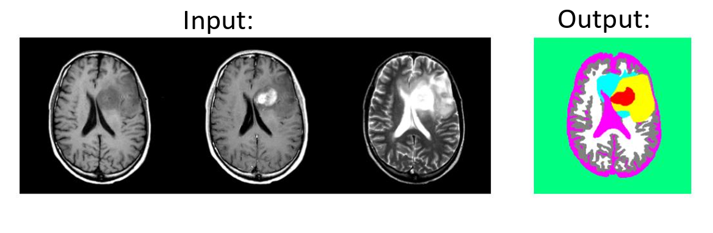
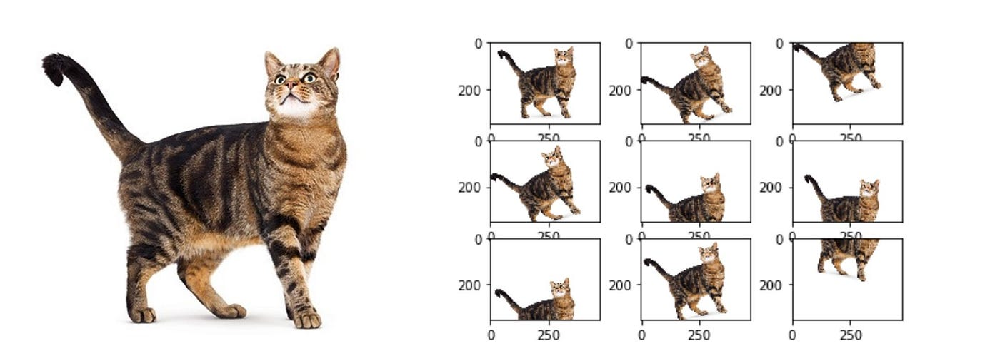
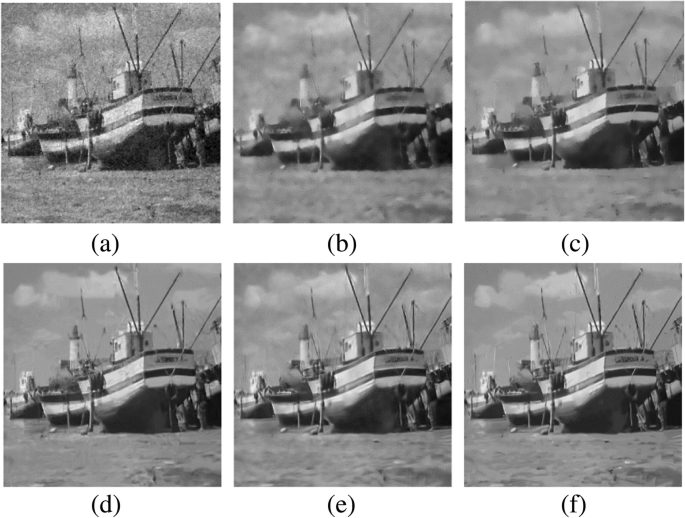
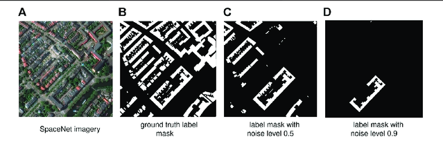

# Section 1: Image Analysis Overview

## 1.1 Motivation

- **"Humans are visual creatures."** Human beings rely on visual information to understand, depict, and communicate about the world around them.

::: {layout-ncol=3}

{height=220px fig-align="center"}

{height=220px fig-align="center"}

{height=220px fig-align="center"}
:::
<!-- end columns -->

---

## 1.1 Motivation

- Into the digital age, images have become a ubiquitous form of data, capturing information that tables and text alone cannot, or at least very inefficient to convey. 
- Analyzing large collections of images can provide insights about patterns, trends, and relationships that would be difficult or impossible to discern through manual inspection.
- The field of **image analysis** has emerged to extract meaningful information from images using computational techniques.

. . .

- **But, this comes with challenges:**
    - Images are **high-dimensional** data, making them computationally intensive to process and analyze.
    - Variability in lighting, angle, occlusion, resolution and other factors can complicate analysis.
    - Annotating images for image analysis tasks can be time-consuming and expensive.

## 1.2 Image Analysis Applications

- **Medical Imaging:** Detecting tumors, analyzing X-rays, MRIs, and CT scans.

{height=200px fig-align="center"}

- **Autonomous Vehicles:** Object detection and scene understanding for navigation.
- **Agriculture:** Crop monitoring, disease detection, yield estimation.
- **Surveillance:** Facial recognition and activity monitoring.
- **Retail & Logistics:** Inventory management, customer behavior analysis.

---

### Specifically, in Arts and Social Sciences...

- **Remote Sensing:** Land use classification, environmental monitoring, satellite archaeology.

)](media/Remote_Sensing_Archaeology.jpg){height=150px fig-align="center"}

- **Cultural Heritage:** Digitization and analysis of artworks and historical documents.
- **Behavioral Studies:** Analyzing human activities, emotions and interactions in photos and frames from videos.

:::{.callout-note icon="false"}
### Discussion 

Can you think of other applications of image analysis in your field of study or interest? Share your thoughts!
:::

# Section 2: Computational Image Analysis

## 2.1 Image as a Type of Data

- Just like tabular data or text data, images can be represented and processed as data structures that computers can understand, but with unique characteristics. 
- Different types and formats of images exist, each with its own properties and use cases.
- **Common Image Formats**:
    - **Raster Images:** Composed of pixels, e.g., JPEG, PNG, BMP.
    - **Vector Images:** Composed of paths, e.g., SVG, EPS.
    - **Specialized Formats:** DICOM (medical imaging), GeoTIFF (geospatial data).

::: {.callout-note}
- The choice of image format can impact the analysis process, including storage requirements, processing speed, and the types of analyses that can be performed.
- Among these, raster images are most commonly used in image analysis tasks. When you are looking for image datasets, you will most likely encounter raster images.

You can learn more about image formats [here](https://en.wikipedia.org/wiki/Image_file_format).
:::

---

### 2.1.1 Image Representation

#### Image as a Grid of Pixels

- Most common representation of images is as a grid of pixels, where each pixel has a specific color value.
- **Grayscale Images:** Each pixel is represented by a single intensity value (0-255 for 8-bit images).
- **Color Images:** Each pixel is represented by multiple values, typically in RGB format (Red, Green, Blue channels).

::: {layout-ncol=3}
{height=180px fig-align="center"}

{height=180px fig-align="center"}

{width=220px fig-align="center"}
:::

---

#### Image as "Visual Words"

- In some image analysis techniques, images can be represented as collections of "visual words" or features.
- This approach is often used in bag-of-words models for image classification, where local features (like edges, corners) are extracted and quantized into a vocabulary of visual words.
- Common techniques for extracting visual words include **SIFT** (Scale-Invariant Feature Transform) and **SURF** (Speeded Up Robust Features).

{height=250px fig-align="center"}

---

#### Image as Embeddings

- Images can be represented as high-dimensional embeddings, encoding features learned by neural networks. 
- These embeddings are useful for tasks like retrieval, clustering, and classification, capturing complex patterns beyond traditional methods.
- Models of different architectures will generate different embeddings for the same image, depending on their training objectives and learned features.

::: {layout-ncol=2}

{width=280px fig-align="center"}

{height=240px fig-align="center"}

:::

## 2.2 Image Processing vs. Image Analysis

- Similar to data processing and data analysis in tabular data, image processing and image analysis are two related but distinct concepts in the field of image analysis.
    - **Image Processing:** Involves techniques to enhance, manipulate, or transform images to improve their quality or extract specific features. 
    - **Image Analysis:** Involves extracting meaningful information from images using computational techniques. 

. . .

- Image processing is often a prerequisite step for image analysis, as it turns unstructured image data into a more structured form that can be analyzed. Examples of common image processing techniques include:
    - Noise reduction
    - Contrast enhancement
    - Edge detection
    - Image segmentation

## 2.2.1 Data Acquisition and Preprocessing

- **Data Acquisition**: 
    - Capture high-quality images relevant to the research question using appropriate equipment and settings.
    - Ensure proper lighting, focus, and resolution to minimize noise and artifacts.
    - Collect diverse samples to account for variability in real world conditions.

. . .

- **Preprocessing**: 
    - Standardize images by resizing, cropping, and normalizing pixel values.
    - Enhance dataset quality through augmentation, denoising, etc.
    - Annotate or label images to provide ground truth information for supervised learning tasks.

. . .

:::{.callout-note icon="false"}
### Discussion

What are some common challenges you might face when acquiring and preprocessing image data for analysis in your field of study or interest?
:::

---

### 2.2.2 Convolutional Operations

- **Convolution** is the cornerstone of many image processing and analysis techniques, it involves applying a filter (or kernel) to an image to extract specific features or patterns.

:::{layout-ncol=2}

{height=150px fig-align="center"}

{height=150px fig-align="center"}

:::
- Common filters include: Edge Detection, Sharpening, Blurring, Embossing, etc.

{height=160px fig-align="center"}

---

### 2.2.3 Augmentation, Denoising, and Masking

- **Augmentation**: Techniques to artificially increase the size and diversity of an image dataset by applying label-invariant transformations such as rotation, flipping, scaling, cropping, color jittering, etc.
- **Denoising**: Techniques to reduce noise in images, such as Gaussian filtering, and more advanced methods like Non-Local Means and Deep Learning-based denoising.
- **Masking**: Techniques to selectively hide or reveal parts of an image, often used in tasks like image inpainting, object detection, and segmentation.

:::{layout-ncol=3}
{height=150px fig-align="center"}

{height=150px fig-align="center"}

{height=150px fig-align="center"}
:::
---

### 2.2.4 "Manual" Image Analysis

- Before the rise of deep learning, researchers usually need to manually design filters and algorithms to extract features and analyze images.
- These practices are still very useful today, especially when working with smaller datasets with **domain-specific knowledge**, or when interpretability is a concern.
- It might also be necessary to use these as a preprocessing step before applying machine learning models, or to analyze the outputs of machine learning models.
    - AI models can be bias and make costly mistakes, so it is better to have a good backup plan in case models fail.
    - Chances are you can't find a pre-trained model that is perfectly suited for your specific task, then you may need to get your hands dirty.

:::{.callout-note icon="false"}
### Useful Tools and Libraries

- **OpenCV**: A powerful Python library that contains a wide range of functions for image processing and computer vision tasks.
- **PIL/Pillow**: A Python library for opening, manipulating, and saving many different image file formats.
- **scikit-image**: A collection of algorithms for image processing and computer vision in Python, built on top of SciPy.
- **MATLAB's Image Processing Toolbox**: A comprehensive suite of tools for image processing and analysis, widely used in academia and industry.
:::

## 2.3 Feature Representations

Different representations capture different properties of an image.

| Representation | Description | Best for |
|---|---|---|
| **Pixel grid** | Raw intensity values per channel | Simple transformations, OCR |
| **Visual words (BoVW)** | Frequency counts of local keypoints | Texture-based similarity |
| **CNN embedding** | Compact semantic vector from a pretrained network | Classification, retrieval |
| **ViT embedding** | Patch-relationship vector via self-attention | Global scene context |

. . .

Choosing the right representation for your data and research question is one of the most important decisions in an image analysis project.

## 2.4 Pre-trained Models as Research Tools

Training a model from scratch requires thousands of labeled images and significant computing resources. In most social science contexts, this is not necessary.

. . .

**Pre-trained models** have already learned visual features from millions of images. You can:

- **Use them as-is** to extract embeddings or run predictions.
- **Fine-tune them** on a smaller labeled set if you have annotations.
- **Prompt them** (for captioning or OCR) without any training at all.

. . .

:::{.callout-note}
**Practical rule**: start with the simplest pre-trained model that fits your task and compute budget. Evaluate its outputs on a small labeled sample before scaling up.
:::


# Section 3: Workshop Demo

## Dataset: Documerica (1970s EPA)

This workshop uses a subset of the **Documerica** archive: photographs commissioned by the U.S. Environmental Protection Agency between 1971 and 1977 to document environmental conditions across America.

The collection spans industrial facilities, urban neighborhoods, agricultural land, and communities affected by pollution. It provides a rich visual record with varied content, consistent metadata, and clear social-science relevance.

. . .

**Metadata fields available**: image ID, title, photographer, date, location, coordinates, and a thematic category generated by a language model.

---

## What We Cover in the Demo

The hands-on demo notebook walks through four increasingly automated workflows:

1. **Manual image operations** (Section 1)
   - Color channels, filters, edge detection, masking
2. **Similarity and clustering** (Section 2)
   - Bag of Visual Words, cosine similarity, K-means
3. **Deep learning embeddings** (Section 3)
   - CNN (ResNet-18) and Vision Transformer (ViT-B/16)
4. **Applications** (Section 4)
   - Classification, multi-label tagging, object detection, OCR, image captioning

---

## 3.1 Manual Image Transformations

We begin by treating images as raw data and applying operations directly.

- **Color channels**: separated R, G, B components show what each channel contributes.
- **Convolution filters**: sharpen edges, blur noise, detect structural boundaries.
- **Masking**: isolate a region of interest and suppress everything else.

. . .

> This section builds the intuition needed to understand why automatic feature extraction works, and what can go wrong when it doesn't.

---

## 3.2 Similarity and Clustering

**Bag of Visual Words (BoVW)** assigns each image a histogram of local visual features.

- Two images with similar histograms are **visually similar**: same textures, similar spatial patterns.
- **Cosine similarity** finds nearest neighbors in this feature space.
- **K-means clustering** groups the corpus into clusters sharing visual themes.

. . .

Clustering is **unsupervised**: it surfaces patterns you did not know to look for. Useful for a first exploratory pass over a new archive.

---

## 3.3 Deep Learning Embeddings

Pre-trained neural networks convert each image into a compact numeric vector (an **embedding**).

::: {layout-ncol=2}

**CNN (ResNet-18)**

- Local convolutional filters build increasingly abstract representations.
- Early layers: textures and edges. Deep layers: objects and scene meaning.
- 512-dimensional embedding per image.

**ViT (Vision Transformer)**

- Splits image into 16×16 patches, then models patch relationships via self-attention.
- Better at capturing global scene context.
- 768-dimensional embedding per image.

:::

---

## 3.3 Reading the Embedding Space

Both embeddings are pre-generated and loaded from disk during the demo — no GPU required.

We compare them using:

- **2D PCA projection**: a quick visual check of how categories cluster.
- **Neighbor consistency**: what fraction of an image's k nearest neighbors share the same category?
- **Perturbation sensitivity**: how much does the embedding change when we blur, shift color, or occlude the image?

. . .

Neither model is universally better. The right choice depends on your data and what you need the representation to capture.

---

## 3.4 Applications: Classification

With frozen embeddings, a simple logistic regression assigns each image a thematic category.

**Workflow**:
1. Load pre-generated embeddings.
2. Split into train and test sets.
3. Fit logistic regression.
4. Evaluate using accuracy and Macro F1.

. . .

**Research use**: pre-sort a large archive before detailed manual review. This does not replace human interpretation — it helps decide where to focus.

---

## 3.4 Applications: Multi-label and Object Detection

Social science images rarely belong to a single theme.

**Multi-label classification** assigns multiple thematic tags at once using One-vs-Rest logistic regression (`community_people`, `pollution_risk`, `nature_ecology`, etc.).

**Object detection (YOLO)** adds bounding boxes around detected objects — `person`, `car`, `trash`, `building` — providing visible evidence for thematic claims.

. . .

Used together: thematic labels name the story; detected objects show the evidence.

---

## 3.4 Applications: OCR

**Optical Character Recognition** converts text visible in an image into machine-readable tokens.

Useful for:

- Digitizing historical documents and archival captions.
- Extracting signs, labels, or printed overlays from photographs.
- Feeding transcriptions into text analysis or search.

. . .

Best results require clean, flat scans. Noisy photographs or skewed pages reduce accuracy significantly. Always filter by confidence score.

---

## 3.4 Applications: Image Captioning

An image-to-text model generates a short raw description. We enrich it with metadata context (scene keywords, category) to produce a more informative, research-relevant sentence.

**Pattern**:

```
Raw caption (from model) + Context (keywords, category, date)
                         ↓
          Prompt sent to an LLM (ChatGPT, Claude)
                         ↓
           Research-ready descriptive sentence
```

. . .

For large archives, this can be batched through an API at low cost (under $1 per 1,000 images with current pricing).

---

## Key Takeaways

1. **Images are data** — processable, vectorizable, and searchable.
2. **Embeddings are general-purpose** — one pre-trained model supports classification, retrieval, and clustering.
3. **Pre-trained models are accessible** — you do not need to train from scratch.
4. **AI assists, not replaces, human analysis** — validate outputs on a labeled sample before scaling up.

---

## Conclusion

Image analysis offers social science researchers new tools for working with large visual archives. The techniques in this workshop do not require deep technical expertise to get started — but they do require careful thought about what you are measuring, what the model may get wrong, and how visual patterns connect to your research question.

Start small. Validate your outputs. Then scale.

---

## References

- [Image File Format](https://en.wikipedia.org/wiki/Image_file_format)
- [Bag of Visual Words (BoVW)](https://medium.com/@aybukeyalcinerr/bag-of-visual-words-bovw-db9500331b2f)
- [The Essential Guide to Data Augmentation in Deep Learning](https://medium.com/@saiwadotai/the-essential-guide-to-data-augmentation-in-deep-learning-f66e0907cdc8)
- [He et al., Deep Residual Learning for Image Recognition (ResNet)](https://arxiv.org/abs/1512.03385)
- [Dosovitskiy et al., An Image is Worth 16x16 Words (ViT)](https://arxiv.org/abs/2010.11929)
- [Ultralytics YOLOv8](https://github.com/ultralytics/ultralytics)
- [EasyOCR](https://github.com/JaidedAI/EasyOCR)
- [Documerica Photo Archive](https://www.flickr.com/photos/usnationalarchives/sets/72157633529642021)
- [Fan et al., Image Denoising Review](https://link.springer.com/article/10.1186/s42492-019-0016-7)