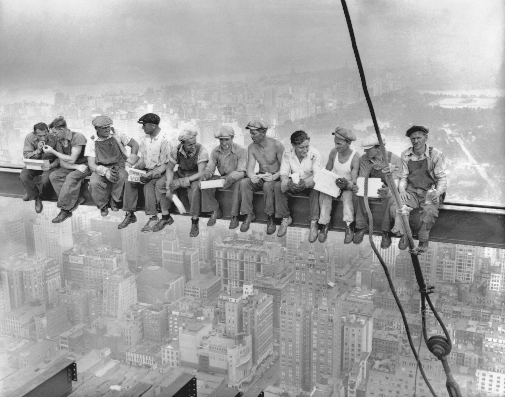
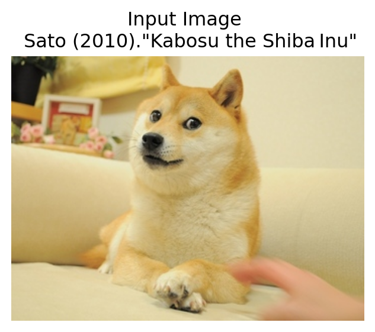
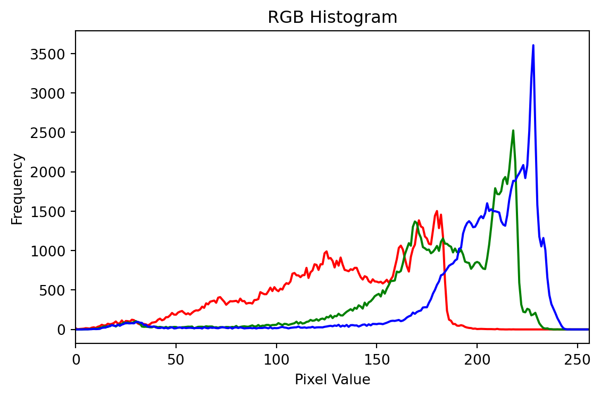
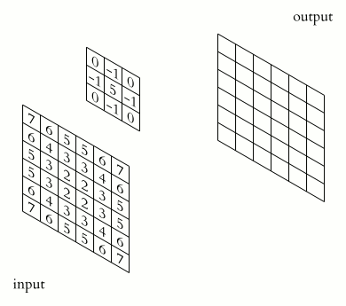
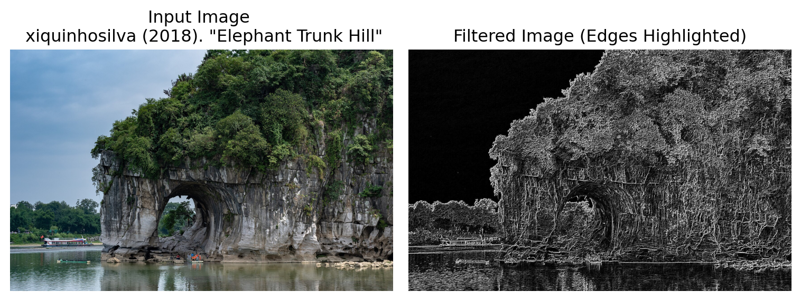
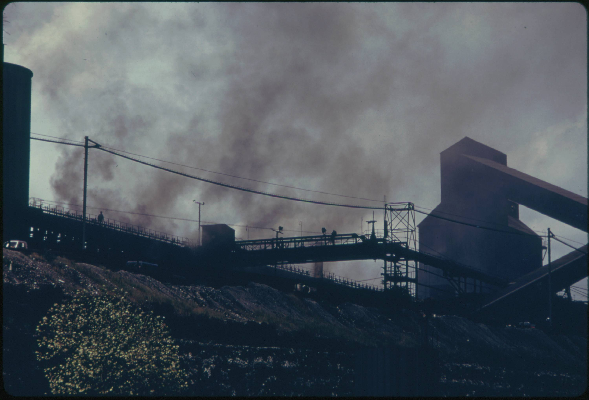
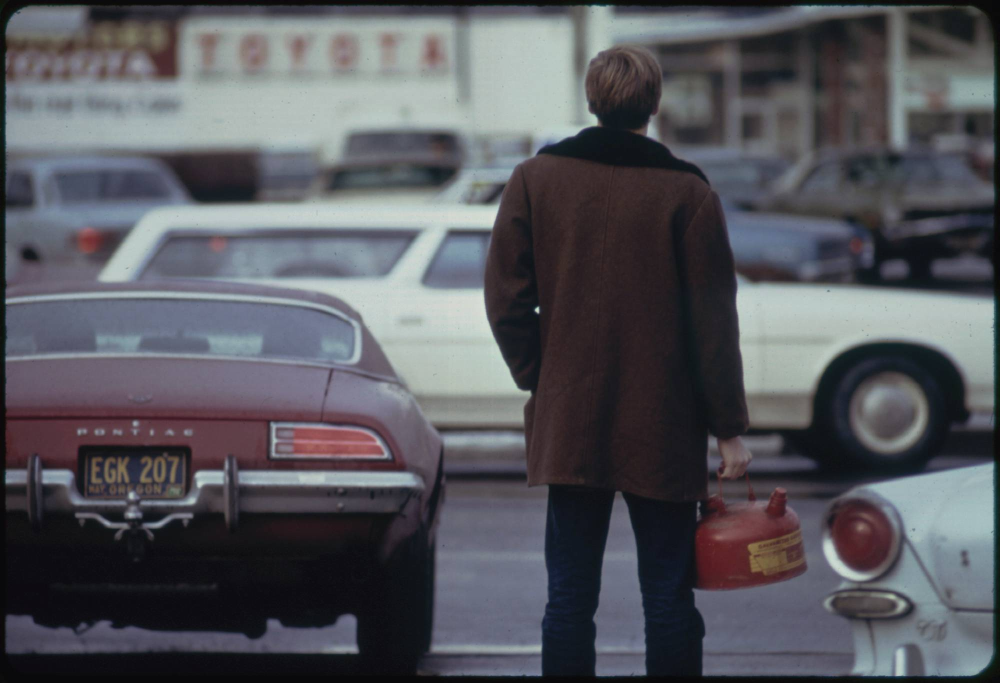
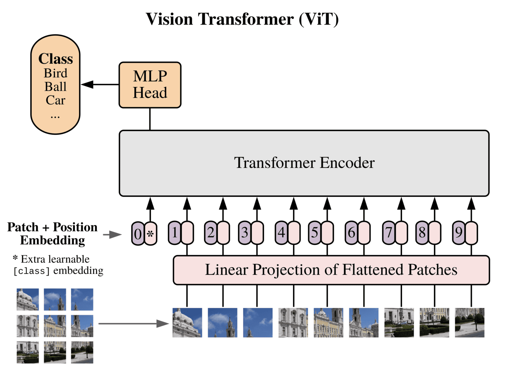
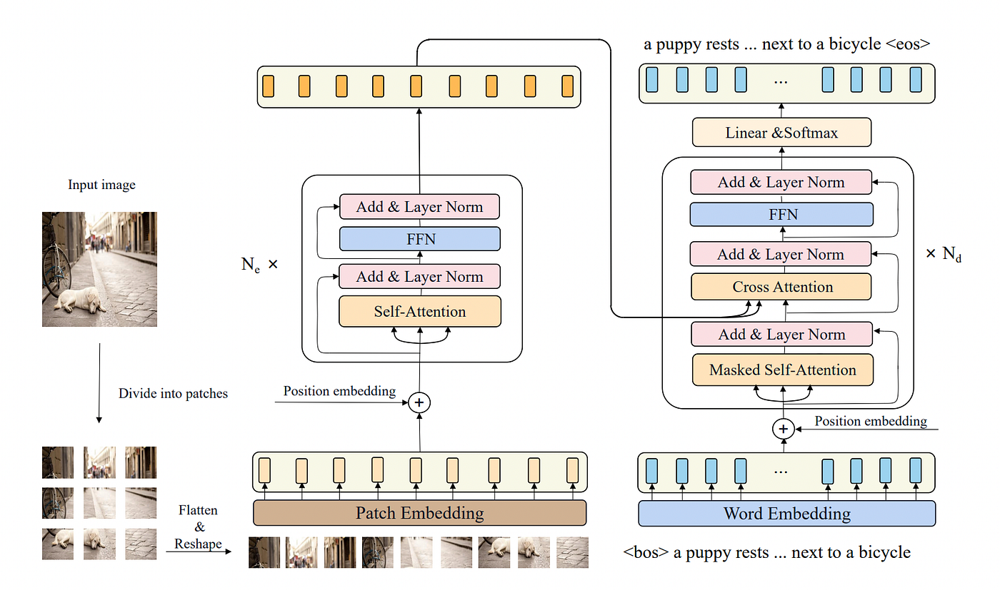

# Why Image Analysis?

## Images Are Everywhere

**"Humans are visual creatures."** We rely on visual information to understand, depict, and communicate about the world.

::: {layout-ncol=3}

{height=200px fig-align="center"}

{height=200px fig-align="center"}

{height=200px fig-align="center"}

:::

---

## Why Computational Image Analysis?

- Images have become a ubiquitous form of data, capturing information that tables and text alone cannot convey efficiently.
- Analyzing large collections of images reveals patterns, trends, and relationships that manual inspection would miss.

. . .

**Challenges:**

- Images are **high-dimensional** data.
- Variability in lighting, angle, resolution, and occlusion complicates analysis.
- Annotating images is time-consuming and expensive.

---

## Applications in Social Sciences

- **Remote Sensing:** Land use classification, environmental monitoring, satellite archaeology.

)](media/Remote_Sensing_Archaeology.jpg){height=140px fig-align="center"}

- **Cultural Heritage:** Digitization and analysis of artworks, historical documents.
- **Behavioral Studies:** Analyzing human activities, emotions, and interactions from photos and video frames.

. . .

:::{.callout-note icon="false"}
### Discussion
Can you think of other applications of image analysis in your field?
:::

# How Computers See Images

## Images as Data

Images can be represented as data structures, just like tables or text.

::: {layout-ncol=3}
{height=170px fig-align="center"}

{height=170px fig-align="center"}

{width=200px fig-align="center"}
:::

- **Grayscale:** single intensity value per pixel (0-255).
- **Color (RGB):** three values per pixel (Red, Green, Blue channels).

---

## Three Ways to Represent an Image

| Representation | What it captures | Used for |
|---|---|---|
| **Pixel grid** | Raw intensity per channel | Transformations, OCR |
| **Visual words (BoVW)** | Local keypoint frequencies | Texture similarity |
| **Embedding (CNN / ViT)** | Learned semantic vector | Classification, retrieval |

. . .

Choosing the right representation is one of the most important decisions in an image analysis project.

---

## Image Processing vs. Image Analysis

- **Image Processing:** enhance, transform, or clean images (noise reduction, edge detection, contrast enhancement).
- **Image Analysis:** extract meaningful information from images using computational techniques.

. . .

Processing is often a prerequisite step for analysis.

---

## Convolution and Filters

**Convolution** applies a small filter (kernel) to an image to extract specific features.

:::{layout-ncol=2}
{height=140px fig-align="center"}

{height=140px fig-align="center"}
:::

Common filters: **Edge Detection**, **Sharpening**, **Blurring**, **Embossing**.

{height=140px fig-align="center"}

---

## Pre-trained Models as Research Tools

Training from scratch requires thousands of labeled images and heavy compute. In most social science contexts, this is unnecessary.

. . .

**Pre-trained models** have already learned visual features from millions of images:

- **Use as-is** to extract embeddings or run predictions.
- **Fine-tune** on a smaller labeled set if annotations exist.
- **Prompt** them (for captioning or OCR) with no training at all.

. . .

:::{.callout-note}
**Practical rule:** start with the simplest pre-trained model that fits your task and compute budget. Evaluate on a small labeled sample before scaling up.
:::

# Workshop Demo

## Dataset: Documerica (1970s EPA)

This workshop uses a subset of the **Documerica** archive: photographs commissioned by the **U.S. EPA** between 1971-1977 to document environmental conditions across America.

The collection spans industrial facilities, urban neighborhoods, agricultural land, and communities affected by pollution.

:::{layout-ncol=2}
{height=50px}

{height=50px}
:::

. . .

**Metadata fields:** image ID, title, photographer, date, location, coordinates, and a thematic category generated by a language model.

. . .

> Let's see how we can extract information from these images using computational techniques!

---

## Demo Roadmap

The hands-on notebook walks through four increasingly automated workflows:

1. **Manual image operations** -- Color channels, filters, edge detection, masking
2. **Similarity and clustering** -- Bag of Visual Words, cosine similarity, K-means
3. **Deep learning embeddings** -- CNN (ResNet-18) and ViT (ViT-B/16)
4. **Applications** -- Classification, multi-label tagging, object detection, OCR, captioning

---

## Part 1: Manual Transformations

We begin by treating images as raw data and applying operations directly.

- **Color channels:** separate R, G, B components to see what each contributes.
- **Convolution filters:** sharpen edges, blur noise, detect boundaries.
- **Masking:** isolate a region of interest and hide everything else.

. . .

> This builds the intuition needed to understand why automatic feature extraction works.

---

## Part 2: Similarity and Clustering

**Bag of Visual Words (BoVW)** assigns each image a histogram of local visual features.

- **Cosine similarity** finds nearest neighbors in this feature space.
- **K-means clustering** groups the corpus into clusters by shared visual patterns.

. . .

Clustering is **unsupervised**: it surfaces patterns you did not know to look for.

---

## Part 3: Deep Learning Embeddings

Pre-trained neural networks convert each image into a compact numeric vector (an **embedding**).

:::{ncols=2}
{width=180px}

{width=180px}
:::

- **CNN (ResNet-18):** local convolutional filters build increasingly abstract representations. 512 dimensions per image.
- **ViT (ViT-B/16):** splits image into patches, models global relationships via self-attention. 768 dimensions per image.

---

## Comparing CNN and ViT

Both embeddings are pre-generated and loaded from disk during the demo (no GPU required).

We compare them using:

- **2D PCA projection:** visual check of how categories cluster.
- **Neighbor consistency:** what fraction of nearest neighbors share the same category?
- **Perturbation sensitivity:** how much does the embedding change under blur, color shift, or occlusion?

. . .

Neither model is universally better. The right choice depends on your data and what you need to capture.

---

## Part 4a: Classification

With frozen embeddings, a simple logistic regression assigns each image a thematic category.

1. Load pre-generated embeddings.
2. Split into train and test sets.
3. Fit logistic regression.
4. Evaluate with accuracy and Macro F1.

. . .

**Research use:** pre-sort a large archive before detailed manual review. This assists, not replaces, human interpretation.

---

## Part 4b: Multi-label Tagging and Object Detection

- **Multi-label classification** assigns multiple thematic tags at once (community_people, pollution_risk, nature_ecology, etc.).
- **Object detection (YOLO)** identifies **what** is visible and **where** it appears in the image.

. . .

Used together: thematic labels name the story; detected objects show the evidence.

---

## Part 4c: OCR

**Optical Character Recognition** converts text visible in an image into machine-readable tokens.

Useful for digitizing documents, reading labels, or extracting text for search and analysis.

. . .

Best results require clean, flat scans. Always filter by confidence score.

Zero-shot OCR (no training) is possible with pre-trained models such as DeepSeek OCR, but fine-tuning on a small labeled set can improve accuracy for specific fonts or layouts.

---

## Part 4d: Image Captioning

**How it works:** A **vision encoder** (CNN or ViT) reads the image; a **language decoder** (GPT) turns those features into text.

{height=200px fig-align="center"}

. . .

**The gap:** The model sees only pixels -- it doesn't know *who*, *where*, or *why*. Raw captions describe surfaces ("aerial view of urban landscape") but miss context ("Cleveland on Lake Erie, 1973").

. . .

**Enrichment pattern:** Combine the raw AI caption with metadata (keywords, category, archival title) into a structured prompt, then ask an LLM to synthesize one research-ready sentence.

---

## Key Takeaways

1. **Images are data** -- processable, vectorizable, and searchable.
2. **Embeddings are general-purpose** -- one pre-trained model supports classification, retrieval, and clustering.
3. **Pre-trained models are accessible** -- you do not need to train from scratch.
4. **AI assists, not replaces, human analysis** -- validate outputs on a labeled sample before scaling up.

:::{.r-stack}
## Thank you for attending!    
:::

## References

- [Image File Format -- Wikipedia](https://en.wikipedia.org/wiki/Image_file_format)
- [Bag of Visual Words (BoVW)](https://medium.com/@aybukeyalcinerr/bag-of-visual-words-bovw-db9500331b2f)
- [He et al., Deep Residual Learning for Image Recognition (ResNet)](https://arxiv.org/abs/1512.03385)
- [Dosovitskiy et al., An Image is Worth 16x16 Words (ViT)](https://arxiv.org/abs/2010.11929)
- [Ultralytics YOLOv8](https://github.com/ultralytics/ultralytics)
- [EasyOCR](https://github.com/JaidedAI/EasyOCR)
- [Documerica Dataset](https://distantviewing.org/data/)
